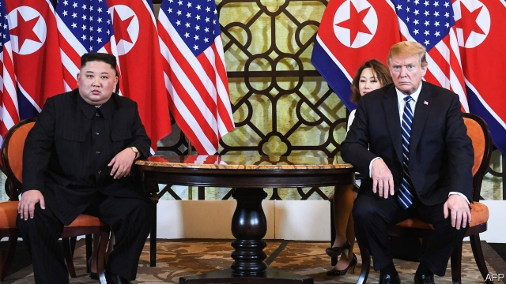

###### Bromance on hold

# Donald Trump and Kim Jong Un leave Vietnam without a deal 

##### But they promised to keep on trying 

 

> Feb 28th 2019 

THE MESSAGE was hard to miss. “Welcome to Hanoi, city of peace” read the multi-coloured, flashing LED display on the road from the airport into central Hanoi. Placards depicting stylised doves and hands clasped in a deal-sealing shake lined the streets all over town. Even the South Korean pastry chain catering to the press got in on the act and put up posters calling for peace on the Korean peninsula in anticipation of the second meeting between Donald Trump, America’s president, and Kim Jong Un, North Korea’s dictator, in Vietnam’s capital this week. 

The decorations turned out to be overly optimistic. On February 28th American officials abruptly cut the summit short, cancelling a “working lunch” and a joint signing ceremony that had been planned for later in the day. Instead they announced that the two leaders would be leaving Hanoi without agreeing on a deal. In a press conference shortly afterwards, Mr Trump said that he and Mr Kim had had a “very productive time” but had ultimately failed to come to an agreement that would work for the United States. “Sometimes you have to walk,” the president told reporters. 

That was a surprise. Many observers had predicted a narrow deal, in which North Korea might have offered the dismantlement and inspection of its main nuclear site at Yongbyon in return for goodwill gestures by America, such as the establishment of liaison offices in both countries and moves towards a declaration ending the Korean war. The talks’ failure will dismay Moon Jae-in, South Korea’s president, who had been planning to announce his new vision for economic cooperation on the Korean peninsula at celebrations marking the centenary of the March 1st movement, a rebellion against Japanese colonialism that is celebrated by both Koreas. 

However, given the large gap between the two sides’ negotiating positions and the lack of agreement in working-level discussions in the run-up to the summit, it had always been optimistic to assume that Mr Trump and Mr Kim would thrash out in a few hours what their negotiators had failed to agree in weeks of talks. At their first meeting in Singapore last June, the two leaders had pledged to establish “new US-DPRK relations” and to build a “lasting and stable peace regime on the Korean Peninsula”. Mr Kim also pledged to work towards “complete denuclearisation of the Korean Peninsula”. 

In the months since, the fuzziness of that statement had led to a deadlock, since the two sides were unable to agree on what any of those commitments actually meant and in what order they should take place. North Korea was adamant that a reset of relations, including security guarantees and, ideally, relief from sanctions, had to precede any moves towards disarmament. America insisted that no concessions would be forthcoming without substantial steps towards disarmament, such as the closure of some of the North’s main nuclear sites, verified by international inspectors, or a list of all nuclear facilities and a timeline for their dismantlement. In recent weeks American officials had sounded ever less exacting both in their demands and in the timeframe for achieving them, appearing to accept denuclearisation as a long-term goal that would be reached step by step, if at all. “I’m in no rush,” Mr Trump repeatedly said before he travelled to Vietnam, a stance he reiterated even as he entered talks with Mr Kim on the morning of February 28th. Yet even this growing malleability, it seems, was not enough to mollify the North Koreans. 

Nonetheless, there was an air of bonhomie. Just as in Singapore, the two leaders exchanged smiles and handshakes in front of an enormous display of American and North Korean flags and congratulated each other on their “successful and great meeting” before most of it had taken place. On Wednesday evening, they could be seen bantering over a dinner of shrimp cocktail, steak, pear-fermented kimchi and hot chocolate cake. In an effort to whet North Korea’s appetite for market reforms, a group of officials was taken around a Vietnamese car factory and given a talk on joint ventures while their boss prepared for his meeting. Mr Trump, meanwhile, tweeted about the “AWESOME” opportunity for “my friend Kim Jong Un” to turn North Korea into an economic powerhouse. 

In the end, no amount of banter or allusion to future riches could bridge the gap. “It was about the sanctions,” Mr Trump confirmed when asked by reporters. “They wanted them lifted entirely but we couldn’t do that.” North Korea was offering too little—in essence, apparently, some form of access to Yongbyon. Both Mr Trump and Mike Pompeo, America’s secretary of state, emphasised that “real progress” had been made at the summit. They said that the relationship with North Korea continued to be productive, that Mr Kim had promised to stick to his moratorium on tests of nuclear devices and missiles and that they were hoping to make headway on an agreement in the weeks and months ahead. 

Mr Trump and his aides seem to have concluded that walking away will do less harm to America’s security than showering North Korea with concessions without gaining much in return. They are also implicitly admitting that denuclearisation is a long process rather than something that can be achieved overnight, as Mr Trump had previously implied. The calm mood that has prevailed on the Korean peninsula for the past year is clearly preferable to the nuclear brinkmanship of 2017. However, according to security analysts and intelligence services, even though Mr Kim is no longer conducting tests, he is still expanding his nuclear programme. Mr Trump’s insistence that there is “no rush” to disarm North Korea suggests a preference for a deal that is much less ambitious than ridding the world of Mr Kim’s nukes: ensuring that they are not used. 

-- 

 单词注释:

1.bromance[]:n. 兄弟罗曼史； 也可以理解为“兄弟情”； 指两个男人关系很好； 但不涉及“性”的同性关系 

2.donald['dɔnәld]:n. 唐纳德（男子名） 

3.trump[trʌmp]:n. 王牌, 法宝, 喇叭 vt. 打出王牌赢, 胜过 vi. 出王牌, 吹喇叭 

4.kim[]:n. 金姆（人名） 

5.jong[jɔŋ]:n. 小伙子；（旧时的）青年男奴 

6.UN[ʌn]:pron. 家伙, 东西 [经] 联合国 

7.Vietnam[.vjet'næm]:n. 越南 

8.hanoi[hæ'nɔi]:n. 河内（越南首都） 

9.placard['plækɑ:d]:n. 公告, 布告, 小牌, 海报 vt. 公布, 布告, 张帖, 贴海报于 

10.depict[di'pikt]:vt. 描述, 描写 

11.stylise['stailaiz]:vt. 使...仿效某派风格, 使因袭时尚, 以固定的风格表现, 使...风格化 

12.dove[dʌv]:n. 鸽子 dive的过去式 

13.Korean[kә'riәn]:n. 朝鲜人, 朝鲜语 a. 朝鲜人的, 朝鲜语的 

14.pastry['peistri]:n. 油酥点心, 面粉糕饼 

15.anticipation[æn.tisi'peiʃәn]:n. 预期, 预料 [医] 提前出现(如遗传病) 

16.dictator['dikteitә]:n. 命令者, 独裁者 

17.overly['әuvәli]:adv. 过度地, 极度地 

18.abruptly[ә'brʌptli]:adv. 突然地, 唐突地 

19.afterwards['ɑ:ftәwәdz]:adv. 然后, 后来 

20.Korea[kә'riә]:n. 朝鲜, 韩国 

21.dismantlement[]:[经] (机器等)拆卸 

22.yongbyon[]:[网络] 宁边；宁边核设施 

23.goodwill[^jd'wil]:n. 友好, 好意, 善意, 亲善, (企业享有的)信誉, 声誉 [经] (企业的)商誉, 信誉 

24.liaison[li:'eizɒn]:n. 联络 

25.declaration[.deklә'reiʃәn]:n. 宣告, 说明, 宣布 [计] 说明 

26.dismay[dis'mei]:n. 沮丧 vt. 使惊愕, 使气馁 

27.cooperation[kәu.ɒpә'reiʃәn]:n. 合作, 协力, 配合 [化] 合作 

28.centenary[sen'ti:nәri]:n. 一百年 a. 一百年的 

29.colonialism[kә'lәunjәlizm]:n. 殖民主义 

30.Korea[kә'riә]:n. 朝鲜, 韩国 

31.alway['ɔ:lwei]:adv. 永远；总是（等于always） 

32.thrash[θræʃ]:vt. 打, 使逆行, 胜过, 推敲, 鞭打 vi. 打谷, 痛打, 剧烈扭动, 逆行 n. 打谷, (划水)鞭状动作 

33.negotiator[ni'gәuʃieitә]:n. 磋商者, 交涉者, 议定者 [经] 谈判者, 交易者, 协商者 

34.Singapore[.siŋgә'pɒ:]:n. 新加坡 

35.pledge[pledʒ]:n. 诺言, 保证, 誓言, 抵押, 信物, 保人, 祝愿 vt. 许诺, 保证, 使发誓, 抵押, 典当, 举杯祝...健康 

36.regime[rei'ʒi:m]:n. 政权, 当权期间, 政体, 社会制度, 体制, 情态 [医] 制度, 生活制度 

37.denuclearisation[di:-,nju:kliərai'zeiʃən; -ri'z-]:n. denuclearise的变形 

38.fuzziness[]:[计] 模糊度, 模糊性 

39.deadlock['dedlɒk]:n. 僵局, 停顿 v. (使)停顿, (使)相持不下 [计] 死锁 

40.adamant['ædәmәnt]:n. 坚硬的东西 a. 非常坚硬的, 坚强的, 固执的 

41.reset[.ri:'set]:n. 重新设定, 重新组合, 重排版 vt. 重新设定, 重置, 重新组合 vi. 重置, 清零 [计] 重置, 清零 

42.ideally[ai'diәli]:adv. 完美地, 理想地 

43.sanction['sæŋkʃәn]:n. 核准, 制裁, 处罚, 约束力 vt. 制定制裁规则, 认可, 核准, 同意 

44.precede[.pri:'si:d]:vt. 在...之前, 优于, 较...优先 vi. 在前面 

45.disarmament[dis'ɑ:mәmәnt]:n. 裁军 [法] 裁军, 解除军备 

46.concession[kәn'seʃәn]:n. 特许, 让步, 认可 [经] 核准, 许可, 特殊(权) 

47.forthcoming['fɒ:θ'kʌmɑŋ]:a. 即将来临的 n. 来临 

48.closure['klәuʒә]:n. 关闭 vt. 使终止 

49.inspector[in'spektә]:n. 检查员, 巡视员 [化] 检查员 

50.timeline[ˈtaɪmlaɪn]:n. 时间轴, 时间表 

51.les[lei]:abbr. 发射脱离系统（Launch Escape System） 

52.timeframe[taɪmfreɪm]:n. 时间表 

53.stance[stæns]:n. 准备击球姿势, 站立的姿势, 位置, 姿态 [经] 地位, 形势 

54.reiterate[ri:'itәreit]:vt. 反复地说, 重申, 反复地做 [法] 重述, 重申, 反覆地做 

55.malleability[.mæliә'biliti]:n. 可展性, 可锻性, 顺从 [医] 展性 

56.mollify['mɒlifai]:vt. 平息, 缓和, 减轻, 使变软 

57.Korean[kә'riәn]:n. 朝鲜人, 朝鲜语 a. 朝鲜人的, 朝鲜语的 

58.nonetheless[,nʌnðә'les]:conj. 然而, 尽管, 不过 adv. 不过, 仍然, 尽管如此, 然而 

59.bonhomie[bɔnɔ'mi:; (?@) bɔnә'mi:]:n. 愉快, 温和, 和蔼 

60.handshake['hændʃeik]:n. 握手 

61.banter['bæntә]:n. 戏谑, 嘲弄 v. 戏弄, 开玩笑 

62.shrimp[ʃrimp]:n. 虾, 小虾, 矮子 vi. 捕小虾 

63.cocktail['kɒkteil]:n. 鸡尾酒, 开味品 a. 鸡尾酒会的 

64.kimchi['kimtʃi:]:n. (=kimchee)<朝鲜语>朝鲜泡菜 

65.whet[hwet]:n. 磨, 开胃小吃 vt. 磨, 磨快, 刺激, 促进 

66.vietnamese['vjetnә'mi:z]:n. 越南人；越南语 

67.tweet[twi:t]:vi. 啁啾 n. 小鸟叫声 

68.powerhouse['pauәhaus]:n. 发电所, 动力室, 精力旺盛的人, 办事效率高的机构 

69.bant[bænt]:vi. 做减肥治疗法 [医] 忌食减瘦 

70.allusion[ә'lu:ʒәn]:n. 提及, 暗指 

71.riche[]:n. 暴发户 

72.entirely[in'taiәli]:adv. 完全, 全然, 一概 

73.essence['esns]:n. 实质, 本质, 香精 [化] 香精 

74.apparently[ә'pærәntli]:adv. 表面上, 清楚地, 显然地 

75.mike[maik]:vi. 偷懒, 游手好闲 n. 休息, 游手好闲, 扩音器, 话筒 

76.pompeo[]:n. (Pompeo)人名；(意)蓬佩奥 

77.emphasise[]:vt. 强调, 重读, 加强...的语气, 着重 

78.moratorium[.mɒrә'tɒ:riәm]:n. 延期偿付, 暂停 [法] 延期偿付, 延缓履行, 延期偿还期 

79.headway['hedwei]:n. 前进, 航行速度, 进展 [经] 进尺, 钻井 

80.aide[eid]:n. 助手, 副官 [计] 数据输入的可说明性 

81.implicitly[]:adv. 含蓄, 不言明, 暗示, 暗指, 内含, 固有, 无疑, 绝对, 无保留 [计] 隐含地 

82.brinkmanship['briŋkmәnʃip]:n. 边缘政策 [法] 外交冒险政策, 紧急政策 

83.analyst['ænәlist]:n. 分析者, 精神分析学家 [化] 分析员; 化验员 

84.insistence[in'sistәns]:n. 坚持, 坚决主张 

85.disarm[dis'ɑ:m]:vt. 解除武装, 裁军, 缓和 vi. 放下武器 

86.ambitious[æm'biʃәs]:a. 有野心的, 抱负不凡的, 雄心勃勃的 

