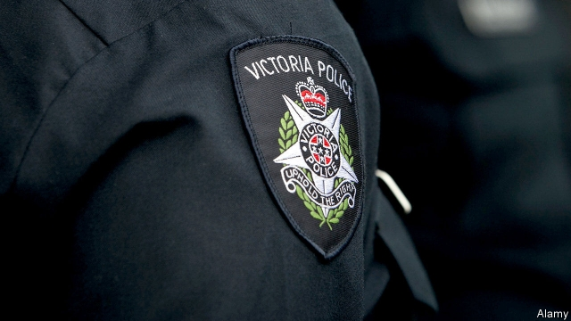

###### Criminal injustice

# How an Australian police force used lawyers to snitch on mobsters 

##### A scandal means that convicted drug lords and gangsters may have to be released 

 

> Feb 28th 2019 

POLICE IN THE state of Victoria spent millions of dollars trying to keep their arrangement with Informer 3838 a secret. She was a young criminal barrister who snitched on some of Australia’s most notorious drug lords while she was representing them in the 1990s and 2000s. The informant, whose name is protected by the courts, claims her actions helped convict nearly 400 criminals. She also violated their right to confidentiality and possibly, their chances of a fair trial. Dozens of gangsters could walk free now the affair has become public. 

The police claimed the lawyer would be murdered if her clients discovered she had double-crossed them. But the High Court lifted suppression orders on the case in December, saying that faith in the courts was more important than her personal safety. Informer 3838 had committed “fundamental and appalling breaches” of her duties as a barrister, it ruled. Police had “corrupted” prosecutions and “debased fundamental principles of the criminal justice system”. A royal commission is investigating. 

Before that inquiry began in February the police admitted that the lawyer had been dishing dirt for a decade longer than they previously thought: from 1995 to 2009. Neither was she alone. Six other legal clerks, secretaries and solicitors were on police books, some as recently as 2016. Other states are asking whether their forces resorted to similar tactics. More than 20 prisoners were told last year that they might have grounds to appeal against convictions secured using ill-gotten information. Three are already doing so. If other professionals snitched on their clients, it follows that more sentences could be in jeopardy. 

Melbourne was shaken by the gang wars that raged between 1998 and 2010. At least 36 mobsters were killed in that period, and police were desperate to punish the perpetrators. But citizens’ right to confidentiality when speaking to their lawyers is enshrined in law. “Police shouldn’t ask and lawyers shouldn’t tell,” says Arthur Moses, president of the Law Council of Australia. Officers knew that well. Ron Iddles, a former detective, reckons that up to 15 senior policemen turned a blind eye to the arrangement with Informer 3838. “They saw the risks,” he said in a television interview, “but there was directions from above.” 

This is not the only controversy to cast a shadow over Victoria Police. This year officers in the state have been accused of falsifying a witness statement and of battering innocents. One victim was a meekly compliant pensioner arrested for drunk driving who was knocked out by an angry copper (he kept his job). Another was an aboriginal teenager who was arrested despite not remotely fitting the description of the criminal the police were hunting, and allegedly assaulted. Complaining about brutality seems futile, though. Most misconduct allegations are referred to the police themselves for investigation. In cases of assault, less than 4% are ever proven. 

Last year a parliamentary committee recommended sweeping reforms to that system, saying that Victoria’s anti-corruption watchdog, IBAC, should be given more power to investigate misconduct. But the state government has not enacted the changes. Other states have conducted far more sweeping inquiries into police abuses and corruption. The last such review in Victoria occurred in the 1970s, according to Colleen Lewis, a retired criminology professor. Darren Palmer, a criminologist at Deakin University, complains of “25 years of serious mismanagement in policing in Victoria”. That will take more than a royal commission to fix. 

-- 

 单词注释:

1.injustice[in'dʒʌstis]:n. 不公平, 非正义的行为 [法] 不公正, 不公平, 权利侵害 

2.snitch[snitʃ]:vt. 偷, 扒(不太值钱的东西) vi. 进行小偷小摸, 告密, 告发 n. 告密者, 告发者 

3.mobster['mɒbstә]:n. 犯罪集团成员 [法] 暴徒, 盗匪 

4.convict[kәn'vikt]:n. 囚犯, 罪犯 vt. 宣告有罪, 使知罪 

5.gangster['gæŋstә]:n. 流氓, 歹徒 [法] 暴徒, 恶棍, 打手 

6.victoria[vik'tɔ:riә]:n. 维多利亚（女子名） 

7.informer[in'fɒ:mә]:n. 密告者, 控告者, 通知者 [法] 控告人, 通知者, 告密者 

8.barrister['bæristә]:n. 出庭律师, 律师 [法] 律师, 专门律师, 大律师 

9.notorious[nәu'tɒ:riәs]:a. 声名狼藉的, 臭名昭著的, 众人皆知的 

10.informant[in'fɒ:mәnt]:n. 提供消息者, 密告者, 被调查者 [经] 填报人, 被征询人 

11.confidentiality[]:[计] 机密性 [经] 保密 

12.client['klaiәnt]:n. 客户, 顾客, 委托人 [计] 客户, 客户机, 客户机程序 

13.suppression[sә'preʃәn]:n. 抑压, 镇压, 抑制 [计] 抑制 

14.appalling[ә'pɒ:liŋ]:a. 骇人的, 令人震惊的 

15.breach[bri:tʃ]:n. 裂口, 违背, 破坏, 违反, 突破, 破裂 vt. 攻破, 突破 vi. 跳出水面 

16.prosecution[.prɒsi'kju:ʃәn]:n. 执行, 经营, 起诉 

17.debase[di'beis]:vt. 贬低, 降低 

18.solicitor[sә'lisitә]:n. (英)律师, 初级律师, (美)法务官, (美)掮客, 游说者, (美)募捐者 [经] 募损者, 律师 

19.tactic['tæktik]:n. 一项战术, 一条策略 a. 战术的, 顺序的, 排列的 

20.conviction[kәn'vikʃәn]:n. 定罪, 信服, 坚信 [法] 定罪, 证明有罪, 判罪 

21.jeopardy['dʒepәdi]:n. 危难, 危险 [法] 危险, 危难, 危险处境 

22.Melbourne['melbәn]:n. 墨尔本 

23.perpetrator[]:n. 作恶者, 犯罪者, 行凶者 [法] 作恶者, 行凶者, 犯罪者 

24.enshrine[in'ʃrain]:vt. 入庙祀奉, 铭记 

25.arthur['ɑ:θә]:n. 亚瑟（男子名）；亚瑟王（传说中六世纪前后英国的国王, 圆桌骑士团的首领） 

26.Moses['mәuziz]:n. 摩西, 领导者, 立法者 

27.ron[]:abbr. 研究法辛烷值（Research Octane Number） 

28.iddles[]: [人名] 伊德尔斯 

29.reckon['rekәn]:vt. 计算, 总计, 估计, 认为, 猜想 vi. 数, 计算, 估计, 依赖, 料想 

30.controversy['kɒntrәvә:si]:n. 论争, 辩论, 论战, 争论 [法] 论战, 争论, 争吵 

31.falsify['fɒ:lsifai]:vt. 伪造, 歪曲 vi. 说谎 

32.batter['bætә]:v. 连续猛打（尤其指妇女），猛击 n. 面糊（食物），击球员，打击手 

33.meekly['mi:kli]:adv. 温顺地, 柔和地, 忠厚地 

34.compliant[kәm'plaiәnt]:a. 顺从的, 屈从的 [电] 适用于, 配合...使用 

35.pensioner['penʃәnә(r)]:n. 领取抚恤金者, (英国剑桥大学的)自费生, 为金钱所收买的人, 帮佣 [法] 领取退休金者, 领取抚恤金者 

36.aboriginal[.æbә'ridʒәnәl]:a. 原始的, 土著的 n. 土著居民, 土生生物 

37.remotely[]:adv. 极小地, 极细微地 

38.allegedly[ә'ledʒidli]:adv. 依其申述 

39.assault[ә'sɒ:t]:n. 攻击, 袭击 vt. 袭击, 攻击 vi. 发动攻击 

40.brutality[bru:'tæliti]:n. 残忍, 无慈悲, 野蛮的行为 

41.futile['fju:tail]:a. 无用的, 琐细的, 不重要的 

42.misconduct[.mis'kɒndʌkt]:vt. 办错, 使行为不端 n. 办错, 渎职, 通奸 

43.allegation[.æli'geiʃәn]:n. 断言, 主张, 申辩 [法] 声明, 事实陈述, 断言 

44.les[lei]:abbr. 发射脱离系统（Launch Escape System） 

45.parliamentary[.pɑ:lә'mentәri]:a. 国会的, 议会的, 议会制度的 

46.watchdog['wɒtʃdɒg]:n. 看门狗, 监察人 [化] 监控设备; 监视器 

47.enact[i'nækt]:vt. 制定法律, 扮演, 颁布 [法] 法令, 法规, 条例 

48.corruption[kә'rʌpʃәn]:n. 腐败, 堕落, 贪污 [计] 论误 

49.colleen['kɒli:n]:n. 少女, 姑娘 

50.lewis['lu:is]:n. 吊楔 

51.criminology[.krimi'nɒlәdʒi]:n. 犯罪学, 刑事学 [医] 犯罪学 

52.Darren['dærən]:n. 达伦（男子名） 

53.palmer['pɑ:mә]:n. 朝圣者；变戏法的人；毛虫（尤指北美的小舌麦蛾幼虫） 

54.criminologist[.krimi'nɒlәdʒist]:n. 犯罪学学者 [法] 刑事学家, 犯罪学家 

55.Deakin[]:n. 迪肯大学（澳大利亚的大学） 

56.mismanagement[]:n. 管理不善；处置失当 

