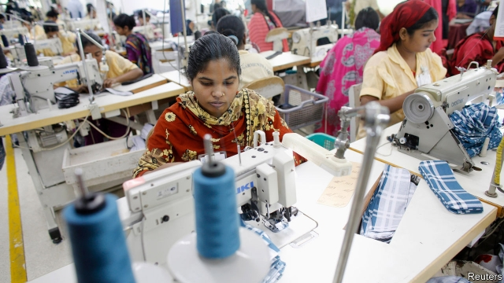

###### Getting out of the house

# Why Bangladesh’s divorce rate is rising 

##### First women get jobs, then they get ideas 

 

> Feb 28th 2019 

IT WAS WHEN Nasrin Khaleque got a job that she realised her marriage “was not normal”. None of her female colleagues seemed to have husbands who checked to see what they were up to ten times a day, or who objected if they went out for coffee after work. She told her husband she wanted a divorce. “I realised I didn’t have to put up with it,” she says. 

According to the Bangladesh Bureau of Statistics, the number of applications for divorce has increased by 34% in the past seven years. More and more are filed by women, especially in cities. Not long ago, women could not initiate divorces. During marriage ceremonies, the presiding registrar would ask the husband and his family if they wanted to give the bride the right to seek a divorce, says Fawzia Karim Firoze, president of the Bangladesh National Woman Lawyers’ Association. “Of course many, if not most, families said ‘no’.” A legal change means women now enjoy the right as a matter of course. But they still have to give a reason for wanting a divorce, such as infidelity. Men do not. 

For the poorest and the richest, says Mrs Firoze, divorce was never that unusual. Among the poor, marriages are seldom official, allowing men to abandon one wife for another easily. As for the rich, “Wealth buys certain freedoms.” But among the middle classes, divorce has been rare: “They face the most stigma. What will my family say? What will other people say?” 

That is changing. The rate of divorce is increasing across the board, but particularly among the middle classes, according to Tania Haque of Dhaka University. Internet access and social media mean women are more easily able to communicate with friends and to lead lives outside their marriage. “This makes the prospect of divorce seem less daunting.” 

With greater access to a world outside the home come changing expectations. Ms Haque believes that popular Indian soap operas have helped to propagate a more liberated world view. For both men and women, she adds, social media have also made it easier to have affairs. Sabrina Saba Mumu, who left her husband after he had an affair, says that her mother’s generation would have tolerated their husbands’ infidelities. She and her friends are less accepting. “We want marriages that are equal partnerships,” she adds, “not a relationship where the man is the boss.” That means sharing housework and child care, too. 

Most importantly, more and more women have jobs. In 1974 women were just 4% of the labour force. In 2016 they were 36% of it. Much of this is down to the booming garment industry, which employs mostly women. Earning a salary makes leaving a bad marriage financially possible. 

Many men are unhappy about these changes. Ms Saba Mumu says her husband wanted her to look after him the way his mother did, but, as a successful research scientist, she “didn’t have time to cook all his meals and do everything else he asked”. Miss Khaleque’s husband thought that because she came from a small town she “wouldn’t be so ambitious”. He forced her to wear a headscarf to work and forbade her from talking to male colleagues. After she had their daughter, he tried to stop her working altogether, saying that she belonged at home. 

Religious groups are also troubled. One of the most prominent, Hefazat-e-Islam (“Protectors of Islam”), formed in 2010 partly in response to plans to change inheritance laws to make them more favourable to women. When Hefazat supporters later marched on the capital calling for stringent segregation of the sexes, that was widely perceived as a call for women to stay at home, especially by the city’s many female garment-workers. Hefazat also rails against adultery and “shamelessness”. 

Hefazat’s hectoring has not stopped the divorce rate from rising. But the social stigma for men and, especially, women who seek divorce remains strong. “In hindsight leaving was the easy part,” says Miss Khaleque. “My family’s judgment since has been harder to take.” 

-- 

 单词注释:

1.nasrin[]:[网络] 纳斯林；娜斯林；娜思琳 

2.khaleque[]:哈利克 

3.Bangladesh[,bɑ:ŋ^lә'deʃ]:n. 孟加拉国 [经] 孟加拉共和国 

4.statistic[stә'tistik]:n. 统计量 a. 统计的, 统计学的 

5.initiate[i'niʃieit]:n. 入会, 开始 a. 新加入的 vt. 开始, 传授基本知识给 

6.preside[pri'zaid]:vi. 统辖, 当主人, 主持 [法] 主持, 负责, 指挥 

7.registrar['redʒistrɑ:]:n. 记录者, 登记者, 登记官员 [医] 登记员, 挂号员, 专科住院医师 

8.fawzia[]:[网络] 埃及公主法丽雅；埃及公主福兹亚；吉娅 

9.Karim[]:n. 卡里姆（男子名） 

10.infidelity[.infi'deliti]:n. 不信神, 无信仰, 背信 

11.Mr['mistә(r)]:先生 [计] 存储器回收程序, 多重请求 

12.stigma['stigmә]:n. 耻辱, 污名, 烙印 [医] 柱头; 小孔, 眼点; 气孔; 小斑; 特征 

13.Tania['tæniә,-njә]:n. [植]芋类 

14.haque[]:[网络] 哈克 

15.DHAKA['dækә]:达卡[孟加拉国首都] 

16.les[lei]:abbr. 发射脱离系统（Launch Escape System） 

17.daunt[dɒ:nt]:vt. 威吓, 难倒, 使气馁 

18.propagate['prɒpәgeit]:vt. 繁殖, 传播, 传送 vi. 繁殖, 蔓延 

19.Sabrina[sә'bri:nә]:n. 塞布丽娜(f.) 

20.saba['sɑ:bə]:n. 塞巴（阿拉伯南部的一个古国, 今天的也门）；萨巴岛（西印度群岛的背风群岛北部的岛）；赛伯伊王国（经营黄金、香料和宝石的古代王国） 

21.mumu['mu:mu:]:n. 丝虫病；穆穆袍（一种色彩鲜艳的女式宽大长袍） 

22.partnership['pɑ:tnәʃip]:n. 合伙, 合股, 合作关系 [经] 合伙(合作)关系, 全体合伙人 

23.importantly[]:adv. 重要地；大量地；有名望地；自命不凡地 

24.financially[]:adv. 金融上；财政上 

25.ambitious[æm'biʃәs]:a. 有野心的, 抱负不凡的, 雄心勃勃的 

26.headscarf[ˈhedskɑ:f]:n. 女人的头巾 

27.protector[prә'tektә]:n. 保护者, 保护物, 保护装置 [医] [催化]保护质, 保护器 

28.Islam['izlɑ:m]:n. 伊斯兰教 

29.inheritance[in'heritәns]:n. 遗传, 遗产 [医] 遗传 

30.supporter[sә'pɒ:tә]:n. 支持者, 后盾, 迫随者, 护身织物 [法] 支持者, 赡养者, 抚养者 

31.stringent['strindʒәnt]:a. 迫切的, 严厉的, 银根紧的 [医] 约束的, 紧迫的 

32.segregation[.segri'geiʃәn]:n. 隔离, 偏析, 被隔离的部分, 种族隔离 [化] 分离; 分凝; 离析; 偏析; 分聚 

33.adultery[ә'dʌltәri]:n. 通奸 [法] 通奸 

34.shamelessness[]:无耻 

35.hindsight['haindsait]:n. 枪的表尺, 事后聪明 

36.judgment['dʒʌdʒmәnt]:n. 裁判, 宣告, 判决书 [医] 判断 

