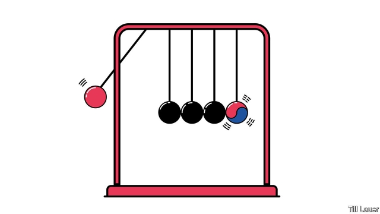

###### Banyan

# Why South Korea and Japan still can’t put the past behind them 

##### Ghosts of the second world war still divide America’s crucial East Asian allies 

 

> Feb 28th 2019 

ONE HUNDRED years ago this week, 33 Korean intellectuals called for independence from the colonial overlord, Japan. Its gendarmes struggled to contain the revolt this sparked, in which over 800,000 Koreans took part. At least 900 Koreans were killed. In one notorious incident police locked protesters in a church and burned it down. 

To mark the anniversary, South Korea’s president, Moon Jae-in, is encouraging hundreds of commemorative events in the coming weeks. Japanese diplomats are nervous about the beating Japan is to get. For Mr Moon, the founding of a provisional government by exiles in Shanghai, as the March 1st movement was being suppressed, more neatly marks the birth of modern Korea than the creation of the Republic of Korea in 1948. After all, that took place, somewhat embarrassingly, under American tutelage. The first president, Syngman Rhee, was a dictator. And only two years later the country was plunged into a civil war that has left the peninsula still cruelly divided today. 

History is messy and painful. Even today few Koreans acknowledge that millions of their compatriots collaborated with the Japanese. Far better to define the Korean character as emanating, pure and brave, from a far-distant moment when it revealed itself in opposition to a monster. For some politicians, Japan-bashing is part of the point. 

But relations between Japan and South Korea are bad enough already. Mr Moon has undermined an agreement between his predecessor, Park Geun-hye, and Shinzo Abe, Japan’s prime minister, meant at last to resolve the issue of Korean “comfort women”—tens of thousands forced during the second world war to have sex with soldiers in imperial army brothels. In return for (yet another) Japanese apology and ¥1bn ($9.3m), South Korea was to stop using the issue as a diplomatic wedge, and to remove the statue of a comfort woman outside the Japanese embassy in Seoul. Half of the money has gone unpaid, and the statue remains. 

Things got worse last year when South Korea’s Supreme Court ordered two Japanese industrial giants to compensate South Koreans forced to work for them during the war. Japan is furious. It says the treaty of 1965 establishing formal relations settled all colonial-era claims in return for $800m, $6.3bn in today’s money, in aid and loans. (The issue of the comfort women arose later.) The South’s then dictator—Ms Park’s father, Park Chung-hee—used the money to kick-start development rather than succour victims. 

Then, in December, Japan claimed a South Korean destroyer in the Sea of Japan had locked its fire-control radar onto a Japanese maritime-surveillance plane—highly provocative, if true. Denying it, the South Korean government accused the plane of buzzing an operation to rescue a stricken North Korean fishing vessel. This is a sensitive sea: South Korea is neuralgic over Japan’s claim to Dokdo, a remote group of islets. 

At least relations among ordinary Koreans and Japanese are good—last year 7.5m South Koreans visited Japan. But as Park Cheol-hee of Seoul National University puts it, leaders are squandering the chances that warmth affords, at a time of growing regional peril. Certainly, Japan is to blame too. Its wartime apologies came thick and fast in the 1990s, when it was keen to be seen to be doing the right thing. These days Mr Abe and his government are more cynical—and fed up. It is popular to decry remorse as “masochism”. Mr Abe has even suggested that comfort women weren’t coerced. 

Worried about its two allies falling out, America urges them to overcome historical differences. That’s blithe. The United States never acknowledges its own contributions to the region’s difficult history. In 1905 it gave Japan a free hand in Korea. As the occupying power in the late 1940s, it put a stop to Japan’s lively examination of its wartime guilt in order to ensure the country was onside during the cold war. 

In 1951, by evading the matter of rightful ownership when helping Japan draw a line under the war in the Treaty of San Francisco, America laid the ground for Dokdo’s present controversy. And leading up to the 1965 treaty, when America had bills to pay in Vietnam and wanted Japan to pony up in South Korea, it urged both sides to adopt only vague statements about “remorse for the past” in favour of looking to the future. Today’s problems are a reminder: a “future-oriented” relationship can’t start without a proper reckoning with the past. 

-- 

 单词注释:

1.banyan['bænjәn]:n. 印度榕树 [医] 榕树, 孟加拉榕 

2.Korea[kә'riә]:n. 朝鲜, 韩国 

3.ally['ælai. ә'lai]:n. 同盟者, 同盟国, 助手 vt. 使联盟, 使联合, 使有关系 vi. 结盟 

4.Korean[kә'riәn]:n. 朝鲜人, 朝鲜语 a. 朝鲜人的, 朝鲜语的 

5.colonial[kә'lәunjәl]:a. 殖民的, 殖民地的 [法] 殖民地居民 

6.overlord['әuvәlɒ:d]:n. 大君主, 最高君主, 霸主 [法] 霸权, 霸主地位, 封建君主 

7.gendarme['ʒɑ:ndɑ:m]:n. 宪兵, 警官 

8.Korean[kә'riәn]:n. 朝鲜人, 朝鲜语 a. 朝鲜人的, 朝鲜语的 

9.notorious[nәu'tɒ:riәs]:a. 声名狼藉的, 臭名昭著的, 众人皆知的 

10.protester[]:n. 抗议者, 持异议者, 拒付者 [经] 反对者 

11.commemorative[kә'memәrәtiv]:a. 纪念的 

12.diplomat['diplәmæt]:n. 外交官, 有外交手腕的人 [法] 外交家, 外交官, 有权谋的人 

13.provisional[prә'viʒәnl]:a. 暂时的, 暂定的, 临时的 [医] 临时的 

14.exile['eksail]:n. 放逐, 流放, 被放逐者 vt. 放逐, 流放, 使背井离乡 

15.suppress[sә'pres]:vt. 镇压, 使止住, 禁止, 抑制, 查禁 [法] 镇压, 平定, 禁止出版 

16.neatly['ni:tli]:adv. 整洁地, 干净地, 匀称地 

17.creation[kri:'eiʃәn]:n. 创造, 创作物, 发明 [化] 产生 

18.embarrassingly[im'bærәsiŋli]:adv. 使人尴尬地, 使人为难地, 使人难堪地 

19.tutelage['tju:tilidʒ]:n. 守护, 监护, 指导 [法] 监护, 保护, 指导 

20.Rhee[]:n. (Rhee)人名；(朝)李 

21.dictator['dikteitә]:n. 命令者, 独裁者 

22.cruelly['kru:әli]:adv. 残忍地, 残酷地, 极 

23.compatriot[kәm'pætriәt]:n. 同国人 a. 同国的, 同胞的 

24.emanate['emәneit]:vi. 散发, 发出, 发源 

25.opposition[.ɒpә'ziʃәn]:n. 反对, 敌对, 相反, 在野党 [医] 对生, 对向, 反抗, 反对症 

26.monster['mɒnstә]:n. 怪物, 恶人, 巨物 [医] 畸胎 

27.undermine[.ʌndә'main]:vt. 在...下面挖, 渐渐破坏, 暗地里破坏 [法] 暗中破坏, 以阴谋中伤伤害 

28.predecessor[.predi'sesә]:n. 前任, 先辈, 前身 [医] 初牙, 前辈, 祖先 

29.shinzo[]:[网络] 晋三；爆裂战士战蓝宝；神像 

30.abe[eib]:n. 亚伯（男子名, 等于Abraham） 

31.imperial[im'piәriәl]:a. 帝王的, 宗主国的, 至尊的, 壮丽的 n. 特等品 

32.brothel['brɒθәl]:n. 妓院 [法] 妓院 

33.diplomatic[.diplә'mætik]:a. 外交的, 老练的 [法] 外交的, 外交上的, 文献上的 

34.wedge[wedʒ]:n. 楔子, 楔形物, 起因, 导致分裂的东西 vt. 楔住, 挤进, 楔入 vi. 楔入, 挤进 

35.Seoul[sәul]:n. 汉城 

36.unpaid[.ʌn'peid]:a. 未付款的, 不支薪水的 [经] 未付的, 未缴纳的 

37.succour['sʌkә]:n. 解救, 援助者 vt. 解救, 援助 

38.destroyer[di'strɒiә]:n. 破坏者, 消灭者, 起破坏作用的东西, 驱逐舰 

39.provocative[prә'vɒkәtiv]:a. 激发感情的, 挑拨的, 刺激的 n. 刺激物, 挑拨物, 兴奋剂 

40.buz['bʌz]:abbr. buzzer 蜂音器, 蜂鸣器 

41.neuralgic[nju'rældʒik]:a. 神经痛的 [医] 神经痛的 

42.Dokdo[]:[网络] 独岛；独岛号；独岛级 

43.islet['ailit]:n. 小岛 [医] 岛, 小岛 

44.squander['skwɒndә]:vt. 浪费, 使分散 vi. 浪费, 漂泊, 四散 

45.regional['ri:dʒәnәl]:a. 地方的, 地域性的 [医] 区的, 部位的 

46.peril['peril]:n. 危险, 冒...之险, 险境, 险因 vt. 置...于险境, 冒险, 危及 

47.wartime['wɒ:taim]:n. 战时 

48.decry[di'krai]:vt. 反对, 责难, 诽谤, 诋毁 

49.remorse[ri'mɒ:s]:n. 懊悔, 良心不安, 自责, 同情 [法] 悔恨, 自责, 懊悔 

50.masochism['mæzәkizm]:n. 被虐待狂, 受虐狂 [医] 受虐狂 

51.coerce[kәu'ә:s]:vt. 强制, 强迫 

52.blithe[blaið]:a. 愉快的, 高兴的 

53.guilt[gilt]:n. 罪行, 内疚 [法] 罪, 犯罪, 罪行 

54.onside['ɒn'said]:n. 不越位 

55.evade[i'veid]:v. (巧妙地)逃脱, 规避, 逃避 

56.rightful['raitful]:a. 合法的, 正直的, 恰当的 [法] 正当的, 合法的, 依法有求权的 

57.san[sɑ:n]:abbr. 存储区域网（Storage Area Networking） 

58.francisco[fræn'siskәu]:n. 弗朗西斯科（男子名, 等于Francis） 

59.controversy['kɒntrәvә:si]:n. 论争, 辩论, 论战, 争论 [法] 论战, 争论, 争吵 

60.Vietnam[.vjet'næm]:n. 越南 

61.pony['pәuni]:n. 矮种马 v. 借助逐字直译文翻译 a. 小型的, 每日摘要的 

62.reckon['rekәn]:vt. 计算, 总计, 估计, 认为, 猜想 vi. 数, 计算, 估计, 依赖, 料想 

