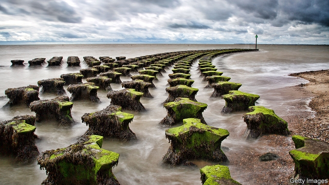

###### The past returns

# A quietly moving book on Mesolithic history and grief 

##### “Time Song” reflects on lost landscapes and lost loved ones 

 

> Feb 28th 2019 

Time Song: Searching for Doggerland. By Julia Blackburn. Illustrated by Enrique Brinkmann. Jonathan Cape; 304 pages; £25. To be published in America by Pantheon in August; $26.95. 

TO LIVE BESIDE the sea is to be reminded of absences. Bones, mammoth tusks, fossilised creatures and even ghostly footprints are washed up on the beach or uncovered under layers of sand, hinting at generations of bygone residents, human and animal. The coastline of East Anglia in England has inspired many writers, notably W.G. Sebald, a German who walked and meditated on its history. That stretch of shore is also one of the places where evidence of Doggerland—the huge area of forests and plains that connected Britain to mainland Europe before it was submerged by the rising sea—has recently appeared. 

A search for traces of Doggerland is the starting point for “Time Song” by Julia Blackburn, a writer and poet who lives in Suffolk. Blending nature writing with memoir and poetry, her book is an unconventional attempt to “learn prehistory hand to mouth”. The result is a meditation on the Mesolithic and what people are truly looking for when they turn to the past. 

Like many of the people in the book—a Dutch customs inspector with an interest in mammoth bones, a young British fossil-hunter—Ms Blackburn is a collector with an eye for minutiae. Like an archaeologist’s shelf, her writing is filled with detail. A friend has a “wonderful breathing bellow of a laugh”; a row of bungalows resembles biscuits in a tin. She relays what the experts she meets say and do, but also notes the muffins they eat, and her nervous chuckle when one of them comments on her untidy handwriting. These mildly eccentric folk, and Ms Blackburn’s responses to them, strike a humorous note rarely found in nature writing. 

But it is in her descriptions of the sea and her imaginings of the land it submerged that Ms Blackburn’s book is most arresting. In her evocation of Doggerland, and how it may have looked or felt before being flooded by rising seas around 8,000 years ago, she is quick to see a parallel with modern climate change: 

I have watched starlings thickening the evening sky, seals gathered in their breeding colonies, an exodus of toads too numerous to count; but every year there is less to see and my memory tries its best to forget what it has known, for fear of being made too sad by the reality of that loss. We learn to grow accustomed to the absences, because it seems we have no choice. 

“Time Song” is not overtly political. Brexit is mentioned only briefly, despite the obvious echo of Britain once again trying to sever connections with the adjacent landmass. But it is deeply concerned about the environment, and how people treat and remember the landscape. 

And with another, more personal loss: of Ms Blackburn’s second husband, Herman Makkink, a Dutch artist. As Ms Blackburn searches for the elusive Doggerland, his absence becomes palpable, too. Her journeys back and forth between Britain and the Netherlands recall earlier trips they made together. In the face of the Tollund Man, the prehistoric body found in a bog in Denmark in 1950, she catches a glimpse of her husband’s features as he died: “They had the same pattern of lines across the forehead, the same arch of the nose, the same inward smile.” 

Ms Blackburn’s poetry, interspersed throughout, is less compelling than her lyrical prose. Yet the combination of wry observations and personal reflections makes “Time Song” gripping. In searching for a landscape she can never fully grasp, much as she reaches out for her husband’s hand in the night to find it missing, she discovers a sort of comfort. The book arrives at an acceptance of loss—of small personal sorrows, if not larger environmental ones. The director of the museum that houses the Tollund Man tells Ms Blackburn that seeing the shrunken, preserved body each day made him realise that “death is not so bad; it is nothing to be afraid of”. 

-- 

 单词注释:

1.quietly['kwaiәtli]:adv. 安静地, 沉着地, 秘密地 

2.Mesolithic[,mesәu'liθik, ,mez-]:n. 中石器时代(旧石器时代与新石器时代之间的时代) 

3.grief[gri:f]:n. 伤心, 忧愁, 悲痛, 不幸, 灾难 

4.landscape['lændskeip]:n. 风景, 山水, 风景画 vi. 从事景观美化 vt. 美化...景观 [计] 横向 

5.Doggerland[]:[网络] 多格兰；水下世界道格岛；牧犬者墓地 

6.julia['dʒu:ljә]:n. 朱莉娅（女子名） 

7.blackburn[]:n. 布莱克本（英国地名）；布力般流浪（足球球会名称） 

8.Enrique[enrik]:n. 恩里克（男子名） 

9.brinkmann[]: [人名] 布林克曼; [地名] [阿根廷] 布林克曼 

10.jonathan['dʒɔnәθәn]:n. 乔纳森（男子名） 

11.cape[keip]:n. 岬, 海角, 披肩, 斗蓬 

12.pantheon['pænθiәn]:n. 众神庙, 万神殿, 罗马万神殿 

13.mammoth['mæmәθ]:n. 猛犸, 庞然大物 a. 猛犸似的, 巨大的 

14.tusk[tʌsk]:n. 长牙, 獠牙, 尖物 vt. 以长牙刺戳, 以长牙掘 

15.fossilise['fɔsilaiz]:vt.vi. 使成化石, 变成化石, 使(思想)陈旧, 使僵化 

16.ghostly['gәustli]:a. 幽灵的, 影子似的, 精神的 

17.footprint['futprint]:n. 足迹 [计] 印迹 

18.bygone['baigɒn]:n. 过去的事, 往事 a. 过去的 

19.coastline['kәustlain]:n. 海岸线 

20.Anglia['æŋgliә]:n. 英格兰的拉丁名称 

21.notably['nәjtbәli]:adv. 显著地, 著名地, 尤其, 特别 

22.wg[]:abbr. 水表（Water Gauge）；波导管（Wave Guide）；线规（Wire Gauge）；威尔士禁卫军（Welsh Guards） 

23.sebald[]: [人名] 西博尔德 

24.meditate['mediteit]:vt. 想, 考虑, 计划 vi. 沉思, 反省 

25.suffolk['sʌfәk]:n. 萨福克（英国东部一郡）；萨克福马；萨福克羊 

26.memoir['memwɑ:]:n. 传记, 实录, 追思录, 回忆录, 自传 [化] 研究报告 

27.unconventional[.ʌnkәn'venʃәnl]:a. 不依惯例的, 非传统的, 非常规的 

28.prehistory[.pri:'histәri]:n. 史前学, 史前史, 历史背景 [法] 史前的, 史前考古学, 史前背景 

29.meditation[.medi'teiʃәn]:n. 沉思, 冥想 

30.Dutch[dʌtʃ]:n. 荷兰人, 荷兰语 a. 荷兰的 

31.inspector[in'spektә]:n. 检查员, 巡视员 [化] 检查员 

32.collector[kә'lektә]:n. 收集家, 收取款项的人 [化] 集电极; 捕收剂 

33.minutia[mai'nju:ʃiә]:n. 细节, 琐事 

34.bellow['belәu]:v. 怒吼 

35.muffin['mʌfin]:n. 松饼 

36.chuckle['tʃʌkl]:n. 咯咯的笑声, 轻笑 vi. 咯咯的笑, 咕咕叫 

37.untidy[.ʌn'taidi]:a. 不整齐的, 懒散的, 混乱的 

38.mildly['maildli]:adv. 柔和地, 和善地, 适度地 

39.eccentric[ik'sentrik]:n. 怪人, 偏心圆 a. 古怪的, 反常的, 不同圆心的 

40.imagining[iˈmædʒinɪŋ]:v. 想( imagine的现在分词 ); 想像; 料想; 误认为 

41.evocation[.evә'keiʃәn]:n. 唤出, 招魂, 唤起 [医] 启发作用(唤起形态形成的潜势力) 

42.starling['stɑ:liŋ]:n. 欧椋鸟, 桥墩尖端 

43.thicken['θikәn]:vi. 变浓, 变厚, 变得模糊, 变为复杂 vt. 使变厚, 加强, 使模糊 

44.exodus['eksәdәs]:n. 大批的离去 [法] 退出, 大批离去, 成一外出 

45.toad[tәud]:n. 蟾蜍, 癞蛤蟆, 讨厌的家伙 

46.les[lei]:abbr. 发射脱离系统（Launch Escape System） 

47.overtly['әuvә:tly. әu'vә:tly]:adv. 明显地；公开地, 公然地 

48.Brexit[]:[网络] 英国退出欧盟 

49.briefly['brifli]:adv. 简短地, 扼要地, 简明地, 简单地 

50.sever['sevә]:vt. 切断, 脱离, 分开, 使分离, 断绝, 中断 vi. 断, 裂开 

51.adjacent[ә'dʒeisәnt]:a. 毗连的, 邻近的, 连接的 [机] 相邻的, 邻位的, 交界的 

52.landmass['lændmæs]:n. 陆块 

53.herman['hә:mәn]:n. 赫尔曼（男子名） 

54.elusive[i'lu:siv]:a. 难懂的, 易忘的, 难以捉摸的 

55.palpable['pælpәbl]:a. 可感知的, 明显的, 触摸得到的 [医] 可触知的 

56.Netherlands['neðәlәndz]:n. 荷兰 

57.tollund[]:[网络] 收费 

58.prehistoric['pri:his'tɔrik]:a. 历史以前的, 史前的 

59.bog[bɒg]:n. 沼泽 vt. 使陷于泥沼 vi. 陷于泥沼 

60.Denmark['denmɑ:k]:n. 丹麦 

61.intersperse[.intә'spә:s]:vt. 散布, 点缀 

62.lyrical['lirikәl]:a. 抒情诗调的, 有抒情味的, 感情丰富的 

63.prose[prәuz]:n. 散文 v. 写散文 a. 散文的, 平凡的 

64.wry[rai]:a. 扭歪的, 歪曲的, 歪斜的 v. 扭曲, 扭歪 

65.fully['fuli]:adv. 十分地, 完全地, 充分地 

66.environmental[in.vaiәrәn'mentәl]:a. 周围的, 环境的 [经] 环境的, 环保的 

