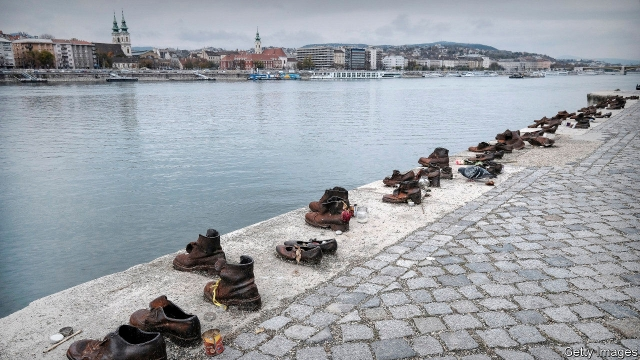

###### European literature

# After 50 years, a Hungarian novel is published in English 

##### A onetime “class enemy” finds a new audience 

 

> Feb 28th 2019 

Katalin Street. By Magda Szabo. Translated by Len Rix. NYRB Classics; 248 pages; $15.95. MacLehose Press; £12.99. 

THE HUNGARIAN writer Magda Szabo, who died in 2007, knew from personal experience what it meant to have dreams smashed by arbitrary power. As a young poet she won her country’s chief literary honour, the Baumgarten prize, in 1949. On the same day, the communist regime cancelled this award to a “class enemy”. She lost her civil-service job, went to teach in a primary school, and only began to publish novels a decade later as a thaw began. 

Her fiction shows the travails of modern Hungarian history from oblique but sharply illuminating angles. In novels such as “The Door” and “Iza’s Ballad”, intimate dramas are entangled with public upheavals: the repressive governments and Nazi occupation of the 1930s and 1940s; the sudden annihilation of Hungary’s Jews; the soul-sapping compromises and betrayals of the Stalinist era. In “Katalin Street”, published in 1969 but only now translated into supple, graceful English by Len Rix, three neighbouring families live through the shocks that batter Budapest between 1934 and 1968. 

Readers meet the upright, naive headmaster Mr Elekes, who will see his obedience to authority traduced by two kinds of tyranny, and his wife and daughters: sensible, thoughtful Iren, who narrates part of the story, and scatty, lovable Blanka. Next door lives the affable Jewish dentist Mr Held, with his wife Anna and dreamy daughter Henriette. On the other side resides the kind-hearted warrior Major Biro with his housekeeper-mistress Mrs Temes and son, Balint. The fate of this tarnished golden boy, a mediocre but weirdly charming medic, anchors a plot that jumps back and forth through the decades. 

To these adjacent households on a quiet street between the Danube and the castle, public tumult often feels as remote as the distant sounds of unrest that reach survivors during the anti-communist uprising of 1956. They dwell most happily in memory, in longing, even in fantasy. Their pasts haunt their present: “The dead are not dead,” Szabo writes, “but continue living in this world.” 

Devoted to order and ritual, headmaster Elekes seeks to “impose stability on the uncertainties of life”. History, with its “concentrated unreality” of cruelty and absurdity, will wreck all such hopes. Szabo summons the cosy, closed world of the three clans with a lyrical, quicksilver touch. That makes the thuggish intrusions of despotic power—the Helds’ deportation, the shooting of Henriette—all the more wrenching. In a striking departure from her usual delicate realism, the author makes the dead girl return as a phantom witness to later events. The post-war years see persecution, exile, grief and eviction fray or snap this tight circle of allies. Symbolised by the ghostly Henriette, former times shadow the new, with “the living experience and the old memory sitting neatly side by side”. 

Szabo is no nostalgic sentimentalist. The pre-war bourgeois idyll between river and castle had defects aplenty. Yet gilded recollection fortifies and binds the families; Iren and Balint, tetchily married in the end, have both “seen the same blue sky shining, before the thunder broke”. That thunder blew trust and justice out of daily life. Now, only force and chance hold sway. “Life isn’t a schoolroom,” Balint says when the mercurial Blanka defects to the West. “There aren’t any rules.” 

-- 

 单词注释:

1.Hungarian[hʌŋ'gєәriәn]:a. 匈牙利的, 匈牙利人的, 匈牙利语的 n. 匈牙利人, 匈牙利语 

2.onetime[]:a. 从前的, 一度的 adv. 从前, 一度 

3.katalin['kætəlɪn]: [医]白内停，卡他林，白障灵 

4.Magda['mæ^dә]:n. 玛格达(Magdalene 的昵称)(f.) 

5.Szabo[]:n. (Szabo)人名；(英)绍博 

6.len[]:n. 伦恩（男子名） 

7.Rix[]:n. 里克斯（男子名）；一种音乐形式 

8.maclehose[]: [人名] 麦克尔霍斯 

9.Hungarian[hʌŋ'gєәriәn]:a. 匈牙利的, 匈牙利人的, 匈牙利语的 n. 匈牙利人, 匈牙利语 

10.baumgarten[]:n. (Baumgarten)人名；(德、匈、英)鲍姆加腾 

11.regime[rei'ʒi:m]:n. 政权, 当权期间, 政体, 社会制度, 体制, 情态 [医] 制度, 生活制度 

12.thaw[θɒ:]:n. 融解, 融化, 解冻时期 vt. 使融解, 使缓和 vi. 融化, 解冻 

13.travail['træveil]:n. 分娩的痛苦, 阵痛, 辛劳 vi. 发生阵痛, 辛劳 

14.oblique[ә'bli:k]:a. 斜的, 倾斜的, 间接的, 不光明正大的, 躲躲闪闪的 [医] 斜的 

15.illuminate[i'lju:mineit]:vt. 照明, 用灯装饰, 阐明, 说明, 使灿烂 vi. 照亮, 用灯装饰 

16.ballad['bælәd]:n. 歌谣 

17.entangle[in'tæŋgl]:vt. 使纠缠, 卷入, 使混乱 

18.repressive[ri'presiv]:a. 压抑的, 抑制的, 镇压的 

19.Nazi['nɑ:tsi]:n. 纳粹党人 a. 纳粹党的 

20.annihilation[ә.naiә'leiʃәn]:n. 歼灭, 湮灭 [化] 消灭; 湮灭; 湮灭 

21.Jew[dʒu:]:n. 犹太人, 守财奴, 犹太教信徒 vt. 欺骗, 杀价 

22.betrayal[bi'treiәl]:n. 背叛, 辜负 [法] 背叛, 通敌, 背信 

23.Stalinist['stalinist]:n. 斯大林主义者 a. 斯大林主义的；斯大林的 

24.supple['sʌpl]:a. 柔软的, 逢迎的, 顺从的 vt. 使柔软, 使顺从 

25.batter['bætә]:v. 连续猛打（尤其指妇女），猛击 n. 面糊（食物），击球员，打击手 

26.Budapest[bju:dә'pest]:n. 布达佩斯(匈牙利首都) 

27.naive[nɑ:'i:v]:a. 天真的, 纯真的, 幼稚的 

28.obedience[ә'bi:djәns]:n. 服从, 顺从, 忠实 [法] 服从, 顺从, 遵从 

29.traduce[trә'dju:s]:vt. 诽谤, 中伤, 背叛 [法] 诽谤, 中伤, 诋毁 

30.tyranny['tirәni]:n. 专制, 暴政 [法] 苛政, 暴政, 专横 

31.iren[]: [地名] [俄罗斯] 伊连河 

32.narrate[nә'reit]:v. 说故事, 说明, 叙述 

33.scatty['skæti]:a. 轻率的, 愚蠢的 

34.lovable['lʌvәbl]:a. 可爱的, 惹人爱的 

35.affable['æfәbl]:a. 和蔼可亲的, 友善的, 亲切的, 慈祥的 

36.anna['ænә]:n. 安娜（女子名） 

37.dreamy['dri:mi]:a. 空幻的, 梦想的 

38.henriette[]:n. (Henriette)人名；(荷)亨丽特 

39.reside[ri'zaid]:vi. 住, 居留, 属于 [法] 居住 

40.warrior['wɒ:riә]:n. 战士, 勇士, 武士, 鼓吹战争的人, 战斗, 尚武 

41.biro['bairәu]:n. 圆珠笔 

42.Mr['mistә(r)]:先生 [计] 存储器回收程序, 多重请求 

43.teme[]: [医]THhromboenmbolic meningoencephalitis 血栓性脑膜炎 

44.balint[]:n. (Balint)人名；(塞、罗、英)巴林特；(法)巴兰 

45.tarnish['tɑ:niʃ]:n. 失泽, 失泽膜, 污点 vt. 使失去光泽, 玷污 vi. 失去光泽, 被玷污 

46.mediocre[.mi:di'әukә]:a. 不好不坏的, 通常, 平凡的 

47.weirdly[]:adv. 古怪地 

48.charm[tʃɑ:m]:n. 吸引力, 魔力, 符咒 vt. 迷住, 使陶醉, 行魔法 vi. 用符咒, 有魅力 

49.medic['medik]:n. 苜蓿属植物, 医师, 医科学生 

50.adjacent[ә'dʒeisәnt]:a. 毗连的, 邻近的, 连接的 [机] 相邻的, 邻位的, 交界的 

51.Danube['dænju:b]:n. 多瑙河 

52.tumult['tju:mʌlt]:n. 骚动, 吵闹, 混乱 [法] 骚乱, 骚动, 暴乱 

53.survivor[sә'vaivә]:n. 生还者, 幸存者 [法] 生还者, 生存者, 辛存者 

54.uprise[ʌp'raiz]:n. 升起, 起立, 上山坡, 出现 vi. 上升, 起义, 出现 

55.dwell[dwel]:vi. 居住, 居住(于), 存在(于) 

56.haunt[hɒ:nt]:n. 常到的地方, 生息地 vt. 常到, 出没于, 萦绕于 vi. 出没, 作祟 

57.ritual['ritʃuәl]:n. 仪式, 典礼, 宗教仪式 a. 仪式的, 依仪式进行的 

58.uncertainty[.ʌn'sә:tnti]:n. 不确定, 不可靠, 不确定的事物 [化] 不确定度 

59.unreality[.ʌnri'æliti]:n. 不真实, 非现实, 不存在之物 

60.cruelty['kru:әlti]:n. 残酷, 野蛮, 残酷行为 [法] 残酷, 残忍, 虐待 

61.absurdity[әb'sә:diti]:n. 荒谬, 悖理, 荒谬的言行 

62.summon['sʌmәn]:vt. 召唤, 召集, 号召, 振奋, 唤起, 鼓起 [经] 传唤, 传讯 

63.clan[klæn]:n. 氏族, 宗族, 集团 [医] 支 

64.lyrical['lirikәl]:a. 抒情诗调的, 有抒情味的, 感情丰富的 

65.quicksilver['kwiksilvә]:n. 水银, 汞 vt. 涂水银于 a. 水银似的, 易变的 

66.thuggish['θʌ^iʃ]:[法] 暗杀的, 杀人的, 暴行的 

67.intrusion[in'tru:ʒәn]:n. 闯入, 侵扰 [医] [向内]突入 

68.despotic[de'spɒtik]:a. 专制的, 专横的, 暴虐的 [法] 专制的, 专横的 

69.deportation[.di:pɒ:'teiʃәn]:n. 驱逐出境, 放逐 [法] 递解出境, 放逐, 驱逐 

70.wrench['rentʃ]:n. 扳钳, 扳手, 扭伤, 歪曲, 痛苦 vt. 猛扭, 扭伤, 曲解, 折磨 vi. 猛扭, 猛绞 

71.realism['riәlizm]:n. 写实主义, 现实, 实在论 [法] 现实主义 

72.phantom['fæntәm]:n. 幻影, 虚位, 幽灵, 化身, 令人恐惧的事物, 骇人的想法 a. 幻觉的, 幻影的, 幽灵的, 虚无飘渺的, 捉摸不定的, 有名无实的 

73.persecution[.pә:si'kju:ʃәn]:n. 虐待, 迫害运动, 迫害, 烦扰 [法] 迫害, 虐待, 困扰 

74.exile['eksail]:n. 放逐, 流放, 被放逐者 vt. 放逐, 流放, 使背井离乡 

75.grief[gri:f]:n. 伤心, 忧愁, 悲痛, 不幸, 灾难 

76.eviction[i'vikʃәn]:n. 逐出, 赶出 [法] 收回财产, 收回租地, 没收 

77.fray[frei]:n. 磨损, 打架, 争论 vt. 使磨损 vi. 被磨损 

78.ally['ælai. ә'lai]:n. 同盟者, 同盟国, 助手 vt. 使联盟, 使联合, 使有关系 vi. 结盟 

79.symbolise['simbәlaiz]:vt. 象征, 代表, 作为...的象征 vt.vi. 用符号表示, 使用符号 

80.ghostly['gәustli]:a. 幽灵的, 影子似的, 精神的 

81.neatly['ni:tli]:adv. 整洁地, 干净地, 匀称地 

82.nostalgic[nɒs'tældʒik]:a. 乡愁的, 怀旧的 [医] 怀乡病的 

83.sentimentalist[senti'mentәlist]:n. 感伤主义者 

84.bourgeois[buә'ʒwɑ:]:n. 中产阶级分子, 商人, 资产阶级 a. 中产阶级的, 平庸的 n. 九点活字 

85.idyll['idil, 'aidil]:n. 叙事诗, 田园景色, 田园诗, 田园乐曲, 牧歌 

86.aplenty[ә'plenti]:a. 丰富的 adv. 充裕地 

87.gild[gild]:vt. 镀金, 虚饰, 装饰, 供给钱 

88.recollection[.rekә'lekʃәn]:n. 记忆, 回想, 回忆 

89.fortify['fɒ:tifai]:vt. 设要塞于, 加强, 使坚强, 增加 vi. 筑防御工事 

90.tetchily[]:adv. tetchy的变形 

91.schoolroom['sku:lru:m]:n. 教室, 讲堂 

92.mercurial[mә:'kjuәriәl]:a. 水星的, 敏捷的, 活泼的, 水银的 n. 汞剂 

