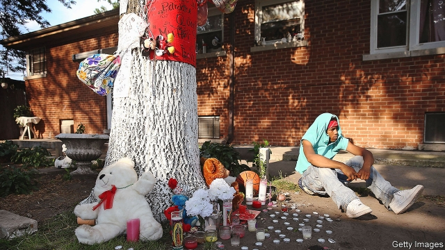

###### Down but very far from out

# An unflinching look at violence in Chicago 

##### Mass shootings get plenty of attention. But ordinary violence causes far more damage to the most vulnerable people 

 

> Feb 28th 2019 

An American Summer: Love and Death in Chicago. By Alex Kotlowitz. Doubleday; 304 pages; $27.95. 

WALK THROUGH Bronzeville on Chicago’s South Side and there is plenty to suggest that a once-troubled neighbourhood is on the up. A supermarket has replaced a housing project, the Ida B. Wells Homes, that was notorious for gangs, drugs and murder. In Peach’s, a bustling corner restaurant, a customer who is tucking into breaded catfish and collard greens talks of a local revival. He marvels that brownstone houses nearby used to go for a song, when many were boarded up and abandoned. Now they sell for $1m or more. 

Some locals fear gentrification, or the loss of a proud black history. In the 1950s over 110,000 African-Americans called Bronzeville home. Artists such as Louis Armstrong, Duke Ellington and Josephine Baker would play and party on 47th Street. As the neighbourhood smartens, incoming white and Hispanic residents put a welcome dent in segregation. But poorer blacks are being squeezed out, as they are elsewhere in Chicago. The city has lost over 230,000 black residents so far this century, most from the South Side. 

Above all, crime festers. Although Bronzeville has become safer in the past few years, it still endures levels of crime unthinkable in richer (and whiter) places. The number of homicides in Chicago as a whole has dropped since 1991, when 927 people were killed. The city nonetheless sees more of them (538 last year) than more-populous New York and Los Angeles combined. As many as 4,000 people are shot and wounded yearly, one every two hours. Many of them are paralysed. 

Some observers liken the neglected districts in the South and West Sides of the city to war zones. The term “Chi-raq” (a combination of Chicago and Iraq) has grown popular in recent years, adopted by rappers, T-shirt makers and the film-maker Spike Lee. Once acquired, such a reputation is terribly hard to shake. Take the word of Eddie Bocanegra for that. He is a former gang member who tries to steer youngsters away from violent crime. At a recent meeting in a redbrick YMCA in Bronzeville, he spoke of how his brother, a soldier who just ended a tour in Syria, refuses to move to Chicago because of its lawlessness. 

How people confront that violence and deal with its consequences is the subject of Alex Kotlowitz’s new book. His first, “There Are No Children Here”, was published at the peak of killings, in the early 1990s. It remains a model of powerful writing on a painful subject. For years Mr Kotlowitz, a journalist and author who lives in the city, immersed himself in the lives of two brothers, Lafayette and Pharaoh, as they became young teenagers. His book tells, in intimate detail, of their growing up in public housing, threatened by gangs and guns. 

In his new book, “An American Summer”, Mr Kotlowitz returns a generation later to the same topic. Depressingly, much continues as before. In the past 20 years over 14,000 people have been murdered in the city. Again he sets out how sudden deaths, injuries and constant dread cut apart the already fragile lives of the most deprived. Mr Kotlowitz spent four years among some 200 interviewees. He tells some of their stories, set in the hot months of 2013 as a surge in killings occurs. “Sun’s out, guns out,” as sardonic locals say. 

He tells Mr Bocanegra’s story, describing his persistent sense of guilt for killing a rival when a teenager, how he served his sentence and has since tried to make amends by counselling others to prevent more violence. More distressing are the profiles of near-random victims, such as a girl hit by a stray bullet from a shoot-out. She died in her living room while dancing at her 11th birthday party. Mr Kotlowitz notes how many parents “take out life insurance policies on their children”, fearing the cost of a funeral. 

Mr Kotlowitz is a sympathetic, fluent writer. He is not one for policy prescriptions, but the accumulating accounts of suffering serve to condemn the city for letting the violence drag on. The author meets a quadriplegic man in his 20s who can find care only in a dementia home. Victims who survive are among the likeliest to become perpetrators, or victims again. The law is hardly a deterrent: only one in ten shootings leads to even a charge. Many witnesses to murders are terrified or set on revenge; few are willing to testify. Though Mr Kotlowitz does not dwell on it, relations with police are often tense. Barely a quarter of murders are cleared up. 

The shifting nature of violence is also troubling. Mr Kotlowitz picks out two trends. First, many killings today seem purposeless. Although he does not romanticise the criminal past, he notes that a few well-structured gangs such as the Gangster Disciples and Vice Lords used to fight to control territory and Chicago’s drug trade. Then, many killings could at least be understood as part of those clashes. 

Since the police broke the large gangs, hundreds of tiny cliques—police estimate 625—have risen. These can have as few as ten members, often young teenagers on a residential block. Such boys are anxious to prove themselves fearless to peers. All have easy access to guns. The cliques quickly turn to violence after a petty spat, or to assert status on the street. “People get into it over nothing”, “just because”, as one miserable teenager explains. 

A second change adds to the trauma. In the past many killings were somewhat hidden. They took place in dark corners of enormous public-housing towers where gangs battled. Many such buildings have been demolished in the past few decades. Another writer, Ben Austen, last year published “High-Risers”, a gripping account of the rise and fall of Cabrini Green, one of the most notorious of such complexes. 

The removal of towers that concentrated poverty, dysfunction and mayhem is welcome—it is part of what lets neighbourhoods like Bronzeville begin to recover. But a side-effect is that violence now occurs more often on ordinary residential streets where youngsters play or chat. Some murders are even streamed on social media by bragging rivals. As Mr Kotlowitz writes: “The thing about Chicago’s violence is it’s public—very public—and so each shooting or its aftermath is witnessed by many, children and adults alike.” 

Where will all this end? Hopeful evidence from neighbourhoods like Bronzeville (or cities like New York) shows that economic rejuvenation, better policing and training for young people can all bring violence down. More worrying is that such facts have long been known, but officials and others have done far too little. In the face of inaction, tragedy is inevitable. 

-- 

 单词注释:

1.unflinching[.ʌn'flintʃiŋ]:a. 不畏惧的, 不退缩的, 不畏缩的 

2.Chicago[ʃi'kɑ:gәu]:n. 芝加哥 

3.vulnerable['vʌlnәrәbl]:a. 易受伤害的, 有弱点的, 易受影响的, 脆弱的, 成局的 [医] 易损的 

4.Alex[]:[计] 开放网络文件系统 

5.Doubleday[]:道布尔迪 

6.bronzeville[]:[网络] 布朗兹维尔；布朗兹维勒；布隆兹威尔 

7.IDA['aidә]:[计] 间接数据地址, 交互式数据分析, 智能数据存取 [化] 同位素稀释分析 

8.B[bi:]:[计] 基地址, 数据库, 基极, 二进制, 块, 字组, 布尔, 总线, 占线, 字节 [医] 硼(5号元素) 

9.notorious[nәu'tɒ:riәs]:a. 声名狼藉的, 臭名昭著的, 众人皆知的 

10.bustle['bʌsl]:n. 喧闹, 裙撑 vi. 奔忙, 喧闹 vt. 使忙碌, 催促 

11.catfish['kætfiʃ]:n. 鲶鱼 

12.collard['kɔlәd]:n. [植]羽衣甘蓝 

13.revival[ri'vaivl]:n. 复兴, 复活, 恢复精神, 苏醒 [医] 复苏, 回生, 精神重振 

14.marvel['mɑ:vl]:n. 奇异事物, 罕见例子 vt. 惊异于 vi. 惊异 

15.brownstone['braunstәun]:n. 褐砂石, 褐砂石建筑 a. 有钱人的 

16.gentrification[ˌdʒentrifiˈkeiʃən]:n. 中产阶级化 

17.louis['lu(:)i, 'lu(:)is]:n. 路易斯（男子名） 

18.Armstrong['ɑ:mstrɔŋ]:[计] 公理 

19.duke[dju:k]:n. 公爵 

20.Ellington[]:埃林顿 *埃灵顿(纳科罗库拉的旧称） 埃灵顿 

21.josephine['dʒәuzifi:n]:n. 约瑟芬（女子名） 

22.baker['beikә]:n. 面包师 [医] 烤箱(骨科用) 

23.smarten['smɑ:tn]:vt. 使潇洒, 使整洁 vi. 变潇洒, 变强烈 

24.incoming['inkʌmiŋ]:a. 进来的, 刚开始的, 新来的 n. 进来 

25.Hispanic[his'pænik]:a. 西班牙的 

26.dent[dent]:n. 凹痕 vt. 使凹下, 削弱 vi. 塌陷 

27.segregation[.segri'geiʃәn]:n. 隔离, 偏析, 被隔离的部分, 种族隔离 [化] 分离; 分凝; 离析; 偏析; 分聚 

28.fester['festә]:vi. 溃烂, 生脓 vt. 使溃烂 n. 脓疮, 溃烂 

29.unthinkable[.ʌn'θiŋkәbl]:a. 不能考虑的, 不能想像的, 想像不到的, 不合理的 

30.homicide['hɒmisaid]:n. 杀人, 杀人者 [医] 杀人, 杀人者 

31.nonetheless[,nʌnðә'les]:conj. 然而, 尽管, 不过 adv. 不过, 仍然, 尽管如此, 然而 

32.york[jɔ:k]:n. 约克郡；约克王朝 

33.los[lɔ:s]:abbr. 月球轨道航天器（Lunar Orbiter Spacecraft）；视线（Line of Sight） 

34.angeles[]:n. 安杰利斯（姓氏）；天使城（菲律宾地名） 

35.paralyse['pærәlais]:vt. 使麻痹, 使瘫痪, 使无力, 使气馁, 终止 [医] 使麻痹, 使瘫痪 

36.liken['laikәn]:vt. 比喻, 比拟 

37.Iraq[i'rɑ:k]:n. 伊拉克 

38.rapper['ræpә]:n. 敲门人, (美)(非正式)控告人, 证人, 检举人 [机] 敲杆 

39.maker['meikә]:n. 制造者, 上帝 [经] 制造者, 出票人 

40.spike[spaik]:n. 长钉, 鞋钉, 钉状物, 尖峰状物, 穗 vt. 以大钉钉牢, 用尖物刺穿, 阻止, 弃置不用 [计] 尖峰信号 

41.lee[li:]:n. 背风处, 避风处, 下风处, 保护, 庇护 a. 避风的, 背风的, 下风的, 保护的 

42.terribly['terәbli]:adv. 可怕地, 甚为, 非常 

43.eddie['edi]:n. 埃迪（男子名） 

44.bocanegra[]:[网络] 博卡内格拉；号博卡内格拉；黑嘴 

45.redbrick['redbrik]:n. 红砖大学 

46.ymca[]:abbr. 基督教青年会（Young Men's Christian Association） 

47.Syria['siriә]:n. 叙利亚 [经] 叙利亚 

48.lawlessness['lɔ:ləsnəs]:n. 不服从法律; 不受法律制约; 未实施法律; 目无法纪 

49.confront[kәn'frʌnt]:vt. 使面对, 对抗, 遭遇, 使对质, 比较 [法] 对证, 使对质, 比较 

50.killing['kiliŋ]:n. 谋杀, 杀戮 a. 杀害的, 疲惫的, 迷人的 

51.immerse[i'mә:s]:vt. 沉浸, 使陷入 [医] 浸[入] 

52.lafayette[.lɑ:fei'et]:n. 拉斐特（美国印地安纳州西部城市）；老佛爷（法国百货公司）；三刺光鲳 

53.pharaoh['færәu]:n. 法老, 暴君 [法] 法老, 暴君 

54.depressingly[dɪ'presɪŋlɪ]:adv. 令人忧愁地; 使人沮丧地; 抑压地; 郁闷地 

55.deprive[di'praiv]:vt. 剥夺, 使丧失 [法] 剥夺, 剥夺, 夺去 

56.interviewee[.intәvju:'i:]:n. 被接见者, 被采访者, 被面试者 

57.surge[sә:dʒ]:n. 巨涌, 汹涌, 澎湃 vi. 汹涌, 澎湃, 颠簸, 猛冲, 突然放松 vt. 使汹涌奔腾, 急放 [计] 电压尖峰 

58.sardonic[sɑ:'dɒnik]:a. 嘲笑的, 冷笑的, 讥讽的 [医] 痉笑的 

59.persistent[pә'sistәnt]:a. 固执的, 坚持的, 持续的, 作用持久的 [法] 坚持的, 固执的, 持续的 

60.guilt[gilt]:n. 罪行, 内疚 [法] 罪, 犯罪, 罪行 

61.amend[ә'mend]:vt. 修改, 改善, 改良 vi. 改过自新 

62.counsel['kaunsәl]:n. 商议, 忠告, 法律顾问 v. 商议, 劝告 

63.profile['prәufail]:n. 侧面, 轮廓, 传略 vt. 描绘...轮廓, 写...的传略 [计] 提问档; 剖面图法; 剖面法 

64.stray[strei]:n. 走失的家畜, 浪子 a. 迷途的, 偶然的 vi. 迷路, 彷徨, 流浪 

65.quadriplegic[,kwɔdri'pledʒik,-'pli:-]:n. 四肢瘫痪者 a. 四肢瘫痪的 

66.dementia[di'menʃiә]:n. 痴呆 [医] 痴呆 

67.perpetrator[]:n. 作恶者, 犯罪者, 行凶者 [法] 作恶者, 行凶者, 犯罪者 

68.testify['testifai]:v. 证明, 作证, 声明, 表明 

69.dwell[dwel]:vi. 居住, 居住(于), 存在(于) 

70.purposeless['pә:pәslis]:a. 无目的的, 无意义的 

71.romanticise[rәj'mæntisaiz]:vt. 使浪漫化, 夸张, 使幻想化 vi. 有浪漫主义思想, 幻想化 

72.gangster['gæŋstә]:n. 流氓, 歹徒 [法] 暴徒, 恶棍, 打手 

73.disciple[di'saipl]:n. 弟子, 门徒 

74.clash[klæʃ]:n. 冲突, 撞击声, 抵触 vi. 冲突, 抵触 vt. 使发出撞击声 [计] 对撞 

75.residential[.rezi'denʃәl]:a. 住宅的, 与居住有关的 [法] 有关居住的, 房产的:居所的, 适于居住的 

76.fearless['fiәlis]:a. 大胆的, 勇敢的, 无畏的 

77.peer[piә]:n. 同等的人, 匹敌, 贵族 vi. 凝视, 窥视, 费力地看, 隐现 vt. 与...同等, 封为贵族 

78.clique[kli:k]:n. 派系, 集团 vi. 结党 [计] 集团型 

79.quickly['kwikli]:adv. 很快地 

80.petty['peti]:a. 琐碎的, 小规模的, 小气的, 委琐的 [经] 小额的, 微小的, 小规模的 

81.assert[ә'sә:t]:vt. 主张, 坚称, 断言 [法] 宣称, 断言, 维护 

82.statu[]:[网络] 状态查看；雕像；特级雪花白 

83.trauma['trɒ:mә]:n. 外伤, 损伤 [医] 创伤, 外伤 

84.demolish[di'mɒliʃ]:vt. 毁坏, 破坏, 粉碎 

85.ben[ben]:n. 内室 [医] 贝昂(俗名,一般指辣木Moringa oleifera,有时也指一些不同属的植物) 

86.Austen['ɔ:stin]:n. 奥斯丁（男子名） 

87.cabrini[]:[网络] 卡布里尼；卡邦尼；卡比连尼 

88.dysfunction[dis'fʌŋkʃәn]:n. 机能不良, 机能障碍 [医] 机能障碍, 机能不良 

89.mayhem['meihem]:n. 蓄意的破坏, 故意的伤害罪 [医] 伤残, 残废 

90.brag[bræg]:n. 吹牛 v. 吹牛 

91.aftermath['ɑ:ftәmæθ]:n. 结果, 后果 [法] 后果, 结果 

92.rejuvenation[]:[医] 回春, 返老还童 

93.inaction[in'ækʃәn]:n. 不活动, 无为, 怠惰, 迟钝 [医] 无作用 

