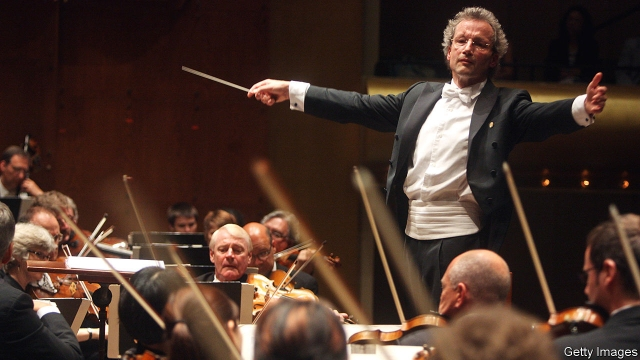

###### Steel and strings

# Orchestral music is thriving in a rock’n’roll city 

##### The 21st century has seen—and heard—a revival of the Cleveland Orchestra’s glory 

 

> Feb 28th 2019 

WHEN THE Cleveland Orchestra moved into Severance Hall in 1931, the state-of-the-art design let well-heeled patrons call their cars from their boxes and be whisked home without having to linger in the cold midwestern air. By 1963 its music director, George Szell, was on the cover of Time and its albums were bestsellers. But after the imperious Szell died in 1970, the orchestra, now in its centennial season, came to lack a distinct identity. “We give a great concert and Szell gets a great review,” griped a former music director in 1997. 

The trajectory reflected the decline of the city itself. Once the fifth-largest in America, a steelmaking hub and sports powerhouse, Cleveland for decades was known mostly for losing games, money and people—shedding half its population in a generation. What is now the 51st-largest city in the country is an unlikely home for a top-tier orchestra. In the late 20th century Cleveland was more associated with rock’n’roll (a term coined by a local DJ in the 1950s). A museum celebrating that sound opened in 1995, and seemed poised to oust Severance Hall as the centre of the city’s musical life. 

Yet the 21st century has seen—and heard—a revival of the orchestra’s glory. Both financially and artistically, the outfit is stronger than ever. Much of its success can be credited to the latest music director, Franz Welser-Möst. The Austrian-born conductor arrived in 2002 and began reshaping the band. One Cleveland board member confides that he was chosen over more famous conductors because he pledged to upend the status quo: “Franz was the only one who said, ‘There’s something different I’d like to do’.” 

Absolute precision has been the orchestra’s hallmark since Szell. Mr Welser-Möst prefers a lighter touch. “You can’t have total control,” he says. “Szell would tell the English horn player which optician to go to. That doesn’t work any more.” Now the music breathes more. Before his current job he endured a rocky stint with the London Philharmonic Orchestra, but in Cleveland he is well-liked by both his players and the wider community. When the orchestra visits local schools or plays at pop concerts on holidays, he goes too. “It makes a difference to people if they see you and say: ‘I know this guy’.” 

More Clevelanders are indeed getting to know him: subscriptions and attendance are rising. The audience is the youngest for any American orchestra, with more than a fifth of classical concert-goers aged 25 or under. Just as important, the patrons are charitable. Statutory funding for the arts is less munificent than in bigger cities and more left-leaning states, but Cleveland’s long tradition of private giving is holding up—crucially, since the institution’s endowment covers only a fraction of the operating budget. Last year the orchestra raised almost $25m; it has managed more than $20m for the past five years. 

That is a handsome haul for any arts organisation, especially one in a mid-tier city. Concert-goers seem to take pride in the underdog character of their musicians. “It’s not a huge population here, but it’s a very generous community,” says André Gremillet, the orchestra’s executive director. “They’re proud that north-east Ohio can produce great American culture.” 

-- 

 单词注释:

1.orchestral[ɒ:'kestrәl]:a. 管弦乐队的 

2.revival[ri'vaivl]:n. 复兴, 复活, 恢复精神, 苏醒 [医] 复苏, 回生, 精神重振 

3.Cleveland['kli:vlәnd]:n. 克利夫兰 

4.severance['sevәrәns]:n. 切断, 分离, 断绝 [经] 解雇 

5.patron['peitrәn]:n. 赞助人, 顾客, 保护人 [法] 保护人, 庇护人, 赞助人 

6.whisk[hwisk]:n. 掸, 扫帚, 毛掸子, 搅拌器, 拂 vt. 扫, 拂, 挥动, 迅速移动, 搅拌 vi. 飞奔 

7.linger['liŋgә]:vi. 逗留, 消磨, 徘徊 vt. 消磨 

8.midwestern['mid'westәn]:a. 美国中西部的 

9.george[dʒɔ:dʒ]:n. 乔治（男子名）；自动操纵装置；英国最高勋爵勋章上的圣乔治诛龙图 

10.szell[]: [人名] 塞尔 

11.bestseller[]:n. 畅销书 

12.imperious[im'piәriәs]:a. 专横的, 傲慢的, 迫切的 [医] 强制的, 不随意的 

13.centennial[sen'tenjәl]:n. 百年纪念 a. 一百年的 

14.gripe[graip]:n. 紧握, 柄, 把手, 控制 vt. 抓紧, 抱住, 使肠痛, 激怒 vi. 肠绞痛, 抱怨 

15.trajectory[trә'dʒektri]:n. 轨道, 弹道, 轨线 [化] 轨道 

16.hub[hʌb]:n. 毂, 木片, 中心 [计] 插座; 插孔; 集线器, 集中器, 连接器, 中继站 

17.powerhouse['pauәhaus]:n. 发电所, 动力室, 精力旺盛的人, 办事效率高的机构 

18.DJ[]:n. 唱片流行音乐节目播音员, 唱片骑师 

19.poise[pɒiz]:n. 平衡, 均衡, 姿势, 镇静, 安静, 砝码 vt. 使平衡, 使悬着, 保持...姿势 vi. 平衡, 悬着, 准备好 

20.oust[aust]:vt. 逐出, 罢黜, 剥夺, 驱逐 [法] 驱逐, 剥夺, 免职 

21.financially[]:adv. 金融上；财政上 

22.artistically[ɑ:'tistikli]:adv. 富有艺术地, 在艺术上 

23.outfit['autfit]:n. 用具, 配备, 机构 vt. 配备, 供应 vi. 得到装备 

24.franz[frɑ:nts]:n. 弗朗茨（Francis Ferdinand的德文名） 

25.reshape[ri:'ʃeip]:vt. 改造, 使成新的形状, 打开新局面 vt. 整形 vi. 整形 [计] 整形 

26.confide[kәn'faid]:vt. 吐露, 委托 vi. 信赖 

27.pledge[pledʒ]:n. 诺言, 保证, 誓言, 抵押, 信物, 保人, 祝愿 vt. 许诺, 保证, 使发誓, 抵押, 典当, 举杯祝...健康 

28.upend[ʌp'end]:v. 颠倒, 倒放 

29.statu[]:[网络] 状态查看；雕像；特级雪花白 

30.hallmark['hɑ:lmɑ:k]:n. 纯度检验证明, 品质证明 vt. 加盖纯度检验证明 

31.optician[ɒp'tiʃәn]:n. 光学仪器商, 眼镜商, 光学仪器制造厂 [医] 眼镜师 

32.rocky['rɒki]:a. 岩石的, 多石的, 像岩石的, 无情的, 摇动的, 摇晃的 

33.stint[stint]:vt. 节省, 限制, 停止 vi. 节约 n. 吝惜, 节约, 限额 

34.philharmonic[.filɑ:'mɒnik]:a. 爱好音乐的, 交响乐团的, 爱乐团体的 n. 音乐爱好者, 音乐协会, 音乐会, 交响乐团 

35.clevelanders[]:[网络] 克利夫兰人 

36.subscription[sәb'skripʃәn]:n. 捐献, 订金, 订阅, 签署, 同意 [化] 订购 

37.attendance[ә'tendәns]:n. 出席, 出席的人数, 照料 [法] 管理, 照料, 资助 

38.charitable['tʃæritәbl]:a. 大慈大悲的, 宽厚的, 慈善的 [法] 慈善的, 慷慨的, 宽恕的 

39.statutory['stætjutәri]:a. 法令的, 法定的, 可依法惩处的 [经] 法定的 

40.les[lei]:abbr. 发射脱离系统（Launch Escape System） 

41.munificent[mju:'nifisnt]:a. 丰厚的, 慷慨的 

42.endowment[in'daumәnt]:n. 捐助, 天赋, 才能 [经] 捐赠, 捐款, 养老金 

43.haul[hɒ:l]:n. 用力拖拉, 拖运, 强拉, 捕获量, 拖运距离 vi. 拖, 拉, 改变方向, 改变主意 vt. 拖拉, 拖运 

44.organisation[,ɔ: ^әnaizeiʃən; - ni'z-]:n. 组织, 团体, 体制, 编制 

45.underdog[.ʌndә'dɒg]:n. 斗败了的狗, 失败者, 受害者 [法] 受压迫者, 在不健全的社会的受害者 

46.Ohio[әu'haiәu]:n. 俄亥俄 

