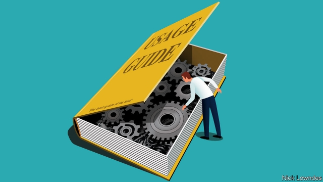

###### Johnson

# What to look for in a usage and grammar guide 

##### “Dreyer’s English”, a bestselling book, is rare in being authoritative but not arrogant 

 

> Feb 28th 2019 

WHY DO PEOPLE buy books on English usage? The obvious answer, “for authoritative advice”, doesn’t square with what people actually buy. For decades the best-selling grammar book in the English-speaking world, by far, has been William Strunk and E.B. White’s “Elements of Style”. It is breezily readable, but neither comprehensive—a recent edition is 95 small pages—nor even always reliable. 

It is not the only book in that category. Lynne Truss had a mega-seller with “Eats, Shoots and Leaves: a Zero Tolerance Guide to Punctuation”. Never mind that “zero-tolerance” needs a hyphen; Ms Truss’s style—sometimes crisp humour, sometimes camped-up outrage—was the real selling-point. A gentler humour is on offer in Gyles Brandreth’s contribution, “Have You Eaten Grandma?”, which follows Ms Truss in making a joke of a missing comma. It calls “Most of the time” a subordinate clause, among other lapses. But it too has sold well. It seems that people prize attitude over expertise. 

At the other end of the spectrum lie venerable reference books. The “Chicago Manual of Style”, in its 17th edition, is a bible for American copy editors. Bryan Garner, a lawyer and lexicographer, produces well-researched tomes. “Merriam-Webster’s Dictionary of English Usage” is one of the best in the business. But these hefty books cannot be zipped through like those of Ms Truss or Mr Brandreth. 

Some journalistic outfits, including the Associated Press, the New York Times and The Economist, offer advice in a smaller package. And a few individual writers have done the same in recent years, with “Accidence Will Happen” by Oliver Kamm (the language columnist for the Times of London), “The Joy of Syntax” by June Casagrande (a copy editor and columnist) and “The Sense of Style” by Steven Pinker (a Harvard psychologist). All three are natives, not tourists, in the study of language, but their books can be read for fun. And so can “Dreyer’s English”, the newest entry. Published only last month in America, it is already in its fifth printing—quite an achievement for a 60-year-old first-time author with strong opinions on the en-dash. 

Benjamin Dreyer is the copy chief at Random House, a New York publisher. For four decades he improved others’ prose without showcasing his own. His experience and good sense are established as early as page 9, where he dispels what he calls “the big three” unkillable myths—that you can’t start a sentence with a conjunction, end one with a preposition or split an infinitive. Do all three, says Mr Dreyer. “You’ll have a certain percentage of the reading and online-commenting populace up your fundament to tell you you’re subliterate. Go ahead and break them anyway. It’s fun, and I’ll back you up.” 

Although he enjoys killing off bogus rules, Mr Dreyer is more concerned with injunctions you should follow than with ones you should discard. In some places he is conservative (singular they is on the rise, but he can’t quite endorse it). In others he is unconventional (he does not use question-marks with so-called tag questions, which can jar, can’t it). But on every page, the serious stuff is spiced with his distinctive humour. 

On some, the serious-to-spice ratio is reversed. The section on proper nouns is heavy on Broadway. The section on redundancies probably didn’t need “assless chaps” (“chaps are by definition assless. Look at a cowboy. From behind”). But these digressions are delivered with a wink. One reviewer called the book “for the 1%”, but that missed the point, and the percentage. This book is not for a financial upper crust, but an intellectual one, and not just a slim sliver. It is a democratic and liberal-minded book for readers who care for grammar, usage and a good read at the same time. Judging from the book’s sales, more than 1% might want that. All the better that it is informed by decades of dealing with subtleties, edge cases, language change and the rest. Where Mr Dreyer delivers a sharp “do this, not that” on a matter of dispute, he admits that you are getting his opinion, not some unchanging rule on stone tablets. 

Mr Dreyer says he considered calling the book “The Last Word”, but decided against: “There’s no rule without an exception (well, mostly), there’s no thought without an afterthought (at least for me), there’s always something you meant to say but forgot to say. There’s no last word, only the next word.” This is what to look for in a language book: authority without arrogance. There is always more to learn. 

-- 

 单词注释:

1.johnson['dʒɔnsn]:n. 约翰逊（姓氏） 

2.bestselling[]:a. 畅销的 

3.authoritative[ɒ:'θɒritәtiv]:a. 权威性的, 官方的, 命令式的 [法] 官方的, 当局的, 权威的 

4.arrogant['ærәɡәnt]:a. 自大的, 傲慢的 

5.william['wiljәm]:n. 威廉（男子名）；[常作W-][美俚]钞票, 纸币 

6.strunk[]: [人名] 斯特伦克 

7.eb[eb]:abbr. 电子束（Electron Beam） 

8.breezily['bri:zili]:adv. 吹微风地, 活泼地, 轻松地 

9.readable['ri:dәbl]:a. 值得一读的, 易读的, 读起来津津有味的 [电] 可读的 

10.alway['ɔ:lwei]:adv. 永远；总是（等于always） 

11.lynne[]:n. 琳妮（女子名） 

12.truss[trʌs]:vt. 捆绑 n. 捆, 束 

13.hyphen['haifәn]:n. 连字符 vt. 用连字符连接 

14.crisp[krisp]:a. 脆的, 新鲜的, 活泼的 v. (使)烘脆, (使)拳曲, (使)起皱 n. 松脆物 

15.gentl[]:[网络] 旧非；情奴；西格 

16.Gyle[]:一次酿造的啤酒量, 勾兑用发酵醪 

17.subordinate[sә'bɒ:dnit]:n. 属下, 附属物 a. 下级的, 次要的, 附属的 vt. 使居下位, 使服从 

18.clause[klɒ:z]:n. 子句, 条款 [计] 子句 

19.lapse[læps]:n. 过失, 流逝, 失效 vi. 犯错, 堕落, 减退, 消失, 流逝 vt. 使失效 

20.expertise[.ekspә:'ti:z]:n. 专家意见, 专门技术 [法] 专门知识, 专家意见 

21.spectrum['spektrәm]:n. 光谱, 范围, 系列 [化] 光谱 

22.venerable['venәrәbl]:a. 庄严的, 值得尊敬的 

23.Chicago[ʃi'kɑ:gәu]:n. 芝加哥 

24.bryan['braiәn]:n. 布赖恩（男子名） 

25.garner['gɑ:nә]:n. 谷仓, 积蓄 vt. 储存, 贮藏 

26.lexicographer[.leksi'kɒgrәfә]:n. 辞典编纂者 

27.tome[tәum]:n. 册, 卷, 大本书 

28.hefty['hefti]:a. 重的, 肌肉发达的 

29.cannot['kænɒt]:aux. 无法, 不能 

30.BRANDRETH['brændriθ]:n. 铁三脚架, 井栏 

31.journalistic[,dʒ\\: nә'listik]:a. 新闻业的, 新闻工作者的, 报刊特有的, 新闻工作的 

32.outfit['autfit]:n. 用具, 配备, 机构 vt. 配备, 供应 vi. 得到装备 

33.york[jɔ:k]:n. 约克郡；约克王朝 

34.economist[i:'kɒnәmist]:n. 经济学者, 经济家 [经] 经济学家 

35.accidence['æksidәns]:n. 词态变化, 词法, 初步, 入门 

36.oliver['ɒlivә]:n. 脚踏铁锤 

37.kamm[]: [人名] 卡姆 

38.columnist['kɒlәmist]:n. 专栏作家 

39.syntax['sintæks]:n. 句法, 语法, 句子构造 [计] 句法, 语法 

40.casagrande[]:[网络] 卡萨格兰德；卡萨格兰地；卡塞格兰德 

41.steven['sti:vn]:n. 史蒂文（男子名） 

42.Harvard['hɑ:vәd]:n. 哈佛大学 

43.psychologist[sai'kɒlәdʒist]:n. 心理学家 [医] 心理学家 

44.benjamin['bendʒәmin]:[医] 安息香 

45.Dreyer[]:n. 德雷尔（人名） 

46.publisher['pʌbliʃә]:n. 出版者, 发行人 [法] 发行人, 出版者, 报刊发行者 

47.prose[prәuz]:n. 散文 v. 写散文 a. 散文的, 平凡的 

48.showcase['ʃәukeis]:n. 陈列橱 [经] 商品陈列所, 货物陈列架 

49.dispel[dis'pel]:vt. 驱散, 驱逐 

50.unkillable[,ʌn'kiləbl]:adj. 永久的，永恒的;持久的; 不死的，长生的；永远不会灭绝的 

51.infinitive[in'finitiv]:n. 不定式 a. 不定式的 

52.populace['pɒpjulәs]:n. 平民, 大众, 人口 

53.fundament['fʌndәmәnt]:n. 基础, 臀部, 肛门 [医] 基底, 基础, 原基, 臀部 

54.subliterate[sʌb'litәrәt]:a. 略具阅读写作能力的,粗通文墨的 

55.bogus['bәugәs]:a. 假的, 伪造的 [经] 伪的, 伪造的 

56.injunction[in'dʒʌŋkʃәn]:n. 命令, 禁令, 劝告 [经] 指令, 禁令 

57.endorse[in'dɒ:s]:vt. 支持, 赞同, 背书于, 签署 [经] 赞成, 背书 

58.unconventional[.ʌnkәn'venʃәnl]:a. 不依惯例的, 非传统的, 非常规的 

59.spice[spais]:n. 香料, 药料, 香气, 调味品, 情趣, 少许 vt. 加香料, 使添趣味 

60.distinctive[di'stiŋktiv]:a. 有特色的, 出众的 

61.broadway['brɒ:dwei]:n. 百老汇大街 

62.redundancy[ri'dʌndәnsi]:n. 过多, 冗长, 累赘, 多余, 冗余位, 冗余度, 冗余码, 多余信息 [计] 冗余 

63.assless[]:[网络] 不好意思 

64.chap[tʃæp]:n. 小伙子, 颌, 龟裂 v. 皲裂 

65.digression[dai'greʃәn]:n. 离题, 扯到枝节上, 偏离 

66.wink[wiŋk]:n. 眨眼, 使眼色, 瞬间 vi. 眨眼, 使眼色, 闪烁 vt. 眨 

67.sliver['slivә]:n. 裂片, 薄片, 梳毛 vt. 切成长片 vi. 剖开, 分裂 

68.subtlety['sʌtlti]:n. 微妙, 精明 

69.unchanging[ʌn'tʃeindʒiŋ]:a. 不变的 

70.afterthought['ɑ:ftәθɒ:t]:n. 事后的想法 

71.arrogance['ærәgәns]:n. 傲慢态度, 自大 

