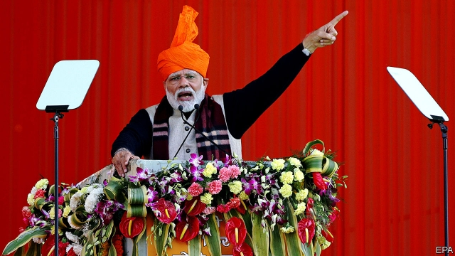
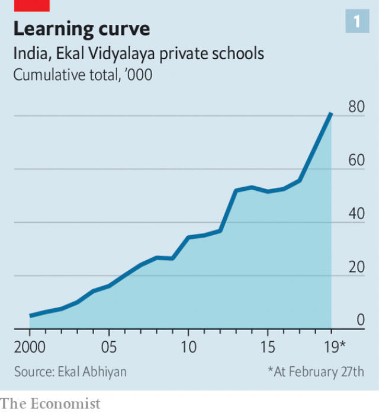
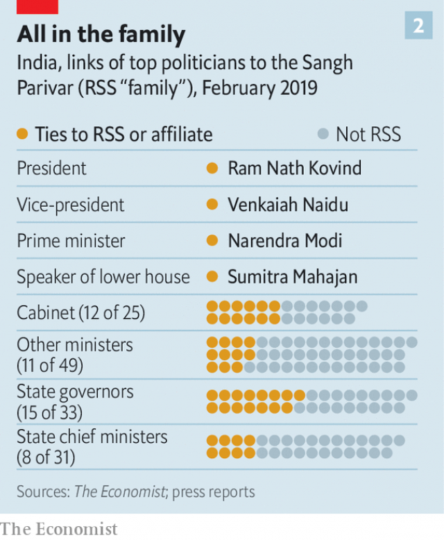

###### Orange evolution

# Narendra Modi and the struggle for India’s soul 

##### How India’s prime minister uses Hindu nationalism 

 

> Mar 2nd 2019 

WHEN THE world’s biggest electorate handed Narendra Modi a thumping victory five years ago, India seemed poised for far-reaching change. His party had won an outright majority of seats in the national parliament, a rare feat in India’s fractious politics. This was not only punishment for tarnished incumbents or reward for Mr Modi’s hard-working, no-nonsense, business-friendly image. Many also saw it as a ringing endorsement of his ideology. Mr Modi’s strident brand of Hindu nationalism, which pictures Pakistan less as a strategic opponent than a threat to civilisation, puts him at the fringe even of his own Bharatiya Janata Party (BJP). 

After five years in power, the Hindutva (Hindu-nationalist) movement faces a moment of reckoning. That is not just because first Pakistan’s jihadists and then its air force have presented Mr Modi with a political crisis. It is also because India is approaching a general election looking as polarised as at any time since independence. 

The rival visions confronting India’s 900m voters have rarely been so sharply defined. Hindu nationalists regard India as a nation defined by its majority faith, much like Israel or indeed Pakistan. On the other side stand those who see India’s extraordinary diversity as a source of strength. For most of the country’s seven decades the multi-coloured, secular vision has prevailed. But the orange-clad Hindutva strain has grown ever bolder. 

Under Mr Modi, the project to convert India into a fully fledged Hindu nation has moved ahead smartly. The pace would undoubtedly accelerate if, carried on a surge of patriotism brought by the clash with Pakistan, he sweeps into another term. But given that in 2014, the BJP grabbed its big majority with just 31% of the popular vote, how far would Mr Modi be able to push the Hindutva project, even if he does get a new mandate? And if he loses, can a secular India be rebuilt? 

The answers depend less on politics than on the underlying strength of the Hindu nationalist movement itself. To measure this, the place to start is with the Rashtriya Swayamsevak Sangh (RSS). With an all-male membership of around 5m, the flagship of Hindutva modestly describes itself as the world’s largest volunteer organisation. It is far more than that. 

Founded in 1925, the RSS has over time absorbed or co-opted nearly every rival Hindutva group. “The miracle and also the design of the Sangh is that they have not split—and that is their power,” says Vinay Sitapati, a historian. Its most obvious manifestation is the RSS’s 60,000-odd self-financing cells, or shakhas, which meet daily for communal exercises and discussion, typically on a patriotic theme. The harder core of the RSS consists of some 6,000 full-time apostles known as pracharaks. These devotees exercise discreet control across not just the shakhas, but a broader “family” of Hindutva groups. 

The family includes India’s largest trade union as well as unions for farmers, students, teachers, doctors, lawyers, women, small businesses and so on. RSS progeny run India’s two largest private school networks, educating some 5m children. One of these, Ekal Vidyalaya, has grown by targeting remote regions where Christian missionaries have made inroads (see chart 1). Some RSS groups exercise quiet influence, lobbying for more “nationalist” economic policy, for instance. Others simply wield muscle. The 2m-member Bajrang Dal, a youth branch of the World Hindu Council, an RSS offshoot, has a reputation for beating up Muslim boys who dare to flirt with Hindu girls. The 3m-strong All India Students Council is aggressive in campus politics. By threat or violent action it frequently blocks events it does not like, such as lectures by secular intellectuals. Just outside the orbit of the RSS lie violent extremist groups, such as one believed responsible for murdering leftist writers. 

 

The BJP is a loose affiliate of the RSS. Under Mr Modi, who served as an RSS pracharak before being assigned to the party, ties have been tighter. The RSS has thrown its full organisational weight behind his campaigns. In return, Mr Modi has inserted RSS men—or like-minded ones—into every part of Indian politics (see chart 2). But RSS influence also extends to university deans, heads of research institutes, members of the board of state-owned firms and banks (including the central bank) and, say critics, ostensibly politics-proof promotions in the police, army and courts. 

 

Still, frictions have arisen between Mr Modi and his alma mater. “They don’t like prima donnas,” says Mr Sitapati. Quiet purges, as well as a massive broadening of the BJP’s membership to over 100m, have forged a party hierarchy of personal loyalty to Mr Modi that RSS elders distrust. More broadly, there is grumbling in the Hindutva camp that he has not championed their agenda energetically enough. 

This includes education “reform” (to inculcate stronger national sentiment and emphasise Hindu identity); ending “appeasement” (a term Hindutva activists apply to policies aimed at garnering Muslim votes); imposing a uniform civil code (to deny a limited role to sharia, or Islamic law); repealing laws that grant special status to the state of Jammu & Kashmir (to underline Indian sovereignty over a disputed territory that has a large Muslim majority); building a temple to the god Ram at Ayodhya (where in 1992 Hindu mobs destroyed a 16th-century mosque said to be built atop his birthplace); and enforcing rules to protect cows. 

Mr Modi’s government has met some Hindutva demands. Nationalist staff have been promoted at every level of schooling, subtly changing the tone of education. But many of the RSS’s demands boil down to putting Muslims, already mostly poor and badly educated, in their place. Accounting for 14% of the population, they are generally excluded from caste-based “reservations” for government favours. Among the BJP’s 1,400 state-level MPs, only four are Muslim. And in Muslim-majority Kashmir, a perennially vexed region, Mr Modi’s government has hardened policies to tackle militancy, imposing direct rule from Delhi, threatening to end unilaterally Indian Kashmir’s special legal status and endorsing, among other measures, the use of shotguns to blast stone-throwing youths. The approach has alienated Kashmiris and also tempted meddling by Pakistan, ever keen to challenge India’s sovereignty. After the longest lull in three decades of violence, it has spiralled again under Mr Modi. 

Violence has also accompanied a campaign in BJP-run states to apply stringent laws against the slaughter of cows, sacred beasts to Hindus. Between 2015 and 2018 some 44 people, 36 of them Muslim, have been beaten or hacked to death by cow vigilantes, says Human Rights Watch, an NGO. The ban has not spread nationally, partly because many Hindus outside the “Cow Belt”—the conservative middle and west of the countryseat beef, and partly through anger among farmers who can no longer sell cows beyond milking age. 

The demand to erect a Ram temple in Ayodhya has not progressed, either. The issue has been stalled in courts for decades. Mr Modi has tried to push India’s Supreme Court to resolve the case, but his influence is limited. In recent weeks the RSS appears to have quietly advised its affiliates to stop agitating over the issue. This suggests a recognition that, although the demand once galvanised mass emotion, most Hindus are now more concerned with matters such as jobs, schools and health care. 

This has not helped Mr Modi’s standing with the Hindu religious establishment. At this year’s Kumbh Mela, a pilgrimage that is the world’s biggest public gathering, BJP flags and billboards proliferated along with boasts of a huge boost in public spending to organise the six-yearly event. Yet several senior religious figures seemed unhappy. “They have been talking of nothing but Ram, Ram all these years, and now they ask us to stop?” mutters Swaroopanand Saraswati, the head of two of Hinduism’s most prestigious monasteries, as a pair of young acolytes flick yak-tail fly whisks. In a nearby encampment, another high-ranking holy man, his forehead streaked with turmeric, complains that the BJP and RSS are trying to hijack the faith while doing little for issues such as protecting the sacred Ganges river. 

Secular foes of Hindutva, however, fear Mr Modi has gone too far. “The battle for a secular India is already lost,” says Mujibur Rehman, a political scientist at Jamia Milia University. Mr Rehman does not blame Mr Modi but sees an acceleration under BJP rule of a slow disempowering of India’s non-Hindu minorities. “When the BJP bans cow slaughter, no opposition party makes the argument that this destroys Muslim livelihoods.” Pratap Bhanu Mehta, a columnist and head of Ashoka University, also sees many signs of Hindutva’s “hegemonic arrival”. One clue is that the BJP’s main opponent, the Congress party, has largely dropped talk of secularism. Since winning the state of Madhya Pradesh in December, Congress has outdone the BJP in cow protection, budgeting millions to build shelters for retired cattle. Its national leader, Rahul Gandhi, now punctiliously visits temples. “He is trying to show that he is no longer ‘embarrassed’ by his Hinduism, and this is a huge thing since the core RSS belief is that the secular state has left Hindus culturally marginalised,” says Mr Mehta. 

This may be seen as a healthy shaking off of colonial legacies. Yet what worries Indian liberals is where Hindutva strays into xenophobia and intolerance of dissent. By repeating a mantra of victimhood it constructs a world full of enemies, making it easy to conflate Pakistani jihadists with protesters in Kashmir or simply critics of Mr Modi. A window sticker now common on cars, showing the monkey god Hanuman with an angry orange face, is disturbing as it seems to respond to a threat which, in a country that is overwhelmingly Hindu and proudly so, is hard to perceive. That sense of threat, says Mr Mehta, is what binds the RSS: “Take that away and the whole project disappears.” 

Mr Gandhi vows that, if elected, he will remove people with RSS links from the bureaucracy. But its devotees have risen organically within the system. “They are judges, they are professors, they went from RSS-run crammers to pass the civil-service exam, or RSS military academies into the army,” says Pragya Tiwari, author of a forthcoming book on the RSS. “These people aren’t going anywhere.” 

Obstacles to the RSS agenda may come more from within the group, and from outside politics. The size of the family means it is also cumbersome and quarrelsome. And its increased exposure to politics has opened new internal frictions and exposed it to greater scrutiny. “Before, people were lulled, they wanted to believe these guys were innocuous, they didn’t really understand what was at stake,” says Ms Tiwari. Now, there is a stronger will to push back. 

Yet there seems limited conviction among Indian liberals that the Hindutva tide can be stemmed. Outside big cities, the roots of secular, inclusive India remain shallow. This lack of a strong and attractive liberal alternative matters more in the long term than the coming vote. Mr Mehta’s prognosis: “Unless there is a massive repudiation, their staying power will be much stronger after the election.” 

-- 

 单词注释:

1.narendra[]:[网络] 纳伦德拉；纳兰德；纳然陀 

2.MODI['mәudai]:[计] 模块化光学数字接口 

3.Hindu['hindu:]:a. 印度教教徒的 n. 印度教教徒 

4.nationalism['næʃәnәlizm]:n. 民族主义, 民族特性 

5.electorate[i'lektәrit]:n. 选民, 有选举权者, 选区 [法] 选民, 选举团, 选区 

6.thump[θʌmp]:n. 重打, 重击声 v. 重打, 撞击, 痛打 

7.poise[pɒiz]:n. 平衡, 均衡, 姿势, 镇静, 安静, 砝码 vt. 使平衡, 使悬着, 保持...姿势 vi. 平衡, 悬着, 准备好 

8.outright['autrait]:a. 率直的, 完全的, 总共的, 直率的 adv. 完全地, 率直地, 立刻地, 一直向前 

9.feat[fi:t]:n. 壮举, 功绩, 技艺表演 a. 灵巧的, 合适的, 整洁的 

10.fractious['frækʃәs]:a. 易怒的, 倔强的, 脾气不好的 

11.politic['pɒlitik]:a. 精明的, 明智的, 策略的 

12.tarnish['tɑ:niʃ]:n. 失泽, 失泽膜, 污点 vt. 使失去光泽, 玷污 vi. 失去光泽, 被玷污 

13.incumbent[in'kʌmbәnt]:a. 现任的, 依靠的, 负有义务的 n. 领圣俸者, 在职者 

14.endorsement[in'dɒ:smәnt]:n. 支持, 认可, 背书 [经] 背书, 担保, 保证 

15.ideology[.aidi'ɒlәdʒi]:n. 思想体系, 意识形态, 观念学, 空论 [医] 观念学, 观念形态 

16.strident['straidnt]:a. 刺耳的, 吱吱尖叫的, 尖锐的, 刺眼的 [医] 喘鸣性的 

17.Pakistan[.pɑ:ki'stɑ:n]:n. 巴基斯坦 

18.les[lei]:abbr. 发射脱离系统（Launch Escape System） 

19.civilisation[,sivilai'zeiʃən;-li'z-]:n. 文明, 文明世界, 文化, 开化, 教化 

20.fringe[frindʒ]:n. 边缘, 端, 流苏, 穗, 初步 vt. 加穗于, 加饰边于 a. 边缘的, 附加的 

21.Bharatiya[]:[网络] 巴拉蒂亚 

22.Janata['dʒʌnətɑ:]:n. （印度）人民团体；人民党（印度联合政党） 

23.bjp[]: [医][=Bence Jones protein]本周（氏）蛋白，凝溶蛋白 

24.hindutva[]:[网络] 印度民族主义；印度教意识；印度教至上主义 

25.reckon['rekәn]:vt. 计算, 总计, 估计, 认为, 猜想 vi. 数, 计算, 估计, 依赖, 料想 

26.jihadist[]:n. 伊斯兰圣战士 

27.polarise['pәjlәraiz]:vi.vt. (使)极化, (使)偏振, (使)两极分化 

28.confront[kәn'frʌnt]:vt. 使面对, 对抗, 遭遇, 使对质, 比较 [法] 对证, 使对质, 比较 

29.voter['vәutә]:n. 选民, 投票人 [法] 选民, 选举人, 投票人 

30.nationalist['næʃәnәlist]:n. 国家主义者, 民族主义者 

31.Israel['izreil]:n. 以色列, 以色列后裔, 犹太人 

32.diversity[dai'vә:siti]:n. 差异, 多样性 [化] 多样性 

33.secular['sekjulә]:n. 修道院外的教士 a. 世俗的, 现世的, 长期的 

34.fully['fuli]:adv. 十分地, 完全地, 充分地 

35.fledge[fledʒ]:vt. 喂养, 用羽毛盖上, 装上羽毛 vi. 长羽毛 

36.smartly['smɑ:ti]:adv. 潇洒地, 火辣辣地, 刺痛地 

37.surge[sә:dʒ]:n. 巨涌, 汹涌, 澎湃 vi. 汹涌, 澎湃, 颠簸, 猛冲, 突然放松 vt. 使汹涌奔腾, 急放 [计] 电压尖峰 

38.patriotism['peitriәtizm]:n. 爱国心, 爱国精神, 爱国主义 

39.clash[klæʃ]:n. 冲突, 撞击声, 抵触 vi. 冲突, 抵触 vt. 使发出撞击声 [计] 对撞 

40.grab[græb]:n. 抓握, 掠夺, 强占, 东方沿岸帆船 vi. 抓取, 抢去 vt. 攫取, 捕获, 霸占 

41.underlie[.ʌndә'lai]:vt. 位于...之下, 成为...的基础 

42.rashtriya[]:[网络] 拉什特里亚 

43.Sangh[sʌŋ^]:n. (印度的)协会,联合会(尤指政治或劳工组织) 

44.rss[]:abbr. 和的平方根（root-sum square）；[拉]英国皇家学会会员（Regiae Societatis Socius, 等于fellow of the royal society） 

45.membership['membәʃip]:n. 会员的资格, 全体会员, 会员数目 [法] 会员资格, 成员资格, 会籍 

46.flagship['flægʃip]:n. 旗舰 

47.modestly[]:adv. 适当地；谨慎地 

48.organisation[,ɔ: ^әnaizeiʃən; - ni'z-]:n. 组织, 团体, 体制, 编制 

49.vinay[]:n. (Vinay)人名；(法)维奈；(匈)维瑙伊；(意)维纳伊 

50.historian[hi'stɒ:riәn]:n. 历史学家, 记事者 

51.manifestation[.mænifes'teiʃәn]:n. 显示, 证明, 示威运动 [医] 表现, 表示 

52.shakhas[]:[网络] 训诂学四吠陀 

53.communal['kɒmjunәl]:a. 公有的, 公社的 [法] 公共的, 自治体的, 巴黎公社的 

54.typically['tipikәli]:adv. 代表性地；作为特色地 

55.patriotic[.peitri'ɒtik]:a. 爱国的, 有爱国心的 [法] 爱国的, 有爱国心的 

56.apostle[ә'pɒsl]:n. 基督十二使徒之一, 早期基督教传士 

57.pracharaks[prə'tʃɑ:rək]:n. 宣传干事（一般在印度通过个人接触、会议、讲座等宣传某一事业） 

58.devotee[.devә'ti:]:n. 爱好者, 献身者, 虔诚的宗教信徒 

59.discreet[dis'kri:t]:a. 小心的, 慎重的 

60.progeny['prɒdʒәni]:n. 子孙, 后裔, 成果 [医] 后代, 后裔 

61.missionary['miʃәnәri]:n. 传教士, 负有任务者, 工作人员 a. 传教的, 传教士的 

62.inroad['inrәud]:n. 侵入, 得手, 侵害 [法] 袭击, 侵犯, 损害 

63.lobby['lɒbi]:n. 大厅, 休息室, 游说议员者 vi. 游说议员, 游说 vt. 游说 

64.wield[wi:ld]:vt. 挥舞, 运用 

65.bajrang[]:巴杰朗 

66.dal[dɑ:l]:n. [植]木豆（等于dhal ）；木豆做的菜；一种带辣味的印度菜（用蚕豆, 豌豆或小扁豆制成） 

67.offshoot['ɒ:fʃu:t]:n. 分支, 旁系, 衍生事物 

68.Muslim['mjzlim; (?@) 'mʌzlem]:n. 伊斯兰教, 伊斯兰教教徒 

69.flirt[flә:t]:n. 卖弄风骚的人, 急动, 急扔 vt. 忽然弹出, 轻快摆动, 挥动 vi. 调情, 玩弄, 摆动, 轻率地对待 

70.extremist[iks'tri:mist]:[经] 偏激份子 

71.leftist['leftist]:n. 左翼的人, 左派 a. 左派的 

72.affiliate[ә'filieit]:vt. 使紧密联系, 使附属, 接纳, 收养 vi. 发生联系, 参加 

73.pracharak[prә'tʃɑ:rәk]:n. (在印度通过个人接触、会议、讲座等宣传某一事业的)宣传干事 

74.organisational[]:a. organise的变形 

75.dean[di:n]:n. 院长, 主持牧师 [法] 外交团长, 学院院长, 教务长 

76.ostensibly[]:adv. 可公开, 显然, 表面, 外表, 诡称, 假装 

77.promotion[prәu'mәuʃәn]:n. 晋级, 创建, 增进 [经] 推广, 推销, 促进 

78.alma['ælmә]:n. 阿尔玛（女子名）；舞女；歌女 

79.mater['meitә]:n. 母亲 [医] 脑[脊]膜 

80.prima['pri:mә]:a. 第一的, 主要的 

81.donna['dɔnә]:n. （意）女士（置于女士名字前的尊称, 相当于Madam）；堂娜（女子名） 

82.purge[pә:dʒ]:n. 净化, 清除, 泻药 v. (使)净化, 清除, (使)通便 [计] 服务器文件删除实用程序 

83.broaden['brɒ:dn]:vi. 变宽, 扩大 vt. 放宽, 使扩大 

84.forge[fɒ:dʒ]:n. 熔炉, 铁工厂 vt. 打制, 锻造, 伪造 vi. 锻造, 伪造 

85.hierarchy['haiәrɑ:ki]:n. 等级制度, 僧侣统治, 等级体系 [计] 分级结构; 分层结构; 新闻组, 新闻组分层 

86.distrust[dis'trʌst]:n. 不信任 vt. 不信任 

87.broadly['brɒ:dli]:adv. 宽广地, 明白地, 无礼貌地 

88.grumble['grʌmbl]:n. 怨言, 满腹牢骚 vi. 抱怨, 发牢骚, 发隆隆声 vt. 抱怨 

89.energetically[.enә'dʒetikәli]:adv. 精力充沛地, 积极地 

90.inculcate['inkʌlkeit]:vt. 反复灌输, 谆谆教诲 

91.sentiment['sentimәnt]:n. 感情, 感伤, 情操, 情绪, 感想, 意见 [医] 情感, 情操 

92.emphasise[]:vt. 强调, 重读, 加强...的语气, 着重 

93.appeasement[ә'pi:zmәnt]:n. 抚慰, 缓解, 平息, 姑息 [法] 缓和:缓静, 安抚 

94.activist['æktivist]:n. 激进主义分子 

95.garner['gɑ:nә]:n. 谷仓, 积蓄 vt. 储存, 贮藏 

96.sharia[ʃә'ri:ә]:n. 伊斯兰教教法 

97.Islamic[iz'læmik]:a. 伊斯兰教的, 穆斯林的 

98.repeal[ri'pi:l]:n. 废止, 撤消 vt. 废止, 撤消, 放弃 

99.statu[]:[网络] 状态查看；雕像；特级雪花白 

100.Jammu['dʒʌmu:]:查谟(城市, 位于亚洲查谟和克什米尔的西南) 

101.Kashmir['kæʃmiә]:n. 克什米尔 

102.sovereignty['sɒvrәnti]:n. 主权, 独立国 [法] 主权, 主权国家, 统治权 

103.ram[ræm]:n. 公羊, 撞锤 vi. 猛击, 撞 vt. 猛击, 填塞, 反复灌输 n. 只读内存, 随机存取内存, 随机存取存储器 [计] 随机存取存储器 

104.Ayodhya[əˈjəʊdjə]:阿约提亚 

105.mob[mɒb]:n. 暴民, 民众, 暴徒 vt. 大举包围, 蜂拥进入, 围攻 vi. 聚众生事 

106.mosque[mɒsk]:n. 清真寺 

107.atop[ә'tɒp]:adv. 在顶上 prep. 在...的顶上 

108.nationalist['næʃәnәlist]:n. 国家主义者, 民族主义者 

109.subtly['sʌtli]:adv. 敏锐地, 巧妙地, 精细地 

110.Muslim['mjzlim; (?@) 'mʌzlem]:n. 伊斯兰教, 伊斯兰教教徒 

111.MP[]:国会议员, 下院议员 [计] 宏处理程序, 维护程序, 线性规划, 微程序, 多处理器 

112.perennially[]:adv. 永久地 

113.tackle['tækl]:n. 工具, 复滑车, 滑车, 装备, 扭倒 vt. 固定, 处理, 抓住 vi. 扭倒 

114.militancy['militәnsi]:n. 战斗性 

115.delhi['deli]:n. 德里（印度城市名） 

116.unilaterally[]:[计] 单侧地 

117.endorse[in'dɒ:s]:vt. 支持, 赞同, 背书于, 签署 [经] 赞成, 背书 

118.shotgun['ʃɒtgʌn]:n. 散弹猎枪, 媒人 v. 用猎枪射击 

119.alienate['eiljәneit]:vt. 使疏远, 离间, 转让 [法] 转让, 让与, 疏远 

120.Kashmiri[kæʃ'miәri]:n. 克什米尔语, 克什米尔人 

121.meddle['medl]:vi. 干涉, 干预, 擅自摸弄 [法] 干预, 插手, 弄乱 

122.lull[lʌl]:n. 暂停, 间歇, 稍息, 使人安静的东西 vt. 使平静, 哄骗, 使安静 vi. 变平静 

123.spiral['spairәl]:n. 螺旋形之物, 螺线 a. 螺旋形的, 盘旋的 vi. 螺旋形下降, 螺旋形上升, 螺旋形行进 vt. 使螺旋形行进 

124.stringent['strindʒәnt]:a. 迫切的, 严厉的, 银根紧的 [医] 约束的, 紧迫的 

125.slaughter['slɒ:tә]:n. 残杀, 屠杀, 杀戮 vt. 残杀, 屠杀, 亏本出售 

126.Hindu['hindu:]:a. 印度教教徒的 n. 印度教教徒 

127.hack[hæk]:n. 劈, 砍, 砍痕, 出租车, 干咳, 晒架, 鹤嘴锄 vt. 劈, 砍, 出租, 用旧 vi. 劈, 砍, 干咳, 驾驶出租车 a. 出租的 

128.vigilante[.vidʒi'lænti]:n. 警戒会会员 

129.ngo[]:abbr. 民间组织；非政府组织（Non-Governmental Organization） 

130.nationally['næʃәnәli]:adv. 作为整个民族, 举国一致地, 全国性地 

131.countryseat[]:n. 乡间宅第 

132.stall[stɒ:l]:n. 厩, 停车处, 牧师职位, 货摊, 托辞, 拖延 vt. 关入厩, 停顿, 推托, 支吾, 使陷于泥中 vi. 被关在厩内, 陷于泥中, 停止, 支吾 

133.quietly['kwaiәtli]:adv. 安静地, 沉着地, 秘密地 

134.agitate['ædʒiteit]:vt. 使摇动, 搅动, 使激动, 使不安 vi. 鼓动, 煽动 

135.galvanise['^ælvәnaiz]:vt. 通电流于, 给...镀锌, 电镀, 刺激, 使兴奋, 激动, 激励, 惊起 

136.kumbh[]: [地名] 泉（布拉灰语） 

137.mela[]:n. 梅拉（女子名） 

138.pilgrimage['pilgrimidʒ]:n. 朝圣, 漫游, 人生的一段经历 vi. 朝拜, 朝圣, 漫游 

139.billboard['bilbɒ:d]:n. 广告牌, 布告板 vt. 宣传 

140.proliferate[prәәu'lifәreit]:vi. 增殖, 激增, 扩散 vt. 使激增 

141.saraswati[]:n. (Saraswati)人名；(尼)萨拉斯沃蒂 

142.prestigious[pre'stidʒiәs]:a. 享有声望的 

143.monastery['mɒnәstәri]:n. 修道院, 僧侣 

144.acolyte['ækәulait]:n. 侍僧, 助手 

145.flick[flik]:n. 快速的轻打, 轻打声, 弹开 v. 轻弹, 轻轻拂去, 忽然摇动 

146.whisk[hwisk]:n. 掸, 扫帚, 毛掸子, 搅拌器, 拂 vt. 扫, 拂, 挥动, 迅速移动, 搅拌 vi. 飞奔 

147.encampment[in'kæmpmәnt]:n. 露营, 宿营 

148.streak[stri:k]:n. 条理, 斑纹, 倾向 vt. 加条纹 vi. 变成条纹, 飞跑 

149.turmeric['tә:mәrik]:n. 姜黄, 姜黄根粉末 [医] 姜黄 

150.hijack['haidʒæk]:vt. 抢劫, 劫持, 敲诈 [法] 挡路抢劫, 抢劫, 绑架 

151.ganges['^ændʒi:z]:n. 恒河（位于亚洲, 发源于喜马拉雅山, 流经印度和孟加拉） 

152.secular['sekjulә]:n. 修道院外的教士 a. 世俗的, 现世的, 长期的 

153.foe[fou]:n. 仇敌, 反对者, 敌人, 对手 

154.mujibur[]:穆吉布 

155.rehman[]:[网络] 李曼；莱赫曼 

156.jamia[]:[网络] Jnl of the American Medical Informatics Assoc; 清真寺; 美国医学信息学会杂志(Journal of the American Medical Informatics Association) 

157.milia['miliә]:milium的复数 

158.disempower[dɪsɪm'paʊər]:vt.& vi. 使自信心降低 

159.opposition[.ɒpә'ziʃәn]:n. 反对, 敌对, 相反, 在野党 [医] 对生, 对向, 反抗, 反对症 

160.livelihood['laivlihud]:n. 生计, 营生, 生活 

161.pratap[]:n. (Pratap)人名；(印、尼)普拉塔普 

162.bhanu[]:n. (Bhanu)人名；(印)巴努 

163.Mehta[]:n. 梅塔（人名） 

164.columnist['kɒlәmist]:n. 专栏作家 

165.ashoka[]:n. 阿育王（印度孔雀王朝的第三位君主） 

166.hegemonic[.hedʒi'mɒnik]:a. 支配的, 霸权的 

167.secularism['sekjulәrizm]:n. 现世主义, 宗教与教育分离论 

168.madhya[]:[网络] 中央；德亚；玛德亚 

169.Pradesh[]:邦 

170.outdo[.aut'du:]:vt. 超越, 胜过, 战胜 

171.budgeting[]:[计] 预定, 预算 [经] 预算编制 

172.rahul[]:n. 拉胡尔（人名） 

173.Gandhi['gændi:]:n. 甘地 

174.punctiliously[pʌŋk'tiliəsli]:adv. 谨小慎微地；拘泥细节地；一丝不苟地 

175.Hinduism['hinduizm]:n. 印度教 

176.culturally[]:adv. 从文化角度, 文化意义上；在人文学方面 

177.marginalise['mɑ:dʒɪnəlaɪz]:v. 使显得微不足道；使处于边缘；使无实权 

178.colonial[kә'lәunjәl]:a. 殖民的, 殖民地的 [法] 殖民地居民 

179.legacy['legәsi]:n. 祖先传下来之物, 遗赠物 [经] 遗产, 遗赠物 

180.stray[strei]:n. 走失的家畜, 浪子 a. 迷途的, 偶然的 vi. 迷路, 彷徨, 流浪 

181.xenophobia[,zenә'fәubiә]:n. 无端畏惧和憎恨外国人/陌生人, 对外国人的畏惧和憎恨 [医] 生客恐怖 

182.intolerance[in'tɒlәrәns]:n. 不宽容, 偏狭, 不容许相反的言论 [医] 不耐[性] 

183.dissent[di'sent]:n. 异议 vi. 持异议, 不同意 

184.mantra['mʌntrә, 'mæn-]:颂歌, 咒语(尤指四吠陀经典内作为咒文或祷告唱念的) 

185.victimhood[]:n. 受害人；牺牲品；牺牲者 (victim的变形) 

186.conflate[kәn'fleit]:vt. 合并；异文合并 

187.Pakistani[.pɑ:ki'stɑ:ni]:a. 巴基斯坦的 n. 巴基斯坦人 

188.protester[]:n. 抗议者, 持异议者, 拒付者 [经] 反对者 

189.sticker['stikә]:n. 屠夫, 尖刀, 刺, 芒, 尖物, 携带尖刀者, 张贴物, 滞销品, (非正式)难题 [经] 呆滞商品 

190.hanuman['hʌnumɑ:n, 'hɑ:n-]:n. [动]长尾猴(产于南亚), (H-)[印神] 猴神 

191.overwhelmingly[.әuvә'hwelmiŋli]:adv. 压倒性地, 不可抵抗地 

192.proudly['praudli]:adv. 傲慢地, 自大地, 得意洋洋地 

193.vow[vau]:n. 誓约, 誓言, 许愿 vi. 起誓, 发誓, 郑重宣言 vt. 立誓, 起誓要, 郑重地宣布 

194.bureaucracy[bjuә'rɒkrәsi]:n. 官僚, 官吏 [法] 官僚主义, 官僚政治, 官僚机构 

195.organically[ɒ:'gænikli]:adv. 有机性地, 器官上地, 有组织地 

196.crammer['kræmә]:n. 搞填鸭式教学的教师, 谎言 

197.tiwari[]:n. (Tiwari)人名；(英、尼、印尼、印)蒂瓦里 

198.forthcoming['fɒ:θ'kʌmɑŋ]:a. 即将来临的 n. 来临 

199.cumbersome['kʌmbәsәm]:a. 笨重的, 麻烦的, 累赘的 

200.quarrelsome['kwɒrәlsәm]:a. 喜欢吵架的, 好争论的 

201.scrutiny['skru:tini]:n. 细看, 仔细检查, 监视, 选票检查 [经] 复查, 评核, 仔细检查 

202.innocuous[i'nɒkjuәs]:a. 无害的, 无伤大雅的 [医] 无害的, 良性的 

203.conviction[kәn'vikʃәn]:n. 定罪, 信服, 坚信 [法] 定罪, 证明有罪, 判罪 

204.inclusive[in'klu:siv]:a. 包含的, 包括的 

205.repudiation[ri.pju:di'eiʃәn]:n. 抛弃, 否认, 拒付 [法] 遗弃, 废弃, 否认 

