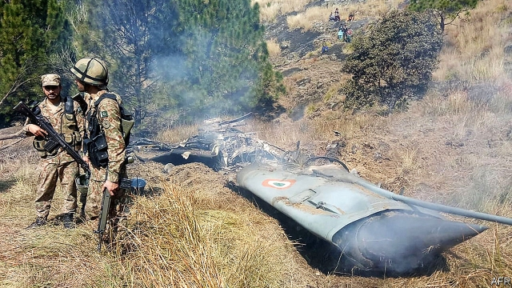
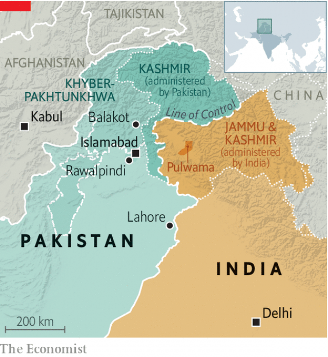
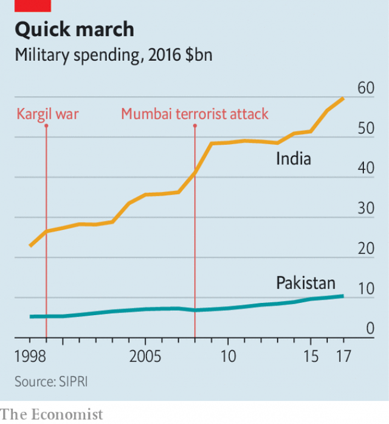

###### On perilous ground

# Skirmishing between India and Pakistan could escalate 

##### Two nuclear-armed states shoot down each other’s planes 

 

> Feb 28th 2019 

THE LAST time that Indian and Pakistani jets bombed one another’s territory was in 1971, during an all-out war. In that conflict more than 10,000 soldiers died, over 100 planes were shot out of the sky and Pakistan was torn asunder, as the new state of Bangladesh took shape. But then neither side had built the nuclear arsenals that they wield today. So when the roar of Indian warplanes returned to Pakistan’s skies on February 26th, it marked the most dangerous moment in South Asia since a months-long mass mobilisation of troops in 2002. How did the two countries get into this situation, and can they step away from the brink? 

The immediate origins of India’s taboo-busting air raid and the resulting aerial skirmishes lie in a suicide-bombing on February 14th in the Pulwama district of the state of Jammu & Kashmir that killed 40 Indian policemen. It was the deadliest attack in the state, and the worst jihadist atrocity anywhere in India for over a decade. But Narendra Modi, India’s prime minister, also faces an election. Hindu hardliners do not feel he has sufficiently advanced their cause while others feel his promise of modernising India to bring jobs has failed (see article). Appearing a resolute commander will do him no harm. 

Though the bomber was a Kashmiri, one of many locals who seethe at heavy-handed Indian rule in the state, the attack was claimed by Jaish-e-Muhammad (JEM), a Pakistan-based Islamist group with close ties to Pakistan’s spy agency, the ISI. That, for India, was the last straw. JEM and Lashkar-e-Taiba, a similar group, conducted spectacular strikes in Delhi in 2001, Kashmir in 2002 and Mumbai in 2008. An attack by JEM in September 2016 killed 19 Indian soldiers, prompting Mr Modi to send special forces across the line of control, the de facto border in Kashmir, in what he triumphantly called “surgical strikes”. Such incursions were commonplace in the 1990s and 2000s, but Mr Modi’s willingness to flaunt such brazen raiding publicly was new. Though of questionable military utility, it reaped political rewards. 

After the Pulwama attack bellicose news anchors bayed for revenge. Even liberal-minded Indian commentators, who would usually favour talks with Pakistan, demanded that something be done. Mr Modi did do something. A dozen or so fighter jets, equipped with 1,000lb bombs, took off from Gwalior air base on February 26th, crossing both the line of control and a political and military threshold. Indian civilian leaders had forbidden the air force to fly or fire over that line even during a war over Kargil, part of Kashmir, in 1999. 

The planes struck an alleged JEM facility in Balakot in the state of Khyber Pakhtunkhwa, undisputed Pakistani territory. India claimed that hundreds of jihadists had been killed. Pakistan snorted at this “self serving, reckless and fictitious claim”. India, it said, had crossed only a few miles into Pakistan and pounded uninhabited jungle for theatrical effect. 

Even so, Pakistan’s powerful armed forces, which have ruled the country for much of its history, were left reeling. Indian jets had appeared to come within 100km of Islamabad, the capital, without being intercepted. Imran Khan, Pakistan’s prime minister, promised to respond at a time and place of his choosing. That did not take long. On February 27th Pakistan said that its own aircraft had struck back. As Indian jets chased the attackers, seemingly into Pakistan, an Indian aircraft was shot down, with the unlucky pilot landing on the Pakistani side of the border. 

Neither side is spoiling for a no-holds-barred fight. Mr Modi’s government made it clear that it had sought to attack terrorists, not Pakistani soldiers, far from densely populated areas. Pakistan said it had fired from within its own airspace (though India disputes this) and deliberately struck open ground “to demonstrate that we could have easily taken the original target”, a group of six military facilities. 

The torture and mutilation of Indian soldiers sparked national outrage during the Kargil war. The captured Indian pilot has been well-treated so far. Though India protested at his “vulgar” display to the press, he was filmed clutching a cup of chai and praising his captors as “thorough gentlemen”. “The tea is fantastic,” he added. On February 28th Mr Khan unexpectedly announced that he would be released the next day. All this may offer a path to de-escalation. Mr Khan gave a sober and emollient speech after the dust-up, acknowledging “the hurt that has been caused due to the Pulwama attack”. “Better sense should prevail,” he urged. “We should sit and settle this with talks.” But it may not prove as easy as that. 

Mr Modi is a captive of his own propaganda. His policy of loud jingoism has left India with less room for manoeuvre. Srinath Raghavan, a former Indian soldier and respected historian, quotes Abba Eban: “A statesman who keeps his ear permanently glued to the ground will have neither elegance of posture nor flexibility of movement.” One possibility is that escalation will involve the usual means, such as artillery duels across the line of control, which increased on February 27th and 28th, and raids on border posts. That would be troubling but not cataclysmic. However, Pakistan has closed its airspace and put Khyber Pakhtunkhwa on high alert, suggesting that more incursions are feared. India has increased naval patrols and raised security on Delhi’s metro network, reflecting concerns that Pakistan might sponsor retaliatory terrorist attacks. 

One Indian expert says that a full mobilisation of the Indian army should not be ruled out. Christopher Clary, who managed South Asia policy at the Pentagon from 2006 to 2009, suggests that America should consider evacuating its citizens from both countries. “Not because we are there yet, but because when the situation warrants it, there will be no time.” 

 

A nuclear shadow also hangs over the crisis. During their last big clash, in 1999, India and Pakistan both possessed nuclear weapons but had only limited means to deliver them. Today India has some 140 warheads and Pakistan about ten more than that. Each wields an array of matching missiles. Pakistan has also built tactical nuclear weapons, with a range of 70km or so, intended for use against invading Indian forces, on Pakistani soil if necessary. Their short reach means they would need to be deployed perilously close to the front line. 

Mr Khan chaired a meeting of his country’s Nuclear Command Authority on February 27th and reminded India of the stakes: “With the weapons you have and the weapons we have, can we really afford a miscalculation?” Pakistan’s aim is to underscore that India, which now spends over five times as much as it does on defence (see chart), cannot bring its conventional military superiority to bear without risking nuclear ruin. It hopes, also, that this chilling prospect will force the international community to restrain Mr Modi. 

 

To Indians, such threats fit with a long pattern of cynical nuclear blackmail stretching back to crises in the 1980s. Some officials share the view expressed in January 2018 by General Bipin Rawat, India’s army chief, that India ought to “call their nuclear bluff”. Hawkish Indians look enviously at Israel’s model of counter-terrorism and chafe at how Pakistani nukes have defanged their more numerous forces. 

Any whiff of nuclear weapons would, in the past, have sent outsiders rushing to the subcontinent to soothe tensions. In 1990 President George H.W. Bush sent his CIA director to South Asia to calm a brewing crisis. During the Kargil war Bill Clinton gave Nawaz Sharif, then Pakistan’s prime minister, a dressing down in Washington, DC. In a stand-off that unfolded in 2001-02 everyone from Tony Blair to Vladimir Putin passed through the region. 

Today, however, America’s calming influence may be lacking. The Trump administration lacks the experience, expertise and focus to lower the temperature in the same way. It is beset by domestic drama and lacks diplomats in important roles. There is no permanent ambassador in Pakistan and the branch of the State Department which covers South Asia has five acting, rather than permanent, deputy assistant secretaries. “I’ve never seen anything like that,” notes Mr Clary. 

Donald Trump broke his silence on the skirmishes on February 28th, noting that “hopefully it’s going to be coming to an end”. There are plenty of useful things he could do. One would be to assure India of further intelligence co-operation and defence assistance should it restrain itself from more muscle-flexing. Another would be to demand that Pakistan takes credible action against terrorist groups such as JEM, rather than the cosmetic and ephemeral steps it has taken in the past. Even so, Pakistan is playing a pivotal role in Afghan peace talks by calling for negotiations by the Taliban, which it has long supported. Mr Trump will fear that should India or America squeeze Pakistan too hard, that process, and the prospect of bringing home 14,000 troops, may collapse. 

The influence of China is also important. In recent years, it has grown closer to Pakistan, lubricating the relationship with investment and arms, and more hostile to India, with which it shares a long, disputed and occasionally turbulent border. It hopes to show support for Pakistan without being dragged into an unwanted conflict. 

The foreign ministers of India, China and Russia met on February 27th and agreed to “eradicate the breeding grounds of terrorism and extremism”. To India, that was welcome language. What Mr Modi really wants, however, is for the leader of JEM to be designated as a terrorist at the UN, something that China has blocked for years to spare its ally’s blushes. Also on February 27th America, Britain and France proposed a ban at the UN Security Council for the fourth time. Another Chinese veto would infuriate India. A change of heart, on the other hand, would make de-escalation more likely. 

The ball is in Mr Modi’s court. His hope was that sending jets into Pakistan would dispel old notions of a pacifist India and collect a few votes in the process. But the pictures on the front pages of newspapers might not now be victorious warplanes but an Indian pilot freed by Pakistan. 

The wise choice would be to take up Mr Khan’s offer of talks, while trading military restraint for international support. Mr Khan and his generals, who are largely satisfied with their token bombing raid, have made that easier by swiftly promising to hand back the pilot. The temptation, however, will be for Mr Modi to have the last word with another martial flourish. Pakistan would be compelled to respond, risking all-out war. Equanimity, responsibility and sobriety are required, but those are hardly Mr Modi’s strong suits. 

-- 

 单词注释:

1.perilous['perilәs]:a. 危险的, 濒临毁灭的 

2.skirmish['skә:miʃ]:n. 前哨战, 小争论, 小冲突 vi. 发生小争论, 侦察 

3.Pakistan[.pɑ:ki'stɑ:n]:n. 巴基斯坦 

4.escalate['eskәleit]:vi. 逐步扩大, 逐步升高, 逐步增强 vt. 使逐步上升 

5.Pakistani[.pɑ:ki'stɑ:ni]:a. 巴基斯坦的 n. 巴基斯坦人 

6.asunder[ә'sʌndә]:adv. 分开, 散, 碎 

7.Bangladesh[,bɑ:ŋ^lә'deʃ]:n. 孟加拉国 [经] 孟加拉共和国 

8.arsenal['ɑ:snәl]:n. 兵工厂, 军械库 [机] 兵工厂 

9.wield[wi:ld]:vt. 挥舞, 运用 

10.warplane['wɒ:plein]:n. 军用飞机 

11.mobilisation[ˌməʊbɪlaɪ'zeɪʃən]:n. 动员, 运用 

12.aerial['єәriәl]:a. 空中的, 航空的, 空气的, 空想的 n. 天线 

13.Jammu['dʒʌmu:]:查谟(城市, 位于亚洲查谟和克什米尔的西南) 

14.Kashmir['kæʃmiә]:n. 克什米尔 

15.jihadist[]:n. 伊斯兰圣战士 

16.atrocity[ә'trɒsiti]:n. 残暴, 凶恶, 暴行 [法] 暴行, 残酷, 残忍 

17.narendra[]:[网络] 纳伦德拉；纳兰德；纳然陀 

18.MODI['mәudai]:[计] 模块化光学数字接口 

19.Hindu['hindu:]:a. 印度教教徒的 n. 印度教教徒 

20.hardliner[ˌhɑ:d'laɪnə(r)]:n. 强硬路线者 

21.modernise['mɔdәnaiz]:vt.vi. (使)现代化, (使)适应现代需要 vi. 用现代方法 

22.resolute['rezәlu:t]:n. 果断的人 a. 坚决的, 刚毅的, 毅然的 

23.bomber['bɒmә]:n. 轰炸机, 投弹手 

24.Kashmiri[kæʃ'miәri]:n. 克什米尔语, 克什米尔人 

25.seethe[si:ð]:vi. 冒泡, 沸腾 vt. 使煮沸, 使浸透 n. 翻腾 

26.jem[]:abbr. 正义与平等运动（Justice and Equality Movement）；日本通信卫星（Japan Experiment Module）；日本电器制造者协会标准（TheStandard of Japanese Electrical Manufacture's Association） 

27.Islamist[iz'lɑ:mist]:n. 伊斯兰教主义者；回教教徒 

28.isi[]:abbr. 工业标准项目（Industry Standard Item）；钢铁学会（Iron and Steel Institute）；印度标准学会（Indian Standards Institution） 

29.spectacular[spek'tækjulә]:a. 公开展示的, 惊人的, 壮观的 n. 奇观, 惊人之举, 展览物 

30.delhi['deli]:n. 德里（印度城市名） 

31.mumbai[]:n. 孟买（印度城市） 

32.de[di:]:[化] 非对映体过量 [医] 铥(69号元素铥的别名,1916年Eder离得的假想元素) 

33.facto[]:[法] 实际上, 事实上 

34.triumphantly[traɪ'ʌmfəntlɪ]:adv. 耀武扬威地, 得意扬扬地; 胜利 

35.surgical['sә:dʒikl]:a. 外科的, 外科医生的, 手术上的 n. 外科病例, 外科病房, 外科手术 

36.incursion[in'kә:ʃәn]:n. 侵入, 侵略, 奇袭 

37.commonplace['kɒmәnpleis]:n. 寻常事, 老生常谈, 普通的东西 a. 平凡的, 普通的 

38.flaunt[flaunt]:n. 炫耀, 飘扬 v. 炫耀, 飘扬 

39.brazen['breizn]:a. 黄铜制的, 厚颜无耻的 vt. 厚脸皮地对待 

40.questionable['kwestʃәnәbl]:a. 可疑的 [法] 可疑的, 有问题的, 不可靠的 

41.bellicose['belikәus]:a. 好战的, 好斗的 [法] 好战的 

42.commentator['kɔmenteitә]:n. 评论员, 实况广播员, 注释者, 时事评论员 

43.Gwalior['ɡwɑ:liɔ:]:n. 瓜廖尔（印度中央邦北部城市） 

44.threshold['θreʃәuld]:n. 门槛, 入口, 开端, 阈 [计] 阈; 阈值 

45.kargil[]: [地名] [克什米尔（地区）] 格尔吉尔 

46.allege[ә'ledʒ]:vt. 宣称, 主张, 提出, 断言 [法] 断言, 指称, 指证 

47.balakot[]:[网络] 巴拉科特；巴拉科特市；巴拉科特城 

48.Khyber[]:n. (Khyber)人名；(阿富)希贝尔 

49.Pakhtunkhwa[]:[网络] 伯尔省帕科屯瓦；普赫图赫瓦 

50.undisputed[.ʌndis'pju:tid]:a. 无可争辩的, 无异议的 [法] 无需争论的, 无疑问的, 确然无疑的 

51.snort[snɒ:t]:vi. 喷着气弄响鼻子, 轻蔑地哼, 嘶嘶响着排气 vt. 哼着鼻子说, 喷出, 吸入(毒品) n. 喷鼻息, (潜艇的)水下通气管 

52.reckless['reklis]:a. 不介意的, 大意的, 鲁莽的, 不顾后果的 [法] 不注意的, 粗心大意的, 鲁莽的 

53.fictitious[fik'tiʃәs]:a. 假想的, 编造的, 虚伪的 [法] 假定的, 假设的, 虚构的 

54.uninhabited['ʌnin'hæbitid]:a. 无人居住的, 杳无人迹的 

55.theatrical[θi'ætrikl]:a. 剧场的, 夸张的, 戏剧性的 n. 戏剧演出 

56.ISLAMABAD[is'lɑ:mәbɑ:d]:伊斯兰堡(巴基斯坦首都) 

57.intercept[.intә'sept]:n. 截取, 妨碍, 截距 vt. 拦截, 阻止, 截取 

58.IMRAN[]:n. 伊姆兰（男子名） 

59.khan[kɑ:n]:n. 可汗, 商队宿店 

60.attacker[ә'tækә]:n. 攻击者 

61.seemingly['si:miŋli]:adv. 看来似乎, 表面上看来 

62.terrorist['terәrist]:n. 恐怖分子 [法] 恐怖份子, 恐怖主义 

63.densely['densli]:adv. 浓密地, 浓厚地 

64.populate['pɔpjuleit]:vt. 使人口聚居在...中, 殖民于, 移民于, 居住于, 定居于 

65.mutilation[.mju:ti'leiʃәn]:n. 切断, 毁损 [医] 残毁, 残缺 

66.outrage['autreidʒ]:n. 暴行, 侮辱, 愤怒 vt. 凌辱, 虐待, 触犯 

67.vulgar['vʌlgә]:a. 粗俗的, 庸俗的, 普通的, 通俗的, 方言的 [法] 庸俗的, 卑下的, 粗俗的 

68.clutch[klʌtʃ]:n. 抓紧, 掌握, 离合器, 一窝小鸡 vt. 抓住, 踩汽车离合器踏板 vi. 抓 [计] 联轴器; 离合器 

69.chai[tʃai]:n. 印度奶茶, 印度茶；混合茶 

70.captor['kæptә]:n. 捕捉者, 逮捕他人者 [法] 捕获者, 夺得者, 攻夺者 

71.unexpectedly[]:adv. 想不到的, 突然的, 意外的, 出乎意料的 

72.emollient[i'mɒliәnt]:a. 使柔软的 n. 软化剂, 润肤剂 

73.propaganda[.prɒpә'gændә]:n. 宣传, 宣传活动 [医] 宣传 

74.jingoism['dʒiŋ^әjiz(ә)m]:n. 侵略主义, 大国沙文主义 

75.les[lei]:abbr. 发射脱离系统（Launch Escape System） 

76.manoeuvre[mә'nu:vә]:n. 调遣, 演习, 策略 vi. 调动, 演习, 用策略 vt. 调动, 操纵 

77.srinath[]:n. (Srinath)人名；(印)斯里纳特 

78.raghavan[]:n. (Raghavan)人名；(印)拉加万 

79.historian[hi'stɒ:riәn]:n. 历史学家, 记事者 

80.Abba['æbә]:n. 阿爸父(耶稣对上帝的尊称) 

81.elegance['eligәns]:n. 高雅, 典雅, 优雅 

82.posture['pɒstʃә]:n. 姿势, 态度, 情形, 形势 vt. 作...的姿势 vi. 作姿势 

83.flexibility[.fleksi'biliti]:n. 弹性, 适应性 [计] 灵活性; 适应性 

84.escalation[.eskә'leiʃәn]:n. 扩大, 增加 [经] 调查, 价格调整 

85.artillery[ɑ:'tilәri]:n. 火炮, 炮兵, 炮术 [机] 火炮, 炮兵 

86.duel['dju:әl]:n. 决斗, 斗争 vi. 决斗 

87.cataclysmic[,kætә'klizmik]:a. 洪水的, 灾变的, 政治和社会大变动的 

88.patrol[pә'trәul]:n. 巡逻, 巡逻员, 侦察队 v. 巡逻, 巡视 

89.metro['metrәu]:n. 地铁 

90.retaliatory[ri'tæliәtәri]:a. 报复的 [经] 报复性的 

91.christopher['kristәfә]:n. 克里斯多夫（男子名） 

92.Clary['kleәri]:n. [植]鼠尾草属的植物 

93.pentagon['pentәgәn]:n. 五角形, 五边形 [经] 五角平台 

94.warrant['wɒ:rәnt]:n. 授权, 正当理由, 根据, 证明, 批准, 凭证, 令状, 委任状 vt. 授权给, 保证, 担保, 批准, 使有正当理由 

95.clash[klæʃ]:n. 冲突, 撞击声, 抵触 vi. 冲突, 抵触 vt. 使发出撞击声 [计] 对撞 

96.warhead['wɒ:hed]:n. 弹头 

97.array[ә'rei]:n. 排列, 衣服, 大批, 军队 vt. 布署, 打扮, 排列 [计] 数组; 阵列 

98.tactical['tæktikl]:a. 战术的, 用兵上的, 策略的 

99.deploy[di'plɒi]:v. 展开, 配置 

100.perilously[ˈperɪləslɪ]:adv. 充满危险地, 危机四伏地 

101.underscore[.ʌndә'skɒ:]:vt. 划线于...下 n. (表强调的)下划线 [计] 底线 

102.cannot['kænɒt]:aux. 无法, 不能 

103.superiority[sju:.piәri'ɒriti]:n. 优越, 高傲 [化] 优越性 

104.cynical['sinikәl]:a. 愤世嫉俗的, 讽刺的, 冷嘲的 

105.blackmail['blækmeil]:n. 勒索 vt. 勒索 

106.rawat[]:n. (Rawat)人名；(德)拉瓦特 

107.bluff[blʌf]:n. 断崖, 绝壁, 吓唬 a. 直率的 v. 吓唬, 欺骗 

108.hawkish['hɒ:kiʃ]:a. 像鹰的, 鹰派的, 强硬派的 

109.enviously['enviәsli]:adv. 羡慕地 

110.chafe[tʃeif]:n. 擦伤, 气恼 v. 摩擦, 擦痛, 激怒 

111.nuke[nju:k]:n. 核武器, 核电厂, 原子核 vt. 以核武器攻击, 把...打垮 a. 核武器的 

112.defanged[]:v. 去毒牙 [网络] 拔掉了批判的牙齿；被拔掉利齿；去势 

113.whiff[hwif]:n. 一吹, 一吸, 一阵, 一点点, 一口烟 vi. 轻轻地吹, 喷气, 三击不中出局, 垂钓 vt. 吹送, 喷出, 吸, 使三击不中出局 

114.outsider[' aut'saidә]:n. 外人, 局外人, 非会员, 外行, 门外汉, 比赛中获胜可能性不大的选手 [经] 外船公司 

115.subcontinent[sʌb'kɒntinәnt]:n. 次大陆 

116.soothe[su:ð]:vt. 缓和, 使安静, 安慰, 奉承 vi. 起安慰作用 

117.george[dʒɔ:dʒ]:n. 乔治（男子名）；自动操纵装置；英国最高勋爵勋章上的圣乔治诛龙图 

118.hw[]:abbr. 半波（Half Wave）；热水（hot water）；硬件（Hardware） 

119.CIA[]:中央情报局 [计] 中国互联网络协会 

120.brew[bru:]:n. 酿造酒, 酝酿 v. 酿造, 酝酿 

121.clinton['klintәn]:n. 克林顿（男子名） 

122.Nawaz[]:n. (Nawaz)人名；(印、孟、巴基、阿富)纳瓦兹 

123.Sharif[ʃɑ:'ri:f]:n. 沙里夫(m.)  n. =sherif 

124.Washington['wɒʃiŋtn]:n. 华盛顿 

125.DC[]:直流电 [计] 数据单元, 数据中心, 数据代码, 数据通信, 数据控制, 数字控制, 直流 

126.tony['tәuni]:a. 高贵的, 时髦的 

127.blair[bleә(r)]:n. 布莱尔（男子名） 

128.Vladimir[vlɑ'dimɪr]:n. 弗拉基米尔（古罗斯弗拉基米尔-苏兹达里公国的古都） 

129.putin['putin]:n. 普京（人名） 

130.trump[trʌmp]:n. 王牌, 法宝, 喇叭 vt. 打出王牌赢, 胜过 vi. 出王牌, 吹喇叭 

131.expertise[.ekspә:'ti:z]:n. 专家意见, 专门技术 [法] 专门知识, 专家意见 

132.beset[bi'set]:vt. 围绕, 使苦恼, 镶嵌 

133.diplomat['diplәmæt]:n. 外交官, 有外交手腕的人 [法] 外交家, 外交官, 有权谋的人 

134.donald['dɔnәld]:n. 唐纳德（男子名） 

135.hopefully['hәjpfjli]:adv. 有希望地, 如果希望能实现的话 

136.credible['kredәbl]:a. 可信的, 可靠的 [法] 可信的, 可靠的 

137.cosmetic[kɒz'metik]:n. 化妆品 a. 化妆用的 

138.ephemeral[i'femәrәl]:a. 朝生暮死的, 短命的, 短暂的 [医] 暂时的 

139.pivotal['pivәtәl]:a. 枢轴的, 关键的, 起中心作用的 

140.Afghan['æfgæn]:a. 阿富汗的, 阿富汗人的 n. 阿富汗人, 阿富汗语, 阿富汗毛毯 

141.negotiation[ni.gәuʃi'eiʃәn]:n. 谈判, 磋商, 交涉 [经] 谈判, 协商 

142.Taliban[]:塔利班 

143.unwanted[.ʌn'wɒntid]:a. 没人要的, 不需要的, 多余的 

144.eradicate[i'rædikeit]:vt. 根除, 扑灭, 根绝, 消灭 

145.terrorism['terәrizm]:n. 恐怖主义, 恐怖统治, 恐怖状态 [法] 胁迫, 暴政, 恐怖政治 

146.extremism[ik'stri:mizm]:n. 极端倾向, 极端论, 过激主义 

147.designate['dezigneit]:vt. 指定, 指明, 称呼 a. 已选出而未上任的 

148.UN[ʌn]:pron. 家伙, 东西 [经] 联合国 

149.blush[blʌʃ]:vi. 脸红, 羞愧 vt. 弄成红色 n. 脸红 

150.veto['vi:tәu]:n. 否决权 vt. 否决, 禁止 

151.infuriate[in'fjuәrieit]:a. 狂怒的 vt. 激怒 

152.dispel[dis'pel]:vt. 驱散, 驱逐 

153.pacifist['pæsifist]:n. 和平主义者, 反战论者, 不抵抗主义者 

154.token['tәukәn]:n. 表征, 记号, 代币 a. 象征的, 表意的 [计] 记号 

155.swiftly['swiftli]:adv. 很快地, 即刻 

156.martial['mɑ:ʃәl]:a. 战争的, 军事的, 尚武的, 威武的 [医] 含铁的 

157.equanimity[.i:kwә'nimiti]:n. 平静, 镇定, 沉着 

158.sobriety[sә'braiiti]:n. 节制饮酒, 戒酒, 节制, 一本正经, 庄重 

