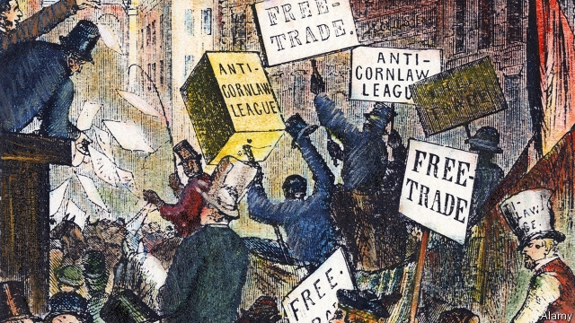

###### Going for broke

# After a no-deal Brexit, should Britain abolish all tariffs? 

##### It would mean cheaper food—but bankrupt farmers 

 

> Feb 28th 2019 

AN OFFICIAL REPORT released on February 26th found that a no-deal Brexit could leave the British economy 6-9% smaller in the long term, “assuming no action is taken”. Many Brexiteers believe, however, that they have a secret weapon that will help soften the blow, or even leave Britain better-off. In the event of no-deal Britain should unilaterally abolish all import tariffs, they say. Such a move would lower prices for British consumers, raising living standards, the argument goes. “Brexit means cheaper food,” says John Longworth, a former head of the British Chambers of Commerce who now runs Leave Means Leave, a pro-Brexit lobby group. The government is weighing up just such a plan, with Liam Fox, the trade secretary, rumoured to favour it. 

Brexiteers point to a long, glorious history of unilateral trade liberalisation. In 1846 Robert Peel, then prime minister, repealed the Corn Laws, tariffs on imported grain. That led to cheaper food, and also pushed investment away from agriculture and towards more productive things like railways and canals. Some high-flying economies such as Singapore charge practically no tariffs on their imports. 

A no-deal Brexit would force Britain to decide whether it wanted to embrace the Peelite model once again. Outside the EU’s customs union Britain could devise its own trade policy, including the rate at which to set tariffs. Yet under World Trade Organisation rules Britain would generally have to charge the same tariffs on EU imports as on non-EU ones. If Britain wanted goods imports which come from the EU to remain tariff-free, it would have to extend that privilege to non-EU exporters too. 

The government’s strategy is slowly becoming clear. On February 25th it announced that once outside the customs union it would abolish many EU “trade remedies”, measures which claim to redress unfair practices (rather than restrict free trade). EU-imposed trade remedies would generally be scrapped unless British firms have more than a 1% share of the domestic market for the product in question. Britons could look forward to sweetcorn from Thailand becoming 10% cheaper than it would otherwise be, if an EU tariff on the crop is cut. On February 26th the Financial Times reported that the government had agreed to set tariffs on certain industrial goods to nil if Britain leaves with no deal. 

Yet there is little chance that it would go the whole hog and abolish all tariffs. Michael Gove, the environment secretary, has suggested that tariffs would be applied to food imports in the event of no deal, to avoid ruining British farmers. The government is said to be considering maintaining a 10% tariff on finished cars for similar reasons. Since both measures would have to be applied both to EU and non-EU imports, prices in Britain would rise. 

That may help British firms. But where would it leave consumers? It might not make much difference either way. A paper from Stephen Clarke of the Resolution Foundation and Ilona Serwicka and Alan Winters of the UK Trade Policy Observatory at Sussex University suggested that even if the government embraced unilateral free trade it would lower consumer prices by only about 1%. Overall, Britons would almost certainly pay more for imports in the event of no-deal, because a large depreciation of sterling would occur. 

The government reportedly envisages committing to a no-deal tariff schedule for one year only. That could give Britain a bit of leverage in trade negotiations with other countries: allow us to export to your market and we will give you better access to ours. If that led to the slow phasing-out of tariffs on both sides, as some Brexiteers dream, it would be a fine thing. Yet in a world where services trade matters as much as goods, 21st-century Peelites focus on reducing non-tariff barriers, such as by harmonising regulations and standards. Quitting the world’s largest trading bloc and aspiring to be a beacon of free trade are incompatible goals. 

-- 

 单词注释:

1.Brexit[]:[网络] 英国退出欧盟 

2.bankrupt['bæŋkrʌpt]:n. 破产者 a. 破产的 vt. 使破产 

3.Brexiteers[]:支持英国退欧的人（Brexiteer的复数） 

4.soften['sɒftn]:v. (使)变柔软, (使)变柔和 

5.unilaterally[]:[计] 单侧地 

6.tariff['tærif]:n. 关税, 关税表, 价格表, 收费表 vt. 课以关税 [计] 价目表 

7.john[dʒɔn]:n. 盥洗室, 厕所, 嫖客 

8.longworth[]: [人名] [英格兰人姓氏] 朗沃思住所名称，来源于古英语，含义是“长+圈用地”(long+enclosure) 

9.lobby['lɒbi]:n. 大厅, 休息室, 游说议员者 vi. 游说议员, 游说 vt. 游说 

10.Liam[liæm]:n. 利亚姆（男子名） 

11.unilateral[.ju:ni'lætәrәl]:a. 单方面的, 单边的, 片面的 [医] 单侧的, 一侧的 

12.liberalisation[,libərəlai'zeiʃən, -li'z-]:n. 自由化；开放 

13.Robert['rɔbәt]:[法] 警察 

14.repeal[ri'pi:l]:n. 废止, 撤消 vt. 废止, 撤消, 放弃 

15.Singapore[.siŋgә'pɒ:]:n. 新加坡 

16.Peelite['pi: lait]:n. [英史]皮尔派保守党员 

17.organisation[,ɔ: ^әnaizeiʃən; - ni'z-]:n. 组织, 团体, 体制, 编制 

18.EU[]:[化] 富集铀; 浓缩铀 [医] 铕(63号元素) 

19.exporter[ik'spɒ:tә]:n. 出口商, 输出者, 出口公司 [经] 出口商, 输出者 

20.redress[ri'dres]:n. 赔偿, 补救, 矫正 vt. 纠正, 赔偿, 救济 

21.scrap[skræp]:n. 碎片, 残余物, 些微, 片断, 铁屑, 吵架 vt. 扔弃, 敲碎, 拆毁 vi. 互相殴打 a. 零碎拼凑成的, 废弃的 

22.Briton['britәn]:n. 大不列颠人, 英国人 

23.sweetcorn[ˈswi:tkɔ:n]:n. 甜玉米 

24.Thailand['tailәnd]:n. 泰国 

25.nil[nil]:n. 无, 全无, 零 [法] 无, 零, 无有 

26.hog[hɒg]:n. 猪, 贪婪者, 象猪般的人 v. (使)拱起 

27.michael['maikl]:n. 迈克尔（男子名） 

28.gove[]: [人名] 戈夫; [地名] [澳大利亚、美国] 戈夫 

29.ruine['ru:ɪn]: [医]路因碱 

30.stephen['sti:vn]:n. 斯蒂芬（男子名） 

31.clarke[]:n. 克拉克（姓氏） 

32.ilona[]:伊洛纳 伊洛娜（人名） 

33.alan['ælәn]:n. 艾伦（男子名） 

34.UK[ju: 'kei]:n. 联合王国 

35.observatory[әb'zә:vәtәri]:n. 天文台, 气象台, 了望台 

36.sussex['sʌsiks]:n. 苏塞克斯（英国郡名） 

37.depreciation[di.pri:ʃi'eiʃәn]:n. 价值减低, 减价, 跌落, 贬低, 折旧 [化] 折旧; 减值 

38.sterling['stә:liŋ]:n. 英国货币, 标准纯银 a. 英国货币的, 标准纯银的, 含标准成分的 

39.reportedly[ri'pɒ:tidli]:adv. 根据传说, 根据传闻, 据报道 

40.envisage[in'vizidʒ]:vt. 面对, 正视, 想象 

41.negotiation[ni.gәuʃi'eiʃәn]:n. 谈判, 磋商, 交涉 [经] 谈判, 协商 

42.Peelite['pi: lait]:n. [英史]皮尔派保守党员 

43.harmonise['hɑ:mәnaiz]:vi.vt. 以和声歌唱/演奏, (使)协调, (使)一致, (使)相称, (使)调和 

44.bloc[blɒk]:n. 集团 

45.aspire[ә'spaiә]:vi. 渴望, 立志于 

46.beacon['bi:kn]:n. 烽火, 灯塔 v. 照亮 

47.incompatible[.inkәm'pætәbl]:a. 不相容的, 不能并存的, 矛盾的 [化] 不协调 

