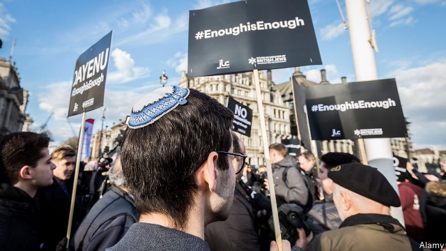

###### An ill wind

# British Jews face prejudice from new quarters 

##### The number of anti-Semitic incidents is on the rise 

 

> Feb 28th 2019 

LAST WEEK David Hirsh resigned from the Labour Party. He was, he wrote, fed up with being humiliated by anti-Semitism. “I have fought it for years, in the student movement, in the academic unions and in the Labour Party. I won’t subject myself to it any longer.” But the 51-year-old sociology lecturer, and author of a book called “Contemporary Left Anti-Semitism”, is not only worried by what is happening in the Labour Party: he sees a conspiratorial outlook spreading across the political spectrum. “When people talk about cosmopolitans, citizens of nowhere or the Rothschilds, I kind of think they are talking about me and my kids,” he says, “even if we don’t own any banks at all.” 

He is not alone. A recent survey by the EU Agency for Fundamental Rights found that three-quarters of British Jews believe anti-Semitism is a problem, up from half in 2012. There has been a rise in the number of recorded anti-Semitic incidents, which range from graffiti to physical violence. The Community Security Trust (CST), a charity, counted 1,652 such incidents in 2018, the highest annual total since it began in 1984. In the past, anti-Semitic incidents have tracked events in the Middle East, with violence against Jews in the West mirroring wars involving Israel. This time that is not the case. 

So far polls show no evidence of an uptick in anti-Semitism in broader British society. And British people are by any measure less anti-Semitic than those in most countries, notes Jonathan Boyd of the Institute for Jewish Policy Research (JPR), a London-based think-tank. A study by his organisation in 2017 found that 5% of Britons could be considered anti-Semitic, with another 25% holding at least one anti-Semitic attitude. 

But some worry that people may come to adopt more strongly held views if they are exposed to them in public life. And under Jeremy Corbyn’s leadership, the Labour Party has faced repeated accusations of tolerating anti-Semitism in its ranks. On February 27th the party suspended Chris Williamson, an MP, after a video emerged of him telling applauding activists that Labour had been “too apologetic” about anti-Semitism. The previous week Luciana Berger, a Jewish Labour MP, quit the party after a campaign of anti-Semitic harassment. Louise Ellman, from a nearby Liverpool constituency, has faced similar abuse. 

On the streets of Ms Ellman’s constituency, Gemma, a 53-year-old IT lecturer and party member, argues that any problems in Labour “have been blown out of all proportion to suit other people’s agendas”. Steve Lawler, a 70-year-old pensioner waiting for a bus, believes that “it’s a coup, like a smear campaign by Labour Friends of Israel”, an organisation Ms Ellman helps run. He is hopeful that Mr Corbyn will be able to create a fairer society—“if Mossad doesn’t assassinate him before then.” 

The JPR study found that people on the left were no more likely than others to hold anti-Semitic opinions. But the same was not true of those with ardent anti-Israel views. Many of the most high-profile cases of anti-Semitism in the Labour Party have arisen in debates about the politics of the Middle East. Party members sometimes then resort to anti-Semitism in an attempt to defend their side, often deploying cruder tropes based on notions of disloyalty or control of finance, the media or government, says Simon Johnson, chief executive of the Jewish Leadership Council, a representative group. 

The rise in anti-Semitic incidents counted by the CST could be because victims are becoming more willing to record them. But many Jewish leaders suspect something else is going on. Social media not only offer a means to spread bile, they also help to bring people with different hatreds together. One analysis of discussion on a far-right website found that 60% of posts on feminism also mentioned Jews. And Dave Rich of the CST thinks some are taking encouragement from the failure to punish anti-Semitism in the Labour Party. “Certain views,” he warns, “are no longer confined to dingy rooms above pubs.” 

-- 

 单词注释:

1.Jew[dʒu:]:n. 犹太人, 守财奴, 犹太教信徒 vt. 欺骗, 杀价 

2.david['deivid]:n. 大卫；戴维（男子名） 

3.hirsh[]:n. (Hirsh)人名；(英)赫什 

4.humiliate[hju:'milieit]:vt. 使丢脸, 使蒙羞, 屈辱 

5.sociology[.sәusi'ɒlәdʒi]:n. 社会学 [医] 社会学 

6.lecturer['lektʃәrә]:n. 演讲者, 讲师 [法] 讲演人, 讲课人, 讲师 

7.conspiratorial[kәn.spirә'tɒ:riәl]:a. 阴谋的, 阴谋者的 [法] 阴谋的, 共谋的 

8.spectrum['spektrәm]:n. 光谱, 范围, 系列 [化] 光谱 

9.cosmopolitan[,kɔzmә'pɔlitәn]:a. 世界主义的, 世界性的, 全世界的, 遍生的, 不偏狭的, 卓有见识的 n. 世界主义者, 世界性 

10.Rothschilds['rɔθtʃaildz]:罗斯恰尔兹贴现公司 

11.EU[]:[化] 富集铀; 浓缩铀 [医] 铕(63号元素) 

12.graffiti[]:n. 墙上乱写乱画的东西 

13.CST[]:[医] 惊厥休克疗法 

14.Israel['izreil]:n. 以色列, 以色列后裔, 犹太人 

15.uptick['ʌptik]:[商](股票)报升(成交价格比上一个交易高的成交或价格) 

16.les[lei]:abbr. 发射脱离系统（Launch Escape System） 

17.jonathan['dʒɔnәθәn]:n. 乔纳森（男子名） 

18.boyd[bɔid]:n. 博伊德（姓氏） 

19.JPR[]:[网络] 游戏玩家(Jon Peddie Research)；吉帕拉纳；托盘租赁株式会社 

20.organisation[,ɔ: ^әnaizeiʃən; - ni'z-]:n. 组织, 团体, 体制, 编制 

21.Briton['britәn]:n. 大不列颠人, 英国人 

22.jeremy['dʒerimi]:n. 杰里米（男子名） 

23.accusation[ækju:'zeiʃәn]:n. 控告, 指控, 指责 [法] 控告, 起诉, 告发 

24.chris[kris]:n. 克里斯（男子名）；克莉丝（女子名） 

25.williamson['wiljәmsn]:n. 威廉姆森（姓氏名） 

26.MP[]:国会议员, 下院议员 [计] 宏处理程序, 维护程序, 线性规划, 微程序, 多处理器 

27.activist['æktivist]:n. 激进主义分子 

28.apologetic[ә.pɒlә'dʒetik]:a. 道歉的, 急于认错的, 辩护的 [法] 辩护的, 辩解的, 道歉的 

29.luciana[]:n. (Luciana)人名；(罗、意)卢恰娜(女名), 卢恰纳 

30.Berger['bә:dʒә]:伯杰(姓氏) 

31.harassment['hærәsmәnt]:n. 困扰, 烦扰, 烦恼 [法] 折磨, 骚扰, 侵扰 

32.louise[lu(:)'i:z]:n. 路易丝（女子名） 

33.ellman[]:n. (Ellman)人名；(英、芬、挪、瑞典)埃尔曼 

34.Liverpool['livәpu:l]:n. 利物浦 

35.constituency[kәn'stitjuәnsi]:n. 选民, 顾客, 读者 [法] 选区, 全体选民, 选区内的选民 

36.gemma['dʒemә]:n. 芽, 无性芽, 芽体 [医] 芽, 微胶粒, 分子团 

37.steve[]:n. 史蒂夫（男子名） 

38.Lawler[]:n. (Lawler)人名；(英)劳勒 

39.pensioner['penʃәnә(r)]:n. 领取抚恤金者, (英国剑桥大学的)自费生, 为金钱所收买的人, 帮佣 [法] 领取退休金者, 领取抚恤金者 

40.coup['ku:]:n. 砰然的一击, 妙计, 出乎意料的行动, 政变 [医] 发作, 中, 击 

41.smear[smiә]:vt. 涂, 擦上, 玷污, 把...擦模糊 vi. 被弄脏 n. 污点, 污迹, 污蔑 

42.Corbyn[]:科尔宾（人名） 

43.Mossad['mɔsæd]:n. 摩萨德（以色列情报机关） 

44.assassinate[ә'sæsineit]:vt. 暗杀, 行刺 [法] 暗杀, 行刺, 中伤 

45.ardent['ɑ:dnt]:a. 热心的, 激动的, 燃烧般的 [医] 灼热的; 热心的 

46.politic['pɒlitik]:a. 精明的, 明智的, 策略的 

47.deploy[di'plɒi]:v. 展开, 配置 

48.trope[trәup]:n. 转义, 比喻 

49.disloyalty[dis'lɒiәlti]:n. 不忠实, 不忠行为, 不义 

50.simon['saimәn]:n. 西蒙（男子名） 

51.johnson['dʒɔnsn]:n. 约翰逊（姓氏） 

52.bile[bail]:n. 胆汁, 坏脾气, 暴躁 [医] 胆汁 

53.feminism['feminizm]:n. 女权主义, 男女平等主义 [医] 男子女性 

54.dave[deiv]:n. 戴夫（男子名） 

55.dingy['diŋdʒi]:a. 暗淡的, 昏暗的, 邋遢的 

