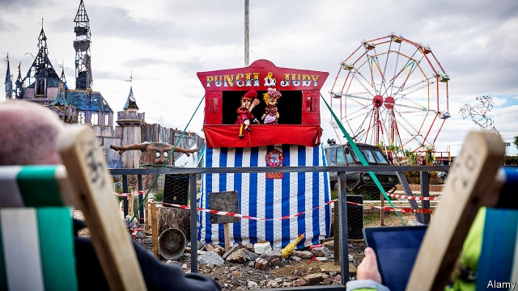
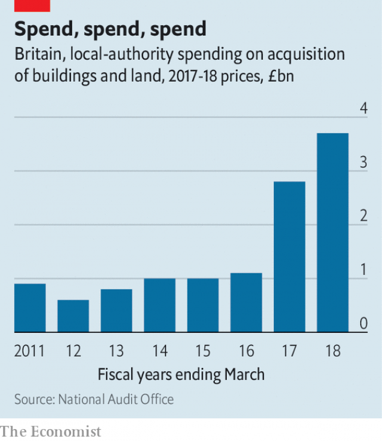

###### Risky business

# British councils speculate to accumulate. Are they out of their depth? 

##### Local authorities are piling into commercial property just as other investors are getting out 

 

> Mar 2nd 2019 

LIKE MANY British seaside towns, Weston-super-Mare has seen better centuries. “Dismaland” was the title that Banksy, a guerrilla artist, chose for his show on the seafront in 2015. Attractions included the Grim Reaper riding the dodgems and Cinderella’s carriage in a crash. All the same, North Somerset council wasn’t going to miss the opportunity to pull in a few punters—less in a celebration of “entry-level anarchism”, as the artist put it, than a desperate stab at urban regeneration. 

The same could be said of the Sovereign Shopping Centre, just up from the lido, which was bought by the council and Legal & General, a big investment company, last year for £21m ($28m). Nigel Ashton, the Conservative leader of the council, saw the purchase as an opportunity to regenerate the tired town centre. But he also hopes that it will provide the council with a vital new income stream. 

Like all councils, North Somerset has seen the money that it receives from central government dwindle since the onset of austerity. In 2010 it got over £50m, making up a third of its budget. Next year the grant will disappear almost entirely. The council has reduced inefficiencies and cut some services. But Mr Ashton argues that he has also been forced to become “more businesslike and entrepreneurial” to plug the gap in Somerset’s finances. The council hopes to receive rent of about £1m a year from the shops in the Sovereign centre. Last year it bought another retail park, in nearby Worle, for £38m. Mr Ashton hopes this will eventually bring in about £600,000 a year to spend on services. 

It is a strategy that has been adopted by both Tory- and Labour-controlled local authorities around Britain. Councils’ commercial investments, in ventures such as offices and recycling plants as well as shops, have increased sharply in recent years. Purchases of land and buildings reached almost £4bn in 2017-18 (see chart). The spree has been financed principally by borrowing from the Public Works Loan Board (PWLB), part of the Treasury established in 1793 to lend cheaply to local authorities. Figures just published show that councils owe the PWLB £75bn, up from £67bn 18 months ago. Total council borrowing exceeds £100bn, up from £92bn. 

 

Worries are growing that not all these investments have been wise. In the past three years councils have bought £800m-worth of shopping centres alone, according to Knight Frank, a property company. Yet as councils have been piling into retail spaces, others have been sounding alarms about the sector. On February 21st a parliamentary committee warned that city centres could become “ghost towns” as shops shut and footfall declines. High-street chains like BHS have collapsed, while others have been closing branches. Next to Weston’s Sovereign centre, a branch of Marks & Spencer is due to close. 

The value of shopping centres is therefore highly precarious. CBRE, a property company, reports that in the third quarter of last year rents in malls fell by 1.7%, continuing a downward trend. On February 25th Hammerson, a big shopping-centre landlord, reported a loss of £267m in 2018, having made a profit of £413m the previous year. It now wants to divest itself of nearly £1bn worth of assets to balance the books. Earlier in February the Postings shopping centre in Kirkcaldy, Scotland, in which 14 of the 21 shops were empty, was sold for a derisory £310,000, having cost £4.3m to build in 1981. 

Jefferies, an investment bank, has warned that retail-property values could plunge by a further 20% this year. Nelson Blackley of Nottingham Business School says that a strong indicator of the lack of confidence in the sector is that last year saw the lowest number of sales of malls since the recession in 2008. 

Thus councils could be picking up some bargains, but they may also have drastically overpaid. The National Audit Office (NAO), an official watchdog, reported last month that consequently “risk profiles have increased in many local authorities” and that councils are making commercial investments that “carry a risk of failure or under-performance”. It added that even as councils have become more speculative in their commercial activities, their capacity to analyse risk has been eroded. Funds to support “governance” in councils fell by 34% in real terms between 2010-11 and 2017-18. Those councils with weaker governance tend to be the ones taking greater financial risks, the NAO said. The abolition in 2015 of the Audit Commission, which had kept tabs on councils’ activities, removed an important layer of oversight. 

As councils take more risks to raise cash, there will inevitably be failures, warns Martin Reeves of the Society of Local Authority Chief Executives. “Even with the best due diligence, markets shift,” he says. And if shopping centres shut down, councils will also lose the business rates they pay, which are meant to be local authorities’ primary source of funding now that the central government grant is drying up. It may soon be time to commission a new show from Banksy. “Panicland”? 

-- 

 单词注释:

1.risky['riski]:a. 危险的 

2.speculate['spekjuleit]:vi. 深思, 推测, 投机 [经] 投机 

3.investor[in'vestә]:n. 投资者 [经] 投资者 

4.Banksy[]:[网络] 班克斯；班克西；街头涂鸦艺术家班克斯 

5.guerrilla[gә'rilә]:n. 游击队 

6.seafront['si:frʌnt]:n. 面向海的一面 

7.grim[grim]:a. 冷酷的, 坚强的, 残忍的, 可怕的, 讨厌的 

8.reaper['ri:pә]:n. 收割者, 收割机 

9.dodgem['dɔdʒim]:n. 躲闪车, 碰碰车 

10.somerset['sʌmәsit. -set]:n. 有衬垫的马鞍（独腿者乘坐的） 

11.anarchism['ænәkizәm]:n. 无政府主义 [经] 无政府主义 

12.regeneration[ri.dʒenә'reiʃәn]:n. 再生, 重建 [化] 再生作用 

13.sovereign['sɒvrin]:n. 元首, 独立国 a. 具有主权的, 至高无上的, 国王的, 完全的 

14.lido['li:dәu]:n. 公共露天游泳池 

15.nigel['naidʒәl]:n. 奈杰尔（男子名） 

16.Ashton[]:n. 阿什顿（人名） 

17.regenerate[ri'dʒenәreit]:vt. 使再生, 重建, 革新 vi. 新生, 再生 a. 新生的, 再生的 [计] 再生; 重写 

18.dwindle['dwindl]:vi. 减少, 缩小, 衰落 vt. 使缩小 

19.onset['ɒnset]:n. 开始, 攻击, 进攻 [医] 起始, 开始 

20.austerity[ɒ'sterәti]:n. 朴素, 苦行, 严格, 严峻 

21.entirely[in'taiәli]:adv. 完全, 全然, 一概 

22.inefficiency[.ini'fiʃәnsi]:n. 无效率, 无能 [化] 效率低; 效率差 

23.businesslike['biznislaik]:a. 有条理的, 有效率的 

24.entrepreneurial[ˌɒntrəprə'nɜ:rɪəl]:a. 创业的, 具有企业精神的; 企业性质的 

25.worle[]:[网络] 英国 

26.recycling[]:[电] 再循环 

27.spree[spri:]:n. 戏耍, 喧闹, 宴会, 狂饮 vi. 狂欢, 狂饮 

28.principally['prinsәpәli]:adv. 主要地, 大部分 

29.treasury['treʒәri]:n. 国库, 宝库, 财政部, 国库券 [经] 库存, 国库, 金库 

30.cheaply['tʃipli]:adv. 便宜地 

31.knight[nait]:n. 骑士, 爵士 vt. 授以爵位 

32.sector['sektә]:n. 扇形, 部门, 部分, 函数尺, 象限仪, 段, 区段 vt. 把...分成扇形 [计] 扇面; 扇区; 段; 区段 

33.parliamentary[.pɑ:lә'mentәri]:a. 国会的, 议会的, 议会制度的 

34.footfall['futfɒ:l]:n. 脚声, 踏步, 脚步 

35.BH[]:abbr. 布氏硬度（Brinell hardness）；营业时间（Business Hours） 

36.spencer['spensә]:n. 针织短外衣, 斜桁纵帆 

37.precarious[pri'kєәriәs]:a. 不稳定的, 不安的, 危险的 

38.CBRE[]:[网络] 世邦魏理仕(CB Richard Ellis)；世邦魏理仕公司；世邦魏理仕集团 

39.mall[mɔ:l]:n. 林荫路 

40.hammerson[]:[网络] 汉莫森；海墨逊；汉森房地产 

41.divest[dai'vest]:vt. 使摆脱, 使脱去, 夺去 [经] 取消权力 

42.asset['æset]:n. 资产, 有益的东西 

43.posting['pәustiŋ]:[计] 记入, 记录, 稿件, 邮件 [经] 过帐, 誊入总帐 

44.Kirkcaldy[]:n. (Kirkcaldy)人名；(英)柯卡尔迪 柯科迪 

45.derisory[di'raisәri]:a. 值得嘲笑的, 可笑的 

46.Jeffery[]:n. 杰弗里（人名） 

47.nelson['nelsn]:n. (摔跤用语)肩下握颈 

48.blackley[]: [人名] [英格兰人、苏格兰人姓氏] 布莱克利 Blakeley的变体; [地名] [英国] 布莱克利 

49.Nottingham['nɒtiŋәm]:n. 诺丁汉郡(英格兰郡名), 诺丁汉市 

50.indicator['indikeitә]:n. 指示器, 指示剂, 指标 [计] 指示器 

51.recession[ri'seʃәn]:n. 后退, 凹处, 衰退, 归还 [医] 退缩 

52.drastically['dræstikәli]:adv. 激烈地, 彻底地 

53.overpay[.әuvә'pei]:vt. 多付, 多给报酬 vi. 付得过多 

54.audit['ɒ:dit]:n. 审计, 查帐 vt. 查(帐), 旁听 vi. 查账 [计] 查帐; 审查; 检查 

55.nao[]:abbr. 国家审计署（National Audit Office）；北大西洋波动（the North Atlantic Oscillation）；全国验光师协会（National Association of Optometrists） 

56.watchdog['wɒtʃdɒg]:n. 看门狗, 监察人 [化] 监控设备; 监视器 

57.profile['prәufail]:n. 侧面, 轮廓, 传略 vt. 描绘...轮廓, 写...的传略 [计] 提问档; 剖面图法; 剖面法 

58.speculative['spekjuleitiv]:a. 思索性的, 投机的, 推测的 [经] 投机的, 冒险的 

59.erode[i'rәud]:vt. 腐蚀, 侵蚀 vi. 受腐蚀 

60.governance['gʌvәnәns]:n. 统治, 统辖, 管理 [法] 统治, 管理, 支配 

61.abolition[.æbәu'liʃәn]:n. 废除, 废奴运动 [医] 禁止, 消失 

62.tab[tæb]:n. 制表(键), 搭襻, 标号, 调整片, (易拉罐)拉环, 帐单, 标签, 制表符 [计] 标签, 制表符, TAB键 

63.oversight['әuvәsait]:n. 勘漏, 失察, 失败, 照料 [经] 监督权 

64.inevitably[in'evitәbli]:adv. 不可避免地 

65.Martin['mɑ:tin]:n. 马丁, 圣马丁鸟 

66.reeve[ri:v]:n. 地方长官 v. 穿(绳索), 穿过 

67.diligence['dilidʒәns]:n. 勤奋 

