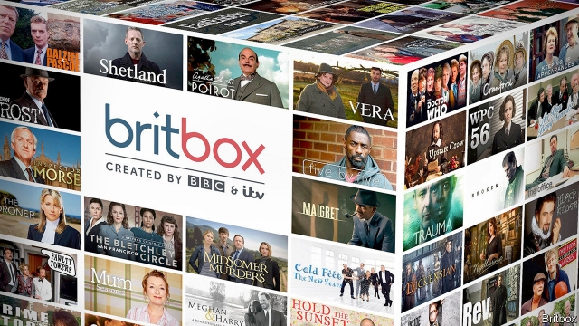

###### BritBox

# The BBC’s Netflix rival 

##### Two British broadcasters announce a new streaming service. But who will tune in? 

 

> Feb 28th 2019 

IN 2007 the BBC, ITV and Channel 4 agreed to start a streaming service that would combine their programming into a tempting offer for the British public. Called Project Kangaroo, it was innovative for the time and probably would have done well—Netflix was just a pup back then, available only in America. But regulators squashed the venture on worries it would stifle competition. 

On February 27th the BBC and ITV announced they were bringing the idea back. BritBox, a streaming service they already offer in North America, will begin service in Britain by the end of this year with shows from both programmers, such as “Broadchurch” and “McMafia”. Ofcom, the telecoms regulator, will review the proposal, but officials there have been encouraging just such a venture. There is no fear now that a British streaming service will stifle competition; Netflix has 10m subscribers in Britain, and Amazon 5m. The question is whether BritBox can hope to compete. 

“Neither party sees this as a Netflix killer,” says Claire Enders, a media analyst. But the BBC and ITV probably felt they had little choice but to try to launch a streaming service, because that is where the audiences are. Viewership of TV channels is on the decline. In January 2010 the average Briton watched 30 hours of TV a week; this January that was down to less than 24 hours, according to Broadcasters’ Audience Research Board, which tracks such data. Viewership of the BBC and ITV’s flagship channels declined even more sharply. 

Nor can the BBC and ITV count on global streaming services to continue serving as repositories for many of their shows. Netflix is expected to cut back on its licensing arrangements with British broadcasters as it makes more of its own programmes. If the BBC and ITV can develop BritBox as a viable platform, and possibly bring it to other territories, that could open up new revenue streams. 

But attracting subscribers will be a challenge. Any British household with a television must pay a licence fee of £150.50 ($200) a year, which funds the BBC. The BBC’s free iPlayer service provides on-demand access to BBC shows. Many households also pay for Sky, Netflix, Amazon or all three. There may be little appetite for another service. 

The BBC and ITV argue that their combined back catalogue of decades of British programming makes their offer distinctive. They also say the service will be priced competitively (analysts reckon £4-5 a month). But they will spend tiny amounts on programming for BritBox—tens of millions of pounds a year, versus Netflix’s billions. That will not be enough to draw a crowd. 

The BBC does have one asset to lure subscribers, if it chooses to make use of him: the Doctor. Britons cannot yet stream the first 26 series of “Doctor Who”. Those classic episodes are available on BritBox in America and Canada. Perhaps the Doctor and his Tardis will materialise on BritBox back home. 

-- 

 单词注释:

1.netflix[]:n. 全球十大视频网站中唯一收费站点 

2.broadcaster['brɒ:dkæstә]:n. 播送者, 广播装置, 播种机 

3.BBC[]:英国广播公司 

4.ITV[]:独立电视, 工业电视, 教学电视 [计] 交互式电视, 电视点播 

5.innovative['inәjveitiv]:a. 革新的, 创新的, 富有革新精神的 

6.pup[pʌp]:n. 小狗, 幼畜, 令人讨厌的年轻人 v. 生小狗 

7.regulator['regjuleitә]:n. 调整者, 校准者, 校准器, 调整器, 标准钟 [化] 调节剂; 调节器 

8.squash[skwɒʃ]:n. 挤压, 压碎的东西, 南瓜属植物, 拥挤的人群 vt. 压扁, 镇压, 压制 vi. 被压扁, 发溅泼声, 挤入 

9.stifle['staifl]:vt. 使窒息, 抑止, 扼杀 vi. 窒息, 被扼杀 

10.programmer['prәugræmә]:n. 程序员 [计] 程序设计员; 程序员 

11.Ofcom['ɒfkɒm]:[网络] 英国通信管理局；英国通讯管理局；英国通讯办公室 

12.telecom['telәkɔm]:telecommunication 电信 

13.subscriber[sʌbs'kraibә]:n. 签署者, 捐献者, 订户 [经] 定户 

14.amazon['æmәzɒn]:n. 亚马孙河 [医] 无乳腺者 

15.killer['kilә]:n. (非正式)杀人者, 屠杀者, 猛兽, 致死(疾病), 杀手, 止痛药, 限制器, 瞄准器 [计] 删除程序; 断路器 

16.claire[kleә]:n. 克莱儿（女子名） 

17.ender[]:n. 安德（游戏中的人物名）；恩德（男子名） 

18.analyst['ænәlist]:n. 分析者, 精神分析学家 [化] 分析员; 化验员 

19.viewership['vju:әʃip]:n. [总称]电视观众 

20.Briton['britәn]:n. 大不列颠人, 英国人 

21.les[lei]:abbr. 发射脱离系统（Launch Escape System） 

22.datum['deitәm]:n. 论据, 材料, 资料, 已知数 [医] 材料, 资料, 论据 

23.flagship['flægʃip]:n. 旗舰 

24.repository[ri'pɔzitәri]:n. 贮藏所, 贮物器, 仓库, 博物馆, 店铺, 陈列室, 资源丰富地区, 墓地, 亲信, 知己 [经] 仓库, 栈房, 贮藏所 

25.viable['vaiәbl]:a. 能养活的, 能生长发育的 [医] 有活力的, 有生机的 

26.iPlayer[]:[网络] 爱玩家；爱播；杀 

27.distinctive[di'stiŋktiv]:a. 有特色的, 出众的 

28.competitively[]:adv. 好竞争地；有竞争力地 

29.reckon['rekәn]:vt. 计算, 总计, 估计, 认为, 猜想 vi. 数, 计算, 估计, 依赖, 料想 

30.versus['vә:sәs]:prep. 对... [法] 诉, 对, 相形 

31.asset['æset]:n. 资产, 有益的东西 

32.lure[luә]:n. 饵, 诱惑 vt. 引诱, 诱惑 

33.Briton['britәn]:n. 大不列颠人, 英国人 

34.cannot['kænɒt]:aux. 无法, 不能 

35.sery[]:n. (Sery)人名；(俄)谢雷；(科特)塞里 

36.tardi[]:[网络] 陶尔迪；塔狄；塔第 

37.materialise[mә'tiәriәlaiz]:vi.vt. (使)物质化, (使)具体化, (使)追求物质利益, (使)显形, 成为事实, 实现 vi. 突然出现 

