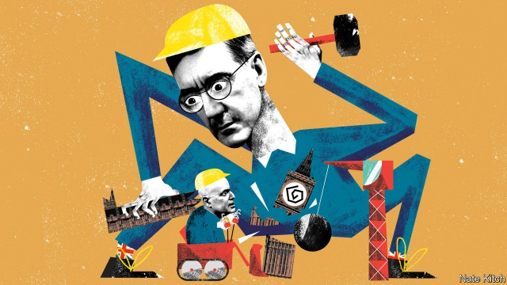

###### Bagehot

# The group that broke British politics 

##### The hardline Brexiteers of the European Research Group have upended all political norms 

 

> Feb 28th 2019 

THE LONDON PALLADIUM is preparing to host one of the great icons of the 1960s, Joan Baez, who burst onto the scene at Woodstock, hooked up with Bob Dylan, and sang some of the most memorable protest songs of the era. This week, however, it played host to a bird of a very different feather—a man who would have been more at home in the 1860s than the 1960s and whose idea of a singalong is “Land of Hope and Glory” rather than “Blowin’ in the Wind”. Some 2,300 people sat enraptured as Fraser Nelson, the editor of the Spectator, gently grilled Jacob Rees-Mogg, the MP for North East Somerset and head of the European Research Group (ERG) of Conservative MPs, on his politics and peccadilloes. 

Mr Rees-Mogg performed his old favourites. He confessed that he had never done the washing up (“That’s what washing machines are for”). He praised true blue Conservatism and threw jabs at wets in his own party (“Philip Hammond is no doubt in many ways a very great man”). But he also provided something important to his supporters in a week of growing uncertainty about Brexit. He assured them that the referendum would be honoured despite the machinations of the establishment. And he insisted in various ways that Brexit must mean Brexit. “I would be quite happy with a no-deal Brexit,” he pronounced, to thunderous applause. 

While Mr Rees-Mogg soaked in a warm bath of adulation, the British political system lay in ruins. The government can work properly only if the prime minister can command the support of her ministers and her party. This week some 15 Conservative ministers, including three cabinet members, threatened to resign if Theresa May didn’t forestall the threat of no-deal by allowing MPs to vote for an extension of the Article 50 talks. Mrs May had no choice but to bend to their will. The government is now a collection of warring factions issuing rival ultimatums. The Conservative Party is falling apart. The civil service looks in vain for clear instructions from its masters. 

The blame for this miserable state of affairs lies squarely with Mr Rees-Mogg’s ERG, a collection of up to 100 MPs who claim to be conservatives but are in fact the closest thing that Britain has produced to sans culottes. British political parties have always contained pressure groups that try to influence their parties. But the ERG is more like a communist cell. It has not only put the most divisive subject imaginable at the heart of British politics (extraordinary as it may seem, “Europe” was low down on most voters’ list of concerns before the referendum of 2016). It has done so by adopting the most poisonous methods possible. 

The ERG acts as a party within a party. It has its own chief whip (Mark Francois) as well as its own leader (Mr Rees-Mogg) and deputy (Steve Baker). It meets regularly to decide its line and sends delegations to Downing Street to lay down the law to the prime minister. ERG members increasingly identify themselves as ERGers rather than mere Conservatives when they appear on television. 

The ERG is frequently closer to other Eurosceptic parties than it is to the left of the Conservative Party. ERGers have been willing to share platforms with current and former members of the UK Independence Party, such as Nigel Farage. They have a particular liking for the Northern Irish Democratic Unionist Party because of its spirit of besieged indomitability. The ERG also has a remarkable ability to operate as both an insider and an outsider at the same time. It has powerful supporters in the government, such as Liam Fox, the trade secretary, as well as on the backbenches. Some of its leading figures, such as Mr Baker, resigned from the government because they thought it was “betraying” Brexit. It also has an extra-parliamentary wing. Grassroots groups that grew up to support the Leave side in the referendum continue to co-ordinate with the ERG. ConservativeHome, a website, could be called ERGHome. 

The ERG has normalised behaviour that a few years ago would have been seen as unacceptable. ERGers have repeatedly defied the party whip. They have briefed the press against Mrs May and her supposed attempts to foil Brexit. They have resisted any dilution of the purity of Brexit, arguing that it means not just leaving the EU but also its customs union and single market. Some of them have even endorsed the idea of de-selecting Tory MPs who don’t agree with them, a tactic normally associated with the far left. 

Yet the ERG has produced a backlash as Remainer MPs have concluded that, when a noisy faction runs riot, they are no longer bound by the old gentlemanly rules. The three Tory MPs who recently left the party to join the new Independent Group issued a colour-confused warning that the Conservative Party was in danger of being taken over by “purple Momentum” and becoming “blueKIP”. Others are adopting ERG-style methods from within the party, such as issuing co-ordinated threats of resignation and writing impassioned op-eds in the Daily Mail. The ERG has found itself competing for influence with other rebellious factions. 

This tit-for-tat behaviour is rapidly leading to the complete ERGification of the British right. The Tories are quickly splitting into two parties with rival power structures and agendas. The great question is how long it will last. For a depressing answer, look at America. For all their difference in sartorial style—the one is as neat as the other is scruffy—the person that Mr Rees-Mogg most resembles is Newt Gingrich. Mr Gingrich succeeded in breaking American politics by applying a similar combination of ideological zeal and toxic methods to the Republican Party. The ERG faces bigger barriers than Mr Gingrich did. In Britain the ruling party has juicier plums to offer MPs, in the form of government jobs. Party leaders can more easily set the tone in the national party—if, unlike Mrs May, they are capable of exercising leadership. On the other hand, the European question shows no sign of going away. British politics is not quite as broken as American politics. But thanks to Mr Rees-Mogg and his wrecking crew, it is getting there fast. 

-- 

 