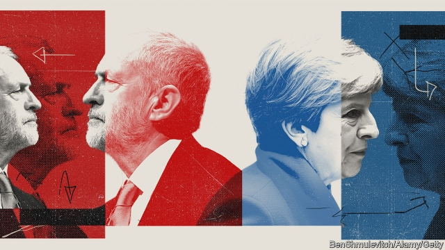

###### Departure delayed
sswww
# Theresa May and Jeremy Corbyn lose control of their Brexit policies 

##### Brexit is likely to be deferred until at least June 30th. This will not make it any easier to get MPs to back a deal 

 

> Feb 28th 2019 

AFTER WEEKS of unstable equilibrium British politics has seen two breakthroughs. Theresa May, the prime minister, agreed to offer MPs a chance to vote to extend the Article 50 Brexit negotiations. This in effect takes a no-deal Brexit off the table for the time being. Meanwhile Jeremy Corbyn, the leader of the opposition, promised to support a second referendum on the final deal. This raises the possibility that a Brexit delay might eventually morph into a Brexit revote. 

The reason for these breakthroughs is that both leaders are losing control of their own parties. Mrs May’s Brexit strategy depended on confronting MPs with a choice between her deal and no deal. But early this week some 15 ministers, including three cabinet members, threatened that they would back a plan drawn up by Yvette Cooper, a Labour MP, to delay Brexit if Mrs May cannot get her deal through Parliament by a specified date. Following one of the most fraught cabinet meetings in years, Mrs May turned up to Parliament on February 26th to offer a succession of promises to appease the rebels: if her deal fails to pass by March 12th, she will ask MPs by the following day if they are willing to sanction a no-deal Brexit and then, assuming that the answer is no, the day after they will be able to instruct the government to go back to Brussels to seek an extension to the Article 50 Brexit deadline of March 29th. 

Mr Corbyn is a lifelong Eurosceptic who also recognises that a large minority of Labour voters backed Leave. But his leadership is in a battered state. Nine MPs recently quit, Tom Watson, the deputy leader, has formed a new moderate group within the party and a YouGov poll shows Labour trailing the Tories by 23% to 36%. This has enabled the party’s pro-Remain constituency to force him to promise a referendum in order to avoid further defections. 

What does all this add up to? Mrs May’s promise of a vote to delay Brexit was so explicit that she cannot go back on her word (though it is a measure of how little trust Mrs May has in Parliament that MPs agonised about whether they should bring their amendment forward as an insurance policy). But she nevertheless hedged her promise with Brexiteer-pleasing caveats such as that she wanted any delay to be “short” and “once only”. Her chosen new Brexit day is probably June 30th. 

A delay would do nothing in itself to tackle the great sticking point of the “backstop”, which seeks to prevent a hard border in Ireland by keeping the entire United Kingdom in a customs union with the EU. Geoffrey Cox, the attorney-general, and Stephen Barclay, the Brexit secretary, spent much of this week in Brussels trying to put into legal form EU undertakings that the backstop will be used only if necessary and that it is not intended to be permanent. 

Some hardline Brexiteers may yet decide to hold their nose and vote for Mrs May’s deal on March 12th, rather than risk the possibility of delaying or even reversing Brexit. Jacob Rees-Mogg, head of the European Research Group of Tory MPs, said this week that he would not insist on the backstop being dropped altogether. The Northern Irish Democratic Unionists, who voted against the deal last time, are sounding a little more emollient. Yet the prospect of putting back the deadline may have increased chance that soft Tories and Labour Leavers will vote against the deal, because it postpones the danger of crashing out with no arrangements in place. 

Then there is the question of how all this will go down in Brussels. An extension to the Article 50 talks would need the approval of all 27 governments. Emmanuel Macron has said that France would consider an extension “if it’s justified by new choices on the part of the British”. Spain’s prime minister, Pedro Sánchez, has made similar noises. Some Eurocrats suggest giving Britain up to a couple of years to rethink its approach and perhaps hold another referendum. But the majority support a short extension, not least because this would allow them to skirt the question of whether Britain should participate in this spring’s European Parliament elections. 

Mr Corbyn’s promise to support another referendum is more confusing. The Labour leader said that he would support a “confirmatory” referendum only in the event that Mrs May’s deal managed to pass through Parliament. It is not clear whether he might in future offer to support Mrs May’s deal in return for her putting it to the country, as some Labour MPs have suggested. And it is certainly not clear whether he will actually campaign for a second vote or simply go through the motions, as he did during the referendum campaign in 2016. 

Mr Corbyn’s willingness to campaign matters because, as things stand, it is unlikely that a Labour motion to support a second referendum would get through Parliament. Some 30 Labour MPs who represent Leave-voting constituencies would probably vote against such a motion but, so far, only a handful of Tories have come out in favour of a second referendum. 

Everything depends on what use Britain’s competing political factions make of a delay in the Brexit timetable. Mrs May’s strategy would be to chip away at her opponents by insisting that her deal, backstop and all, remains the only one available and by resurrecting the threat of a no-deal crash out, only in June rather than March. The Brexiteers would continue to push for a prize that they have been seeking for decades. The large group of moderate MPs would continue to resist the possibility of leaving without a deal on the grounds that it would do grave damage to the economy. (The government’s own analysis of the consequences of a no-deal Brexit, published this week, predicted lower growth, long delays at Dover and costly new customs procedures.) There is little reason to think it would be any easier to solve the problem of the backstop in the next three months than it was in the past three. 

The only thing to emerge with any clarity from this week’s dramatic events is that Britain’s agonies are likely to go on for longer than originally billed. Those people who thought that March 29th might put an end to all the talk about Brexit are set to be sorely disappointed. 

-- 

 单词注释:

1.theresa[ti'ri:zә]:n. 特丽萨（女子名） 

2.jeremy['dʒerimi]:n. 杰里米（男子名） 

3.Corbyn[]:科尔宾（人名） 

4.Brexit[]:[网络] 英国退出欧盟 

5.defer[di'fә:]:vi. 推迟, 延期, 听从 vt. 使推迟, 使延期 

6.MP[]:国会议员, 下院议员 [计] 宏处理程序, 维护程序, 线性规划, 微程序, 多处理器 

7.equilibrium[.i:kwi'libriәm]:n. 平衡, 平静, 均衡 [化] 平衡 

8.politic['pɒlitik]:a. 精明的, 明智的, 策略的 

9.negotiation[ni.gәuʃi'eiʃәn]:n. 谈判, 磋商, 交涉 [经] 谈判, 协商 

10.opposition[.ɒpә'ziʃәn]:n. 反对, 敌对, 相反, 在野党 [医] 对生, 对向, 反抗, 反对症 

11.referendum[.refә'rendәm]:n. （就重大政治或社会问题进行的）全民公决，全民投票 

12.morph[mɔf]:[计] 形态, 词态 

13.revote[]:vt. 再拨款；重新投票 

14.Mr['mistә(r)]:先生 [计] 存储器回收程序, 多重请求 

15.confront[kәn'frʌnt]:vt. 使面对, 对抗, 遭遇, 使对质, 比较 [法] 对证, 使对质, 比较 

16.yvette[i'vet]:n. 伊薇特（女子名） 

17.cooper['ku:pә]:n. 制桶工人 v. 制桶 

18.MP[]:国会议员, 下院议员 [计] 宏处理程序, 维护程序, 线性规划, 微程序, 多处理器 

19.cannot['kænɒt]:aux. 无法, 不能 

20.fraught[frɒ:t]:a. 含有...的, 伴着...的, 充满...的 

21.appease[ә'pi:z]:vt. 抚慰, 缓解, 平息, 姑息 [法] 使和缓, 使满足, 姑息 

22.sanction['sæŋkʃәn]:n. 核准, 制裁, 处罚, 约束力 vt. 制定制裁规则, 认可, 核准, 同意 

23.Brussel[]:n. 布鲁塞尔（比利时首都） 

24.lifelong['laiflɒŋ]:a. 终身的, 毕生的 

25.eurosceptic[ˌjʊərəʊ'skeptɪk]:n. 欧洲统一怀疑论者；反对英国亲近欧盟的人 

26.voter['vәutә]:n. 选民, 投票人 [法] 选民, 选举人, 投票人 

27.batter['bætә]:v. 连续猛打（尤其指妇女），猛击 n. 面糊（食物），击球员，打击手 

28.tom[tɒm]:n. 雄性动物, 雄猫 

29.Watson['wɔtsn]:[计] 沃森 

30.YouGov[]:[网络] 民治调查公司；尤格夫；民治公司 

31.Tory['tɒ:ri]:n. 托利党党员, 保守党员, 亲英分子 a. 保守分子的 

32.constituency[kәn'stitjuәnsi]:n. 选民, 顾客, 读者 [法] 选区, 全体选民, 选区内的选民 

33.defection[di'fekʃәn]:n. 背叛, 缺乏, 毛病 [法] 缺点, 过失, 背叛 

34.agonise['æ^әnaiz]:v. 烦恼, 挣扎 

35.amendment[ә'mendmәnt]:n. 修订, 改善, 改良, 改正 [化] 调理剂; 修正 

36.caveat['keiviæt]:n. 中止诉讼程序的申请, 警告 [经] 停止支付的广告, 货物出门概不退换 

37.tackle['tækl]:n. 工具, 复滑车, 滑车, 装备, 扭倒 vt. 固定, 处理, 抓住 vi. 扭倒 

38.backstop['bækstɒp]:n. 挡球网, 接球手 [电] 背向停止 

39.EU[]:[化] 富集铀; 浓缩铀 [医] 铕(63号元素) 

40.geoffrey[]:n. 杰弗里（男子名） 

41.cox[kɒks]:n. 舵手 v. 做舵手 

42.stephen['sti:vn]:n. 斯蒂芬（男子名） 

43.barclay['bɑ:kli]:n. 巴克利（姓氏, 男子名） 

44.hardline[]:n. 强硬路线 [电] 硬线 

45.Brexiteers[]:支持英国退欧的人（Brexiteer的复数） 

46.jacob['dʒeikәb]:n. [圣经]雅各（以色列人的祖先）；雅各布（男子名） 

47.Tory['tɒ:ri]:n. 托利党党员, 保守党员, 亲英分子 a. 保守分子的 

48.unionist['ju:njәnist]:n. 工会会员, 工联主义者 [法] 工会会员, 工会主义者 

49.emollient[i'mɒliәnt]:a. 使柔软的 n. 软化剂, 润肤剂 

50.leaver['li:vә]:n. 离开者（常指学校毕业生） 

51.emmanuel[i'mænjuәl]:n. 以马内利（耶稣基督的别称）；伊曼纽尔（男子名, 等于Immanuel） 

52.macron['mækrәn]:n. 长音符号 

53.pedro['pi:drәu]:n. 彼得牌戏（一种纸牌戏） 

54.Eurocrat['juәrәkræt]:n. 欧洲经济共同体的官员(或职员) 

55.rethink[ri:'θiŋk]:v. 再想, 重想 

56.confirmatory[kәn'f\\:mәtәri]:起确定作用的, 坚信礼的, 证实的 [计] 证实 

57.faction['fækʃәn]:n. 小派系, 内讧 [法] 宗派, 派别, 小集团 

58.chip[tʃip]:n. 屑片, 薄片, 碎片 vt. 削, 切, 削成碎片, 使摔倒, 凿 vi. 削下屑片 [计] 孔屑; 组件; 晶片; 芯片 

59.resurrect[.rezә'rekt]:vi. 复活 vt. 使复活, 复兴, 恢复, 盗掘 

60.Dover['dәuvә]:n. 多佛(英国港口) 

61.clarity['klærәti]:n. 清楚, 明晰 [化] 透明度; 透明性; 清晰性 

62.originally[ә'ridʒәnli]:adv. 本来, 原来, 最初, 就起源而论, 独创地 

63.sorely['sɒ:li]:adv. 疼痛地, 强烈地, 非常 

