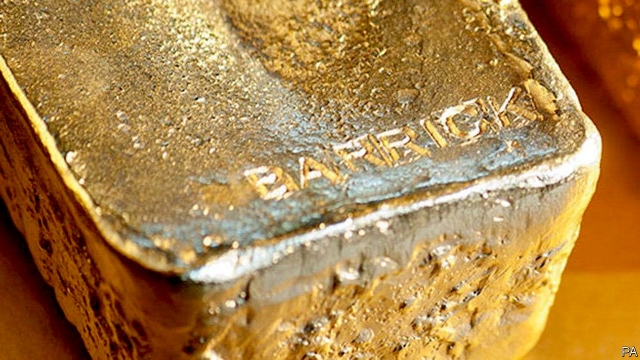

###### Gold mining

# A giant gold miner crashes its rival’s wedding 

##### A late bid by Barrick Gold for Newmont Mining 

 

> Mar 2nd 2019 

IN THE MOVIES weddings often feature a dramatic moment where the minister asks the congregation whether anyone objects to the union. On February 25th Barrick Gold performed the corporate equivalent of a spurned lover leaping to their feet mid-ceremony, offering $18bn to buy American gold firm Newmont Mining before it could consummate its $10bn takeover of Goldcorp, a Canadian one. Newmont was rushing into an “ill-conceived” merger and should stop to consider Barrick’s unsolicited “but clearly superior” bid, said Mark Bristow, Barrick’s chief executive. Newmont’s boss, Gary Goldberg, called the intervention “desperate and bizarre”. 

After some grim years for the industry, the gold price is picking up and big miners want to grow bigger. The easiest and safest way to do that is to buy someone else’s mines. To which end Toronto-based Barrick bought Randgold Resources, a South African firm, for $6bn in a deal that closed in January. Newmont hopes to complete buying Goldcorp later this year. 

This is not the first time Barrick has approached Newmont. Talks were well advanced in 2014 before an acrimonious falling out. Mr Bristow, Randgold’s former boss, has tried to persuade Mr Goldberg that much has changed since 2014. So far he has been unable to convince him that the two are a natural fit. 

At least part of the problem is that Barrick is not offering Newmont’s shareholders a premium to sweeten a deal which would leave them with 44.1% of the merged company and Barrick’s shareholders with 55.9%. Instead, Mr Bristow is talking up an estimated $7bn in savings over 20 years. These would mostly come from putting gold mines in Nevada, now separately owned by the two, under one management and removing duplication in such things as transport and processing. Mr Barrick also wants Newmont to sever the agreement with Goldcorp, which means paying a $650m break-up fee. 

Newmont is clearly not keen. The figures it has come up with show substantially lower savings from a merger with Barrick and higher benefits if shareholders stick with the Goldcorp deal. It also reckons Barrick has risky assets in countries like the Democratic Republic of Congo, Mali and Papua New Guinea, as well as a poor share-price performance since the two companies last talked. Newmont’s shares have risen 65% in value since 2014, whereas Barrick’s only managed a 22% rise. 

Yet something seems to have encouraged Barrick to move, aside from not wanting to fall behind a combined Newmont-Goldcorp as the world’s largest gold firm by market capitalisation. Barrick’s Mr Bristow probably thinks Newmont’s shareholders are up for a deal, reckons Chris Terry of Deutsche Bank. Indeed, the reaction to Newmont’s purchase of Goldcorp has been mixed. Goldcorp’s share price dipped this week, which suggests some investors are betting that Goldcorp could be left standing at the altar. 

-- 

 单词注释:

1.barrick[]:n. (Barrick)人名；(英)巴里克 

2.newmont[]:[网络] 纽蒙特；纽蒙特矿业公司；纽蒙特公司 

3.congregation[.kɒŋgri'geiʃәn]:n. 集合, 聚集 [法] 集会, 人一, 红衣主教会议 

4.corporate['kɒ:pәrit]:a. 社团的, 合伙的, 公司的 [经] 团体的, 法人的, 社团的 

5.spurn[spә:n]:n. 踢开, 拒斥 vt. 踢开, 冷落, 践踏, 唾弃 vi. 藐视, 摒弃 

6.consummate['kɒnsәmeit]:vt. 完成, 使完美 a. 无上的, 至上的, 完美的 

7.takeover[]:n. 接管, 接收 [经] 接收 

8.Goldcorp[]:[网络] 加拿大黄金公司；加拿大金矿公司；黄金企业公司 

9.merger['mә:dʒә]:n. 合并, 归并 [经] 购并 

10.unsolicited['ʌnsә'lisitid]:a. 未经请求的, 主动提供的 [计] 任意型的 

11.Bristow[]:布里斯托（美国地名） 

12.gary['^eәri]:n. 盖理 

13.goldberg['^әjldb\\:^]:n. [俚]犹太老板（尤指在黑人聚居区开店或雇用黑人的） 

14.intervention[.intә'venʃәn]:n. 插入, 介入, 调停 [经] 干预 

15.bizarre[bi'zɑ:]:a. 奇异的 

16.grim[grim]:a. 冷酷的, 坚强的, 残忍的, 可怕的, 讨厌的 

17.acrimonious[ækri'mәunjәs]:a. 尖刻的, 讥讽的, 激烈的 

18.shareholder['ʃєә.hәuldә]:n. 股东 [法] 股东, 股票持有人 

19.premium['pri:miәm]:n. 额外补贴, 奖金, 奖赏, 保险费 [医] 保险费 

20.sweeten['swi:tn]:vt. 使变甜, 加糖于, 使悦耳, 使温和, 减轻 vi. 变甜 

21.merge[mә:dʒ]:vt. 使合并, 使消失, 吞没 vi. 合并, 渐渐消失 [计] 合并 

22.Nevada[ni'vædә]:n. 内华达 

23.duplication[.dju:pli'keiʃәn]:n. 副本, 复制 [医] 重迭, 双折, 复制 

24.sever['sevә]:vt. 切断, 脱离, 分开, 使分离, 断绝, 中断 vi. 断, 裂开 

25.substantially[sәb'stænʃәli]:adv. 实质上, 本质上, 大体上 

26.reckon['rekәn]:vt. 计算, 总计, 估计, 认为, 猜想 vi. 数, 计算, 估计, 依赖, 料想 

27.risky['riski]:a. 危险的 

28.asset['æset]:n. 资产, 有益的东西 

29.Congo['kɔŋ^әu]:n. 刚果, 刚果河, 工夫茶 [建] 刚果, 直接刚果红 

30.Mali['mɑ:li]:n. 马里 

31.Papua['pæpjuә]:n. 巴布亚岛 

32.guinea['gini]:n. 几内亚 

33.capitalisation[,kæpitәlai'zeiʃən;-li'z-]:n. <主英>=capitalization 

34.chris[kris]:n. 克里斯（男子名）；克莉丝（女子名） 

35.terry['teri]:n. 毛圈, 毛圈织物 

36.deutsche[]:n. 德意志联邦共和国马克 

37.investor[in'vestә]:n. 投资者 [经] 投资者 

38.altar['ɒ:ltә]:n. 圣坛, 祭坛 

