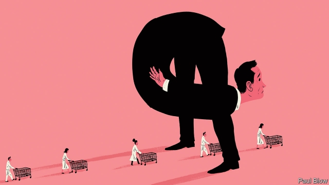

###### Bartleby

# Conscious decoupling 

##### A new book explains how managers are challenged by changing customer behaviour 

 

> Mar 2nd 2019 

THINK ABOUT the companies like Uber and Airbnb that have burst through into public consciousness in the past ten years. While many of them depend on the internet, their success is not down to any particular technological innovation of their own design. Instead, their secret lies in their business model. 

Thales Teixeira of the Harvard Business School argues that the principle that underlies a lot of these models is called decoupling. In his book “Unlocking the Customer Value Chain”*, he explains how this concept applies across a wide range of industries. 

Buying a product will involve at least four stages. First, customers will evaluate the items available; then they will choose one or two; then they will buy them; finally they will consume them. In the traditional model, the first three took place inside a single retail store. Customers would look at the TVs or dishwashers on offer, pick one they liked with a price they could afford, pay at the till and then take the item home or arrange for the retailer to deliver it. 

These steps are all part of what Mr Teixeira calls the “customer value chain”. Disrupters have muscled in on some parts of this chain. One example is the practice of “showrooming”. Shoppers enter an electrical store like Best Buy and examine what’s on offer. But instead of purchasing the item in the store, they buy it online. Amazon has even created an app allowing customers to scan a product’s bar code, or take its picture, and discover its online price. The selection of products has been decoupled from their purchase. 

Other examples of the decoupling process cited by Mr Teixeira include Zipcar, where driving a car is separated from purchasing and maintaining it; TiVo, where watching TV is delinked from sitting through ads; and Birchbox, where customers are sent samples of beauty products, eliminating the need to visit a store to try them. 

This is not, as the author points out, a particularly new idea. Budget airlines like Ryanair have long since decoupled flying from the services and amenities that usually accompanied it. Passengers have to pay separately for the extras, like seat selection and the carrying of baggage. Other airlines have followed suit. 

Customer services have for some time been disrupted by a trend with the ugly name of disintermediation, the cutting out of middlemen. Most holidays are now purchased directly, rather than via travel agents; shares are bought via low-commission services, rather than through advisory stockbrokers. New entrants can gain market share if they can offer customers a lower cost or greater convenience. Decoupling doesn’t subtract middlemen but still results in lower costs to the consumer. 

The beauty of the decoupling approach is that the only limit to innovation is imagination, rather than technical brilliance. For example, Mr Teixeira cites Trov, a company which allows customers to buy insurance solely for specific items for specific periods of time. If you want to insure your latest smartphone for a two-week holiday, you can do so; and then insure it again for a weekend trip later in the year. The need for insurance is decoupled from the hassle of buying an annual policy. 

Suppose that you like a restaurant’s ambience, but not its food. In theory, you could book a table but order the food from elsewhere, paying separately for the service and the cooking. If 3D printers become ubiquitous, design and manufacture could be decoupled, with consumers paying for the digital blueprint. 

Mr Teixeira argues that decoupling is a customer-driven phenomenon—bottom-up rather than top-down. Successful businesses will spot how consumer tastes are shifting, and that may involve looking at other industries as well as their own. For example, they can look at the success of Netflix’s subscription-based model; what works for TV programmes may also work for other goods and services. Already, there are companies that will deliver socks or perfume on a regular basis, decoupling this from a trip to the mall. 

The challenge for existing managers is that they must worry about more than whether their overall costs are lower than those of their immediate rivals. If a part of their process is inefficient, or inconvenient for consumers, the decouplers may well grab hold of it. 

* subtitled How Decoupling Drives Consumer Disruption, published by Currency Books 

-- 

 单词注释:

1.bartleby[]:[网络] 巴特比；巴特白；老板是空气 

2.decouple[di'kʌpl]:[计] 去耦, 退耦, 分离 

3.uber['ju:bә]:[医] 乳房 

4.Airbnb[]:爱彼迎（美国短租平台） 

5.technological[.teknә'lɒdʒikl]:a. 技术的 [经] 工艺的, 技术的 

6.innovation[.inәu'veiʃәn]:n. 改革, 创新 [法] 创新, 改革, 刷新 

7.thale[]: [地名] [德国] 塔勒 

8.teixeira[]: [地名] [巴西、葡萄牙] 特谢拉 

9.Harvard['hɑ:vәd]:n. 哈佛大学 

10.underly[]:[网络] 潜在的；标的资产 

11.unlock[.ʌn'lɒk]:vt. 开...的锁, 开启, 表露, 放出 vi. 被开启, 揭开, 解放 [计] 解出锁定 

12.dishwasher['diʃwɒʃә]:n. 洗碗机, 洗碗工 

13.retailer['ri:teilә]:n. 零售商人, 传播的人 [经] 零售商 

14.disrupter[]:n. 分裂者, 破坏者 

15.showrooming[]:[网络] 展厅现象；展示厅现象；先逛店后网购 

16.shopper['ʃɒpә]:n. 购物者 [经] 顾客, 购物的人 

17.online[]:[计] 联机 

18.amazon['æmәzɒn]:n. 亚马孙河 [医] 无乳腺者 

19.APP[]:[计] 应用, 应用程序; 相联并行处理器 

20.cite[sait]:vt. 引用, 引证, 表彰 [建] 引证, 指引 

21.zipcar[]:[网络] 汽车共享；吉普卡租车公司；汽车共享服务与热布卡公司 

22.tivo[]:abbr. 美国电视录制技术公司；硬盘数字录像机 

23.delink[]:[计] 解链, 解除连接 

24.Ryanair[]:n. 瑞安航空公司（欧洲最大的廉价航空公司, 总部位于爱尔兰） 

25.amenity[ә'mi:niti]:n. 便利设施, 适意, 礼仪 [法] 舒适, 方便, 优雅 

26.disrupt[dis'rʌpt]:a. 分裂的, 中断的 vt. 使分裂, 使瓦解 

27.disintermediation[dis,intәmi:di'eiʃәn]:n. <美>非居间化(指由储蓄银行存款转为直接的证券投资) 

28.middleman['midlmæn]:n. 中间人 [法] 调解人, 中间人, 中人 

29.advisory[әd'vaizәri]:a. 顾问的, 咨询的, 劝告的 [法] 劝告的, 忠告的, 咨询的 

30.stockbroker['stɒk.brәukә]:n. 股票经纪人 

31.entrant['entrәnt]:n. 新会员, 新成员, 进入者 

32.brilliance['briljәns]:n. 卓越, 光辉 [电] 辉度 

33.smartphone[]:n. 智能手机 

34.hassle['hæsl]:n. 激烈而持久的争论 vi. 争论 vt. 与...争辩, 使烦恼 

35.ambience['æmbiәns]:n. 周围环境, 气氛 

36.ubiquitous[ju:'bikwitәs]:a. 无所不在的, 到处存在的, 普遍存在的 

37.blueprint['blu:'print]:n. 蓝图, 设计图, (周详的)计划 vt. 制成蓝图, 计划 

38.mall[mɔ:l]:n. 林荫路 

39.inconvenient[.nkәn'vi:njәnt]:a. 不便的, 有困难的 

40.decouplers[]:去耦器 

41.grab[græb]:n. 抓握, 掠夺, 强占, 东方沿岸帆船 vi. 抓取, 抢去 vt. 攫取, 捕获, 霸占 

42.subtitle['sʌb.taitl]:n. 副标题 

43.disruption[dis'rʌpʃәn]:n. 分裂, 崩溃, 瓦解 

