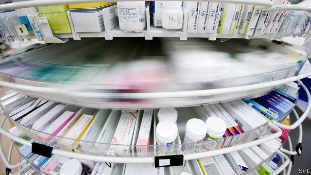
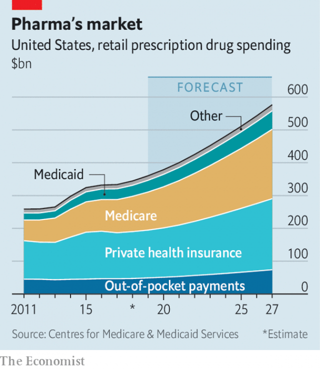

###### The sharp end of the spear

# Global drugs firms are under pressure from American politicians 

##### A number of reforms could force big changes 

 

> Mar 2nd 2019 

“AS A LIFELONG farmer who raised hogs, cattle and sheep…[I] know when someone’s trying to pull the wool over my eyes.” So declared Senator Chuck Grassley, a Republican from Iowa, this week after the Senate Finance Committee, which he chairs, ordered top executives from seven global drugs firms to explain why American drug prices are the world’s highest. Ron Wyden, the senior Democrat on the committee, denounced the industry’s “two-faced scheming and profiteering”. 

Big Pharma has been pilloried for decades but still flourished, not least because it keeps producing life-saving innovations needed by Americans, who are in aggregate getting fatter, older and sicker by the year. Still, the hearing marks a dangerous moment for the industry. Reforms may force big changes to a lucrative business model. 

Anger is growing over rising drug costs (see chart). Insulin cost less than $200 for a vial 15 years ago but sells for nearly $1,500 today, according to one estimate. Such price spikes have led to bipartisan support in an otherwise rancorous Congress for measures to tame the industry. 

 

The reform efforts could lead to three changes, reckons Benjamin Isgur of PwC, a consultancy. One involves pricing. In October the Trump administration unveiled an “international pricing index” that would link the prices paid for a number of expensive drugs purchased by Medicare, a giant government health-care plan for the aged, to lower prices paid for those same drugs by other rich countries. 

If implemented, this would force dramatic change. PwC estimates that it could lead to a loss of $500m in annual revenues at each of five big drugs firms, and losses of between $100m and $500m a year each at six others. Knock-on effects could push down prices for drugs not purchased by Medicare. This week pharmaceutical executives noisily objected to the proposal, arguing that a sharp cut in profits would inevitably reduce their research capabilities. 

The second push is for transparency. In America, Big Pharma sells its output mostly to pharmacy-benefit managers (PBMs), a handful of intermediaries who consolidate the demand generated by many insurers. PBMs force drugs firms to give huge secret rebates (part of which they pocket) on list prices in return for favourable treatment. Drugs bosses argued at the hearing that it was PBMs, and not their own greed, that led to higher list prices. 

The Trump administration calls this a “hidden system of kickbacks to middlemen”. In January it proposed an end to the existing legal protection for confidential rebates between drugs firms and PBMs. Instead it wants discounts to go directly to consumers. Drugs bosses hailed this as a step towards transparency. 

PBMs remain unbowed, arguing they are the most able to stand up to Big Pharma. Steve Miller, the chief clinical officer of Cigna Express Scripts, a recent union of a big insurer and a big PBM, thinks the Trump plan for transparency is flawed. PBMS have already tried to get insurers to pass on rebates to consumers, he says, but they prefer to use the savings (arising mostly from drugs used by the sickest) to cross-subsidise and lower the cost of typical insurance plans (to win more healthy customers). He advocates explicit caps on “co-payments” required of patients. 

The third, and more promising, area of likely reform involves boosting competition. Momentum is building for American regulators to catch up with Europe in promoting “biosimilars”, which are generic approximations of patented drugs. In America drugs firms sometimes use thickets of patents and payoffs to biosimilar upstarts so that a lucrative but ageing drug can be milked a few more years. At this week’s hearing Mr Wyden likened the tactics used by America’s AbbVie to protect Humira, a blockbuster drug with global sales of some $20bn last year, from competition in America to “Gollum with his ring”. 

Imperfect though these proposals are, they still pose a threat to Big Pharma. Observing that at no time in his career has he seen such bipartisan commitment to tackling drug pricing, Dr Miller insists: “Drugs are the sharp end of the spear.” Perhaps, but PBMs should take little comfort from the misery of Big Pharma. Congress is already planning to hold hearings on them, too. 

-- 

 单词注释:

1.lifelong['laiflɒŋ]:a. 终身的, 毕生的 

2.hog[hɒg]:n. 猪, 贪婪者, 象猪般的人 v. (使)拱起 

3.senator['senәtә]:n. 参议员, (某些大学的)理事 [法] 参议员, 上议员 

4.chuck[tʃʌk]:n. 抚弄, 赶走, 抛掷, 咯咯声, 颈肉, 卡盘 vt. 轻拍, 抛掷, 驱逐, 丢弃, 用卡盘夹住 vi. 咯咯叫 

5.grassley[]: [人名] 格拉斯利 

6.Iowa['aiәwә]:n. 衣阿华州 

7.ron[]:abbr. 研究法辛烷值（Research Octane Number） 

8.wyden[]: [人名] 怀登 

9.democrat['demәkræt]:n. 民主人士, 民主主义者, 民主党党员 [经] 民主党 

10.denounce[di'nauns]:vt. 告发, 抨击, 谴责 [法] 谴责, 斥责, 告发 

11.profiteering[.prɒfi'tiәriŋ]:n. 谋取暴利, 投机倒把 [经] 牟取暴利, 投机活动 

12.pharma[]:n. 制药公司 

13.pillory['pilәri]:n. 颈手枷, 笑柄, 示众 vt. 上颈手枷, 使惹人嘲笑, 使受众辱, 将...示众 

14.innovation[.inәu'veiʃәn]:n. 改革, 创新 [法] 创新, 改革, 刷新 

15.aggregate['ægrigәt]:n. 合计, 总计, 聚集体 a. 合计的, 聚集的 v. 聚集, 集合, 合计达 [计] 聚合体; 聚集 

16.lucrative['lu:krәtiv]:a. 有利益的, 获利的, 合算的 

17.insulin['insjulin]:n. 胰岛素 [化] 胰岛素 

18.les[lei]:abbr. 发射脱离系统（Launch Escape System） 

19.vial['vaiәl]:n. 小瓶 vt. 装入小瓶 

20.spike[spaik]:n. 长钉, 鞋钉, 钉状物, 尖峰状物, 穗 vt. 以大钉钉牢, 用尖物刺穿, 阻止, 弃置不用 [计] 尖峰信号 

21.bipartisan[bai,pɑ:ti'zæn]:a. 两党连立的 

22.rancorous['ræŋkәrәs]:a. 深恨的, 怀恶意的 

23.reckon['rekәn]:vt. 计算, 总计, 估计, 认为, 猜想 vi. 数, 计算, 估计, 依赖, 料想 

24.benjamin['bendʒәmin]:[医] 安息香 

25.isgur[]: [人名] 伊斯格尔 

26.PWC[]:abbr. 印刷线路卡（Printed Wiring Card） 

27.consultancy[]:n. 商量, 协商, 磋商, 会诊, 与...商量, 咨询, 请教, 找(医生)看病, 查阅, 考虑 [经] 咨询业务, 咨询服务 

28.trump[trʌmp]:n. 王牌, 法宝, 喇叭 vt. 打出王牌赢, 胜过 vi. 出王牌, 吹喇叭 

29.unveil[.ʌn'veil]:vt. 揭开, 揭幕, 除去...的面纱 vi. 显露, 除去面纱 

30.medicare['medi,keә]:n. 医疗照顾方案, 医疗照顾项目 [法] 公办的医疗保险制 

31.pharmaceutical[,fɑ:mә'sju:tikәl]:a. 药学的, 制药的, 药用的, 药物的, 药剂师的, 药师的 n. 药品, 成药, 药剂 

32.inevitably[in'evitәbli]:adv. 不可避免地 

33.capability[.keipә'biliti]:n. 能力, 性能, 约束力 [化] 能力 

34.transparency[træns'pærәnsi]:n. 透明, 透明度, 透过性, 透明物, 清晰 [计] 透明性; 透明 

35.pbms[]:[网络] 电池管理系统；Possum Bourne Motor Sports；营销管理系统 

36.intermediary[.intә'mi:diәri]:n. 仲裁者, 调解者, 媒介物, 中间人 a. 中间的, 媒介的 

37.consolidate[kәn'sɒlideit]:vt. 巩固, 使联合, 统一 vi. 巩固 [计] 合并计算 

38.insurer[in'ʃuәrә]:n. 保险公司 [法] 保险人, 承保人, 保险公司 

39.rebate[ri'beit]:n. 部分退款, 折扣 vt. 退还, 打折扣 vi. 退还部分付款 

40.greed[gri:d]:n. 贪欲, 贪婪 

41.kickback['kikbæk]:n. 回答, 反扑, 退还 [电] 蹴后 

42.middleman['midlmæn]:n. 中间人 [法] 调解人, 中间人, 中人 

43.hail[heil]:n. 冰雹, 致敬, 欢呼, 招呼 vt. 向...欢呼, 致敬, 招呼, 使象下雹样落下 vi. 招呼, 下雹 interj. 万岁, 欢迎 

44.unbowed[.ʌn'baud]:a. 不弯的, 不屈服的 

45.steve[]:n. 史蒂夫（男子名） 

46.miller['milә]:n. 厂主, 蛾 [机] 铣床 

47.clinical['klinikәl]:a. 临床的, 门诊部的 [医] 临床的, 临证的 

48.cigna[]:abbr. Connecticut General Corporation Combined with the Insurance Company of North America 康涅狄格与北美保险公司联合的总公司 

49.script[skript]:n. 手迹, 手稿, 正本, 手写体 vt. 改编为演出本 [计] 手写体, 小型程序 

50.pbm[]:abbr. performance-based management 基于执行的管理经营; peribacteroid membrane 拟杆菌周膜 

51.flaw[flɒ:]:n. 缺点, 裂纹, 瑕疵, 一阵狂风 [化] 划痕; 裂缝; 裂纹 

52.pbms[]:[网络] 电池管理系统；Possum Bourne Motor Sports；营销管理系统 

53.momentum[mәu'mentәm]:n. 动力, 动量 [化] 动量 

54.regulator['regjuleitә]:n. 调整者, 校准者, 校准器, 调整器, 标准钟 [化] 调节剂; 调节器 

55.biosimilars[]:[网络] 生物仿制药；生物相似药；生技仿制药 

56.generic[dʒi'nerik]:a. 属类的, 一般的 [计] 一般的 

57.approximation[ә.prɒksi'meiʃәn]:n. 接近, 近似值 [医] 接近; 近似 

58.thicket['θikit]:n. 丛林, 草丛 

59.payoff['peiɒf]:n. 发工资, 分赃, 贿赂, 盈利, 报酬, 报应, 结果, 高潮, 决定因素 a. 决定性的, 产生结果的, 支付的 

60.biosimilar[]:[网络] 生物仿制药；生物相似性药品；生技仿制药 

61.upstart['ʌpstɑ:t]:n. 新贵, 暴发户, 自命不凡者 a. 暴富的 

62.liken['laikәn]:vt. 比喻, 比拟 

63.tactic['tæktik]:n. 一项战术, 一条策略 a. 战术的, 顺序的, 排列的 

64.AbbVie[]:[网络] 艾伯维；雅培生命；雅培生命公司 

65.Humira[]:[网络] 阿达木单抗；修美乐；雅培阿达木单抗 

66.blockbuster['blɒkbʌstә]:n. 巨型炸弹 

67.gollum[]:n. 咕噜 

68.imperfect[im'pә:fikt]:a. 不完美的, 不完整的, 减弱的, 未完成过去时的 n. 未完成体 

69.tackle['tækl]:n. 工具, 复滑车, 滑车, 装备, 扭倒 vt. 固定, 处理, 抓住 vi. 扭倒 

70.misery['mizәri]:n. 痛苦, 悲惨, 不幸, 穷困 

