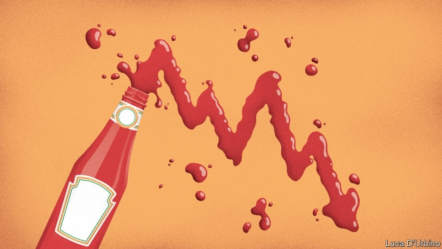

###### An accident with the ketchup

# Kraft Heinz and its investors taste the food industry’s woes 

##### 3G Capital’s problem with its famous brands 

 

> Feb 28th 2019 

THIS WAS supposed to be the quarter that Kraft Heinz showed America’s huge, struggling food companies a new model for success. A merger in 2015 had joined two of the world’s most iconic food makers. Backed by 3G Capital, a private-equity firm, the new group slashed costs at a pace that made rivals shudder and investors swoon. After a failed bid in 2017 for Unilever, an Anglo-Dutch giant, Kraft Heinz set out to prove it could not just cut fat but boost sales on its own. Bernardo Hees, the company’s boss, pointed cheerfully to new products, including Heinz Mayochup and something called Just Crack an Egg. The company was on the path to “sustainable, profitable growth”, he declared in November. Unfortunately, it wasn’t. 

On February 21st Kraft Heinz announced a staggering $15bn impairment, a dividend cut of more than 30% and an inquiry into its procurement by the Securities and Exchange Commission (SEC). Earnings calls are often sleepy affairs. This one was a nightmare. Some of 3G’s long-time critics are now clucking with satisfaction. Others fear 3G is tarnishing American treasures such as Kraft Macaroni and Cheese and Warren Buffett, who partnered with 3G to combine Heinz and Kraft and last year lost nearly $3bn on the deal. Yet dramatic as Kraft Heinz’s decline may seem, 3G’s impact and the food industry’s problems extend far beyond it. 

While its founders are Brazilian, 3G’s buyout business is based in Manhattan. (Its most famous founder, Jorge Paulo Lemann, lives in Switzerland.) Unlike many big private-equity firms, 3G’s main investors are not pension funds but family offices and individuals, including its partners. It does not have a wide portfolio, but backs just two companies: Kraft Heinz and Restaurant Brands International (RBI). Blackstone, a private-equity firm based a few blocks away, has nearly 2,500 staff. 3G’s New York office has fewer than two dozen. Yet 3G’s leaders have rocked the consumer industry like few investors in history. 

All buyout firms are thirsty for deals, but 3G is uniquely parched. Before starting 3G, the firm’s founders went on a beer-buying spree that culminated in 2016 with Anheuser-Busch InBev’s purchase of SAB Miller for more than $100bn. AB InBev, in which 3G’s partners have a large stake, now brews more than one in four of the world’s beers. Kraft Heinz counts Kraft cheese, Heinz Ketchup, Jell-O, Philadelphia Cream Cheese and Oscar Mayer among its holdings. RBI includes Burger King, Popeyes, a fried-chicken restaurant, and Tim Hortons, a popular Canadian chain. 

The way 3G runs companies is as notable as its appetite for buying them. In a practice called zero-based budgeting, managers must justify their expenses anew each year. The idea is to expand margins continuously. Overseeing this are managers chosen for their talent and work ethic, rather than mere experience. Daniel Schwartz, a 3G partner, became the chief executive of Burger King at 32. Mr Hees, a 3G partner who spent more than a decade working for a Latin American railroad, became Kraft Heinz’s boss at 45. David Knopf, its chief financial officer, assumed his position in 2017 at 29. 

To 3G’s detractors, this all seems a bit mad. The company’s strategy can be caricatured as follows: buy a big business, cut costs, repeat. This is not entirely fair. RBI has invested in marketing Burger King, winning prizes for its ads. AB InBev is working to boost its sales, for instance by pushing higher-priced beers and deploying best practices across its vast geography. 

But buying big companies and slashing costs remain 3G’s speciality. The risks of that strategy have become clear. RBI struggled to integrate franchisees at Tim Hortons. AB InBev last year said it would slash its dividend by half. 

Nowhere has 3G’s approach played out more tumultuously than at Kraft Heinz. America’s food industry seemed the perfect target, with flabby companies and powerful brands. Rare is the American who has not slurped Kool-Aid or downed an Oscar Mayer hot dog smothered in Heinz Ketchup. 3G reckoned the brands were strong enough to withstand large cuts. As it turns out, they were not. 

This was not the same for AB InBev, which despite abysmal results in America, has little beer competition from in-store brands, is rarely sold online and faces ample growth abroad. Kraft Heinz’s business, by comparison, is concentrated in America, where the food industry is being turned on its head. It brands may be familiar, but that does not make them popular. Small firms are offering healthier options, taking advantage of cheap digital marketing and nimble contract manufacturers. The smallest 20,000 packaged goods players account for about half the industry’s growth, according to Nielsen, a research firm. 

Meanwhile, the rise of e-commerce and European discount grocers has put pressure on food retailers, which are in turn squeezing food companies. Stores led by Walmart are using extensive data to launch their own, increasingly sophisticated, low-cost private label goods, all the while pushing companies to lower their prices. 

Things started well for Kraft Heinz. Its operating profit margin surged from 15% in 2014 to 24% in 2017. The first big setback came that year when Paul Polman, then Unilever’s boss, rebuffed the company’s $143bn courtship. (Unilever, wisely, has devoted growing attention not to food but to beauty and household products.) Without his megadeal, Mr Hees turned to the basic work of lifting sales by pouring more money into advertising, product innovation and Kraft Heinz’s sales force, but that ate into profits. 

Equally striking is the company’s new $15bn impairment, a recognition that the value of giant brands has shrivelled. Mr Buffett says that he misjudged the worth of Kraft’s stable of products (see article). “The management team entered into this merger with the assumption they could cut the spending needed to maintain brands, let alone help them grow,” says Robert Moskow of Credit Suisse, a bank. “The world changed on them—retailers changed and consumers changed.” 

Flawed though 3G’s approach may seem, few food companies offer a successful alternative. Companies have tried to evolve by buying smaller firms, often at lofty prices and with mixed results. For instance Campbell Soup bought Bolthouse Farms, a maker of fruity drinks, in 2012, but is now trying to sell it. Last year it bought Snyder’s-Lance, a pretzel and popcorn company, to boost its snacks business. Its debt level has risen accordingly. Indeed, shopping sprees at Campbell, ConAgra and General Mills have made those companies more levered than Kraft Heinz, according to Sanford C Bernstein, a research firm. 

Kraft Heinz now wants to shrink to grow: it plans divestments over the next 18 months to improve its balance sheet so it can make other, big deals. But the SEC’s subpoena suggests that some internal processes might be unravelling as managers struggle to meet bold goals. The notion that big deals will save American food firms looks increasingly dubious. In 2014, before Heinz bought Kraft, the combined gross operating profits of the companies were about $6.5bn. Now, due in part to some problems beyond its control, Kraft Heinz expects its 2019 profits to be about the same. 

-- 

 单词注释:

1.ketchup['ketʃәp]:n. 蕃茄酱 

2.kraft[krɑ:ft]:n. 牛皮纸 

3.heinz[]:n. 海因茨（姓氏）；亨氏食品公司（世界著名的食品供应商, 主要产品包括调味品和餐食两大类） 

4.investor[in'vestә]:n. 投资者 [经] 投资者 

5.woe[wәu]:n. 悲哀, 悲痛, 苦痛 

6.merger['mә:dʒә]:n. 合并, 归并 [经] 购并 

7.iconic[ai'kɔnik]:[计] 图标的 

8.maker['meikә]:n. 制造者, 上帝 [经] 制造者, 出票人 

9.slash[slæʃ]:v. 猛砍, 乱砍 n. 猛砍, 乱砍, 删减 [计] 斜线 

10.shudder['ʃʌdә]:n. 战栗, 发抖 vi. 战栗, 发抖 

11.swoon[swu:n]:n. 昏晕, 晕厥 vi. 昏晕, 着迷, 渐渐消失 

12.Unilever[]:n. 联合利华（财富500强公司之一, 总部位于荷兰和英国, 主要经营食品和洗涤用品） 

13.Bernardo[]:伯纳多（人名） 

14.hee[]:abbr. 家庭娱乐引擎（Home Entertainment Engine）；高情绪表达（High Expressed Emotion）；韩依依（服装品牌） 

15.cheerfully['tʃiәfuli]:adv. 高高兴兴地 

16.sustainable[sә'steinәbl]:a. 足可支撑的, 养得起的, 可以忍受的 

17.stagger['stægә]:n. 蹒跚, 踌躇 vi. 蹒跚, 犹豫 vt. 使摇摆, 使踌躇, 交错, 错开 a. 交错的, 错开的 

18.impairment[im'peәmәnt]:n. 削弱, 减少, 损害, 损伤, 危害 [计] 减损 

19.dividend['dividend]:n. 被除数, 股利 [计] 被除数 

20.procurement[prә'kjuәmәnt]:n. 获得 [经] 采购 

21.SEC[sek]:[计] 秒, 辅助 [化] 尺寸排阻色谱法 

22.earning['ә:niŋ]:n. 收入（earn的现在分词） 

23.nightmare['naitmєә]:n. 梦魇, 恶梦, 可怕的事物(或情景、人物) [医] 梦魇, 恶梦 

24.cluck[klʌk]:n. 咯咯的叫声 v. 咯咯叫 

25.tarnish['tɑ:niʃ]:n. 失泽, 失泽膜, 污点 vt. 使失去光泽, 玷污 vi. 失去光泽, 被玷污 

26.macaroni[.mækә'rәuni]:n. 通心面, 纨绔子弟 

27.warren['wɒrәn]:n. 养兔场, 拥挤的地区 

28.buffett['bʌfit]: [人名] 巴菲特 

29.founder['faundә]:n. 创立者, 建立者 vt. 使沉没, 使摔倒, 弄跛, 浸水, 破坏 vi. 沉没, 摔到, 变跛, 倒塌, 失败 

30.Brazilian[brә'ziljәn]:n. 巴西人 a. 巴西的, 巴西人的 

31.buyout[ˈbaɪaʊt]:n. 全部买下; 买下（公司或产业） 

32.Manhattan[mæn'hætәn]:n. 曼哈顿 

33.jorge[]:n. 豪尔赫（男子名） 

34.paulo[]:n. 保罗（男子名） 

35.lemann[]: [人名] 莱曼 

36.portfolio[pɒ:t'fәuliәu]:n. 皮包, 公文包, 部长职务, 有价证券财产目录, 艺术代表作选辑 [法] 公文包, 文件夹, 阁员职务 

37.RBI[,ɑ:bi:'ai,'ribi]:abbr.[棒球] Run Batted In ,打点 

38.Blackstone[]:n. 百仕通集团（即黑石集团, 全球最大私募基金公司）；布莱克斯通（英国前文化部长）；黑石镇（美国马萨诸塞州的一个镇） 

39.york[jɔ:k]:n. 约克郡；约克王朝 

40.uniquely[]:adv. 独特地；珍奇地 

41.parch[pɑ:tʃ]:vt. 烤, 烘, 使干透 vi. 烤干, 焦干 

42.spree[spri:]:n. 戏耍, 喧闹, 宴会, 狂饮 vi. 狂欢, 狂饮 

43.culminate['kʌlmineit]:vi. 到绝顶, 达于极点, 达到高潮 vt. 使到绝顶, 使达到高潮 

44.sab[]:abbr. Sabbath 安息日; sabbatical 安息日的; soprano, alto, baritone 女高音; special assessment bond 特别评估债券 

45.miller['milә]:n. 厂主, 蛾 [机] 铣床 

46.ab[æb]:prep. 从, 自 [计] 地址总线 

47.inbev[]:[网络] 英博；英博啤酒集团；英博集团 

48.brew[bru:]:n. 酿造酒, 酝酿 v. 酿造, 酝酿 

49.ketchup['ketʃәp]:n. 蕃茄酱 

50.Philadelphia[.filә'delfjә]:n. 费城 

51.Oscar['ɔskә]:n. 奥斯卡金像奖, 钱, 现金 

52.mayer['meiә]:[医] 迈尔(热容单位) 

53.holding['hәuldiŋ]:n. 把持, 支持, 保持 [法] 租借地, 占有物, 拥有的财产 

54.burger['bә:ɡә]:n. 汉堡包（等于hamburger） 

55.Popeye['pɔpai]:n. 凸出的眼睛,突眼 

56.tim[tim]:n. 蒂姆（男子名） 

57.Horton[]:n. 荷顿奇遇记（美国喜剧动画电影名） 

58.notable['nәutәbl]:n. 著名人士, 值得注意之事物 a. 值得注意的, 显著的 

59.budgeting[]:[计] 预定, 预算 [经] 预算编制 

60.anew[ә'nju:]:adv. 重新, 再 

61.continuously[kәn'tinjuәsli]:adv. 不断地, 连续地 [电] 连续地 

62.oversee[.әuvә'si:]:vt. 向下看, 了望, 监督, 偷看到 [法] 监察, 监督, 俯瞰 

63.ethic['eθik]:n. 道德规范, 伦理 

64.daniel['dænjәl]:n. 丹尼尔（男子名） 

65.schwartz[ʃwɑ:ts]:n. 施瓦兹（姓氏）；史华兹（姓氏） 

66.david['deivid]:n. 大卫；戴维（男子名） 

67.Knopf[]:n. (Knopf)人名；(德、瑞典、捷)克诺普夫；(英)克诺夫 

68.detractor[di'træktә(r)]:n. 毁损者, 贬低者 

69.caricature['kærikәtʃә]:n. 讽刺画, 漫画, 漫画手法 vt. 画成漫画讽刺 

70.entirely[in'taiәli]:adv. 完全, 全然, 一概 

71.marketing['mɑ:kitiŋ]:n. 行销, 买卖 [经] 推销, 在市场买卖, 销售 

72.deploy[di'plɒi]:v. 展开, 配置 

73.franchisee[.fræntʃai'zi:]:n. 有代销权的人(或团体) [经] 特许证持有人 

74.tumultuously[tju:'mʌltʃʊəslɪ]:adv. 骚乱地, 喧闹地 

75.flabby['flæbi]:a. 软弱的, 没气力的, 不稳的, 松弛的 

76.slurp[slә:p]:n. 吃的声音 v. 出声地吃(或喝) 

77.smother['smʌðә]:vt. 使喘不过气, 使窒息, 闷熄, 忍住, 抑制, 覆盖 vi. 窒息, 被抑制 n. 浓烟, 窒息状态, 杂乱无章 

78.reckon['rekәn]:vt. 计算, 总计, 估计, 认为, 猜想 vi. 数, 计算, 估计, 依赖, 料想 

79.abysmal[ә'bizmәl]:a. 深不可测的, 无底的 

80.online[]:[计] 联机 

81.nimble['nimbl]:a. 敏捷的, 伶俐的, 聪明的 

82.nielsen[]:n. 尼耳森（人名） 

83.retailer['ri:teilә]:n. 零售商人, 传播的人 [经] 零售商 

84.walmart['wɔlma:t]: 沃尔玛（世界连锁零售企业） 

85.datum['deitәm]:n. 论据, 材料, 资料, 已知数 [医] 材料, 资料, 论据 

86.sophisticate[sә'fistikeit]:n. 久经世故的人, 精于...之道的人 vt. 篡改, 曲解, 使变得世故, 掺合, 弄复杂 vi. 诡辩 

87.surge[sә:dʒ]:n. 巨涌, 汹涌, 澎湃 vi. 汹涌, 澎湃, 颠簸, 猛冲, 突然放松 vt. 使汹涌奔腾, 急放 [计] 电压尖峰 

88.setback['setbæk]:n. 挫折, 退步, 逆流 

89.paul[pɔ:l]:n. 保罗（男子名） 

90.polman[]: [人名] 波尔曼 

91.rebuff[ri'bʌf]:n. 断然拒绝, 严厉拒绝, 漠不关心 vt. 严厉拒绝 

92.courtship['kɒ:tʃip]:n. 求爱, 求婚, 求爱时期 

93.wisely['waizli]:adv. 聪明地, 精明地 

94.megadeal[meɡə'dɪəl]:n. 特大交易 

95.advertising['ædvәtaiziŋ]:n. 广告业, 广告 a. 广告的 [计] 发广告 

96.innovation[.inәu'veiʃәn]:n. 改革, 创新 [法] 创新, 改革, 刷新 

97.equally['i:kwәli]:adv. 相等地, 同样地, 平等地 

98.shrivel['ʃrivl]:v. (使)起皱纹, (使)枯萎, (使)束手无策 

99.misjudge[mis'dʒʌdʒ]:v. 判断错 

100.Robert['rɔbәt]:[法] 警察 

101.moskow[]: [人名] 莫斯科 

102.Suisse[swi:s]:<法> = Switzerland 

103.flaw[flɒ:]:n. 缺点, 裂纹, 瑕疵, 一阵狂风 [化] 划痕; 裂缝; 裂纹 

104.lofty['lɒfti]:a. 高的, 傲慢的, 崇高的, 高级的, 玄虚的 

105.campbell['kæmbl]:n. 坎贝尔（姓氏） 

106.fruity['fru:ti]:a. 水果的, 有果味的, 有(低级)趣味的, 圆润的 

107.pretzel['pretsәl]:n. 椒盐卷饼, (美)(非正式)法国号 

108.conagra[]: 康尼格拉公司总部所在地：美国主要业务：食品 

109.sanford['sænfәd]:n. 桑福德（男子名） 

110.C[si:]:[计] 调用, 访问, 呼叫；电容, 进位, 通道, 字符, 清除, 常数, 控制, 周期；C 程序设计语言 [化] 碳的化学符号; 胞苷 

111.Bernstein[bә:n'stein]:[德]琥珀, 伯恩斯坦(姓氏) 

112.divestment[dai'vestmәnt,di-]:n. (=divesfiture) 剥夺, 夺取 

113.subpoena[sәb'pi:nә]:n. 传票 vt. 传审, 传唤 

114.unravel[.ʌn'rævl]:vt. 阐明, 解决, 解开 vi. 散开 

115.dubious['dju:biәs]:a. 可疑的, 不确定的 

