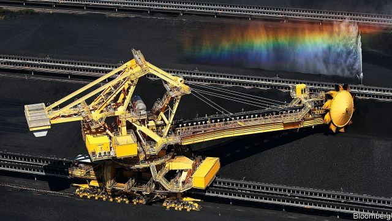

###### The dangerous dark stuff

# Troubling signs for the future of Australia’s giant coal industry 

##### An uncertain future 

 

> Mar 2nd 2019 

COAL HAS been king in Australia ever since British colonists first spotted the black stuff in coastal cliffs north of Sydney in the 1790s. Its grand epoch may finally be fading. China, Australia’s second-biggest coal customer, after Japan, was reported on February 21st to have imposed delays on coal imports from Australia at the northern port of Dalian, but not on those from other countries. A day earlier Glencore, a Swiss-based company and Australia’s biggest coal miner, announced it would cap coal production at current levels. And, for the first time, an Australian judge has refused to allow a new coal mine because it would have contributed to climate change. 

The events have intensified a debate over coal’s future in Australia. Already, coal risked being enveloped in political battles over Australia’s climate policy and the economy’s reliance on China, the country’s biggest trading partner. Mining companies must increasingly grapple with not just green protesters but anxious banks, under pressure from investors to limit financing for new, polluting projects. Some big miners brush off any threat. “It is way too early for us to think that this is some turning point,” says Andrew Mackenzie, the chief executive of BHP, a giant miner based in Melbourne. 

Coal is forecast to be Australia’s top export by value this year and the industry’s most immediate concern is the status of shipments to China. The delay on shipments has left Australian officials scrambling for explanations. Some recent Australian political decisions affecting China have displeased Beijing. Citing security concerns, Australia last year banned Huawei, a Chinese technology company, from building Australia’s 5G mobile network. 

Simon Birmingham, Australia’s trade minister, dismisses as “conspiracy theories” arguments that China’s coal suspension is payback for that. Michael Roche, a consultant in Queensland, a state that supplies China with much coking coal, which is used to make steel, disagrees. He believes China is targeting Australia: “It is letting us know, ‘We can hurt you’.” 

Miners hope that any delays with China will be temporary. The industry’s environmental problems, however, will not be. Climate concerns have infused Australian coal’s other recent shocks. On February 8th Brian Preston, chief judge of the New South Wales Land and Environment Court, banned a bid by Gloucester Resources to mine 21m tonnes of coal over 16 years near the country town of Gloucester. Among the mine’s “adverse impacts” the judge listed greenhouse gases that would contribute to climate change. Notably, the mine was to produce coking coal and not thermal coal for power plants. BHP’s Mr Mackenzie reckons the decision is unlikely to have a broad impact. “People will realise the rank stupidity of preventing a development in Australia only to find it’s replaced elsewhere with dirtier coal,” he says. But the idea that concerns over climate change could limit not just mines producing thermal coal but coking coal too is new, with the potential for broad reverberations. 

Though Glencore is not abandoning coal, it is steering investment towards commodities such as cobalt, copper and nickel, which underpin a lot of the transition to renewable energy. It is doing so after pressure from Climate Action 100+, a group whose affiliates include several Australian pension funds that want to support cleaner energy. They may put pressure on Glencore to cut coal production in future. Urged along by its investors, BHP has pressed Australia’s mining lobby to revise its position on energy policy. BHP itself, however, retains two thermal coal mines, including one in Australia. 

In the long term Australia’s coal industry may see a bifurcation, as exports rise for coking coal, which is crucial for the production of steel, and slump for thermal coal. Already, banks are limiting the amount of finance they make available for coal projects. Australia’s banks have also declined to underwrite a controversial plan by Adani, a firm based in the Indian state of Gujarat, to build what was once billed as Australia’s biggest thermal coal mine in the untapped Galilee Basin in northern Queensland. 

David Lennox, an analyst in Sydney, thinks “significant investment” in new coal mines will diminish over the next 30 years. Firms providing capital, he reckons, will see growth in gas and renewable-energy projects providing better returns “because they won’t have people protesting about them”. The Clean Energy Council, an industry body, cites investment of A$20bn ($14.3bn) in 83 renewable-energy projects already under way in Australia; a figure that has doubled since late 2017. 

However, the transition from coal to cleaner fuels may be slower than in other countries, because of the industry’s scale. Scott Morrison, prime minister in the conservative coalition government, gave a speech on climate change on February 25th, which he hopes will boost his political fortunes in an election due in May. But he did not mention coal at all. Mr Morrison has openly championed coal. When he was Treasurer two years ago, he waved a lump of it in parliament and declared: “This is coal. Don’t be afraid.” Perhaps he now is. 

-- 

 单词注释:

1.colonist['kɒlәnist]:n. 殖民地居民, 移民 

2.coastal['kәustәl]:a. 海岸的, 沿海的, 沿岸的 [法] 海岸的, 沿海的 

3.sydney['sidni]:n. 悉尼（澳大利亚港市） 

4.epoch['i:pɒk]:n. 新纪元, 时代, 时期 

5.dalian['dɑ:ljәn]:大连 

6.Glencore[]:[网络] 嘉能可；交易商嘉能可；嘉能可公司 

7.intensify[in'tensifai]:vt. 加强 vi. 强化 

8.envelop[in'velәp]:vt. 包封, 遮盖, 包围 n. 信封 

9.grapple[græpl]:v. 抓住, 掌握 n. 抓住, 系紧, 掌握, 与...扭打 

10.protester[]:n. 抗议者, 持异议者, 拒付者 [经] 反对者 

11.investor[in'vestә]:n. 投资者 [经] 投资者 

12.andrew['ændru:]:n. 安德鲁（男子名） 

13.mackenzie[]:n. 麦肯齐河（又译“马更些河”, 加拿大西北部河流）；麦肯齐区（又译“马更些区”, 加拿大西北部的小区）；麦肯齐氏 

14.bhp[]:abbr. [军]制动马力（Brake Horse Power） 

15.Melbourne['melbәn]:n. 墨尔本 

16.statu[]:[网络] 状态查看；雕像；特级雪花白 

17.shipment['ʃipmәnt]:n. 装船, 出货 [经] 运送, 运送(寄出)货物, 装载 

18.scramble['skræmbl]:n. 攀缘, 爬行, 抢夺, 混乱, 紧急起飞 vi. 攀缘, 杂乱蔓延, 争夺, 拼凑, 匆忙 vt. 攀登, 扰乱, 使混杂 

19.cite[sait]:vt. 引用, 引证, 表彰 [建] 引证, 指引 

20.huawei[]: 华为 

21.simon['saimәn]:n. 西蒙（男子名） 

22.Birmingham['bә:miŋәm]:n. 伯明翰 

23.conspiracy[kәn'spirәsi]:n. 同谋, 阴谋, 阴谋集团 [法] 阴谋, 通谋, 共谋 

24.payback[]:[经] 报酬率 

25.michael['maikl]:n. 迈克尔（男子名） 

26.roche[]:n. 瑞士罗氏（制药企业） 

27.Queensland['kwi:nzlәnd]:[经] 昆士兰 

28.environmental[in.vaiәrәn'mentәl]:a. 周围的, 环境的 [经] 环境的, 环保的 

29.infuse[in'fju:z]:vt. 注入, 使充满, 泡制, 鼓舞 vi. 泡 

30.brian['braiәn]:n. 布莱恩（男子名） 

31.preston['prestәn]:n. 普勒斯顿（男子名；英国港市名字） 

32.wale[weil]:n. 隆起的伤痕, 鞭痕, 凸条纹, 精华, 选择 vt. 在...上留下鞭痕, 织成棱纹, 挑选, 撑住 vi. 挑选 

33.gloucester['^lɔstә]:n. 格洛斯特（英国西南部的港市）；格洛斯特硬干酪（产于英国） 

34.tonne[tʌn]:n. 吨, 公吨 [经] 吨 

35.adverse['ædvә:s]:a. 不利的, 敌对的, 相反的, 逆的 [法] 相反的, 敌对的, 逆的 

36.notably['nәjtbәli]:adv. 显著地, 著名地, 尤其, 特别 

37.thermal['θә:ml]:a. 热的, 热量的, 温泉的 n. 上升温暖气流 

38.reckon['rekәn]:vt. 计算, 总计, 估计, 认为, 猜想 vi. 数, 计算, 估计, 依赖, 料想 

39.stupidity[stju:'piditi]:n. 愚蠢, 糊涂事 [医] 迟钝 

40.reverberation[ri.vә:bә'reiʃәn]:n. 反响, 混响, 反射 [电] 交混回响 

41.commodity[kә'mɒditi]:n. 农产品, 商品, 有用的物品 [经] 商品, 货物, 日用品 

42.cobalt['kәubɒ:lt]:n. 钴, 钴类颜料 [化] 钴Co 

43.nickel['nikl]:n. 镍, 镍币, 五分镍币 vt. 镀镍于 

44.underpin[.ʌndә'pin]:vt. 从下面支承, 支撑, 支持 [经] 支撑 

45.transition[træn'ziʃәn]:n. 转变, 转换, 变迁, 过渡时期, 临时转调 [化] 跃迁 

46.renewable[ri'nju(:)әbl]:a. 可更新的, 可恢复的, 可继续的, 可换新的, 可重复的, 可重说的 [计] 可更新, 可再生的 

47.affiliate[ә'filieit]:vt. 使紧密联系, 使附属, 接纳, 收养 vi. 发生联系, 参加 

48.lobby['lɒbi]:n. 大厅, 休息室, 游说议员者 vi. 游说议员, 游说 vt. 游说 

49.bifurcation[.baifә'keiʃәn]:n. 双叉, 分叉, 分歧, 分歧点 [计] 双态; 分叉 

50.slump[slʌmp]:n. 暴跌, 垂头弯腰的姿态 vi. 猛然掉落, 陷入, 衰落(经济等) 

51.underwrite['ʌndәrait]:vt. 签名于下, 给...保险 vi. 经营保险业 

52.Adani[]:[地名] 阿达尼 ( 尼日利 ) 

53.Gujarat[,ɡu:dʒe'rɑ:t]:n. 古吉拉特邦（印度西部的邦） 

54.untap[]:abbr. United Nations Technical Assistance Programme 联合国技术援助计划 

55.galilee['^ælә,li]:n. 加利利（巴勒斯坦北部一多山地区）；西端入口处的门廊（中古英国教堂） 

56.david['deivid]:n. 大卫；戴维（男子名） 

57.Lennox[]:伦诺克斯（人名、地名） 

58.analyst['ænәlist]:n. 分析者, 精神分析学家 [化] 分析员; 化验员 

59.diminish[di'miniʃ]:v. (使)减少, (使)变小 

60.scott[skɔt]:n. 斯科特（男子名） 

61.morrison['mɔrisn]:n. 莫里森（姓氏） 

62.coalition[.kәuә'liʃәn]:n. 结合体, 结合, 联合 [经] 联合, 联盟 

63.openly['әjpәnli]:adv. 公开地, 坦率地, 直率地, 公然地 

64.treasurer['treʒәrә]:n. 会计, 出纳员, 司库 [经] 司库, 财务主任, 财政大臣 

