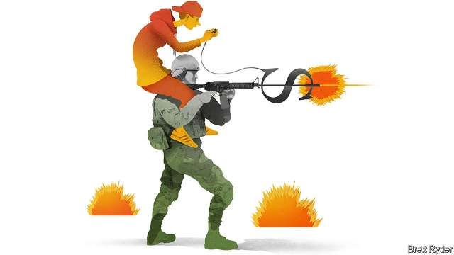

###### Schumpeter

# Video gamers v couch potatoes 

##### Business has a lot to learn from trigger-happy teens in their bedrooms 

 

> Mar 2nd 2019 

IF READERS, LIKE Schumpeter, have children who barely have time to say hello as they hunch over a computer, headsets on, talking with friends while blasting their digital enemies to smithereens, here is some advice. Take them to a competitive video-gaming, or e-sports, tournament, like the Counterstrike: Global Offensive (CS:GO) “major” in Katowice, Poland, this weekend. It is an orgy of creative destruction—in the glorious, goriest sense. 

Amid the razzmatazz and cosplay, it may not feel like a potent threat to mainstream entertainment. The Spodek, a Soviet-era arena shaped like a flying saucer in the heart of Katowice, only seats 11,500. But that is deceptive. The action takes place online as well as in the stadium. Fans are obsessed by the fierce strategising and skill behind teams shooting each other, throwing digital grenades and setting off bombs. As many CS:GO fanatics will watch the final as boxing fans watch a title fight. The biggest e-sports game, League of Legends, achieved more than 100m online viewers for a final last year, mostly Chinese. That is more than the number of Americans who watch the Superbowl. 

Most compelling for fans, though, is the ecosystem around e-sports. CS:GO fans are also CS:GO gamers. They discuss the tournaments with their CS:GO teammates. They stream games on Amazon’s Twitch, listen to CS:GO “casters” (commentators) on YouTube, and go behind the scenes with—and even tip—their favourite players. It is an adrenalin-filled corollary to social media. The intense, year-round relationship between e-sports and its fan base should strike fear into the heart of the sports and entertainment industries whose core audiences are ageing fast. Trigger-happy 15-35 year-olds are literally calling the shots. They have the dependable era of the couch-potato in their sights. 

The line between e-sports and video gaming is blurry. Gaming long ago vaulted from the bedroom to big business. Its global revenues, estimated at almost $150bn this year, rival those of traditional sports. In America last year, the industry earned as much as Hollywood. E-sports is professional gaming, which builds on the huge popularity of competitive gaming among amateurs. Newzoo, a consultancy, says its revenues will exceed $1bn for the first time this year, mostly from media rights, advertising and sponsorship. That is just $5.45 per serious fan. Yet already the smart money has caught the sweet smell of digital disruption. 

Take Team Liquid, a Los Angeles-based outfit that is one of the hottest teams in Katowice. A few years ago, its CS:GO manager, Steve Perino, earned $500 a month, and would lie to people about his job because it was too obscure. His players, self-taught in their bedrooms, had exceptional talent but were sullen and insecure. Then they hit the big time. Liquid now has teams spanning 14 different video games, each with its own fan base (similar to, say, soccer and basketball). Its financial backers include Michael Jordan, a basketball legend, Peter Guber, a film and baseball mogul, and David Rubenstein, a private-equity bigshot, giving it a valuation estimated by Forbes last year at $200m. It has a plush training facility, including chef and psychologist, and its CS:GO team spent 11 days at a “boot camp” in the Netherlands preparing for Katowice, counselled by a champion poker player. Mr Perino now makes sure his five team members build upbeat personal brands, to keep advertisers and sponsors like Honda happy. When Mr Guber invited the team to his palatial home in January to celebrate a big win, the penny dropped. “Holy shit, we’ve made it,” Mr Perino says. 

E-sports teams are striving to become not only more professional, but more profitable. Riot Games, owned by China’s Tencent, which publishes League of Legends, last year revamped a North American league, in which teams bought slots for $10m from which they cannot be relegated. Similar to the National Basketball Association, such leagues attract sponsors and guarantee teams a steady income. The cash prizes from tournaments are huge: $150m in total last year. In Europe, teams do not command the same lofty valuations as their American peers, says Nikolaj Nyholm, founder of RFRSH, owner of Astralis, the Danish world champions of CS:GO. But Astralis is increasing revenues by directly cultivating its fan base. In China six cities are vying to be hubs of e-sports (though a government crackdown on gaming has hurt). In South Korea, where e-sports first became a craze, it has matured. The best players are marketing machines. One Russian advertises Head & Shoulders—surely a useful product for gamers. 

E-sports has picked up a lot from mainstream sports and entertainment. But those industries ignore its advance at their peril. The first lesson is engagement. E-sports “athletes” have direct contact with their fans, via Twitch, YouTube and social media, streaming to them live via webcams to their bedrooms. That creates a more intimate relationship than most fans have with stars. The second is global reach. Team Liquid transmits to its Brazilian fans in Portuguese, and its Chinese fans in Mandarin. Victor Goossens, who founded the team in his teens, revels in being a “citizen of nowhere,” rather than being tied to a home-town club. That broadens the appeal. The third is experimentation. Fortnite, a gaming sensation, is combining e-sports with entertainment. In February a game hosted by Marshmello, a DJ, attracted 10.7m viewers. 

The competition is pricking up its ears. Sports teams with dwindling numbers of young fans are investing in e-sports. Traditional broadcasters, like Disney and ESPN, have purchased media rights. Netflix’s recent interactive film, Bandersnatch, targeted gamers. Incumbents may hope that a sport steeped in bloodshed will have limited mainstream appeal for advertisers (not to mention parents). But instead they should seize on the appeal of high-intensity engagement, rather like Sanquin, a Dutch blood bank that niftily sponsored a League of Legends killfest. Otherwise its hashtag #MyFirstBlood could be their epitaph. 

-- 

 单词注释:

1.Schumpeter[]:n. 熊彼特（美籍奥匈帝国经济学家, 当代资产阶级经济学代表人物之一） 

2.gamer['ɡeimә]:n. 玩家, 博弈者 

3.V[vi:]:[计] 溢出, 变量, 向量, 检验, 虚拟, 垂直 [医] 钒(23号元素) 

4.couch[kautʃ]:n. 长沙发, 睡椅, 卧榻 vt. 横躺, 表达 vi. 躺下, 蹲伏 

5.teen[ti:n]:n. 愤怒, 悲哀 

6.hunch[hʌntʃ]:n. 肉峰, 预感, 大块 vt. 弯腰驼背, 预感到, 耸肩 vi. 向前移动, 隆起 

7.headset['hedset]:n. (一副)耳机 [电] 头载机组 

8.smithereen[,smiðә'ri:n]:vt.把…击碎,把…炸成碎片 

9.offensive[ә'fensiv]:a. 令人不快的, 侮辱的, 攻击性的 [法] 攻击的, 进攻的, 冒犯的 

10.katowice[,kɑ:tɔ:'vi:tse]:n. 卡托维兹（波兰南部一城市） 

11.Poland['pәulәnd]:n. 波兰 

12.orgy['ɔ:dʒi]:n. 无节制, 狂欢, 纵酒宴乐, 放荡 

13.gory['gɒ:ri]:a. 血淋淋的, 满是血的, 血污的 

14.amid[ә'mid]:prep. 在其间, 在其中 [经] 在...中 

15.razzmatazz['ræzmәtæz]:n. 兴奋, 欺人之谈, 狂欢 

16.cosplay[]:abbr. 角色扮演；动漫真人秀（Costume Play） 

17.potent['pәutnt]:a. 有力的, 有说服力的, 有效的 [医] 有力的, 有性交能力的 

18.mainstream['meinstri:m]:n. 主流 

19.spodek[]:[网络] 热门地区；体育场；波德克 

20.arena[ә'ri:nә]:n. 角斗场, 舞台, 场地 [医] 尿沉渣, 尿沙; 脑沙 

21.deceptive[di'septiv]:a. 迷惑的, 虚伪的, 欺诈的 

22.online[]:[计] 联机 

23.obsess[әb'ses]:vt. 迷住, 使困扰 

24.strategising['strætidʒaiz]:strategising vi., vt. strategise的变形 strategise ['strætidʒaiz] vi., vt. [英国英语] = strategize 变形： vi., vt. strategised . strategising 

25.grenade[gri'neid]:n. 手榴弹 

26.fanatic[fә'nætik]:n. 狂热者, 盲信 a. 狂热的, 盲信的 

27.superbowl[]:un. 美国职业橄榄球锦标赛 [网络] 超级碗；超级杯；超级盃 

28.ecosystem['i:kәu.sistәm]:n. 生态系统 [医] 生态系 

29.teammate['ti:mmeit]:n. 队友 

30.twitch[twitʃ]:vi. 急拉, 抽搐, 阵痛 vt. 急拉, 攫取, 抽动 n. 急拉, 抽搐, 阵痛 

31.caster['kæstә. 'kɑ:stә]:n. 投手, (家具的)脚轮, 调味瓶 [机] 后倾角 

32.commentator['kɔmenteitә]:n. 评论员, 实况广播员, 注释者, 时事评论员 

33.youtube[]:n. 视频网站（可以让用户免费上传、观赏、分享视频短片的热门视频共享网站） 

34.corollary[kә'rɒlәri]:n. 必然的结果, 系, 推论 

35.literally['litәrәli]:adv. 逐字地, 按照字面上地, 不夸张地 

36.dependable[di'pendәbl]:a. 可信任的, 可靠的, 可信赖的 

37.blurry['blә:ri]:a. 模糊的, 不清楚的, 污脏的 

38.vault[vɒ:lt]:n. 拱顶, 窖, 地下室, 撑竿跳, 穹窿 vt. 做成圆拱形, 撑竿跳过 vi. 成穹状弯曲, 跳跃 

39.Hollywood['hɔliwud]:n. 好莱坞, 美国电影界, 美国电影工业, 美国式电影 

40.popularity[.pɒpju'læriti]:n. 名声, 受大众欢迎, 流行 

41.consultancy[]:n. 商量, 协商, 磋商, 会诊, 与...商量, 咨询, 请教, 找(医生)看病, 查阅, 考虑 [经] 咨询业务, 咨询服务 

42.advertising['ædvәtaiziŋ]:n. 广告业, 广告 a. 广告的 [计] 发广告 

43.sponsorship['spɔnsәʃip]:n. 发起, 倡议, 主办, 保证人的地位, 教父的地位, 教母的地位 

44.disruption[dis'rʌpʃәn]:n. 分裂, 崩溃, 瓦解 

45.los[lɔ:s]:abbr. 月球轨道航天器（Lunar Orbiter Spacecraft）；视线（Line of Sight） 

46.outfit['autfit]:n. 用具, 配备, 机构 vt. 配备, 供应 vi. 得到装备 

47.steve[]:n. 史蒂夫（男子名） 

48.perino[]:[网络] 佩里诺 

49.exceptional[ik'sepʃәnәl]:a. 例外的, 异常的, 特别的 

50.sullen['sʌlәn]:a. 愠怒的, 沉闷的, 阴沉的 

51.insecure[.insi'kjuә]:a. 不安全的, 不牢靠的, 不坚固的, 不稳定的 

52.backer['bækә]:n. 援助者, 支持者 [经] 背书人, 支持人 

53.michael['maikl]:n. 迈克尔（男子名） 

54.jordan['dʒɒ:dәn]:n. 约旦, 约旦河, 尿壶 

55.peter['pi:tә]:vi. 逐渐消失, 逐渐减少 

56.guber[]: [地名] [波兰] 古贝尔河 

57.mogul[mәu'^ʌl, 'mәu^ʌl]:n. 大人物, 有权势的人 

58.david['deivid]:n. 大卫；戴维（男子名） 

59.rubenstein[]: [人名] 鲁本斯坦 

60.bigshot[]:n. 权贵；大人物 

61.valuation[.vælju'eiʃәn]:n. 评价, 估价, 价值判断 [经] 估价, 计价, 评价 

62.forbes['fɔ:bz, 'fɔ:bis]:n. 福布斯（美国出版及媒体集团）；福布斯（美国著名财经杂志）；福布斯（姓氏） 

63.plush[plʌʃ]:n. 长毛绒, 长毛绒裤 a. 长毛绒制的, 豪华的 

64.psychologist[sai'kɒlәdʒist]:n. 心理学家 [医] 心理学家 

65.Netherlands['neðәlәndz]:n. 荷兰 

66.counsel['kaunsәl]:n. 商议, 忠告, 法律顾问 v. 商议, 劝告 

67.poker['pәukә]:n. 戳的人, 拨火棍, 纸牌戏 vt. 烙制 

68.upbeat['ʌpbi:t]:n. 弱拍, 上升, 兴旺 a. 上升的, 乐观的 

69.advertiser['ædvәtaizә]:n. 做广告者, 广告客户 [经] 广告商, 广告者 

70.honda['hɔndә]:n. 本田汽车公司 

71.palatial[pә'leiʃәl]:a. 宫殿似的, 宏伟的, 堂皇的, 庄严的 

72.shit[ʃit]:vi. 拉屎 vt. 欺骗, 在...拉屎 n. 粪, 屎 interj. 狗屁 

73.strive[straiv]:vi. 努力, 奋斗, 斗争 

74.riot['raiәt]:n. 暴动, 喧闹, 放纵 vi. 发动, 暴动, 纵情, 放荡 vt. 浪费, 挥霍 

75.Tencent[]:[网络] 腾讯；腾讯公司；腾讯控股 

76.revamp[ri:'væmp]:vt. 换新鞋面, 修理, 修补, 修改 [经] 整修, 补, 修改 

77.slot[slɒt]:n. 水沟, 细长孔, 硬币投币口, 缝, 狭槽, 狭通道, 位置, 一档(广播节目等) vt. 开槽于, 把...纳入机构 [计] 槽; 存储槽 

78.cannot['kænɒt]:aux. 无法, 不能 

79.relegate['religeit]:vt. 驱逐, 使降低地位, 把...归类, 把...委托给 [法] 流放, 判流放刑, 驱逐 

80.lofty['lɒfti]:a. 高的, 傲慢的, 崇高的, 高级的, 玄虚的 

81.peer[piә]:n. 同等的人, 匹敌, 贵族 vi. 凝视, 窥视, 费力地看, 隐现 vt. 与...同等, 封为贵族 

82.nikolaj[]:[网络] 尼哥拉依 

83.nyholm[]: [人名] 尼霍姆 

84.founder['faundә]:n. 创立者, 建立者 vt. 使沉没, 使摔倒, 弄跛, 浸水, 破坏 vi. 沉没, 摔到, 变跛, 倒塌, 失败 

85.astralis[]:[网络] 星光园；阿斯特拉里斯；星光园酒 

86.Danish['deiniʃ]:n. 丹麦文 a. 丹麦的, 丹麦人的, 丹麦文的 

87.vie[vai]:vi. 争, 竞争, 争胜 vt. 提出...来竞争, 以...作较量 

88.hub[hʌb]:n. 毂, 木片, 中心 [计] 插座; 插孔; 集线器, 集中器, 连接器, 中继站 

89.crackdown['krækdaun]:n. 制裁, 镇压, 痛击 

90.Korea[kә'riә]:n. 朝鲜, 韩国 

91.craze[kreiz]:n. 狂热, 大流行 v. (使)发狂, (使)开裂 

92.marketing['mɑ:kitiŋ]:n. 行销, 买卖 [经] 推销, 在市场买卖, 销售 

93.peril['peril]:n. 危险, 冒...之险, 险境, 险因 vt. 置...于险境, 冒险, 危及 

94.engagement[in'geidʒdmәnt]:n. 诺言, 约会, 婚约, 交战 [医] 衔接 

95.webcam['webkæm]:n. 网络摄像头 

96.Brazilian[brә'ziljәn]:n. 巴西人 a. 巴西的, 巴西人的 

97.mandarin['mændәrin]:n. 中国官话, 国语, 满清官吏, 柑橘 a. (中国式)紧身马褂的 

98.victor['viktә]:n. 胜利者 a. 胜利的 

99.goossens[]: [人名] 古森斯 

100.revel['revl]:n. 作乐, 狂欢 vi. 狂欢作乐, 陶醉, 着迷 vt. 耗费 

101.broaden['brɒ:dn]:vi. 变宽, 扩大 vt. 放宽, 使扩大 

102.experimentation[eks,perimen'teiʃәn]:n. 实验, 试验, 实验法 [化] 实验; 实验过程 

103.sensation[sen'seiʃәn]:n. 感觉, 轰动 [医] 感觉 

104.DJ[]:n. 唱片流行音乐节目播音员, 唱片骑师 

105.prick[prik]:vt. 刺, 戳, 刺痛, 使竖起 vi. 刺, 竖起 n. 扎, 一刺, 刺痛 a. 竖起的 

106.dwindle['dwindl]:vi. 减少, 缩小, 衰落 vt. 使缩小 

107.broadcaster['brɒ:dkæstә]:n. 播送者, 广播装置, 播种机 

108.Disney['dizni]:n. 迪斯尼 

109.espn[]:abbr. 娱乐体育节目电视网（Entertainment Sports Programming Network）；欧洲儿科肾病学会（European Society for Paediatric Nephrology） 

110.interactive[,intәr'æktiv]:a. 相互作用的, 相互影响的 [计] 交互, 人机对话的 

111.bandersnatch['bændәsnætʃ]:n. 一种想像中的猛兽, 行动粗鲁者 

112.incumbent[in'kʌmbәnt]:a. 现任的, 依靠的, 负有义务的 n. 领圣俸者, 在职者 

113.bloodshed['blʌdʃed]:n. 流血 

114.Dutch[dʌtʃ]:n. 荷兰人, 荷兰语 a. 荷兰的 

115.niftily[]: 俏皮地 

116.hashtag['hæʃtæg]:n. 井号(#)标签（微博twitter中用来标注线索主题的标签） 

117.epitaph['epitɑ:f]:n. 墓志铭, 碑文 

