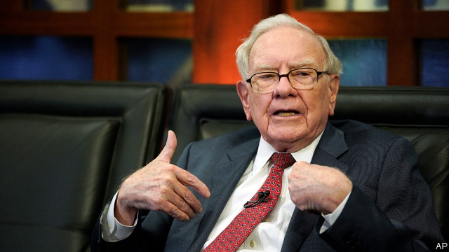
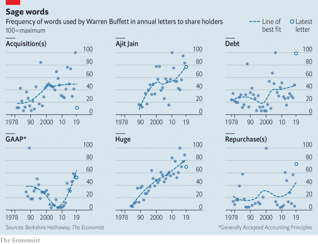

###### Buffettology

# What four decades of correspondence from the Oracle of Omaha reveal 

##### A shifting strategy 

 

> Mar 2nd 2019 

WHEN FUTURE generations want to study today’s capitalists, a good place to start would be Warren Buffett’s annual letters to the shareholders of his firm, Berkshire Hathaway. Unfortunately, any economic insights from the world’s most celebrated investor are woven in with lots of corny jokes about golf and fast food. Mindful that readers may not have the intestinal fortitude to stomach the Oracle of Omaha’s unique sense of humour, The Economist has performed a textual analysis of 40 years’ worth of Mr Buffett’s letters to see what his language reveals about his thinking. 

Berkshire has changed a lot. Having grown considerably in size, Mr Buffett now speaks of “businesses”, rather than “business”. He has also taken to using the adjective “huge” (see chart). The letters track how the firm used to focus on buying small stakes in listed companies; it now buys large, established firms outright. 

This shifting strategy has made it tough for outsiders to value Berkshire properly. On the face of it last year was a pretty dismal one for the company. Berkshire’s book value per share rose by just 0.4%, its worst showing since the financial crisis. Earnings were just $4bn, a meagre 1.2% return on equity. 

 

Mr Buffett contends these figures partly reflect arcane accounting standards which do not cope well with his varied investments. A change in accounting principles forces him to put mark-to-market swings in the value of his $173bn equity portfolio through his earnings, resulting in a $20.6bn loss in 2018. By contrast, the book values of companies Mr Buffett owns outright, an increasing share of his portfolio, are carried at “far below” their current value, making it tough to assess Berkshire’s performance by its annual change in book value. Mr Buffett has moaned about these dynamics a lot. References to America’s Generally Accepted Accounting Principles (GAAP) have soared. 

In other ways, though, Mr Buffett remains consistent. His philosophy has always been to look for cheap companies. He reckons that shares in firms with decent long-term prospects are too pricey at the moment. Instead, Berkshire will focus on buying back its own shares as well as investing in liquid stocks in 2019. Mentions of “repurchases” are on the rise but “acquisition” shows up just three times this year. 

Historically, Mr Buffett has been loth to borrow vast sums of money, arguing that “rational people don’t risk what they have and need for what they don’t have and don’t need”. He made an exception in 2013, when he invested in Kraft Heinz. This was one of Mr Buffett’s biggest mistakes. Shares in Kraft Heinz have plummeted. Berkshire has taken a hit of nearly $3bn to its balance-sheet as a consequence. Mentions of “debt” spiked in this year’s letter. 

The biggest question facing investors in Berkshire is who might replace Mr Buffett, now 88, as leader of the company. His partner, Charlie Munger, turned 95 in January. The two most obvious candidates are Ajit Jain, who is 67, and Greg Abel, 56. They were both appointed to Berkshire’s board last year and got 3 mentions each in Mr Buffett’s letter this year. Mr Buffett claims Berkshire’s blood flows in their veins. In years to come their letters might prove this to be the case—if so, Berkshire’s investors are likely to be happy. Especially if they skip the jokes. 

-- 

 