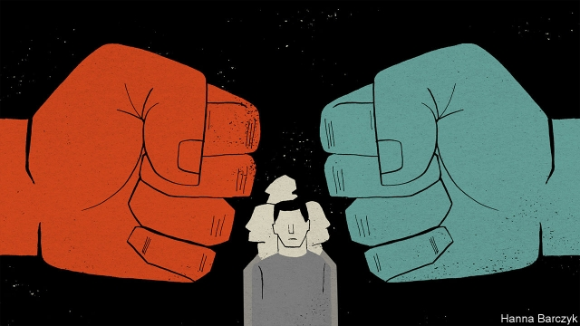

###### Chaguan

# America’s allies are struggling with two bullies 

##### One is Team Trump, but Xi frightens them more 

 

> Feb 28th 2019 

CANADIAN DIPLOMATS in China recently carried out one of their grimmer duties: paying a monthly visit to a former colleague, Michael Kovrig, who is being detained by state security agents. Mr Kovrig, a diplomat for over a decade before joining the International Crisis Group, a conflict-prevention charity, was grabbed off a Beijing street on December 10th. He is being held in a room kept brightly lit at all times, and questioned for up to six hours a day. Granted one consular visit a month, Mr Kovrig may not see his family or hire a lawyer. On this occasion friends gave the consuls messages to read to him (handing over letters is banned). Mr Kovrig, a lover of jazz, the blues and literature—he likes the science fiction of Harlan Ellison—was allowed to receive a book. Though accused of endangering China’s national security, a catch-all offence, Mr Kovrig has not been charged with any crime. 

Mr Kovrig is, in effect, a hostage. He is being held because on December 1st Canada arrested Meng Wanzhou, a senior executive of Huawei, a telecommunications giant, and the daughter of its founder. The action was taken at the request of American prosecutors, who accuse Ms Meng of scheming to sidestep sanctions against Iran. Along with Mr Kovrig, China has detained a second Canadian, Michael Spavor, who runs tours to North Korea. Even the most urbane Chinese officials turn icy when pressed about their treatment of Canada, Chaguan can report. Their line is that China had to respond forcefully to the arrest of Ms Meng. They swat away the idea that Canada is merely following its extradition treaty with America. They give no credit to Canada’s rule of law (Ms Meng is free on bail and living in her handsome Vancouver home). In their telling, Canada made a political choice to please America, while angering China. Now Canada must feel pain, so the next time America asks for such help every ally will think twice. 

The Kovrig case has shaken diplomatic Beijing. China’s agents are reported to have quizzed Mr Kovrig about his years at Canada’s embassy there, when his work—analysing Chinese politics by cultivating official and scholarly contacts—enjoyed diplomatic immunity. A source at another embassy says China’s apparent breach of the Vienna Convention has “frightened” some staff. 

Several diplomats call China’s actions self-defeating. Many governments are reviewing whether to let Huawei help build 5G mobile networks. Some, such as Australia, have already banned the firm. Huawei bosses say that they run a normal private company, and are not beholden to any state. Yet Huawei’s supposed independence is not easy to square with China’s all-out defence of the firm. A Western country reviewing 5G plans was startled to hear Chinese foreign ministry officials call Huawei’s fate a “core” concern. If that wording was deliberate, in theory that ranks Huawei with such vital interests as the status of Taiwan. 

This is a fight bigger than Huawei. The West is really debating whether China can be trusted as a pillar of high-tech globalisation. Decisions about public procurement lie on a spectrum, with easy questions at each extreme. Can a Western army safely buy bootlaces from China? Obviously, yes. Would a Russian firm be hired to rewire the Pentagon? Clearly, no. Whether Huawei should help build 5G networks is a hard question, somewhere in between those two extremes. When cyber-spooks in Britain, say, declare that the technical risks of using Huawei kit can be managed, they mean that 5G switches are more like bootlaces than many realise. For their part, Huawei’s critics in America, led by Vice-President Mike Pence and the secretary of state, Mike Pompeo, stress the risks of entrusting any sensitive infrastructure to any Chinese firm. Put another way, they mean that China is an adversary like Russia. 

Team Trump has casually tossed about some momentous threats. Trump envoys told Poland’s leaders that doing business with Huawei threatens Poles’ dreams of a permanent American troop presence on Polish soil. Mr Pompeo suggested to the Fox Business Network, a television channel, that the use of Chinese telecommunications technology is incompatible with membership of the “Five Eyes” intelligence-sharing group, comprising America, Australia, Britain, Canada and New Zealand. If a country puts Huawei gear into critical information systems, “we won’t be able to share information with them,” Mr Pompeo asserted. Allies hope that is not official policy. One diplomat says that Mr Pompeo’s words took other bits of America’s government by surprise. 

If Mr Pompeo causes surprises, his boss provokes unhappy bewilderment. President Trump has publicly suggested that he might bargain away Ms Meng’s extradition for the right trade deal with China—undermining Canada’s insistence that her fate hinges on the law, not politics. Welcoming Chinese negotiators to the Oval Office on February 22nd, Mr Trump said that a long-mooted executive order outlawing Chinese telecommunications technology from American networks “may or may not” be on the table during trade talks. In Beijing’s leafy embassy districts, diplomats know the conclusion that China would like them to draw, namely that no principles guide American criticisms of Huawei, merely clumsy ambitions to contain China as a technological rival. 

In truth, many countries feel bullied by both China and Team Trump. Diplomats are depressed that hopes of engaging China, for instance in tackling climate change, are being derailed by discussions about Chinese undermining of Western democratic life, rampant state-sponsored commercial espionage and other alleged sins. Across the West, intelligence agencies have gained unusual sway over China policy, says a diplomat, adding that spies bring a distinctive grimness to such debates: “We’re out here walking in the sunlight, those guys move in a darker world.” 

A less aggressive China could easily capitalise on divisions among Western countries over Huawei. Instead China is using fear to pursue its goals. Hence the bleak mood in Beijing embassies. 

-- 

 单词注释:

1.ally['ælai. ә'lai]:n. 同盟者, 同盟国, 助手 vt. 使联盟, 使联合, 使有关系 vi. 结盟 

2.bully['buli]:n. 欺凌弱小者, 土霸 vt. 威胁, 恐吓, 欺负 vi. 欺负 a. 特好的, 第一流的 adv. 十分 

3.trump[trʌmp]:n. 王牌, 法宝, 喇叭 vt. 打出王牌赢, 胜过 vi. 出王牌, 吹喇叭 

4.diplomat['diplәmæt]:n. 外交官, 有外交手腕的人 [法] 外交家, 外交官, 有权谋的人 

5.grim[grim]:a. 冷酷的, 坚强的, 残忍的, 可怕的, 讨厌的 

6.michael['maikl]:n. 迈克尔（男子名） 

7.detain[di'tein]:vt. 扣留, 扣押, 耽搁 [法] 拘留, 扣押, 留住 

8.grab[græb]:n. 抓握, 掠夺, 强占, 东方沿岸帆船 vi. 抓取, 抢去 vt. 攫取, 捕获, 霸占 

9.brightly['braitli]:adv. 生辉地, 明亮地, 鲜明地 

10.consular['kɒnsjulә]:a. 领事的 [经] 领事的 

11.consul['kɒnsәl]:n. 领事, 执政官 [经] 领事 

12.harlan['hɑ:lən]:n. 哈伦（男子名）；哈尔纶聚偏氯乙烯纤维 

13.endanger[in'deindʒә]:vt. 危及 [法] 使危险, 危及 

14.hostage['hɒstidʒ]:n. 人质, 抵押品 [经] 人质, 抵押品 

15.meng[]:abbr. 工程硕士（Master of Engineering） 

16.Wanzhou[]:万州 

17.huawei[]: 华为 

18.telecommunication['telikәmju:ni'keiʃәn]:n. 电讯, 远距离通讯, 无线电通讯 [计] 远程通信, 电信 

19.founder['faundә]:n. 创立者, 建立者 vt. 使沉没, 使摔倒, 弄跛, 浸水, 破坏 vi. 沉没, 摔到, 变跛, 倒塌, 失败 

20.prosecutor['prɒsikju:tә]:n. 实行者, 告发者, 公诉人 [法] 原告, 起诉人, 检举人 

21.sidestep['saidstep]:n. 横跨的一步, 台阶 vt. 横跨一步躲避, 回避 vi. 回避问题, 躲避打击 

22.sanction['sæŋkʃәn]:n. 核准, 制裁, 处罚, 约束力 vt. 制定制裁规则, 认可, 核准, 同意 

23.Iran[i'rɑ:n]:n. 伊朗 

24.Korea[kә'riә]:n. 朝鲜, 韩国 

25.urbane[ә:'bein]:a. 彬彬有礼的 

26.icy['aisi]:a. 冰的, 冰冷的, 冷淡的, 滑溜的 

27.forcefully[]:adv. 激烈地；强有力地；有说服力地 

28.swat[swɒt]:vt. 用力打下去, 重拍 n. 用劲打击, 长打, 全垒打 

29.extradition[.ekstrә'diʃәn]:n. 引渡逃犯, 亡命者送还本国 [法] 引渡 

30.bail[beil]:n. 保释, 拎环, 杓, 栅栏 vt. 保释, 舀水 

31.vancouver[væn'ku:vә]:n. 温哥华（加拿大主要港市） 

32.diplomatic[.diplә'mætik]:a. 外交的, 老练的 [法] 外交的, 外交上的, 文献上的 

33.politic['pɒlitik]:a. 精明的, 明智的, 策略的 

34.scholarly['skɔlәli]:a. 学者派头的, 学者风度的, 有学问的, 博学的, 好学的 

35.immunity[i'mju:niti]:n. 免疫, 免疫性, 免除 [化] 免疫性 

36.breach[bri:tʃ]:n. 裂口, 违背, 破坏, 违反, 突破, 破裂 vt. 攻破, 突破 vi. 跳出水面 

37.Vienna[vi'enә]:n. 维也纳 

38.beholden[bi'hәudәn]:a. 负有义务的, 受惠的 

39.wording['wә:diŋ]:n. 用词, 措词 

40.statu[]:[网络] 状态查看；雕像；特级雪花白 

41.taiwan['tai'wɑ:n]:n. 台湾 

42.globalisation[,gləubəlai'zeiʃən]:n. 全球化, =globalization 

43.procurement[prә'kjuәmәnt]:n. 获得 [经] 采购 

44.spectrum['spektrәm]:n. 光谱, 范围, 系列 [化] 光谱 

45.bootlace['bu:tleis]:n. 鞋带 

46.rewire[ri:'waiә]:vt. 换电线, 再打电报 

47.kit[kit]:n. 装备, 工具箱, 成套工具 [计] 成套部件; 成套零件 

48.mike[maik]:vi. 偷懒, 游手好闲 n. 休息, 游手好闲, 扩音器, 话筒 

49.pompeo[]:n. (Pompeo)人名；(意)蓬佩奥 

50.entrust[in'trʌst]:vt. 信托, 交托, 委托 [经] 委托 

51.infrastructure['infrәstrʌktʃә]:n. 基础结构, 基础设施 [经] 基础设施 

52.adversary['ædvәsәri]:n. 敌手, 对手 a. 敌手的, 敌对的 

53.casually['kæʒjuәli]:adv. 偶然地, 临时地, 随便地 

54.momentous[mәu'mentәs]:a. 重大的, 重要的 

55.envoy['envɒi]:n. 外交使节, 特使 [法] 使者, 代表, 使节 

56.incompatible[.inkәm'pætәbl]:a. 不相容的, 不能并存的, 矛盾的 [化] 不协调 

57.membership['membәʃip]:n. 会员的资格, 全体会员, 会员数目 [法] 会员资格, 成员资格, 会籍 

58.zealand['zi:lәnd]:n. 西兰岛（丹麦最大的岛） 

59.assert[ә'sә:t]:vt. 主张, 坚称, 断言 [法] 宣称, 断言, 维护 

60.provoke[prә'vәuk]:vt. 激怒, 惹起, 诱导 [法] 刺激, 煽动, 激怒 

61.bewilderment[bi'wildәmәnt]:n. 困惑, 昏乱 

62.insistence[in'sistәns]:n. 坚持, 坚决主张 

63.hinge[hindʒ]:n. 铰链, 关键, 枢纽 vt. 装铰链 vi. 靠铰链移动, 依...而转移 

64.negotiator[ni'gәuʃieitә]:n. 磋商者, 交涉者, 议定者 [经] 谈判者, 交易者, 协商者 

65.outlaw['autlɒ:]:n. 被剥夺法律保护的人, 罪犯 vt. 使...失去法律保护, 将...逐出社会, 宣告非法, 取缔 

66.leafy['li:fi]:a. 叶茂盛的, 多叶的, 叶状的 

67.technological[.teknә'lɒdʒikl]:a. 技术的 [经] 工艺的, 技术的 

68.tackle['tækl]:n. 工具, 复滑车, 滑车, 装备, 扭倒 vt. 固定, 处理, 抓住 vi. 扭倒 

69.derail[di'reil]:vt. 使出轨 n. 脱轨器 [计] 转移指令 

70.undermine[.ʌndә'main]:vt. 在...下面挖, 渐渐破坏, 暗地里破坏 [法] 暗中破坏, 以阴谋中伤伤害 

71.rampant['ræmpәnt]:a. 猖獗的, 蔓生的, 猛烈的, 跃立作扑击状的 

72.espionage[.espiә'nɑ:ʒ]:n. 间谍活动 [法] 间谍活动, 刺探, 间谍 

73.allege[ә'ledʒ]:vt. 宣称, 主张, 提出, 断言 [法] 断言, 指称, 指证 

74.distinctive[di'stiŋktiv]:a. 有特色的, 出众的 

75.grimness['grimnis]:n. 严格, 冷酷, 严峻 

76.les[lei]:abbr. 发射脱离系统（Launch Escape System） 

77.capitalise['kæpitәlaiz]:vt. 用大写字母写, 用大写字母印, 投资于, 使变为资本, 提供资本给 vi. 利用 

78.bleak[bli:k]:a. 萧瑟的, 荒凉的, 阴冷的 

