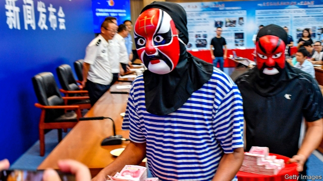

###### Under the umbrella
保护伞
# China is waging a nationwide campaign against gang crime 
中国正在全国范围内开展打击黑帮犯罪活动

##### It is often an excuse to crush political threats to the Communist Party 

 

> Feb 28th 2019 

IN THEIR EFFORTS to eradicate criminal gangs, Chinese officials deploy a colourful vocabulary. Beijing is festooned with red banners urging citizens to “resolutely root out black and evil forces”. (In other countries this might be a job for police officers or exorcists.) Other banners mix metaphors. “Dig deep and thoroughly investigate the protective umbrellas” of such menaces, says one. 

In January 2018 China’s leader, Xi Jinping, launched a three-year campaign against organised crime. State media brim with reports of success. The authorities in Zhanjiang, a city in the southern province of Guangdong, claim to have dealt an effective blow to “vehicle tyrants” (taxi-business mafias), “sand tyrants” (gangs that control the sand-mining industry), “sea tyrants” (those involved in the seafood business) and “basket tyrants” (those engaged in the basket trade). So far more than 10,000 alleged gangsters have been brought to trial across the country. State media say police have smashed 6,000 gangs, with the help of citizens who are offered lavish rewards for leads (disguised recipients are pictured). 

Campaigns against hei shehui, or “black society”, as organised crime is often called, are common in China. But officials have been at pains to point out that this one is different. Previous such efforts have been called dahei, or “smashing black”. This one is called saohei, or “sweeping [aside] black”. The metaphorical shift is intended to suggest a more comprehensive effort: one that is aimed not only at the mob, but also at their official protectors and the grassroots political structures they have infiltrated. Official descriptions of crimes being targeted paint more than simply a picture of gangsters terrorising ordinary citizens. They describe a menace to the Communist Party itself. Top of the list are “black and evil forces that threaten political security, especially the safety of the [political] system and of political authority, and that infiltrate the political arena.” 

A cartoon released by police in Zhaoqing, another city in Guangdong, gives an example. It shows what appears to be a Buddhist leader, judging by the decor and the kowtowing of his followers. He talks of establishing an “ideal country where we can do what we want”. Next he is shown leading protesters outside a government building. In the final scene he counts piles of banknotes. “The goal of an independent kingdom is getting ever closer,” he chortles, before police burst in. 

Other examples given by state media relate to political control in the countryside. They include clans that “lord over” rural areas (many villages are inhabited mainly by people of one surname) and the often-related issue of gangs that rig the vote in grassroots elections (their efforts sometimes proving more effective than the party’s). Perhaps not surprisingly, the gangs that help developers and officials to evict people from their homes are not mentioned as targets of the campaign. Rather, it is black and evil forces that “whip up unrest” during demolitions that are to be crushed. In other words, as the police are likely to interpret this, activists who try to organise resistance to the bulldozing of their communities. 

Also in the cross-hairs are the forces of evil that organise people to go in groups to submit petitions at government offices. Petitioning higher authorities for redress of local injustices is an ancient tradition in China that has continued under Communist rule. The party, however, is fearful of people with grievances gathering in public. The saohei campaign appears to offer the police an excuse to round up organisers and treat them as gangsters instead of merely bundling them off to detention centres to await deportation to their home towns. In January bosses at an industrial park in the coastal province of Fujian met to discuss two main topics: progress with saohei and how to control petitioners in order to prevent “sudden incidents” during the Chinese new-year holiday. 

In Tibet and the neighbouring region of Xinjiang, officials are using the saohei campaign to bolster their relentless efforts to crush unrest. Tibetans have been told to inform on dark and evil forces that “link up with the Dalai [Lama] clique”, that advocate the Dalai Lama’s “middle way” of compromise with China, that lurk in monasteries and use religion to stir up opposition to the party, or that encourage campaigning for the protection of the Tibetan language (see article). In Xinjiang officials say the main purpose of the saohei effort is to fight gangs related to the “three evil forces” of terrorism, extremism and separatism. 

Since he took over as China’s leader in 2012, Mr Xi has been waging a campaign against corruption as well as perceived political threats to the party in the form of independent lawyers, unauthorised religious activity and dissidents generally. It may seem surprising, then, that more than six years later—amid a climate of fear that pervades officialdom and stifles most of the party’s critics—the party still sees so many threats to its control. 

Yet it does. In January the country’s police chief, Zhao Kezhi, said the saohei campaign should be the “dragonhead”, ie, at the forefront, of this year’s security work. But the “focal point”, he said, should be “preventing colour revolutions”. Four days later, at a hastily convened meeting of senior officials from around the country, Mr Xi called for “high alert” against “black swan” or “grey rhino” events: crises resulting from unexpected incidents or obvious but neglected problems. As part of measures to ensure social stability, he said there should be “no let-up” in the saohei drive. 

The last time such a high-profile campaign was waged against gangs was a decade ago in the south-western region of Chongqing by its then leader, Bo Xilai. Mr Bo’s efforts earned him much approval locally, but were also widely criticised for their ruthlessness—critics said the campaign was used as a pretext to arrest businesspeople on trumped-up charges and seize their assets. Smashing black, as many commentators noted, turned into heida: “black [ways of] smashing [people]”. 

Mr Bo is now in prison for corruption, having lost a power struggle just before Mr Xi assumed power. But his methods remain in favour. A lawyer in Beijing says private businesspeople are just as worried by Mr Xi’s campaign as those in Chongqing were about Mr Bo’s. Lawyers, he says, have been ordered not to defend those arrested without official permission. Local government websites say prosecutors have been given quotas for handling cases related to the saohei campaign. Black and white are getting confused once again. 

-- 

 单词注释:

1.eradicate[i'rædikeit]:vt. 根除, 扑灭, 根绝, 消灭 

2.deploy[di'plɒi]:v. 展开, 配置 

3.colourful['kʌlәful]:a. 颜色丰富的, 鲜艳的, 艳丽的, 多色的, 丰富多彩的, 吸引人的, 引人入胜的 [计] 有色的 

4.festoon[fes'tu:n]:n. 花彩 vt. 结彩于 

5.resolutely[]:adv. 坚决地；毅然地 

6.exorcist['eksɔ:sist]:n. 驱魔的人, 召魂者 

7.metaphor['metәfә]:n. 隐喻 

8.thoroughly['θʌrәli]:adv. 彻底地, 绝对地, 透彻地, 详尽地, 周到地, 完全地, 完善地, 全面地 

9.menace['menis]:n. 威胁, 胁迫 v. 威吓, 胁迫 

10.tyrant['taiәrәnt]:n. 暴君 [法] 专制君主, 暴君, 压制他人者 

11.mafia['mæfiә]:n. 黑手党, 秘密政党 

12.seafood['si:fu:d]:n. 海味, 海鲜, 鱼类 

13.allege[ә'ledʒ]:vt. 宣称, 主张, 提出, 断言 [法] 断言, 指称, 指证 

14.gangster['gæŋstә]:n. 流氓, 歹徒 [法] 暴徒, 恶棍, 打手 

15.lavish['læviʃ]:a. 大方的, 丰富的, 浪费的 vt. 浪费, 滥用, 慷慨给予 

16.recipient[ri'sipiәnt]:a. 领受的, 容易接受的, 感受性强的 n. 领受者, 容纳者, 容器 

17.shehui[]:[网络] 白社会；升辉；宽频直播 

18.metaphorical[metә'fɒ:rikl]:a. 隐喻性的, 比喻性的 

19.mob[mɒb]:n. 暴民, 民众, 暴徒 vt. 大举包围, 蜂拥进入, 围攻 vi. 聚众生事 

20.protector[prә'tektә]:n. 保护者, 保护物, 保护装置 [医] [催化]保护质, 保护器 

21.grassroot[]:n. 草根 

22.infiltrate[in'filtreit]:vt. 使浸润, 使潜入, 使渗入 vi. 渗入 n. 渗透物 

23.terrorise['terәraiz]:vt. 使恐怖, 恐吓, 威胁, 胁迫 vi. 引起恐怖, 实行恐怖统治 

24.arena[ә'ri:nә]:n. 角斗场, 舞台, 场地 [医] 尿沉渣, 尿沙; 脑沙 

25.decor['deikɔ:(r); (?@) dei'kɔ:r]:n. 装饰, 布置 

26.kowtow[.kәu'tau]:n. 磕头 vi. 叩头 

27.follower['fɒlәuә]:n. 从者, 属下, 追补者 [电] 随动机 

28.protester[]:n. 抗议者, 持异议者, 拒付者 [经] 反对者 

29.banknote['bæŋknәut]:n. 钞票 

30.chortle['tʃɒ:tl]:vi. 咯咯笑 n. 咯咯的欢笑(声) 

31.clan[klæn]:n. 氏族, 宗族, 集团 [医] 支 

32.rig[rig]:n. 装备, 帆装 vt. 装配, 装扮, 给船装帆, 垄断, 操纵 

33.developer[di'velәpә]:n. 开发者 [计] 显影器 

34.evict[i'vikt]:vt. 逐出, 赶出, 驱逐 [法] 逐出, 驱逐, 没收 

35.demolition[.demә'liʃәn]:n. 破坏, 毁坏, 撤销 [经] 拆毁(除,破坏) 

36.activist['æktivist]:n. 激进主义分子 

37.bulldoze['buldәuz]:vt. 强迫, 用推土机推平/削平, 用推土机清除, 压倒, 威胁 

38.petition[pi'tiʃәn]:n. 请愿, 诉状, 陈情书, 申请, 祈求, 祷文 v. 正式请求, 恳求, 请愿 

39.redress[ri'dres]:n. 赔偿, 补救, 矫正 vt. 纠正, 赔偿, 救济 

40.injustice[in'dʒʌstis]:n. 不公平, 非正义的行为 [法] 不公正, 不公平, 权利侵害 

41.grievance['gri:vәns]:n. 委屈, 冤情, 苦况 [经] 不满(对雇用条件的) 

42.detention[di'tenʃәn]:n. 阻止, 监禁, 拘留 [医] 隔离, 拘留, 滞留, 停滞 

43.deportation[.di:pɒ:'teiʃәn]:n. 驱逐出境, 放逐 [法] 递解出境, 放逐, 驱逐 

44.coastal['kәustәl]:a. 海岸的, 沿海的, 沿岸的 [法] 海岸的, 沿海的 

45.Fujian['fu:'dʒjen]:福建(位于中国东部沿海) 

46.petitioner[pi'tiʃәnә]:n. 请愿人, 诉愿人, (离婚案)原告 [法] 诉愿人, 上诉人, 请愿人 

47.bolster['bәulstә]:n. 支持, 长枕 vt. 支持, 支撑 

48.relentless[ri'lentlis]:a. 无情的, 冷酷的, 残酷的 

49.Tibetan[ti'betn]:a. 西藏的 n. 藏语, 西藏人 

50.Dalai[]:[网络] 达拉伊 

51.clique[kli:k]:n. 派系, 集团 vi. 结党 [计] 集团型 

52.lurk[lә:k]:n. 潜伏, 潜行 vi. 暗藏, 潜伏, 埋伏 [计] 隐匿阅读 

53.monastery['mɒnәstәri]:n. 修道院, 僧侣 

54.opposition[.ɒpә'ziʃәn]:n. 反对, 敌对, 相反, 在野党 [医] 对生, 对向, 反抗, 反对症 

55.Tibetan[ti'betn]:a. 西藏的 n. 藏语, 西藏人 

56.terrorism['terәrizm]:n. 恐怖主义, 恐怖统治, 恐怖状态 [法] 胁迫, 暴政, 恐怖政治 

57.extremism[ik'stri:mizm]:n. 极端倾向, 极端论, 过激主义 

58.separatism['sepәrәtizm]:n. 分离主义 

59.corruption[kә'rʌpʃәn]:n. 腐败, 堕落, 贪污 [计] 论误 

60.unauthorised[ʌn'ɔ:θəraizd]:a. 无权的（等于unauthorized） 

61.dissident['disidәnt]:a. 意见不同的, 持不同政见的 n. 意见不同的人, 持不同政见者 

62.pervade[pә'veid]:vt. 弥漫于, 遍及于, 流行于, 蔓延, 渗透于, 充满 

63.officialdom[ә'fiʃәldәm]:n. 官场, 官僚圈子, 公务员, 官僚主义 [法] 官场, 公务员界, 官吏 

64.stifle['staifl]:vt. 使窒息, 抑止, 扼杀 vi. 窒息, 被扼杀 

65.zhao[]:n. 赵（姓氏） 

66.dragonhead['dræɡәned]:n. 青兰属植物 

67.IE['i:ei]:[计] 中断启动 

68.forefront['fɒ:frʌnt]:n. 最前部, 最前线 

69.focal['fәukl]:a. 焦点的, 在焦点上的 [医] 病灶的, 灶的 

70.hastily['heistili]:adv. 匆忙地, 急速地, 急躁地 

71.convene[kәn'vi:n]:vt. 集合, 召集, 召唤 vi. 聚集, 集合 

72.rhino['rainәu]:n. 钱, 现金, 犀牛 

73.unexpect[]:[网络] 意想不到；使意外 

74.chongq[]:[网络] 重庆 

75.locally['lәukәli]:adv. 地方性地, 局部性地, 在当地 

76.criticise['kritisaiz]:v. 批评, 吹毛求疵, 非难 

77.pretext['pri:tekst]:n. 借口, 托词 v. 以...为借口 

78.businessperson['bɪznəspɜ:sn]:n. 商人 

79.asset['æset]:n. 资产, 有益的东西 

80.commentator['kɔmenteitә]:n. 评论员, 实况广播员, 注释者, 时事评论员 

81.prosecutor['prɒsikju:tә]:n. 实行者, 告发者, 公诉人 [法] 原告, 起诉人, 检举人 

82.quota['kwәutә]:n. 配额, 限额 [化] 定额 

