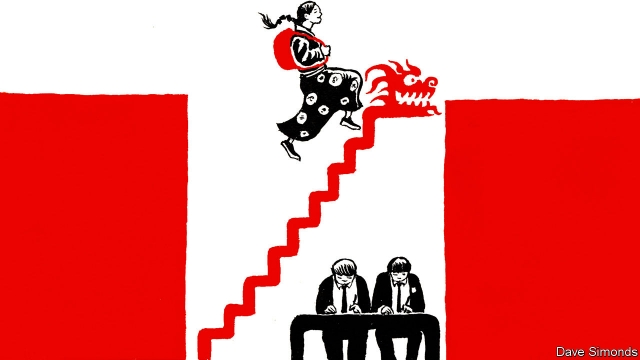

###### A class apart

# To win minorities’ support, China offers places at boarding school 

##### It is too much of a shock for some 

 

> Feb 28th 2019 

MEIDUO WAS 11 when she left her village in Tibet to attend boarding school. Her family had been trying to secure this opportunity for her ever since she began her education. They believed that studying in a more prosperous part of China would give her a brighter future. Yet when the moment came to say goodbye, they could not bear to send her off. So Meiduo, with a suitcase bigger than herself, went to the railway station with a teacher who escorted her to her destination. It was four years before the girl saw her relatives again. 

Meiduo (not her real name) is one of more than 141,000 children from Tibet who have taken part in a scheme known as “inland classes”, or neidiban. Set up in 1985, it offers selected students places at secondary schools in parts of China inhabited by the country’s Han majority. There are dozens of schools scattered over more than 20 provinces that accept such children from Tibet (including some of Han ethnicity). In 2000 the offer was extended to children in Xinjiang, a western region bordering Tibet with a large population of mostly Muslim Uighurs. Since then more than 100,000 students from Xinjiang have attended neidiban schools in 45 cities. 

Admission to the programme is highly competitive. Applicants must not only excel academically. They must also “ardently love” the party and socialism, say guidelines issued last year by a local government in Tibet. Even so, those accepted must receive further “ideological and political education” before they set off. 

The programme’s apparent aim is to win the support of elites in restive frontier areas and give the brightest ethnic-minority children more exposure to Han culture. The education they receive at neidiban schools is usually superior to that available in their native regions. It is also heavily subsidised. The students gain a mastery of Mandarin that would be hard to achieve at home. Under a government affirmative-action policy, university-entrance requirements are lower for ethnic minorities. 

In 2015 President Xi Jinping said the project had achieved “outstanding” results. But it gets mixed reviews from participants. A Uighur graduate from the first Xinjiang class says most of his classmates were, like himself, the children of government officials. But they were described condescendingly at the school as “precious people” from Xinjiang, even “like pandas”. He says they were closely watched. 

Despite efforts by his school to introduce the Uighurs to their Han fellow-students, members of the two ethnic groups rarely became friends. At most neidiban schools, ethnic-minority students attend separate classes and live in segregated accommodation (this is justified by schools on “security” grounds). “We’re second-class citizens. Why? We’re all Chinese...aren’t we?” says a former neidiban student of Tibetan ethnicity. 

Some pupils find it hard to adapt to their schools’ Han-centric teaching, including exclusive use of Mandarin. Meiduo says there were many students at her previous school in Tibet who were good enough academically to qualify for neidiban education, but decided not to apply. She says they did not want to “forget their own culture”. 

Among Tibetans the programme has a high drop-out rate—participants often find it hard to adapt to the different cultural and academic environment. After finishing their studies, ethnic minorities have difficulty getting the kind of work they want. The government offers them incentives to work in remote parts of their home regions as teachers and police officers. But most prefer to work in cities, says Timothy Grose of the Rose-Hulman Institute of Technology in Indiana. In majority-Han areas they often face discrimination because of their ethnicity. Many people in China associate Tibetans and Uighurs with trouble: their regions are fraught with separatist tensions and brutally repressed by the state. 

Yet demand for the neidiban remains strong. “Students [are] being lured in through the opportunities it creates for upward social mobility,” says James Leibold of La Trobe University in Melbourne, Australia. “Even if it comes at a cultural cost.” 

-- 

 单词注释:

1.escort['eskɒ:t]:n. 护送者, 护卫者, 护航舰 vt. 护卫, 护送 

2.han[hæn]:n. 汉朝；汉民族 

3.ethnicity[eθ'nisәti]:n. 种族划分 

4.Muslim['mjzlim; (?@) 'mʌzlem]:n. 伊斯兰教, 伊斯兰教教徒 

5.Uighur[]:n. 维吾尔族人, 维吾尔语, 维吾尔人 

6.excel[ik'sel]:vt. 胜过, 优于, 擅长 vi. 胜过其他 

7.academically[.ækә'demikәli]:adv. 学术上；学业上 

8.ardently['ɑ:dntli]:adv. 热心地, 热烈地 

9.guideline['gaidlain]:n. 指导路线, 方针, 指标 [经] 指导路线, 方针, 准则 

10.ideological[.aidiә'lɒdʒikәl]:a. 意识形态的, 空想的 [法] 思想的, 思想上的, 意识形态的 

11.elite[ei'li:t]:n. 精华, 精锐, 中坚分子 

12.restive['restiv]:a. 不愿向前走的, 倔强的, 难驾御的 

13.subsidise[]:vt. 给...补助金, 津贴, 资助 

14.mastery['mɑ:stәri]:n. 征服, 统治权, 优势, 精通, 掌握 [法] 统治权, 控制权, 征服 

15.mandarin['mændәrin]:n. 中国官话, 国语, 满清官吏, 柑橘 a. (中国式)紧身马褂的 

16.ethnic['eθnik]:a. 人种的, 种族的 [医] 人种的 

17.participant[pɑ:'tisipәnt]:n. 参加者, 参与者 a. 有份的, 参加的, 参与的 

18.Uighur[]:n. 维吾尔族人, 维吾尔语, 维吾尔人 

19.condescendingly[,kɔndi'sendiŋli]:adv. 谦逊地；俯就地；屈尊地 

20.segregate['segrigeit]:a. 分离的, 被隔离的 vi. 分离, 隔离, 分凝 vt. 使分离, 使隔离 

21.Tibetan[ti'betn]:a. 西藏的 n. 藏语, 西藏人 

22.Tibetan[ti'betn]:a. 西藏的 n. 藏语, 西藏人 

23.cultural['kʌltʃәrәl]:a. 文化的, 教养的, 修养的 [医] 培养的 

24.incentive[in'sentiv]:n. 动机 a. 激励的 

25.timothy['timәθi]:n. 梯牧草 [医] 梯牧草, 牛草 

26.grose[]:n. (Grose)人名；(英)格罗斯 

27.Indiana[.indi'ænә]:n. 印地安那州 

28.fraught[frɒ:t]:a. 含有...的, 伴着...的, 充满...的 

29.separatist['sepәreitist]:n. 分离主义者, 独立派 

30.brutally[]:adv. 残忍地, 蛮横地 

31.repress[ri'pres]:vt. 镇压, 抑制, 压制 vi. 压制 

32.lure[luә]:n. 饵, 诱惑 vt. 引诱, 诱惑 

33.mobility[mәu'biliti]:n. 可动性, 流动性, 机动性 [化] 迁移率 

34.jame[]: 灰岩井 

35.leibold[]:[网络] 雷伯德 

36.La[lɔ:, lɑ:]:[医] 镧(57号元素) 

37.trobe[]:n. (Trobe)人名；(德)特罗贝 

38.Melbourne['melbәn]:n. 墨尔本 

