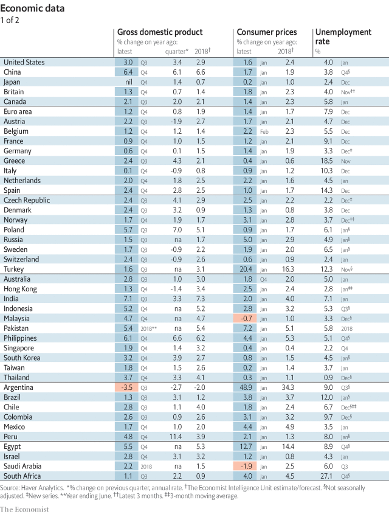
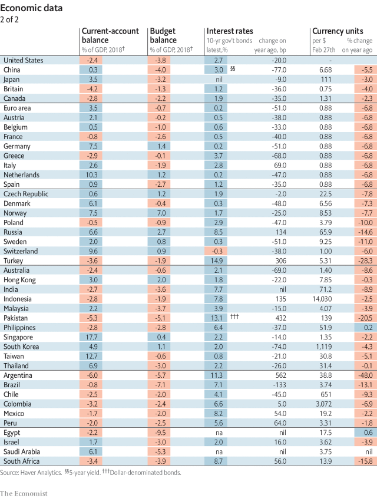
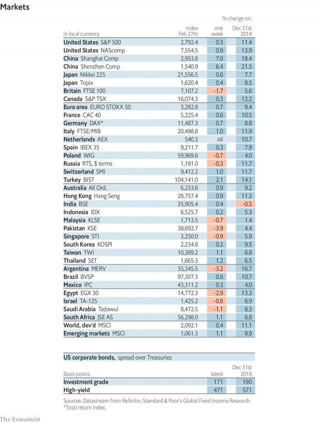
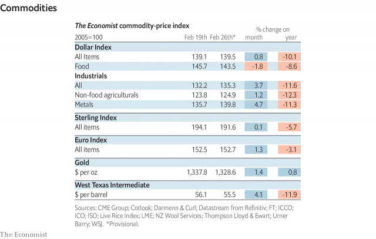

###### Bromance on hold

# Economic data, commodities and markets 

> Feb 28th 2019 

 

 

 

 

-- 

 单词注释:

1.bromance[]:n. 兄弟罗曼史； 也可以理解为“兄弟情”； 指两个男人关系很好； 但不涉及“性”的同性关系 

2.datum['deitәm]:n. 论据, 材料, 资料, 已知数 [医] 材料, 资料, 论据 

3.commodity[kә'mɒditi]:n. 农产品, 商品, 有用的物品 [经] 商品, 货物, 日用品 

