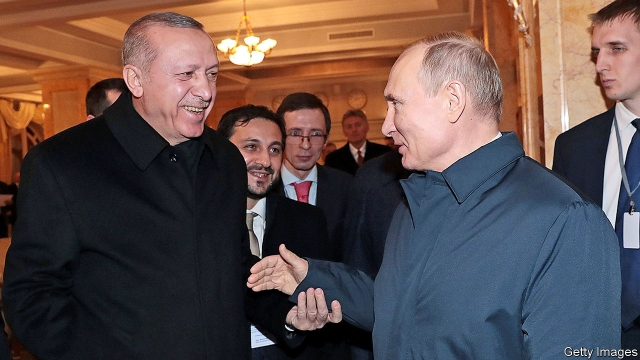

###### In Sputnik’s orbit

# A Russian propaganda outlet prospers in Turkey 

##### Come for uncensored news, and stay for the pro-Kremlin spin 

 

> Feb 28th 2019 

A WOUNDED JIHADIST commander is spotted receiving treatment in a Turkish hospital near the border with Syria. A court awards compensation to a Kurdish villager beaten senseless by security officials. A writer accuses the government of fearmongering after a prosecutor demands life sentences for 16 people involved in protests. These are the kind of stories only a few media outlets in Turkey, the world’s biggest jailer of journalists, dare to cover. It may come as a surprise that one of them is a news organisation founded and funded by Russia’s government. 

In much of Europe and America Sputnik has a richly earned reputation as a Kremlin mouthpiece. Facebook recently accused the group’s employees of setting up dozens of fake accounts on its platform designed to spread misinformation. President Emmanuel Macron has referred to Sputnik as “an agent of influence and propaganda” in France. Sputnik has played a similar role in Turkey, where it has enthusiastically supported Russian efforts to deepen the country’s estrangement from its Western allies. But the agency has also won over hundreds of thousands of readers and listeners by providing an increasingly scarce product—uncensored news about Turkey in Turkish. 

The service, which features a website and radio channel, was launched in Turkey in late 2014. A year later Turkey’s airforce shot down a Russian warplane which had entered its airspace after a run over northern Syria. Russia responded with sanctions and demanded a formal apology. Sputnik responded by airing thinly sourced Russian claims about Islamic State oil sales to Turkish officials, including members of Mr Erdogan’s family. Some Turkish news outlets picked up the story. In the spring of 2016 Turkey blocked access from Turkish internet providers to Sputnik’s website and deported its news manager. Later the same year, as the Russian sanctions started to bite, Mr Erdogan relented, expressed regret for the downed plane and reconciled with his counterpart, Vladimir Putin. 

Later in 2016, Mr Erdogan travelled to St Petersburg, where he thanked Mr Putin for condemning a coup attempt against Turkey’s government, agreed to bridge differences over the war in Syria, revived a number of joint energy projects, including an undersea gas pipeline from Russia, and expressed interest in purchasing a Russian weapons system. Mr Putin won one other concession. The day before Mr Erdogan’s visit, Turkey unblocked Sputnik. 

Since then Sputnik has drummed up support for the rapprochement between Turkey and Russia. Its website teems with stories hailing Turkey’s purchase of Russia’s S-400 missile system, which NATO and in particular America opposes, as a sign of the country’s increasing independence from the Western alliance. On issues like the wars in Ukraine and Syria and the turmoil in Venezuela, Sputnik regularly channels the voice of its Russian paymasters. A study published last year by the RAND Corporation concluded the news agency was part and parcel of a Kremlin strategy to “foment suspicion” between Turkey and its NATO partners and to enlist the country’s support for Russia’s policies. It is operating on fertile ground. According to a series of polls by Kadir Has University, the share of Turks who identified Russia as a threat to their country dropped from 34.9% in 2016 to 12.4% last year. Those who saw America as such soared from 44.1% to 60.2%. That looks like a good return for Mr Putin on a limited investment. 

But Sputnik has also continued to be a thorn in Mr Erdogan’s side by flouting the rules imposed on Turkey’s leading news outlets. (Analysts and media-rights groups estimate that about 90% of newspapers in circulation are in the hands of businessmen close to the government.) The service recently published excerpts from an interview with Selahattin Demirtas, a Kurdish political leader imprisoned since late 2016. Most outlets are effectively banned from reporting on Mr Demirtas or his movement. Critics reckon that the website wants Turks, especially those who are critical of the Erdogan government, to come for decent coverage of Turkish politics and to stay for the pro-Kremlin spin. 

Sputnik’s journalists say they are simply providing an alternative to the bland, toothless coverage offered by domestic news outlets. Whatever Sputnik is doing seems to be working. Its service in Turkey now boasts over twice as many Twitter followers (609,000 at last count) as its global service has. 

Along with the BBC and Deutsche Welle, which also run Turkish-language services, Sputnik has turned into a magnet for unemployed Turkish reporters. Today, the group boasts some of the country’s best and most popular journalists. Ahu Ozyurt, a veteran television anchor who joined the service last year, says she was pleasantly surprised to discover that she could invite whomever she wanted to appear on her radio programme. Most of the big news channels blacklist experts overly critical of the Erdogan government. “The mainstream in Turkey is so bad”, says Ms Ozyurt, “that just being able to do basic, orthodox journalism feels extraordinary.” Those responsible for the sorry state of the Turkish media, starting with Mr Erdogan, ought to take notice. When your newspapers make a group financed by the Kremlin look like a beacon of press freedom, something has gone seriously wrong. 

-- 

 单词注释:

1.propaganda[.prɒpә'gændә]:n. 宣传, 宣传活动 [医] 宣传 

2.prosper['prɒspә]:vi. 繁荣, 兴隆, 成功 vt. 使成功, 使昌盛 

3.uncensored[.ʌn'sensәd]:a. 未经审查的, 无保留的 

4.jihadist[]:n. 伊斯兰圣战士 

5.Turkish['tә:kiʃ]:n. 土耳其语 a. 土耳其的, 土耳其人的, 土耳其语的 

6.Syria['siriә]:n. 叙利亚 [经] 叙利亚 

7.compensation[.kɒmpen'seiʃәn]:n. 补偿, 赔偿金, 工资 [医] 代偿(机能), 补偿 

8.Kurdish['kә:diʃ]:a. 库尔德人的 n. 库尔德语 

9.senseless['senslis]:a. 无感觉的, 无意识的, 不省人事的 

10.fearmongering[]:[网络] 散布恐惧 

11.prosecutor['prɒsikju:tә]:n. 实行者, 告发者, 公诉人 [法] 原告, 起诉人, 检举人 

12.jailer['dʒeilә]:n. 看守监狱的人, 狱卒 [法] 看守, 狱卒, 监狱管理员 

13.organisation[,ɔ: ^әnaizeiʃən; - ni'z-]:n. 组织, 团体, 体制, 编制 

14.sputnik['sputnik]:n. 人造卫星 

15.richly['ritʃli]:adv. 富裕地, 丰富地, 充分地 

16.Kremlin['kremlin]:n. 克里姆林宫 [经] 克里姆林宫 

17.mouthpiece['mauθpi:s]:n. 发话筒, 代言人, (电话)送话口 [机] 钳口垫片 

18.facebook[]:n. 脸谱网 

19.fake[feik]:n. 假货, 欺骗, 诡计 a. 假的 vt. 假造, 仿造 vi. 伪装 

20.misinformation['misinfә'meiʃәn]:n. 错误的消息, 误传 [法] 错误的消息, 误传 

21.emmanuel[i'mænjuәl]:n. 以马内利（耶稣基督的别称）；伊曼纽尔（男子名, 等于Immanuel） 

22.macron['mækrәn]:n. 长音符号 

23.enthusiastically[in.θju:zi'æstikli]:adv. 热心地, 狂热地 

24.estrangement[i'streindʒmәnt]:n. 疏远 

25.ally['ælai. ә'lai]:n. 同盟者, 同盟国, 助手 vt. 使联盟, 使联合, 使有关系 vi. 结盟 

26.airforce[]:n. 空军 

27.warplane['wɒ:plein]:n. 军用飞机 

28.sanction['sæŋkʃәn]:n. 核准, 制裁, 处罚, 约束力 vt. 制定制裁规则, 认可, 核准, 同意 

29.thinly['θinli]:adv. 薄, 细, 瘦 

30.Islamic[iz'læmik]:a. 伊斯兰教的, 穆斯林的 

31.provider[prә'vaidә]:n. 供应者, 供养人, 伙食承办人 [计] 提供器 

32.deport[di'pɒ:t]:vt. 举止, 驱逐出境 [法] 放逐, 驱逐, 递解 

33.erdogan[]:[网络] 埃尔多安；土耳其总理埃尔多安；艾尔多安 

34.relent[ri'lent]:vi. 变宽厚, 变温和, 动怜悯之心 

35.reconcile['rekәnsail]:vt. 使和解, 调停, 使和谐, 使一致, 使听从 [经] 对帐, 使一致 

36.counterpart['kauntәpɑ:t]:n. 副本, 复本, 配对物, 相应物 [经] 副本, 正副二份中之一 

37.Vladimir[vlɑ'dimɪr]:n. 弗拉基米尔（古罗斯弗拉基米尔-苏兹达里公国的古都） 

38.putin['putin]:n. 普京（人名） 

39.ST[]:[计] 段表, 状态, 系统测试, 直端连接器 [化] 磺胺噻唑 

40.petersburg['pi:tәzbә:^]:n. 彼得斯堡（美国城市）；彼得堡（苏联城市列宁格勒旧称） 

41.coup['ku:]:n. 砰然的一击, 妙计, 出乎意料的行动, 政变 [医] 发作, 中, 击 

42.revive[ri'vaiv]:vt. 使苏醒, 使复兴, 使振奋, 回想起, 重播 vi. 苏醒, 复活, 复兴, 恢复精神 

43.undersea['ʌndәsi:]:a. 海面下的 adv. 在海面下 

44.concession[kәn'seʃәn]:n. 特许, 让步, 认可 [经] 核准, 许可, 特殊(权) 

45.unblocked[]:a. 非块式；畅通无阻的 

46.rapprochement[ræ'prɔʃmә:ŋ]:n. 和解, 恢复邦交, 恢复友好关系, 重归于好 

47.teem[ti:m]:vi. 充满, 充足, 倾注 vt. 倒出 

48.hail[heil]:n. 冰雹, 致敬, 欢呼, 招呼 vt. 向...欢呼, 致敬, 招呼, 使象下雹样落下 vi. 招呼, 下雹 interj. 万岁, 欢迎 

49.NATO['neitәj]:北大西洋公约组织, 北约组织 [经] 北大西洋公约组织 

50.alliance[ә'laiәns]:n. 联盟, 联合 [法] 同盟, 联盟, 联姻 

51.ukraine[ju(:)'krein]:n. 乌克兰（原苏联一加盟共和国, 现已独立） 

52.turmoil['tә:mɒil]:n. 骚动, 混乱 

53.Venezuela[,vene'zweilә]:n. 委内瑞拉 

54.paymaster['pei,mɑ:stә]:n. 出纳员, 军需官 [经] 出纳员, 军需机 

55.rand[rænd]:n. 兰特, (非正式)边, 田埂, 缘 [经] 兰特 

56.foment[fәu'ment]:vt. 热敷, 煽动 

57.enlist[in'list]:vt. 征募, 参与, 谋取 vi. 从军, 应募, 赞助 

58.sery[]:n. (Sery)人名；(俄)谢雷；(科特)塞里 

59.kadir[]:n. (Kadir)人名；(阿拉伯、哈萨、乌兹、吉尔、塔吉)卡迪尔 

60.Turk[tә:k]:n. 土耳其人, 土耳其马 

61.soar[sɒ:]:n. 高扬, 翱翔 vi. 往上飞舞, 高耸, 翱翔 

62.flout[flaut]:vt. 嘲笑, 愚弄 vi. 表示轻蔑 n. 嘲笑, 愚弄, 轻视 

63.analyst['ænәlist]:n. 分析者, 精神分析学家 [化] 分析员; 化验员 

64.circulation[.sә:kju'leiʃәn]:n. 流通, 循环, 发行量 [化] 环流 

65.excerpt['eksә:pt]:n. 摘录 v. 引用, 摘录 

66.Selahattin[]:[网络] 萨拉赫丁 

67.Demirtas[]:德米尔塔什 

68.effectively[i'fektivli]:adv. 有效地, 有力地, 实际上 

69.reckon['rekәn]:vt. 计算, 总计, 估计, 认为, 猜想 vi. 数, 计算, 估计, 依赖, 料想 

70.coverage['kʌvәridʒ]:n. 覆盖的范围, 保险总额, 新闻报导 [化] 可达范围; 覆盖度 

71.politic['pɒlitik]:a. 精明的, 明智的, 策略的 

72.bland[blænd]:a. 温和的, 乏味的, 冷漠的 [医] 温和的, 淡的 

73.toothless['tu:θlis]:a. 无齿的 [医] 无牙的 

74.twitter['twitә]:n. 啁啾, 唧唧喳喳声 vi. 啭, 啁啾, 颤抖 vt. 嘁嘁喳喳地讲, 抖动 

75.follower['fɒlәuә]:n. 从者, 属下, 追补者 [电] 随动机 

76.BBC[]:英国广播公司 

77.deutsche[]:n. 德意志联邦共和国马克 

78.welle[]: [地名] [比利时、德国] 韦勒; [地名] [科特迪瓦] 韦莱 

79.unemployed[.ʌnim'plɒid]:a. 失业的, 未被利用的 [经] 没有被雇用的, 失业的, 没有被利用的 

80.ahu['ɑ:hu:]:abbr. 空气处理机（Air Handling Unit） 

81.pleasantly[]:adv. 和蔼地, 亲切地；友好地；愉快地 

82.whomever[ˌhu:mˈevə(r)]:pron. （作动词或介词的宾语时, 有时候用来替代whoever） 

83.blacklist['blæklist]:n. 黑名单 

84.overly['әuvәli]:adv. 过度地, 极度地 

85.mainstream['meinstri:m]:n. 主流 

86.orthodox['ɒ:θәdɒks]:a. 正统的, 传统的, 惯常的 

87.journalism['dʒә:nәlizm]:n. 新闻业, 报章杂志 [法] 报刊, 新闻业, 新闻出版 

88.beacon['bi:kn]:n. 烽火, 灯塔 v. 照亮 

