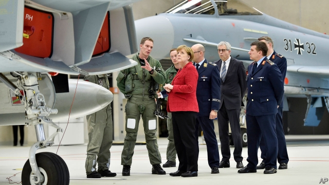

###### Sticking to its guns

# Germany’s moral qualms about arms sales infuriate its allies 

##### They are less picky, but rely on German parts 

 

> Mar 2nd 2019 

AFTER 13 YEARS at the top of German politics, what does Angela Merkel regret? Asked this question at the Munich Security Conference on February 16th, the chancellor—rather than rueing her decisions on refugees or euro-zone reform—declared herself “greatly concerned” about Germany’s inability to harmonise its policy on arms exports with its European allies. 

The chancellor had two audiences in mind. The first was France, which resents Germany’s tight export rules. The second was Germany’s Social Democratic Party, which governs in coalition with Mrs Merkel’s Christian Democrats and resists relaxing those rules. Put simply, the chancellor is trapped between her closest ally and her governing partner. 

The proximate cause for the row is Germany’s decision last November to suspend all weapons exports to Saudi Arabia, following the murder and dismemberment of Jamal Khashoggi, a Saudi journalist, by state goons. Because German components are often indispensable for weapons or arms systems made elsewhere, that policy threatened other countries’ export arrangements with the Saudis. Emmanuel Macron called it “pure demagoguery”. The British are also furious, for the decision undermines a potential £10bn ($13.3bn) deal to sell the Saudis 48 Eurofighter Typhoon jets, which need German parts. Jeremy Hunt, Britain’s foreign secretary, has privately accused Germany of undermining NATO and reducing European leverage on Saudi Arabia. Some French-made helicopters in Saudi Arabia are grounded for want of spare parts. 

France and Britain view arms sales as a tool of foreign policy, and governments often back their firms’ export efforts. Germany gives priority to human rights. Under rules dating from 2000, German arms exports are supposed to be limited largely to EU and NATO members and their allies. In practice regulators have often adopted a more relaxed attitude; big customers over the past decade have included Algeria, Qatar and Egypt as well as the Saudis. Between 2012 and 2016 Germany was the world’s fifth-largest weapons exporter, and not without controversy: its tanks and small arms have turned up in the killing fields of Libya, Syria and Yemen. 

Yet since 2013, says François Heisbourg, a Paris-based defence analyst, “chaos has replaced order” in German decision-making. That upsets domestic manufacturers, who have been tempted to establish subsidiaries overseas. And it infuriates allies who demand predictability. French concerns centre on proposed joint projects like the Future Combat Air System (a plan that includes fighter jets, satellites, drones and missiles, to which the Spanish have signed up) and a next-generation tank. Bruno Le Maire, France’s finance minister, fears Germany’s export rules could render such plans “useless”. The pair are now negotiating what would amount to an updated version of a 1972 agreement on arms exports that aimed to ensure neither could veto the other’s decisions. But the details are still sketchy. 

Ursula von der Leyen, Mrs Merkel’s defence minister, told the Munich crowd that Germany must not act as if it occupies a higher moral plane than the British or French. Yet Sophia Besch at the Centre for European Reform says German sceptics are more likely to be convinced by arguments couched in European terms. Cross-border co-operation on defence and security offers the best chance to kick-start Europe’s stalled integration. Joint military projects could improve capabilities, boost European industry and hedge against American disengagement. But for Germany, that means overcoming long-established taboos. Seen from abroad, then, Germany faces an awkward choice: compromise on its principles, or stand in Europe’s way. 

-- 

 单词注释:

1.qualm[kwɒ:m]:n. 晕眩, 不安, 疑虑 [法] 疑虑, 不安, 内疚 

2.infuriate[in'fjuәrieit]:a. 狂怒的 vt. 激怒 

3.ally['ælai. ә'lai]:n. 同盟者, 同盟国, 助手 vt. 使联盟, 使联合, 使有关系 vi. 结盟 

4.les[lei]:abbr. 发射脱离系统（Launch Escape System） 

5.picky['piki]:a. 吹毛求疵的, 挑剔的, 找麻烦的 

6.politic['pɒlitik]:a. 精明的, 明智的, 策略的 

7.angela['ændʒilә]:n. 安吉拉（女子名） 

8.merkel[]: [人名] 默克尔; [地名] [美国] 默克尔 

9.Munich['mju:nik]:n. 慕尼黑 

10.rue[ru:]:n. 懊悔, 后悔, 芸香 v. 后悔, 悲伤, 懊悔 

11.refugee[.refju'dʒi:]:n. 难民, 流亡者 [法] 避难者, 流亡者, 难民 

12.inability[.inә'biliti]:n. 无能, 无力 

13.harmonise['hɑ:mәnaiz]:vi.vt. 以和声歌唱/演奏, (使)协调, (使)一致, (使)相称, (使)调和 

14.chancellor['tʃɑ:nsәlә]:n. 大臣, 总理, 首相, 大使馆/领事馆的一等秘书, 司法官, 大学校长 

15.resent[ri'zent]:vt. 愤恨, 憎恶, 怨恨 

16.coalition[.kәuә'liʃәn]:n. 结合体, 结合, 联合 [经] 联合, 联盟 

17.Mr['mistә(r)]:先生 [计] 存储器回收程序, 多重请求 

18.democrat['demәkræt]:n. 民主人士, 民主主义者, 民主党党员 [经] 民主党 

19.proximate['prɒksimeit]:a. 最近的, 将临的, 近似的 [医] 近接的, 邻近的 

20.saudi['sajdi]:a. 沙乌地阿拉伯（人或语）的 

21.Arabia[ә'reibiә]:n. 阿拉伯半岛 

22.dismemberment[]:[医] 肢体[部分]切断 

23.Jamal[]:n. 贾马尔（男子名） 

24.khashoggi[]:卡舒吉 

25.goon[gu:n]:n. 受雇暴徒, 愚笨者, 呆子 

26.saudi['sajdi]:a. 沙乌地阿拉伯（人或语）的 

27.emmanuel[i'mænjuәl]:n. 以马内利（耶稣基督的别称）；伊曼纽尔（男子名, 等于Immanuel） 

28.macron['mækrәn]:n. 长音符号 

29.demagoguery['demәgɒgәri]:n. 煽动, 煽动行为, 散布谣言 

30.undermine[.ʌndә'main]:vt. 在...下面挖, 渐渐破坏, 暗地里破坏 [法] 暗中破坏, 以阴谋中伤伤害 

31.Eurofighter[]:[网络] 欧洲战斗机；欧洲战机；欧洲战机集团 

32.jeremy['dʒerimi]:n. 杰里米（男子名） 

33.privately[]:adv. 秘密地；私下地 

34.NATO['neitәj]:北大西洋公约组织, 北约组织 [经] 北大西洋公约组织 

35.EU[]:[化] 富集铀; 浓缩铀 [医] 铕(63号元素) 

36.regulator['regjuleitә]:n. 调整者, 校准者, 校准器, 调整器, 标准钟 [化] 调节剂; 调节器 

37.Algeria[æl'dʒiәriә]:n. 阿尔及利亚 

38.Qatar['kɑ:tәr]:n. 卡塔尔 

39.Egypt['i:dʒipt]:n. 埃及 

40.exporter[ik'spɒ:tә]:n. 出口商, 输出者, 出口公司 [经] 出口商, 输出者 

41.Libya['libiә]:n. 利比亚 

42.Syria['siriә]:n. 叙利亚 [经] 叙利亚 

43.yeman[]:[网络] 也门；叶门；园艺业的普及则始于也门 

44.heisbourg[]:[网络] 海斯堡；战略家埃斯堡 

45.analyst['ænәlist]:n. 分析者, 精神分析学家 [化] 分析员; 化验员 

46.chao[]:n. 钞（货币） 

47.subsidiary[sәb'sidiәri]:n. 子公司, 附件, 辅助者 a. 辅助的, 次要的, 津贴的 

48.oversea['әuvә'si:]:adv. 海外, 向国外, 向海外, 国外 a. 外国的, 在国外的, 在海外的, 舶来的 

49.predictability[pri.diktә'biliti]:n. 可预言 [电] 可预测性 

50.combat['kɒmbæt]:n. 争斗, 战斗 vi. 战斗, 争斗 vt. 与...战斗, 与...斗争 

51.drone[drәun]:n. 雄蜂, 懒惰者, 嗡嗡的声音, 无人驾驶飞机(或船) vi. 嗡嗡作声, 混日子 vt. 低沉地说 

52.bruno['bru:nәu]:n. 布鲁诺（男子名） 

53.LE[]:[计] 小于或等于 

54.Maire[]:n. 莫雅（女子名） 

55.update[ʌp'deit]:vt. 更新, 使现代化 n. 更新 [计] 更新 

56.veto['vi:tәu]:n. 否决权 vt. 否决, 禁止 

57.sketchy['sketʃi]:a. 概略的, 草草完成的 

58.ursula['ә:sjulә]:n. 厄休拉（女子名） 

59.Von[vɔn;fɔn;fәn]:[计] 冯·诺伊曼 

60.der[]:abbr. 区分编码规则（Distinguished Encoding Rules） 

61.leyen[]:[网络] 部女部长莱恩 

62.sophia[sә'faiә]:n. 索菲娅（女子名） 

63.besch[]:[网络] 夏延阿里 

64.sceptic['skeptik]:n. 怀疑论者 

65.couch[kautʃ]:n. 长沙发, 睡椅, 卧榻 vt. 横躺, 表达 vi. 躺下, 蹲伏 

66.stall[stɒ:l]:n. 厩, 停车处, 牧师职位, 货摊, 托辞, 拖延 vt. 关入厩, 停顿, 推托, 支吾, 使陷于泥中 vi. 被关在厩内, 陷于泥中, 停止, 支吾 

67.integration[.inti'greiʃәn]:n. 综合, 与环境协调的行为, 集成 [化] 集成; 整合 

68.capability[.keipә'biliti]:n. 能力, 性能, 约束力 [化] 能力 

69.disengagement[.disin'geidʒmәnt]:n. 分开, 空闲, 解脱 [医] 解脱(分娩) 

70.taboo[tә'bu:]:n. 禁忌, 禁止接近, 禁止使用 a. 禁忌的, 忌讳的 vt. 禁忌, 忌讳, 禁止 

