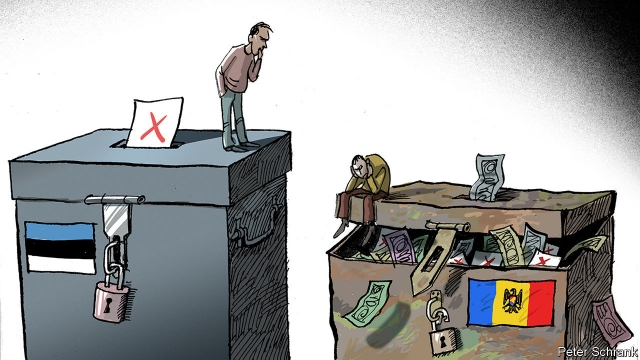

###### Elections, dirty and clean

# Moldova and Estonia show how different democracies can be 

##### One post-Soviet country defeated corruption, the other is still battling it 

 

> Feb 28th 2019 

KAJA KALLAS, a former competition lawyer and member of the European Parliament, is just the sort of businesslike politician one expects in Estonia. She took over as leader of Estonia’s liberal Reform Party last year; polls show it in a dead heat with the ruling Centre Party. She has run a technocratic campaign, focusing on education and tax policy. But she loses her cool when she talks about EKRE, Estonia’s anti-immigrant, Eurosceptic populist party. “They want to destroy everything,” she says: all the institutions that have made her open, tech-savvy nation more successful than “other countries that had the same starting-point. Take Moldova, for example.” 

Indeed, take Moldova. Like Estonia, it declared independence from the Soviet Union in August 1991. Both tiny countries have big Russian minorities, and both have struggled with emigration and shrinking populations. Yet in many ways they are polar opposites. Estonia joined the European Union in 2004 and the euro zone in 2011; Moldova’s EU candidacy has ground to a halt. Transparency International deems Estonia squeaky-clean, the 18th-least-corrupt country in the world. Moldova is 117th. Estonia is an IT hub, Moldova a farm economy whose pride is its excellent wines. Adjusted for purchasing power, Estonians are five times richer than Moldovans. 

This week both countries held elections. Estonia’s polls close on March 3rd, but internet voting started ten days earlier. Moldova’s vote took place on February 24th. The results gave some hope for progress in Moldova. An alliance of reformist parties called ACUM, headed by two corruption-fighters, Maia Sandu and Andrei Nastase, took 27 of parliament’s 101 seats. But the Socialist Party (PSRM), aligned with the Russia-friendly president, Igor Dodon, got 34. In second place with 30 seats is the ruling Democratic Party (PDM), a nominally pro-European group headed by the country’s biggest oligarch, Vladimir Plahotniuc. 

Since ACUM has vowed to stay in opposition, a coalition seems to require the PSRM and PDM. But Mr Plahotniuc may have other plans. In Moldova, MPs often switch parties, lured by rewards or threats. Then there is the party of Ilan Shor, a 31-year-old Israeli-born businessman who, as an MP, now enjoys immunity from prosecution. 

In 2015 Mr Shor was elected mayor of Orhei, a modest town an hour’s drive north of Chisinau, the capital. He has donated money to restore parks, repave streets and build social-housing units. Last year he opened a free amusement park called Orheiland. The town is dotted with Mr Shor’s “social stores”, offering wares at subsidised prices. Three dozen new buses ply the streets. 

The question is where the money comes from. In 2017 a court convicted Mr Shor of playing a role in a scheme that used fake loans to Russian companies to siphon nearly $1bn from the country’s banking system in 2014. Mr Shor has appealed. He blames another oligarch, an ex-prime minister serving nine years in prison. 

Ms Sandu, a former education minister revered for battling corruption in the exam system, thinks the entire political class is rotten. Though nominally rivals, “[President] Dodon and the Democratic Party are working together”, she says, blackmailing European countries into maintaining aid by threatening to turn towards Russia. 

The EU nevertheless cut off most aid last summer, after Mr Nastase won Chisinau’s mayoral election only to see it annulled on flimsy grounds. Political rot and poverty have driven many to emigrate. Over a million of Moldova’s 4.3m citizens live abroad, and remittances are about a fifth of GDP. 

If Estonia’s politics seem boring by comparison, Mart Helme, the leader of EKRE, is trying to fix that. On February 24th, the national holiday, EKRE led a torchlit march of 6,000 followers through Tallinn, the capital, chanting Eesti eest (“For Estonia!”). Mr Helme compares “so-called liberal democracy” to communism, and the EU to the Soviet Union. His party wants schools serving the country’s Russian-speaking minority to switch to Estonian, and to restrict the numbers of Ukrainians coming in for low-skilled jobs. It is polling at 17%. 

The Centre Party of Juri Ratas, the prime minister, gets most of the Russian vote. It is used to EKRE exploiting ethnic tension. But the fearmongering has less traction in this election, thinks Raimond Kaljulaid, a Centre Party MP. Young Russians are better integrated, and Estonian culture is doing well, with successful hip-hop artists and novelists. After a huge decline from 1991 to 2014, the population has risen for the past three years. Last year more Estonian citizens returned to the country than left. 

How has Estonia avoided Moldovan-style corruption? Some believe it made better choices early on, privatising state enterprises in a more transparent fashion. Tarmo Juristo of Praxis, a think-tank, credits Scandinavian banks with establishing norms in the financial industry. But others think it may have got lucky. Lucan Way and Adam Casey, of the University of Toronto, argue that former Soviet states democratised better when they had a deep-rooted nationalist movement. This was stronger in Estonia, which was independent from 1918 to 1940, than in Moldova, which was ruled by Romania or Russia for centuries. To judge by EKRE, though, that nationalism may not be entirely benign. 

-- 

 单词注释:

1.Moldova[mɔl'dɔvɑ:]:n. 摩尔多瓦 

2.Estonia[es'tәuniә]:n. 爱沙尼亚 

3.corruption[kә'rʌpʃәn]:n. 腐败, 堕落, 贪污 [计] 论误 

4.kaja[]:n. (Kaja)人名；(日)冠者 (姓)；(塞、德、波)卡娅(女名), 卡亚 

5.kallas[]: [人名] 卡拉斯 

6.businesslike['biznislaik]:a. 有条理的, 有效率的 

7.technocratic[ˌteknə'krætɪk]:a. 由技术专家官员组成的；受技术官僚影响的 

8.eurosceptic[ˌjʊərəʊ'skeptɪk]:n. 欧洲统一怀疑论者；反对英国亲近欧盟的人 

9.Populist['pɔpjulist]:n. 民粹派的成员 

10.emigration[.emi'greiʃәn]:n. 移民, 移居外国(或外地) [医] 血细胞渗出 

11.polar['pәulә]:a. 两极的, 极地的, 正好相反的, 极性的 n. 极线, 极面 

12.euro['juәrәu]:n. 欧元（欧盟的统一货币单位） 

13.EU[]:[化] 富集铀; 浓缩铀 [医] 铕(63号元素) 

14.candidacy['kændidәsi]:n. 候选人的地位, 候选资格 [法] 候选人的身份, 资格 

15.transparency[træns'pærәnsi]:n. 透明, 透明度, 透过性, 透明物, 清晰 [计] 透明性; 透明 

16.deem[di:m]:v. 认为, 相信 

17.hub[hʌb]:n. 毂, 木片, 中心 [计] 插座; 插孔; 集线器, 集中器, 连接器, 中继站 

18.Estonian[es'tәuniәn]:a. 爱沙尼亚的 n. 爱沙尼亚人, 爱沙尼亚语 

19.Moldovan[]:n. 摩尔多瓦人；摩尔多瓦语；摩尔多万（姓氏） a. 摩尔多瓦的 

20.alliance[ә'laiәns]:n. 联盟, 联合 [法] 同盟, 联盟, 联姻 

21.reformist[ri'fɒ:mist]:n. 改良主义者, 改革者 

22.maia['meijə; 'maiə]:n. 玛雅（希腊神话中女神）；玛雅（女子名） 

23.sandu[]:n. (Sandu)人名；(罗)桑杜 

24.Andrei[]:安德烈（人名） 

25.nastase[]:[网络] 纳斯塔斯 

26.align[ә'lain]:vi. 排列, 排成一行, 结盟 vt. 使结盟, 使成一行, 校正 

27.Igor[]:n. (Igor)人名；(乌克、罗、塞、斯洛伐、法、葡、俄、西、英)伊戈尔 abbr. 注入气和采出石油比（Injection Gas-Oil Ratio） 

28.pdm[]:[电] Pulse-Duration-Modulation的简写 

29.nominally['nɒminәli]:adv. 有名无实地, 名义上地, 名称上 

30.oligarch['ɒligɑ:k]:n. 寡头政治执政者 

31.Vladimir[vlɑ'dimɪr]:n. 弗拉基米尔（古罗斯弗拉基米尔-苏兹达里公国的古都） 

32.vow[vau]:n. 誓约, 誓言, 许愿 vi. 起誓, 发誓, 郑重宣言 vt. 立誓, 起誓要, 郑重地宣布 

33.opposition[.ɒpә'ziʃәn]:n. 反对, 敌对, 相反, 在野党 [医] 对生, 对向, 反抗, 反对症 

34.coalition[.kәuә'liʃәn]:n. 结合体, 结合, 联合 [经] 联合, 联盟 

35.MP[]:国会议员, 下院议员 [计] 宏处理程序, 维护程序, 线性规划, 微程序, 多处理器 

36.lure[luә]:n. 饵, 诱惑 vt. 引诱, 诱惑 

37.ilan[]:abbr. integrated local area network 综合局域网 

38.shor[]: [人名] 肖尔; [地名] [印度] 绍尔 

39.MP[]:国会议员, 下院议员 [计] 宏处理程序, 维护程序, 线性规划, 微程序, 多处理器 

40.immunity[i'mju:niti]:n. 免疫, 免疫性, 免除 [化] 免疫性 

41.prosecution[.prɒsi'kju:ʃәn]:n. 执行, 经营, 起诉 

42.Orhei[]:[地名] 奥尔海伊 ( 摩尔 ) 

43.chisinau[]:n. 基希讷乌（摩尔多瓦的首都） 

44.donate['dәuneit]:v. 捐赠 

45.repave[ri:'peiv]:vt.再铺, 重新铺砌 

46.ware[wєә]:n. 物品, 器具, 货物, 商品, 陶器 vt. 留心, 小心 a. 知道的, 意识到的, 留神的 

47.subsidise[]:vt. 给...补助金, 津贴, 资助 

48.ply[plai]:n. 厚度, 板层 vt. 使用, 使劲挥舞, 从事, 折, 弯 vi. 辛勤工作, 定期航行 

49.convict[kәn'vikt]:n. 囚犯, 罪犯 vt. 宣告有罪, 使知罪 

50.fake[feik]:n. 假货, 欺骗, 诡计 a. 假的 vt. 假造, 仿造 vi. 伪装 

51.siphon['saifәn]:n. 虹吸管 vt. 用虹吸管吸出, 抽取 vi. 通过虹吸管 

52.rever[]:n. 作梦（歌名） 

53.blackmail['blækmeil]:n. 勒索 vt. 勒索 

54.mayoral['mєәrәl]:a. 市长的 

55.annul[ә'nʌl]:vt. 废除, 宣告无效, 取消 [经] 撤销, 宣告无效 

56.flimsy['flimzi]:a. 易坏的, 脆弱的, 浅薄的 n. 易损坏的东西(或材料), 薄纸, 描图用薄纸, 薄纸稿纸 

57.emigrate['emigreit]:v. (使)移居, (使)移民 

58.remittance[ri'mitns]:n. 汇款 [经] 汇款, 寄款, 支付(金额) 

59.politic['pɒlitik]:a. 精明的, 明智的, 策略的 

60.mart[mɑ:t]:n. 商业中心, 市场 [经] 商业中心, 市场 

61.Helme[]:赫尔母 

62.torchlit[]:adj. 点燃火炬的，点燃火把的 

63.follower['fɒlәuә]:n. 从者, 属下, 追补者 [电] 随动机 

64.Tallinn['tælin]:塔林[爱沙尼亚共和国首都] 

65.eesti[]: [地名] [欧罗巴洲] 爱沙尼亚 

66.Estonian[es'tәuniәn]:a. 爱沙尼亚的 n. 爱沙尼亚人, 爱沙尼亚语 

67.ukrainian[ju(:)'kreinjәn]:a. 乌克兰的；乌克兰人的 

68.juri[]: [人名]树里 

69.rata[]: ——见 pro rata 

70.ethnic['eθnik]:a. 人种的, 种族的 [医] 人种的 

71.fearmongering[]:[网络] 散布恐惧 

72.les[lei]:abbr. 发射脱离系统（Launch Escape System） 

73.traction['trækʃәn]:n. 曳, 牵引, 牵引力 [医] 牵引 

74.raimond[]:[网络] 雷蒙家族；雷蒙·拉；罗穆卢斯 

75.privatise[p'rɪvətɪs]:vt. 使私有化 

76.praxis['præksis]:n. 习惯, 惯例, 练习, 习题 [医] 行为 

77.Scandinavian[,skændi'neivjәn]:n. 斯堪的纳维亚人, 斯堪的纳维亚语, 北欧日耳曼语系 a. 斯堪的纳维亚人的, 斯堪的纳维亚语的, 北欧日耳曼语系的 

78.norm[nɒ:m]:n. 基准, 模范, 标准, 准则, 平均数 [化] 定额 

79.Lucan['lu'kən]:n. 卢坎（人名） 

80.Adam['ædәm]:n. 亚当 [计] 自动直接存取管理 

81.casey['keisi]:n. 凯西（男子名） 

82.toronto[tә'rɔntәu]:n. 多伦多（加拿大城市） 

83.democratise[di'mɔkrәtaiz]:v. <主英> = democratize 

84.nationalist['næʃәnәlist]:n. 国家主义者, 民族主义者 

85.Romania[rәu'meinjә]:n. 罗马尼亚 

86.nationalism['næʃәnәlizm]:n. 民族主义, 民族特性 

87.entirely[in'taiәli]:adv. 完全, 全然, 一概 

88.benign[bi'nain]:a. 善良的, 良性的 [医] 良性的 

