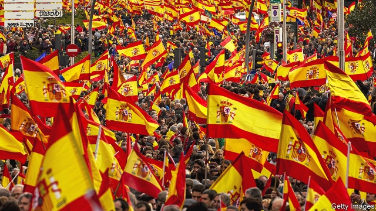
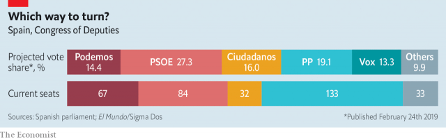

###### The two souls of Ciudadanos

# Spain’s centrist party is struggling to stay that way 

##### Catalan separatism has pushed politics to the right—but how far? 

 

> Feb 28th 2019 

IN IMPROBABLY WARM weather some 500 people gathered on February 23rd in Plaza de la Villa, one of Madrid’s oldest squares, to launch the election campaign of Ciudadanos (Citizens), one of Spain’s newer political parties. A year ago Ciudadanos, which describes itself as a centrist, liberal party, was leading the opinion polls, with around 27% of the vote in a crowded field. Now it trails behind both the governing Socialists and the conservative People’s Party (PP). Yet Ciudadanos and its young leader, Albert Rivera, may still hold the key to Spain’s next government. 

Mr Rivera fired the opening shot in the campaign by rejecting, from the outset, a coalition with the Socialist party of Pedro Sánchez, the prime minister since June, whom he accused of disregard for the constitution in his negotiations with Catalan separatists. In doing so, Mr Rivera has tried to define the character of the election due on April 28th. It will be about the unity of Spain and it will be a contest between the Socialists on the one hand and a three-headed block to the right of centre in which Ciudadanos has lined up with the PP and Vox, a new ultra-conservative party. 

A fortnight earlier this trio joined forces in a much bigger demonstration in another Madrid square, to protest against Mr Sánchez. Vox is a Spanish nationalist party that in some respects resembles far-right movements elsewhere in Europe. This is a strange place to be for a liberal party once compared to Emmanuel Macron’s En Marche in France. “I’m surprised they are putting a cordon sanitaire against me and not the far right,” said Mr Sánchez. 

This stance can only be understood in the “exceptional circumstances” of Spain, says Inés Arrimadas, until now Ciudadanos’s leader in Catalonia and the party’s star attraction, who announced in the Plaza de la Villa that she will run for parliament for Barcelona. In October 2017 the separatist regional administration in Catalonia held a “binding”, although unofficial, referendum and declared independence later that month in defiance of the constitution. These events amounted to a “coup”, says Ms Arrimadas. 

 

Mr Sánchez came to office after a censure motion against Mariano Rajoy, the previous PP prime minister, and with the backing of Catalan and Basque nationalists in the Madrid parliament. Mr Sánchez has attempted to defuse the conflict in Catalonia through a less confrontational attitude. Ms Arrimadas accuses him of making “concessions” to coup-mongers by failing to stop the separatists from using public resources to promote their “republic”. 

Ciudadanos, which was formed in Catalonia, has always had two souls: one liberal and the other anti-separatist and thus Spanish nationalist. It is still liberal on lifestyle issues and favours modernising economic reforms, but these proposals are “harder to understand” in a “polarised scenario”, says Toni Roldán, a Ciudadanos legislator. The party’s rise and its decline owe much to the political earthquake caused by Catalan separatism. In a regional election in Catalonia in December 2017 Ms Arrimadas’s muscular campaigning helped Ciudadanos win the most votes, although the three separatist groups retained their narrow majority of seats in the Catalan parliament. Because of separatist intimidation “it’s not easy being Ciudadanos in Catalonia,” she said in the Plaza de la Villa. But as the embodiment of the defence of the Spanish nation, the party surged in the national opinion polls. 

The Catalan events pushed public opinion, traditionally slightly left of centre, to the right. At the last election in 2016 the right won 46% of the vote; today it polls at 55%, points out Kiko Llaneras, a psephologist. The difference is that today the right is split in three, which means it will probably win fewer parliamentary seats. From nowhere, Vox took 11% of the vote in a regional election in Andalucía in December, helping to eject the Socialists from the regional administration they had run for almost 40 years. Mr Rivera’s vetoing of Mr Sánchez is thus a “defensive move” to stop Ciudadanos voters moving to Vox, says Mr Llaneras. 

It may help Mr Sánchez, in two ways. He broke off talks with the separatists last month, although this contributed to him losing his budget and thus precipitated his calling of the election. He is now seeking votes in the centre ground from which Ciudadanos is retreating. After the shock in Andalucía, where some 400,000 left-wing voters stayed at home, the Socialists expect the spectre of Vox to help get out the vote. The core of Mr Sánchez’s campaign will be about “what kind of country do you want”, says Manuel de la Rocha Vázquez, an adviser to the prime minister. “Do we want a closed, nationalistic, xenophobic, male-dominated society? We strongly believe that the majority of Spaniards are in favour of an open, pluralistic, multicultural, tolerant society,” he says. 

Although this is the third general election since December 2015, its character shows how quickly the country has changed. The past two were held in the shadow of austerity and corruption involving the PP and the Socialists, who seemed to face extinction at the hands of Podemos, a far-left party. Now Podemos is fading amid internal splits. Mr Sánchez, a politician of no fixed ideology, has hastened that process by feinting left in office, with a big increase in the minimum wage and budget proposals for higher social spending. Instead of the Socialists, it is Ciudadanos and the PP who now have to fight on two fronts. Catalan separatism is Spain’s thorniest problem. But it is Vox, rather than Podemos, which seems to many like the immediate threat to the system. All this suggests that Mr Rivera’s bet on forming a centre-right government is a risky one. 

-- 

 单词注释:

1.centrist['sentrist]:n. 中间党派的成员, 温和主义者 [法] 中间派议员, 中立派议员 

2.Catalan['kætәlәn]:n. 加泰隆人, 加泰隆语 

3.separatism['sepәrәtizm]:n. 分离主义 

4.politic['pɒlitik]:a. 精明的, 明智的, 策略的 

5.improbably[im'prɒbәbli]:adv. 未必会地, 不象真实地 

6.plaza['plɑ:zә]:n. 广场, 市场, 购物区 

7.de[di:]:[化] 非对映体过量 [医] 铥(69号元素铥的别名,1916年Eder离得的假想元素) 

8.La[lɔ:, lɑ:]:[医] 镧(57号元素) 

9.villa['vilә]:n. 别墅 

10.p[pi:]:便士 [计] 页, 对, 并行, 奇偶性, 指示器, 多项式, 程序, 方法, 皮 

11.albert['ælbәt]:n. 艾伯特（男子名） 

12.Rivera[]:n. 里韦拉（乌拉圭北部最重要的边境城市, 里韦拉省首府） 

13.coalition[.kәuә'liʃәn]:n. 结合体, 结合, 联合 [经] 联合, 联盟 

14.pedro['pi:drәu]:n. 彼得牌戏（一种纸牌戏） 

15.disregard[.disri'gɑ:d]:n. 忽视, 漠视 vt. 忽视, 不顾 

16.negotiation[ni.gәuʃi'eiʃәn]:n. 谈判, 磋商, 交涉 [经] 谈判, 协商 

17.separatist['sepәreitist]:n. 分离主义者, 独立派 

18.Spain[spein]:n. 西班牙 

19.vox[vɔks]:[医] 语音, 语声 

20.trio['tri:әu]:n. 三重唱 

21.demonstration[.demәn'streiʃәn]:n. 示范, 实证 [医] 示教, 实物教授 

22.Madrid[mә'drid]:n. 马德里 

23.nationalist['næʃәnәlist]:n. 国家主义者, 民族主义者 

24.emmanuel[i'mænjuәl]:n. 以马内利（耶稣基督的别称）；伊曼纽尔（男子名, 等于Immanuel） 

25.en[en]:n. 字母N, (铅字)半方 prep. 在...中, 作为 

26.Marche[]:n. 马尔什（法国中部地区旧省）；马尔凯（位于意大利中部） 

27.cordon['kɒ:dәn]:n. 哨兵线, 非常警戒线, 饰带 vt. 用警戒线围住 

28.sanitaire[]:[网络] 生化处理；曝气系统与现场清洗系统 

29.stance[stæns]:n. 准备击球姿势, 站立的姿势, 位置, 姿态 [经] 地位, 形势 

30.exceptional[ik'sepʃәnәl]:a. 例外的, 异常的, 特别的 

31.catalonia[,kætә'lәjniә]:n. 加泰罗尼亚（西班牙东北地方） 

32.Barcelona[.bɑ:si'lәunә]:n. 巴塞罗那 

33.regional['ri:dʒәnәl]:a. 地方的, 地域性的 [医] 区的, 部位的 

34.unofficial[.ʌnә'fiʃәl]:a. 非正式的, 非官方的 [化] 非法定的; 未入药典的 

35.referendum[.refә'rendәm]:n. （就重大政治或社会问题进行的）全民公决，全民投票 

36.defiance[di'faiәns]:n. 蔑视, 挑战 [法] 挑战, 藐视, 违抗 

37.coup['ku:]:n. 砰然的一击, 妙计, 出乎意料的行动, 政变 [医] 发作, 中, 击 

38.censure['senʃә]:n. 责难 vt. 非难, 指责 

39.Mariano[]:马里亚诺 

40.Rajoy[]:[网络] 拉霍伊；西班牙总理拉荷伊；总理拉霍伊 

41.Basque[bæsk]:n. 巴斯克衫(女子紧身上衣), 巴斯克人, 巴斯克语 a. 巴斯克人的 

42.defuse[.di:'fju:z]:vt. 去掉...的引信, 平息 

43.les[lei]:abbr. 发射脱离系统（Launch Escape System） 

44.confrontational[ˌkɒnfrʌnˈteɪʃnl]:a. 挑衅的; 对抗的 

45.concession[kәn'seʃәn]:n. 特许, 让步, 认可 [经] 核准, 许可, 特殊(权) 

46.alway['ɔ:lwei]:adv. 永远；总是（等于always） 

47.lifestyle['laifstail]:n. 生活方式 

48.modernise['mɔdәnaiz]:vt.vi. (使)现代化, (使)适应现代需要 vi. 用现代方法 

49.polarise['pәjlәraiz]:vi.vt. (使)极化, (使)偏振, (使)两极分化 

50.scenario[si'nɑ:riәu]:n. 剧本提纲, 情节, 剧本, 方案, 事态 [计] 方案 

51.toni['tәuni]:n. 托妮（女子名） 

52.legislator['ledʒisleitә]:n. 立法者, 立法官, 立法委员 [法] 立法者, 立法机关成员, 立法委员 

53.muscular['mʌskjulә]:a. 强壮的, 肌肉发达的, 有力的 [医] 肌的; 肌肉发达的 

54.intimidation[in,timi'deiʃәn]:n. 恐吓, 威胁 [法] 恐吓, 威胁 

55.embodiment[im'bɒdimәnt]:n. 具体化, 化身 

56.surge[sә:dʒ]:n. 巨涌, 汹涌, 澎湃 vi. 汹涌, 澎湃, 颠簸, 猛冲, 突然放松 vt. 使汹涌奔腾, 急放 [计] 电压尖峰 

57.traditionally[]:adv. 传统上；传说上；习惯上 

58.kiko[]:abbr. 矶村（人名） 

59.psephologist[]:[法] 选举学家 

60.parliamentary[.pɑ:lә'mentәri]:a. 国会的, 议会的, 议会制度的 

61.eject[i'dʒekt]:vt. 逐放, 放逐, 喷射 [化] 排出 

62.veto['vi:tәu]:n. 否决权 vt. 否决, 禁止 

63.defensive[di'fensiv]:a. 防卫的, 防备用的, 自卫的 n. 守势, 防卫姿势, 防卫物 

64.voter['vәutә]:n. 选民, 投票人 [法] 选民, 选举人, 投票人 

65.precipitate[pri'sipiteit]:n. 沉淀物, 凝结物, 结果 vt. 猛抛, 使陷入, 促成, 使沉淀 vi. 猛地落下 a. 突然的, 猛地落下的, 轻率的 

66.spectre['spektә]:n. 幽灵, 妖怪, 凶兆 

67.manuel['mænjuel]:n. 曼纽尔（男子名）；曼努埃尔二世（拜占庭皇帝约翰五世的次子） 

68.Rocha[]:罗恰（乌拉圭地名） 

69.adviser[әd'vaizә]:n. 顾问, 劝告者, 指导教师 [法] 顾问, 劝告者 

70.nationalistic[.næʃәnә'listik]:a. 国家主义的 

71.xenophobic[,zenәj'fәjbik,,zi:-]:a. 畏惧和憎恨外国人的 [法] 仇外的, 恐惧外国人的 

72.Spaniard['spænjәd]:n. 西班牙人 

73.pluralistic[.pluәrә'listik]:a. 兼职的, 多元论的 

74.multicultural[.mʌlti'kʌltʃәrәl]:a. 融合或具有多种文化的；多种文化的 

75.tolerant['tɒlәrәnt]:a. 宽容的, 容忍的, (对冷、热)能耐的 [医] 能耐受的 

76.quickly['kwikli]:adv. 很快地 

77.austerity[ɒ'sterәti]:n. 朴素, 苦行, 严格, 严峻 

78.corruption[kә'rʌpʃәn]:n. 腐败, 堕落, 贪污 [计] 论误 

79.extinction[ik'stiŋkʃәn]:n. 消失, 消灭, 废止 [化] 消光; 熄灭 

80.podemos[]:[网络] 社会民主力量党；社会民主党；社会暨民主力量党 

81.amid[ә'mid]:prep. 在其间, 在其中 [经] 在...中 

82.ideology[.aidi'ɒlәdʒi]:n. 思想体系, 意识形态, 观念学, 空论 [医] 观念学, 观念形态 

83.feint[feint]:n. 伪装, 假装, 假托, 佯攻 vi. 装作, 假装, 佯攻 a. 假的, 虚饰的 

84.thorny['θɒ:ni]:a. 多刺的, 令人苦恼的 

85.risky['riski]:a. 危险的 

