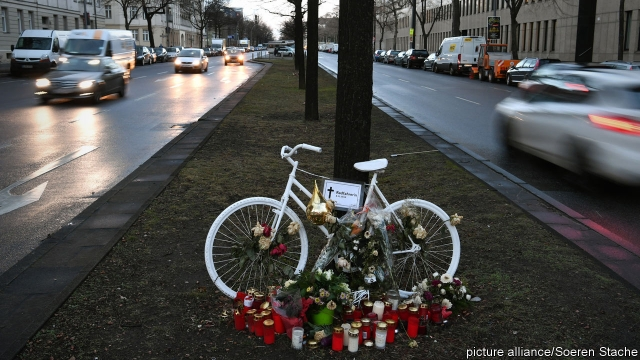

###### Berlin’s brave bikers

# The German capital wants drivers to stop killing cyclists 

##### If the streets are safer, more people will pedal 

 

> Feb 28th 2019 

TEDDYBEARS, CANDLES and flowers are piled up around a white-painted bike on the side of the road. This is a memorial to an eight-year-old boy who died after being hit by a truck while cycling with his mother to school. These white “ghost bikes” are dotted around Berlin at spots where cyclists have perished. In 2018 nearly one cyclist a month died on the roads of Germany’s capital. 

Berlin’s state government, a three-way Social-Democrat, Green and Left Party coalition, is promising a “transport revolution” to reduce the number of road deaths to zero. Last year 45 people died in traffic accidents in Berlin, 11 of them on bikes. (In London, a city nearly three times bigger, 10 cyclists were killed in 2017). In June Berlin passed a law to make driving less attractive. The aim is to turn the city into a sea of Lycra. “Privileging cars has to stop,” says Matthias Tang of Berlin’s department for transport and the environment. 

Busy intersections are being redesigned for bikes. Some main roads are getting two-metre-wide cycle-paths that are separated from traffic by bollards, to stop motorists parking on bike-paths, a common outrage. Over 100km of bike-only highways into the city will be built, and secure bicycle storage set up at train stations. Officials say safer roads will encourage people to swap petrol for pedal-power, thereby reducing pollution and congestion. 

But progress has been slow. Berlin’s current government was formed more than two years ago, and promised better bike infrastructure from the start. But the first new wider cycle lanes have only just been built. Opposition conservatives oppose the law, so unless the pedallers’ paradise is built quickly, the “revolution” could be reversed by a change of government in less than three years. Meanwhile, more space for bikes means less for cars, and motorists will not surrender their parking spots without a fight. “It’s expropriation by the back door,” says Jörg Becker of ADAC, a drivers’ association. 

Berlin’s population is growing and the economy is doing well. More workers mean that once-quiet streets are getting congested. Rising rents are pushing residents out of the centre, increasing the number of car-commuters and making trains and buses more crowded. More Berliners would no doubt like to get out and feel the breeze in their hair—if they were less worried about being mown down by motorists. 

-- 

 单词注释:

1.biker['baikә(r)]:n. 骑自行车/摩托车的人 

2.pedal['pedl]:n. 踏板, 脚蹬子 a. 脚的, 脚踏的 vt. 用脚踏动 vi. 踩踏板, 骑车 

3.teddybear[]:na. 玩具熊 [网络] 泰迪熊；熊娃娃；泰迪熊家族 

4.Berlin[bә:'lin]:n. 柏林, (软质)柏林毛线 

5.perish['periʃ]:vi. 毁灭, 丧生, 凋谢, 颓丧, 死亡, 腐烂 vt. 毁坏, 使麻木, 使丧生, 耗尽 

6.coalition[.kәuә'liʃәn]:n. 结合体, 结合, 联合 [经] 联合, 联盟 

7.les[lei]:abbr. 发射脱离系统（Launch Escape System） 

8.Lycra['laikrә]:[化] (商)莱克拉(聚氨基甲酸酯纤维) 

9.Matthias[mә'θaiәs]:n. [宗]马提亚(耶稣受洗时所得诸使徒之一) 

10.tang[tæŋ]:n. 强烈味道, 特殊的气味, 特性, 柄脚, 当的一声, 墨角藻 vt. 使发气味, 装刀柄于, 使发出当的一声 vi. 发出当的一声 

11.intersection[.intә'sekʃәn]:n. 交集, 十字路口, 交叉点 [计] 逻辑乘; 与 

12.redesign[,ri:di'zain]:[化] 重新设计 

13.bollard['bɒlәd]:n. 系船柱 

14.motorist['mәutәrist]:n. 开汽车者, 驾车旅行的人 

15.outrage['autreidʒ]:n. 暴行, 侮辱, 愤怒 vt. 凌辱, 虐待, 触犯 

16.congestion[kәn'dʒestʃәn]:n. 拥挤, 充血 [计] 拥挤, 拥塞 

17.infrastructure['infrәstrʌktʃә]:n. 基础结构, 基础设施 [经] 基础设施 

18.opposition[.ɒpә'ziʃәn]:n. 反对, 敌对, 相反, 在野党 [医] 对生, 对向, 反抗, 反对症 

19.quickly['kwikli]:adv. 很快地 

20.expropriation[eks.prәupri'eiʃәn]:n. 征用, 收用, 征收 [经] 征用, 没收, 征购 

21.becker[]:n. 贝克尔（美国经济学家） 

22.ADAC[]:[计] 模数/数模转换器, 数据自动采集中心 

23.congest[kәn'dʒest]:vt. 使充满, 使拥塞, 使充血 vi. 充塞, 充血, 拥挤 

24.Berliner[bә'linә]:n. 柏林市民 

25.mow[mau. mәu]:n. 草堆, 皱眉, 怪脸 vt. 割草 vi. 割草, 做怪脸 

