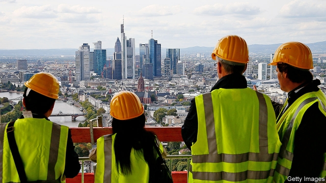
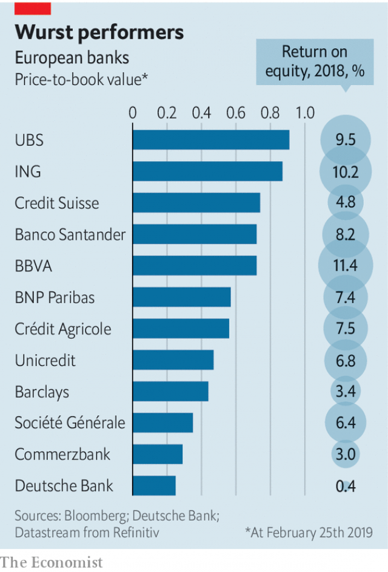

###### German banks

# Commerzbank and Deutsche Bank would gain little by merging 

##### Low interest rates and the three-pillar system squish profits 

 

> Feb 28th 2019 

GERMANY’S ECONOMY may be slowing, but its financial capital is booming. New towers are rising to join those of Commerzbank, Deutsche Bank, DZ Bank, Helaba and others on Frankfurt’s jagged skyline. More are on the drawing board. Had you read no financial news for the past decade, you might presume that Germany’s banks were thriving too. 

How wrong you would be. Bankers grumble about subterranean official interest rates—they must pay the European Central Bank 0.4% a year to deposit cash—that show no sign of rising. Those compound an old problem: Germany’s extraordinarily crowded banking market. The country has 1,580 banks, grouped in three “pillars”: private, public and co-operative. Although the grand total is shrinking by 40-60 a year, the public pillar still contains 385 Sparkassen—savings banks, mainly municipally owned—and half a dozen Landesbanken—regional lenders, such as Helaba, that also act as clearers for Sparkassen. There are 875 local co-ops. Their clearer and corporate lender, DZ Bank, is Germany’s second-biggest bank by assets. 

Some, to be sure, have found ways of making money. Unencumbered by the cost of running branches, DiBa, an online bank owned by ING, a Dutch lender, has clocked up double-digit returns on equity (ROE). But according to Oliver Wyman, a consulting firm, German banks’ average ROE dwindled from a thin 4% in 2010 to a dreadful 1% in 2016. Big private-sector banks are the most discomfited by the lack of elbow room. They have to compete with public and co-op sector banks that have goals beside profits. The private banks’ shareholders regard 10% as a decent ROE. Few big European banks hit that mark; Germany’s are far from it (see chart). 

 

Deutsche Bank, the country’s biggest bank, left it ludicrously late to adapt to the financial crisis of 2007-08. Since 2015 it has been undergoing a painful restructuring, including cuts in global investment banking, where before the crisis it went toe-to-toe with Wall Street’s mightiest. In 2018 it made its first annual profit in four years—just. Its ROE was 0.4%. Commerzbank, the third-biggest, made a mere 3%. On the stockmarket Deutsche is worth less than a quarter of the book value of its equity; Commerzbank, a little more. 

Reportedly, Germany’s government would like to see Commerzbank and Deutsche Bank merge. Politics aside, the state has a limited direct say. It owns 15% of Commerzbank, the legacy of a bail-out and a merger with the stricken Dresdner Bank in 2008-09. It has no stake in Deutsche. Rumour has also linked Commerzbank with French and Italian suitors, and suggested that Deutsche’s bosses would prefer a deal with Switzerland’s UBS, but ministers may be loth to see another big bank in foreign hands (HVB, based in Munich, is owned by Italy’s UniCredit). In a speech on industrial strategy last month Peter Altmaier, the economy minister, included Deutsche in a list of “national champions”—although national albatross is more accurate. 

It is possible to build a business case for a deal. The main gains would come from cutting costs and greater scale in retail banking. Deutsche has around 1,500 branches (including those of Postbank, which it bought in 2008-10) and Commerzbank 1,000. Combined, the two would have nearly 20% of total deposits, according to Autonomous Research, easily the biggest share. There is some overlap in business customers, but Commerzbank focuses on the Mittelstand, Germany’s army of mainly private, export-oriented firms and Deutsche more on bigger companies. Commerzbank has quit investment banking; Deutsche, though weakened, has clung on. 

The timing, though, would be terrible. Deutsche, having decided to sell Postbank in 2015 and to keep it two years later, is still tying two systems together. A merger would mean combining Commerzbank too. Both banks are already slashing costs and shedding staff; a union would add another round. 

And the deal would do little to ease the banks’ biggest headache: the structure of Germany’s banking market. Though they consist largely of minnows, the public and co-operative sectors are serious rivals, accounting for most deposits, mortgages and lending to companies. Without faster consolidation in those pillars—or inter-pillar deals— marriage will not bring Commerzbank and Deutsche bliss. 

Granted, the past decade has seen action, besides the steady stream of unions among neighbouring savings banks and co-ops. The merger of DZ Bank and WGZ Bank, a similar but smaller outfit, in 2016 united the top of the co-operative pillar. In the public sector, the financial crisis forced the eventual dismembering of WestLB, much of which was absorbed by Helaba, in 2012. HSH Nordbank, another Landesbank, was bought by private investors last year, having been sunk by bad shipping loans and recapitalised with state help, and renamed Hamburg Commercial Bank. 

Helmut Schleweis, the head of the German Savings Banks Association (DSGV), which represents the public-sector banks, has called for the creation of a “super Landesbank”. According to Handelsblatt, a financial newspaper, he wanted to start with the merger of Helaba and NORD/LB, another Landesbank holed by bad shipping debts, and eventually to bring in LBBW, from the south-west, Deka Bank, an asset manager, and Berlin Hyp, a mortgage lender. 

Late last year Helaba had a close look at NORD/LB—its domain would have stretched from the river Main to the Baltic—but could not agree on terms. The DSGV and Lower Saxony’s state government have since hatched a plan to recapitalise NORD/LB. Cerberus, an American private-equity firm, is said to be a likely buyer. (A rare optimist about German banking, Cerberus has stakes in both Commerzbank and Deutsche Bank and part-owns Hamburg Commercial Bank.) 

Without that first stage, the super-Landesbank looks improbable. Even with it, persuading public-sector owners, with their own political agendas, to give up a large stake in their local bank for a smaller slice of a national one would be a tall order. A regional savings banks’ association owns nearly 70% of Helaba, for instance; the state of Baden-Württemburg owns 41%, and the city of Stuttgart 19%, of LBBW. 

Mergers between pillars remain all but unthinkable for now. Klaus-Peter Müller, a former boss of Commerzbank, once declared that he admired the Sparkassen so much he would like to buy one, if only he could. With that path to consolidation closed, his successors may wonder how they will ever make much money from the domestic market. But others might look at Germany’s economic record over the decades and conclude that the three-pillar system has served the country pretty well—even if it frustrates some of the occupants of Frankfurt’s towers. 

-- 

 单词注释:

1.commerzbank[]: 德国商业银行公司总部所在地：德国主要业务：银行 

2.deutsche[]:n. 德意志联邦共和国马克 

3.merge[mә:dʒ]:vt. 使合并, 使消失, 吞没 vi. 合并, 渐渐消失 [计] 合并 

4.squish[skwiʃ]:n. 咯吱声, 挤扁 vt. 把...挤扁, 压扁 vi. 咯吱咯吱地走 

5.dz[]:n. 阿尔及利亚的域名 

6.jagged['dʒægd]:a. 锯齿状的 [电] 锯齿形的 

7.skyline['skailain]:n. 天涯, 地平线, 空中轮廓线 

8.presume[pri'zu:m]:vt. 假定, 推测, 擅自, 意味着 vi. 擅自行动, 相信 

9.banker['bæŋkә]:n. 银行家, 庄家 [经] 银行业者, 银行家 

10.grumble['grʌmbl]:n. 怨言, 满腹牢骚 vi. 抱怨, 发牢骚, 发隆隆声 vt. 抱怨 

11.subterranean[.sʌbtә'reinjәn]:a. 地下的, 秘密的 n. 地下室, 地下工作者 

12.extraordinarily[ik'strɔ:dθnәrili]:adv. 非凡, 破例, 特别, 非常, 离奇, 使人惊奇, 惊人, 特命, 特派 

13.municipally[mju:'nisipәli]:adv. 市政方面 

14.lender['lendә]:n. 出借人, 贷方 [经] 出借者, 贷方, 贷款人 

15.clearer['kliәrә]:[医] 澄清剂, 透明剂; 洗剂(牙) [经] (票据)交换员 

16.corporate['kɒ:pәrit]:a. 社团的, 合伙的, 公司的 [经] 团体的, 法人的, 社团的 

17.asset['æset]:n. 资产, 有益的东西 

18.unencumbered['ʌnin'kʌmbәd]:a. 没有阻碍的, 不受妨碍的, 没有负担的, 没有家累的, 没有子女的 

19.diba[]:abbr. di-isobutyl adipate 己二酸二异丁酯; Domestic and Internal Business Administration 国内与国际业务管理; digital internal ballistic analyzer 膛内弹道数据分析; Dominion Investment and Banking Association 领土投资和银行协会 

20.online[]:[计] 联机 

21.ing[]:abbr. 惯性导航与制导（Inertial Navigation and Guidance）；强中子发生器（Intense Neutron Generator） 

22.Dutch[dʌtʃ]:n. 荷兰人, 荷兰语 a. 荷兰的 

23.equity['ekwiti]:n. 公平, 公正 [经] 权益, 产权 

24.roe[rәu]:n. 狍, 鱼子, 鱼卵 [医] 鱼卵, 牝鹿 

25.oliver['ɒlivә]:n. 脚踏铁锤 

26.Wyman[]:怀曼（人名） 

27.dwindle['dwindl]:vi. 减少, 缩小, 衰落 vt. 使缩小 

28.dreadful['dredful]:a. 可怕的 

29.discomfit[dis'kʌmfit]:vt. 打乱, 挫败, 使破灭 

30.sector['sektә]:n. 扇形, 部门, 部分, 函数尺, 象限仪, 段, 区段 vt. 把...分成扇形 [计] 扇面; 扇区; 段; 区段 

31.shareholder['ʃєә.hәuldә]:n. 股东 [法] 股东, 股票持有人 

32.ludicrously['lu:dɪkrəslɪ]:adv. 滑稽地, 荒唐地 

33.restructuring[]:[计] 重构的 

34.mighty['maiti]:n. 有势力的人 a. 有势力的, 强大的, 有力的 adv. 很, 极 

35.stockmarket[s'tɒkmɑ:kɪt]: 证券市场; 证券交易所; 证券行情 

36.les[lei]:abbr. 发射脱离系统（Launch Escape System） 

37.reportedly[ri'pɒ:tidli]:adv. 根据传说, 根据传闻, 据报道 

38.politic['pɒlitik]:a. 精明的, 明智的, 策略的 

39.legacy['legәsi]:n. 祖先传下来之物, 遗赠物 [经] 遗产, 遗赠物 

40.merger['mә:dʒә]:n. 合并, 归并 [经] 购并 

41.dresdner[]:[网络] 德累斯顿；德利银行；德利 

42.suitor['sju:tә]:n. 起诉者, 请愿者, 求婚者 [法] 起诉人, 原告, 求婚者 

43.UB[]:[计] 上限 

44.loth[lәuθ]:a. 不愿意的, 厌恶的 

45.hvb[]: [计]= High Voltage Bias,高压偏压 

46.Munich['mju:nik]:n. 慕尼黑 

47.UniCredit[]:[网络] 意大利联合信贷银行；意大利裕信银行 

48.peter['pi:tә]:vi. 逐渐消失, 逐渐减少 

49.altmaier[]:[网络] 环境部长奥特梅尔 

50.albatross['ælbәtrɒs]:n. 信天翁, 沉重负担 

51.Postbank[]:[网络] 邮政银行；德国邮政银行；信贷银行德国邮政银行 

52.overlap[.әuvә'læp]:n. 重叠, 重复, 部分的同时发生 vt. 重叠, 重复, 与...同时发生 vi. 迭盖, 部分的同时发生 [计] 重叠 

53.Mittelstand[ˈmɪtlˌstænd]:[网络] 中小型企业；中小企业；德国中小型企业 

54.cling[kliŋ]:vi. 粘紧, 附着, 紧贴, 坚持 

55.timing['taimiŋ]:n. 时间选择, 时间测定, 定时, 调速 [计] 定时器时钟 

56.slash[slæʃ]:v. 猛砍, 乱砍 n. 猛砍, 乱砍, 删减 [计] 斜线 

57.minnow['minәu]:n. 鲤科淡水小鱼 

58.mortgage['mɒ:gidʒ]:n. 抵押, 约束性义务, 抵押借款 vt. 抵押, 以...作担保, 把...许给 

59.consolidation[kәn.sɒli'deiʃәn]:n. 巩固, 团结, 合并, 加强 [医] 实变 

60.bliss[blis]:n. 福佑, 天赐的福 [计] 实现系统软件的基本语言 

61.outfit['autfit]:n. 用具, 配备, 机构 vt. 配备, 供应 vi. 得到装备 

62.eventual[i'ventʃuәl]:a. 最后的, 终于的 

63.dismember[dis'membә]:vt. 割断手足, 支解, 分割 

64.westlb[]:[网络] 西德意志银行；西德意志州立银行；西德意志土地银行 

65.hsh[]:abbr. His （或 Her） Serene Highness 尊贵的殿下（间接提及时用） 

66.landesbank[]:[网络] 银行；地方银行；德国州立银行 

67.investor[in'vestә]:n. 投资者 [经] 投资者 

68.recapitalised[]:[网络] 资本重组 

69.rename[.ri:'neim]:vt. 重新命名, 再命名, 给...改名 [计] 重命名; DOS内部命令:更改文件名 

70.hamburg['hæmbә:^]:n. 汉堡（德国城市） 

71.Helmut[]:赫尔穆特 

72.creation[kri:'eiʃәn]:n. 创造, 创作物, 发明 [化] 产生 

73.handelsblatt[]:[网络] 德国商报；德国商业日报；德国商务日报 

74.deka[]:十进的 

75.Berlin[bә:'lin]:n. 柏林, (软质)柏林毛线 

76.hyp[hip]:<废> n.忧郁, 疑病 v. 使忧郁 

77.domain[dәu'mein]:n. 领域, 领土, 产业, 范围 [计] 域, 区域, 支配命令 

78.recapitalise[ri:'kæpitəlaiz]:vt. [主英国英语] = recapitalize 

79.Cerberus['sә:bәrәs]:n. 守护冥府入口的三头狗 

80.buyer['baiә]:n. 买主, 买方 [经] 买主, 买方, 买手 

81.optimist['ɔptimist]:n. 乐观者, 乐观主义者 

82.improbable[im'prɒbәbl]:a. 不大可能的, 不象发生的, 荒谬可笑的 [法] 未必会的, 不大可能发生的, 未必确实的 

83.regional['ri:dʒәnәl]:a. 地方的, 地域性的 [医] 区的, 部位的 

84.stuttgart['stut^ɑ:t]:n. 斯图加特（德国城市） 

85.unthinkable[.ʌn'θiŋkәbl]:a. 不能考虑的, 不能想像的, 想像不到的, 不合理的 

86.successor[sәk'sesә]:n. 继承者, 接任者 [计] 后继 

87.occupant['ɒkjupәnt]:n. 占有者, 居住者, 占用者 

