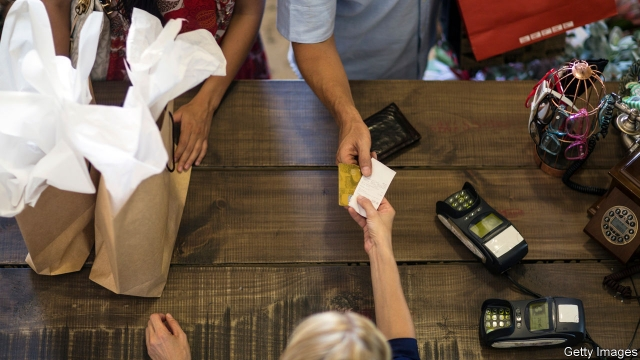

###### Hitting the jackpot

# Governments use receipt lotteries to boost tax compliance 

##### They make it harder for businesses to evade value-added taxes 

 

> Feb 28th 2019 

PEOPLE PAY taxes because governments say they must and society says they should. But what if tax compliance became fun? Governments around the world are encouraging consumers to ask for receipts by turning them into lottery tickets. Taiwan was an early experimenter, in 1951. The past decade has seen a flurry of such schemes: China, the Czech Republic, Lithuania, Portugal, Romania and Slovakia all now have them. Latvia will launch one later this year. 

The aim is to make it harder for retail businesses to evade taxes. Worldwide, 20-35% of government revenue comes from value-added taxes (VAT) or similar levies on consumption. But as much as a third of what should be collected is thought to be forfeited because businesses under-report revenues. The problem is not business-to-business transactions; firms can usually reclaim any VAT they pay if they keep proper records. But when selling direct to consumers, it is tempting to accept cash without recording the sale. A tax-dodging retailer can undercut law-abiding rivals or pocket a higher margin. 

The idea of a receipt-lottery scheme is to give customers an incentive to ask for receipts, thereby forcing sales to be recorded and taxed. Receipts might be printed with a code that can then be submitted into a central draw. Prizes range from decent sums of money to cars and holidays. Digital technology means schemes are cheap to run, even allowing for the cost of prizes. 

Few countries have studied schemes’ impact. An exception is Slovakia, which has run a lottery scheme since 2013 as one of a range of attempts to reduce its unusually high rate of VAT evasion. In 2014 the finance ministry estimated that the lottery had contributed a very modest €8m ($11m) in annual revenues. But the Brazilian state of São Paulo is so sure its lottery increases tax collection that it grants citizens who give their taxpayer number when making a purchase not just a chance to win a prize, but a rebate of 30% of the sales taxes they have paid. 

For governments trying to up the tax take, consumption taxes have appeal. They are less noticeable than income taxes or cuts to public services. But higher rates fall most heavily on poor people, who tend to spend a bigger share of their income. Receipt lotteries allow governments to raise revenue without raising rates. As a bonus, they also increase awareness of tax evasion and encourage citizens to look out for tax cheats. 

According to a report for the European Commission in 2017, of the ten European countries with the biggest shortfalls in collection of VAT in 2014-15, nine have, or are setting up, a receipt-lottery scheme. (Italy is the exception.) Though a receipt lottery cannot end evasion on its own, says Jonas Fooken, a researcher at the University of Queensland, adding “a bit of magic” to mundane purchases can help. 

-- 

 单词注释:

1.jackpot['dʒækpɔt]:n. 最大赌注, (彩票的)头奖, 最大成功, 意外的成功/奖赏, 困境 

2.lottery['lɒtәri]:n. 奖券, 彩票, 运气 [经] 抽彩给奖法 

3.compliance[kәm'plaiәns]:n. 遵从, 顺从, 屈从 [化] 柔顺; 顺应 

4.evade[i'veid]:v. (巧妙地)逃脱, 规避, 逃避 

5.taiwan['tai'wɑ:n]:n. 台湾 

6.experimenter[]:n. 实验者, 试验者 

7.flurry['flә:ri]:n. 疾风, 飓风, 慌张 vt. 使恐慌, 使激动 vi. 慌张 

8.Czech[tʃek]:n. 捷克人, 捷克语 a. 捷克的, 捷克语的, 捷克人的 

9.lithuania[,liθju(:)'einjә, -niә]:n. 立陶宛 

10.Portugal['pɒ:tʃugl]:n. 葡萄牙 

11.Romania[rәu'meinjә]:n. 罗马尼亚 

12.Slovakia[slәu'vækiә]:n. 斯洛伐克 

13.Latvia['lætviә]:n. 拉脱维亚 

14.VAT[væt]:n. 大桶 vt. 装入大桶, 在大桶里处理 

15.levy['levi]:n. 税款, 所征的人数, 征收 vi. 征税, 课税 vt. 征收, 强求, 召集 

16.forfeit['fɒ:fit]:n. 没收物, 罚金, 丧失 vt. 没收, 丧失 a. 丧失了的 

17.transaction[træn'sækʃәn]:n. 交易, 办理, 学报, 和解协议 [计] 事务处理 

18.reclaim[ri'kleim]:vt. 开垦, 改造, 感化, 纠正, 回收 vi. 喊叫, 抗议 

19.retailer['ri:teilә]:n. 零售商人, 传播的人 [经] 零售商 

20.undercut['ʌndәkʌt]:n. 底切, 牛腰部下侧嫩肉, 下口, 下旋削球 vt. 廉价出售, 底切, 雕出, 下旋削球 vi. 切除底部 

21.incentive[in'sentiv]:n. 动机 a. 激励的 

22.evasion[i'veiʒәn]:n. 逃避, 藉口 [法] 回避, 规避, 逃避 

23.Brazilian[brә'ziljәn]:n. 巴西人 a. 巴西的, 巴西人的 

24.paulo[]:n. 保罗（男子名） 

25.taxpayer['tækspeiә]:n. 纳税人 [法] 纳税人, 纳税义务人 

26.rebate[ri'beit]:n. 部分退款, 折扣 vt. 退还, 打折扣 vi. 退还部分付款 

27.les[lei]:abbr. 发射脱离系统（Launch Escape System） 

28.awareness[ә'weәnis]:n. 意识, 认识 [计] 识别, 议定, 明白 

29.shortfall['ʃɒ:tfɒ:l]:n. 不足, 不足量 [经] 缺少, 不足, 亏舱运费 

30.cannot['kænɒt]:aux. 无法, 不能 

31.Jona[]:n. (Jona)人名；(瑞典)约纳；(塞、冰、意)约娜 (女名), 约纳 abbr. 日本有机和自然食品协会（Japan Organic & Natural Foods Association） 

32.Queensland['kwi:nzlәnd]:[经] 昆士兰 

33.mundane['mʌndein]:a. 现世的, 世俗的, 宇宙的 

