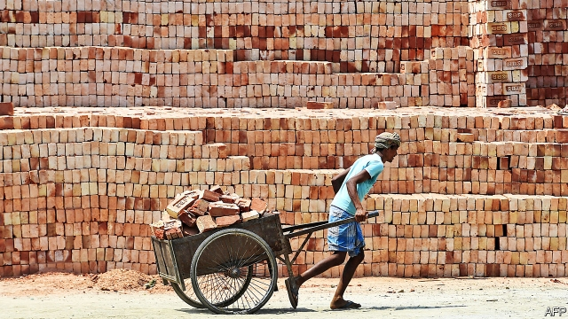
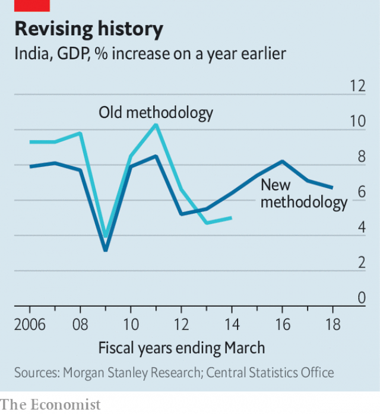

###### Modifications

# Narendra Modi’s most distinctive economic policies were his worst 

##### His economic policies have not broken with the past 

 

> Feb 28th 2019 

NARENDRA MODI, India’s prime minister, stormed to power so decisively in 2014 that it is difficult now to imagine any other outcome. But try. Imagine that the United Progressive Alliance (UPA), a tired coalition led (if that is the word) by the Congress party, had limped to victory instead. What economic policies might it have pursued in a third term? This is not an entirely idle question. Any assessment of Mr Modi’s economic record in his first stint as prime minister requires a counterfactual scenario against which to measure it. A third UPA government is one such baseline. 

A Congress-led government would no doubt have built on some of its existing pet initiatives, such as a job guarantee, providing employment on public works to rural households, and an identification scheme, giving every Indian a unique identity number based on a fingerprint or an iris scan. It presumably would have allowed the central bank to continue to fight against inflation, aided by a drop in oil prices. 

A third UPA government would surely have shied away from reforming India’s onerous labour laws or privatising poorly run public enterprises, like Air India. It probably would also have dallied with resolving the banking system’s bad loans, fearing it might otherwise be condemned for bailing out crony companies. 

As the next election approached, the UPA government would no doubt have indulged in giveaways to farmers (as in previous political cycles) and disguised its failure to hit fiscal targets through budgetary tricks. GDP growth and job creation would probably have improved little. 

The UPA never, of course, got this third bite of the cherry. It lost instead to Mr Modi, who promised a radical alternative to this steady-as-she-goes approach. But despite these bold pledges, Mr Modi’s first term in charge of the economy has proved to be rather similar to the hypothetical third UPA term described above. Much of what probably would have happened if Mr Modi had somehow lost also happened after he won. 

The parallels loom large. GDP growth has averaged about 7%, quicker than any other big economy but little different from the average for the five years before Mr Modi entered office. There have been no big reforms of land or labour markets; no junking of the employment guarantee or the identity scheme; and a costly delay in tackling banks’ bad loans. The government’s proudest economic feat was to implement a nationwide value-added tax that Congress had previously proposed. 

This continuity should not be a surprise. Although Mr Modi’s party won a rare majority in parliament, India’s political system still imposes checks on his power through the upper house, the courts, public auditors and the states, which have sole or joint responsibility for many of the reforms India needs. And although the Modi vote was a plea for more jobs and fewer scams, it was not a vote for liberal economics per se. Capitalism in India remains “stigmatised”, notes Arvind Subramanian, a former economic adviser to the government, in his new book, “Of Counsel”. 

Mr Modi did manage some departures from the baseline. It is hard to imagine the UPA cutting red tape as zealously (India has risen 65 places in the World Bank’s rankings of the ease of doing business since 2014) or courting foreign-direct investment (FDI) as assiduously. He contributed to the conquest of inflation by removing some fuel subsidies and limiting increases in the minimum prices for crops. His government helped open bank accounts for the poor and passed a welcome new bankruptcy law for firms. Corruption has been reduced. 

Sadly, fertiliser subsidies persist, minimum crop prices have jumped again, and the new bankruptcy system will take about six years to clear the backlog of cases at its present pace, reckons Mr Subramanian. Planned changes to e-commerce rules could hobble foreign firms operating in the country, such as Amazon and Walmart. 

Mr Modi’s most innovative decision was also his worst: the abrupt cancellation of high-denomination banknotes. The aim was to wipe out “black money”, piles of ill-gotten cash stashed outside the banking system. The government was therefore surprised when most of the notes were returned to the banks, before they expired, by long queues of depositors. It is a miracle the stunt did little lasting harm to the economy, if official data are to be believed. 

 

And that, sadly, is a real question. The government’s other alarming innovation has been to discontinue, revise or delay some official data that do not flatter it. It tried to prevent publication of a new report on employment, prompting two members of the country’s statistical-oversight body to resign. They also objected to the manner in which revised GDP data were released (see chart). The world will never know what would have happened under a third UPA government. And with less reliable official statistics, it will be harder to know what has happened under Mr Modi, too. 

-- 

 单词注释:

1.modification[.mɒdifi'keiʃәn]:n. 修正, 修饰, 修改 [化] 修饰; 修改 

2.narendra[]:[网络] 纳伦德拉；纳兰德；纳然陀 

3.distinctive[di'stiŋktiv]:a. 有特色的, 出众的 

4.narendra[]:[网络] 纳伦德拉；纳兰德；纳然陀 

5.MODI['mәudai]:[计] 模块化光学数字接口 

6.decisively[]:adv. 果断地；决然地 

7.alliance[ә'laiәns]:n. 联盟, 联合 [法] 同盟, 联盟, 联姻 

8.upa['ju:pə]: [医][=uridylyl phosphate adenosine]尿苷酰基磷酸腺苷 

9.coalition[.kәuә'liʃәn]:n. 结合体, 结合, 联合 [经] 联合, 联盟 

10.limp[limp]:n. 跛行 a. 柔软的, 无力的, 软弱的 vi. 跛行 

11.entirely[in'taiәli]:adv. 完全, 全然, 一概 

12.stint[stint]:vt. 节省, 限制, 停止 vi. 节约 n. 吝惜, 节约, 限额 

13.counterfactual[,kajntә'fæktʃjәl]:a. [逻]反事实的( 指在不同条件下有可能发生但违反现存事实的) 

14.scenario[si'nɑ:riәu]:n. 剧本提纲, 情节, 剧本, 方案, 事态 [计] 方案 

15.baseline['beislain]:n. 基线, 基准 [计] 基线, 基准 

16.fingerprint['fiŋgәprint]:n. 指纹 vt. 采指纹 

17.iris['airis]:n. 虹膜, 鸢尾属植物, 虹, 虹彩 [化] 可变光阑 

18.inflation[in'fleiʃәn]:n. 胀大, 夸张, 通货膨胀 [化] 充气吹胀; 膨胀 

19.onerous['ɒnәrәs]:a. 繁重的, 负有法律责任的 [法] 负有义务的, 艰巨的, 繁重的 

20.privatise[p'rɪvətɪs]:vt. 使私有化 

21.poorly['puәli]:adv. 贫穷地, 不充分地, 贫乏地 a. 身体不舒服的 

22.dally['dæli]:vi. 戏耍, 玩弄, 闲混 vt. 浪费 

23.bail[beil]:n. 保释, 拎环, 杓, 栅栏 vt. 保释, 舀水 

24.crony['krәuni]:n. 密友, 亲密伙伴, 好朋友 

25.indulge[in'dʌldʒ]:vt. 纵情于, 使高兴, 放任, 迁就 vi. 沉溺 

26.giveaway['givә.wei]:n. 泄漏, 免费赠品 

27.fiscal['fiskәl]:a. 财政的, 国库的 [经] 财政上的, 会计的, 国库的 

28.budgetary['bʌdʒitәri]:a. 预算的 [法] 预算的 

29.creation[kri:'eiʃәn]:n. 创造, 创作物, 发明 [化] 产生 

30.MODI['mәudai]:[计] 模块化光学数字接口 

31.pledge[pledʒ]:n. 诺言, 保证, 誓言, 抵押, 信物, 保人, 祝愿 vt. 许诺, 保证, 使发誓, 抵押, 典当, 举杯祝...健康 

32.hypothetical[,haipәu'θetikәl]:a. 假设的, 有待证实的, 假定的, 有前提的 [计] 理想的 

33.loom[lu:m]:n. 织布机, 若隐若现的景象 vi. 朦胧地出现, 隐约可见, 可怕地出现 

34.tackle['tækl]:n. 工具, 复滑车, 滑车, 装备, 扭倒 vt. 固定, 处理, 抓住 vi. 扭倒 

35.feat[fi:t]:n. 壮举, 功绩, 技艺表演 a. 灵巧的, 合适的, 整洁的 

36.continuity[.kɒnti'nju:iti]:n. 连续性 [化] 连续性 

37.auditor['ɒ:ditә]:n. 审计员, 听者, 旁听生 [经] 审计(查帐)员, 审计师, 会计检查员 

38.plea[pli:]:n. 恳求, 辩解, 抗辩, 诉讼, 请愿, 托词 [法] 抗辩, 申诉案件, 答辩 

39.scam[skæm]:n. 骗局, 诡计；故事 

40.SE[]:[计] 栈空, 系统扩充 [医] 硒(34号元素) 

41.capitalism['kæpitәlizәm]:n. 资本主义 [经] 资本主义 

42.stigmatise['stɪgmətaɪz]:vt. 使受耻辱, 指责, 污辱 

43.arvind[]:n. (Arvind)人名；(瑞典、印、肯)阿尔温德 

44.subramanian[]:[网络] 苏巴马廉王；苏布兰马尼安；苏布拉马尼亚 

45.adviser[әd'vaizә]:n. 顾问, 劝告者, 指导教师 [法] 顾问, 劝告者 

46.counsel['kaunsәl]:n. 商议, 忠告, 法律顾问 v. 商议, 劝告 

47.zealously[]:adv. (正式)热心, 渴望, 积极, 热诚, 热情 

48.ranking['ræŋkiŋ]:n. 等级, 地位 a. 上级的, 头等的, 超群的 

49.fdi[]:abbr. 飞行方向指示器（Flight Direction Indicator ）；世界牙科联合会（Federation Dentaire Internationale） 

50.assiduously[ə'sidʒuəsli]:adv. 刻苦地；勤勉地 

51.bankruptcy['bæŋkrәptsi]:n. 破产者 [经] 破产, 倒闭 

52.corruption[kә'rʌpʃәn]:n. 腐败, 堕落, 贪污 [计] 论误 

53.fertiliser['fә:tilaizә]:[化] 肥料 

54.backlog['bæklɔ^]:n. 积压待办的事务, 积压而未交付的订货, 积压的工作 vt. 储备, 把...积压起来 [计] 储备, 后备, 积压 

55.reckon['rekәn]:vt. 计算, 总计, 估计, 认为, 猜想 vi. 数, 计算, 估计, 依赖, 料想 

56.hobble['hɒbl]:vi. 蹒跚 vt. 使跛行, 阻碍 n. 跛行 

57.amazon['æmәzɒn]:n. 亚马孙河 [医] 无乳腺者 

58.walmart['wɔlma:t]: 沃尔玛（世界连锁零售企业） 

59.innovative['inәjveitiv]:a. 革新的, 创新的, 富有革新精神的 

60.cancellation[kænsә'leiʃәn]:n. 取消, 作废, 注销戳 [经] 注销, 取消, 保险单的注销 

61.banknote['bæŋknәut]:n. 钞票 

62.stash[stæʃ]:vt. 藏起来 n. 隐藏处, 隐藏物 

63.expire[ik'spaiә]:vi. 期满, 呼气, 断气 vt. 呼出 

64.depositor[di'pɒzitә]:n. 存放者, 存款人 [经] 存款人, 储户, 委托人 

65.stunt[stʌnt]:n. 特技, 绝技, 花招, 噱头, 手腕, 发育不良 vt. 阻碍成长 vi. 表演特技 

66.datum['deitәm]:n. 论据, 材料, 资料, 已知数 [医] 材料, 资料, 论据 

67.innovation[.inәu'veiʃәn]:n. 改革, 创新 [法] 创新, 改革, 刷新 

68.discontinue[.diskәn'tinju:]:vi. 中断, 终止, 停止 vt. 使中止 

69.les[lei]:abbr. 发射脱离系统（Launch Escape System） 

70.statistic[stә'tistik]:n. 统计量 a. 统计的, 统计学的 

