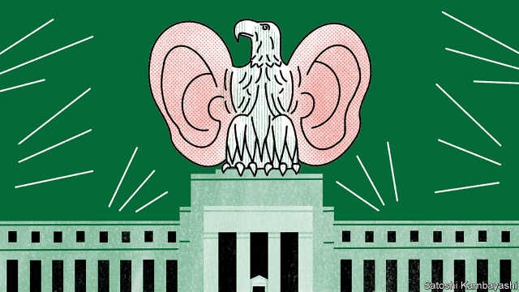

###### Food for thought

# The Federal Reserve reviews its monetary-policy framework 

##### Are there better ways for it to meet its inflation target? 

 

> Feb 28th 2019 

SARA GORATH was a little surprised when she was asked to speak at an event held by the Dallas Federal Reserve. What could a woman who runs a food bank have to say about monetary policy? On February 25th she found herself describing to Richard Clarida, vice-chairman of the Federal Reserve, the problems her customers face, including “how do you cut open a butternut squash if you don’t have a sharp knife?” 

The event was the first of many “Fed Listens” sessions, part of an official review of the Fed’s monetary-policy framework. In addition to the likes of Ms Gorath, the Fed will hear from business and trade-union leaders, as well as academics. If the economy were a squash, monetary policymakers want advice on how to carve it. 

Key questions will include whether the Fed should expand its toolkit and improve its communication. Also up for discussion is whether there might be better ways to meet its 2% inflation target (the level of the target itself will be taken as given). Perhaps, for example, rather than aiming for 2% regardless of recent history, policymakers should try to make up for past misses and aim for an average of 2% instead? 

One could ask why the review is happening now; economists have argued over the Fed’s framework for years. The first official answer is that economic conditions are ripe for some chin-stroking, with unemployment at its lowest level in decades and inflation close to target. Now is as good a time as any for the Fed to take stock. 

The second relates to the decline in interest rates around the world over the past decade, which could merit a change in the way monetary policymakers operate. Although central bankers should still be able to hit their inflation target in good times, when recessions strike they will find interest rates increasingly stuck at the lower bound of zero, with no room to cut them when the economy needs stimulating. 

The fear is that this downward drift blunts central bankers’ tools. If inflation hits the target in good times, but undershoots it in bad, inflation expectations could drift downwards. Since these expectations then influence wage and pricing decisions, they would in turn have an impact on actual inflation, making it harder to achieve the inflation target. 

Average-inflation targeting would mean that interest rates would be lower for longer after an inflation-sapping recession, as policymakers aim for a temporary overshoot. A shift in the framework could signal to investors and the public that the Fed would use monetary policy more aggressively to stimulate the economy in a recession, generating the sort of self-fulfilling confidence that could help a recovery. 

It might not work, of course, if no one believed that the Fed would be able to resist tightening policy when the economy did get going. It could also backfire. What if, in the process of temporary overshooting, inflation expectations began drifting above the target? On February 26th Pat Toomey, an American senator, sternly reminded Jerome Powell, the Fed’s chairman, that a period of overshooting would be a period without price stability. 

Cynics will dismiss the review as window-dressing. Even if Ms Gorath’s food bank contributes to her community, she had a point when she questioned her ability to inform monetary policymakers. And the bar for change seems high. The review’s unofficial context is a decade of the Fed struggling to hit its inflation target and a labour market that was too lousy for too long. Even after that, Mr Clarida reckons the existing framework has “served us well”. 

Defenders could point out that central banks are hardly nimble creatures. If a reform of the Fed’s framework were in the offing, this is the sort of process you might expect to precede it. The idea of a rethink certainly has some senior supporters. On February 22nd John Williams, the head of the New York Fed, said that the risk of slipping inflation expectations called for a reconsideration of the “dominant inflation-targeting framework”. 

Even if, as most expect, there is no formal change, the discussion could still lead to a greater tolerance of temporary overshooting after periods of limpness. Interest-rate rises are on hold for now, which could be evidence that the Fed is rethinking its carving technique. But with inflation still hovering around its target, it has not yet made a mark. 

-- 

 单词注释:

1.inflation[in'fleiʃәn]:n. 胀大, 夸张, 通货膨胀 [化] 充气吹胀; 膨胀 

2.Sara['sɑ:rә]:n. 萨拉族, 萨拉人 

3.dallas['dælәs]:n. 达拉斯（美国城市） 

4.monetary['mʌnitәri]:a. 货币的, 金钱的 [经] 货币的, 金融的 

5.richard['ritʃәd]:n. 理查德（男子名） 

6.clarida[]:[网络] 澄清 

7.butternut['bʌtәnʌt]:n. 灰胡桃 [化] 灰胡桃(Juglans cenerea) 

8.squash[skwɒʃ]:n. 挤压, 压碎的东西, 南瓜属植物, 拥挤的人群 vt. 压扁, 镇压, 压制 vi. 被压扁, 发溅泼声, 挤入 

9.policymaker['pɔlisi.meikә]:n. 政策制定者；决策人 

10.toolkit[]:[计] 工具包 

11.economist[i:'kɒnәmist]:n. 经济学者, 经济家 [经] 经济学家 

12.banker['bæŋkә]:n. 银行家, 庄家 [经] 银行业者, 银行家 

13.recession[ri'seʃәn]:n. 后退, 凹处, 衰退, 归还 [医] 退缩 

14.blunt[blʌnt]:a. 钝的, 坦率的, 麻痹的 

15.undershoot[.ʌndә'ʃu:t]:vt. 射击未达到(目标), 脱靶 n. 负脉冲信号, 负尖峰 

16.downwards['daunwәdz]:adv. 向下 

17.overshoot[.әuvә'ʃu:t]:vt. 打过头, 越过 vi. 射击越标, 过火 n. 超越目标, 讲话(或行动)过火 [计] 过冲 

18.investor[in'vestә]:n. 投资者 [经] 投资者 

19.aggressively[]:adv. (贬)侵略, 侵犯, 寻衅, (褒)敢作敢为, 有进取心, (武器)攻击性, 过分, 放肆 

20.tighten['taitn]:vt. 勒紧, 使变紧 vi. 变紧, 绷紧 

21.backfire[.bæk'faiә]:n. 逆火, 回火, 放火 vi. 放逆火, 预先放火, 发生意外 

22.toomey[]:n. (Toomey)人名；(英)图米 

23.senator['senәtә]:n. 参议员, (某些大学的)理事 [法] 参议员, 上议员 

24.sternly['stә:nli]:adv. 严格地, 严肃地, 严厉地 

25.jerome[dʒә'rәum]:n. 杰罗姆（男子名） 

26.powell['pәuәl, 'pauәl]:n. 鲍威尔（英国物理学家） 

27.cynic['sinik]:n. 犬儒学派的人, 玩世不恭的人, 愤世嫉俗者, 好挖苦人的人 a. 犬儒学派的 

28.unofficial[.ʌnә'fiʃәl]:a. 非正式的, 非官方的 [化] 非法定的; 未入药典的 

29.context['kɒntekst]:n. 上下文, 背景, 来龙去脉 n. 上下文 [计] 上下文 

30.lousy['lauzi]:a. 污秽的, 恶心的, 生虱的 

31.reckon['rekәn]:vt. 计算, 总计, 估计, 认为, 猜想 vi. 数, 计算, 估计, 依赖, 料想 

32.defender[di'fendә]:n. 防卫者, 防护者, 辩护者 [法] 辩护人, 保护人 

33.nimble['nimbl]:a. 敏捷的, 伶俐的, 聪明的 

34.offing['ɒ:fiŋ]:n. 海面, 离岸距离 

35.precede[.pri:'si:d]:vt. 在...之前, 优于, 较...优先 vi. 在前面 

36.rethink[ri:'θiŋk]:v. 再想, 重想 

37.supporter[sә'pɒ:tә]:n. 支持者, 后盾, 迫随者, 护身织物 [法] 支持者, 赡养者, 抚养者 

38.john[dʒɔn]:n. 盥洗室, 厕所, 嫖客 

39.williams['wiljәmz]:n. 威廉姆斯（男子名） 

40.york[jɔ:k]:n. 约克郡；约克王朝 

41.reconsideration[]:n. 再考虑, 再审查, 再议 

42.dominant['dɒminәnt]:a. 占优势的, 支配的 [医] 优性的, 显性的 

43.limpness['lɪmpnɪs]:n. 柔弱, 疲倦 

44.hover['hʌvә]:vi. 盘旋, 翱翔, 徘徊 vt. 孵 n. 翱翔 

