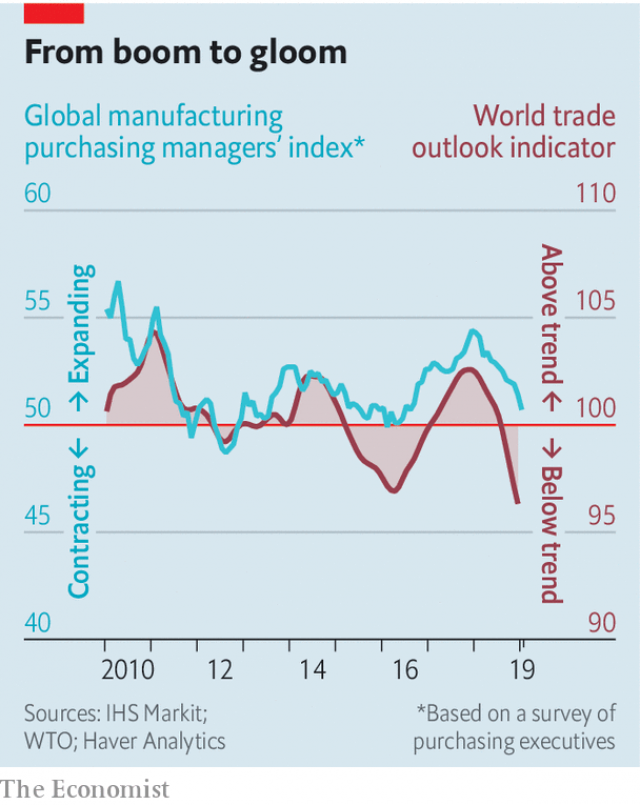

###### Free exchange

# Why a global manufacturing slump is a recurring threat 

##### China’s on-and-off efforts to curb lending spill over to the rest of the world 

 

> Feb 28th 2019 

THE GLOBAL economy had an inauspicious start to 2019. Markets went into a tailspin and America’s government was locked in a seemingly interminable shutdown. But matters have not played out as dismally as they might have. The government in Washington is open again. America and China appear close to a trade deal which, although modest in its achievements, would nonetheless reflect a welcome easing of tension between the world’s two biggest economies. Markets have smiled on these developments: the MSCI index of global shares has risen by 10% so far this year. 

Good news notwithstanding, many economic indicators have undergone a remarkable downward shift since early 2018. Back then economists were celebrating the emergence of a broad-based expansion. When it assessed the world economy in January last year, the IMF hailed the “broadest synchronised global growth upsurge since 2010”. Now the progress on trade talks is occurring against a darker economic backdrop. 

Global manufacturing activity has slowed (see chart). Economies that are especially reliant on trade, such as Germany and Japan, have suffered. Industrial production in the euro area has fallen over the past year. Both Japan and South Korea reported tumbling exports in January. The World Trade Organisation’s global trade outlook index has been falling for the past year. In February it dipped to its lowest level since 2010. America’s economy, which is less trade-dependent, has been relatively less harmed, though industrial production contracted in January. Why does the world’s manufacturing upswing appear to have flopped? 

 

It is tempting to blame President Donald Trump for the reversal. America has spent the past year ratcheting up its confrontation with China. The deceleration in manufacturing activity began around the time Mr Trump raised tariffs on washing machines and solar panels. It continued as America slapped tariffs first on steel imports and then on a range of Chinese goods, and as it restricted the involvement of Chinese technology firms in its economic affairs. A clash between the world’s two largest economies could not help but undermine global economic confidence. 

But there is more to the manufacturing swoon than Mr Trump’s trade war. The downturn bears a striking resemblance to the bout of economic trouble that began in 2015. Then, too, global manufacturing activity faltered. That was partly due to the bust that followed America’s extraordinary shale-oil boom. But China was also a big influence on exporters’ fortunes. Germany, for instance, has come to rely on China’s voracious appetite for its capital goods. 

Once they had hauled the economy through the global financial crisis of 2007-08, on the back of massive stimulus, China’s leaders pivoted towards economic reform in 2015. They sought to wean the economy off credit, which had grown at mind-boggling rates in 2009-14. They also took steps to open up China’s financial markets. The measures turned out to be premature: as constraints on capital movement were loosened, money fled the country and stock prices crashed. Financial turmoil radiated outwards, threatening to tip large swathes of the world economy into recession. 

The downward spiral was quickly halted. China put its plans to lift capital controls on ice; the stimulus taps were turned back on. The government eased monetary policy and began spending with gusto. Officially, China’s fiscal deficit expanded only modestly in 2015 and 2016, to just under 4% of GDP. But the government is adept at using special financing vehicles, primarily at the local-government level, to borrow and to direct funds to projects; these do not affect the official deficit figures. Researchers at Goldman Sachs, an investment bank, estimate that China’s “augmented” budget deficit, which includes such tactics, rose to around 15% of GDP in early 2017. The explosion of borrowing did the trick. By the end of 2017, the world was on the road to a synchronised upsurge. 

Having survived that close call, China’s leaders focused again on the economy’s dismaying reservoirs of red ink. They restricted lending to over-indebted firms and embarked on a bout of fiscal belt-tightening that would make even the prudent Germans blush. China’s augmented budget deficit has narrowed by about six percentage points of GDP since the beginning of 2017. Domestic demand has consequently weakened. As Brad Setser, an economist at the Council on Foreign Relations, a think-tank, has recently pointed out, China’s imports of manufactures for domestic use have fallen by more than its “processing imports”, or inputs into the products that China makes and exports. Its purchases of American goods have tumbled; imports from the rest of the world have fallen too. Although the trade war has played a role, the world economy’s recent ups and downs are more closely related to China’s on-and-off struggle to reform its economy and curb unruly borrowing. 

China should not matter so much. Its tight capital controls ensure that its financial links with the rest of the world remain modest. It is not yet the engine of global demand in the way that America is: Mr Setser notes that China’s manufacturing imports for its own consumption are only about a third as large as America’s (though recent growth in Chinese imports has been an important driver of manufacturing demand for some countries, such as Germany). The problem is not so much that the headwinds from China are powerful, but that the rest of the world is so poorly prepared to lean against them. Interest rates remain extraordinarily low. If the global manufacturing malaise worsens, America will have precious little room to cut rates in response; Europe and Japan will have none. Fiscal policy could pick up the slack. Advanced economies could badly use a dose of deficit-financed public investment. But neither the euro area nor America seem keen to build. 

Such policy debates may be inconsequential this time. In the last few weeks China has begun turning on the stimulus taps yet again, propping up sentiment there. The world’s manufacturing slowdown may well prove as fleeting as that of 2015. Both episodes show that the rich world has chosen to put itself at the mercy of the fiscal management of the Chinese Communist Party. That is a curious decision—but not an unprecedented one. 

-- 

 单词注释:

1.manufacturing[.mænju'fæktʃәriŋ]:n. 制造业 a. 制造业的 

2.slump[slʌmp]:n. 暴跌, 垂头弯腰的姿态 vi. 猛然掉落, 陷入, 衰落(经济等) 

3.recur[ri'kә:]:vi. 复发, 回到, 重现, 再来, 诉诸, 采用, 循环 

4.curb[kә:b]:n. 抑制, 勒马绳, 边石 vt. 抑制, 束缚, 勒住 

5.inauspicious[i.nɒ:'spiʃәs]:a. 不吉的, 凶兆的, 恶运的 

6.tailspin['teilspin]:n. 旋尾降落 

7.seemingly['si:miŋli]:adv. 看来似乎, 表面上看来 

8.interminable[in'tә:minәbl]:a. 无限的, 冗长的 

9.shutdown['ʃʌtdaun]:n. 关门, 停工, 停机 [经] 停工 

10.dismally[]:adv. 沉闷地；阴暗地 

11.Washington['wɒʃiŋtn]:n. 华盛顿 

12.nonetheless[,nʌnðә'les]:conj. 然而, 尽管, 不过 adv. 不过, 仍然, 尽管如此, 然而 

13.msci[]:abbr. medium scale compound integration 中规模混合集成; multi-protocol serial communications interface 多协议串行通信接口 

14.notwithstanding[.nɒtwiθ'stændiŋ]:adv. 虽然, 尽管 prep. 尽管 conj. 虽然 

15.indicator['indikeitә]:n. 指示器, 指示剂, 指标 [计] 指示器 

16.economist[i:'kɒnәmist]:n. 经济学者, 经济家 [经] 经济学家 

17.emergence[i'mә:dʒәns]:n. 出现, 浮现, 发生 

18.IMF[]:国际货币基金组织 [经] 国际货币基金 

19.hail[heil]:n. 冰雹, 致敬, 欢呼, 招呼 vt. 向...欢呼, 致敬, 招呼, 使象下雹样落下 vi. 招呼, 下雹 interj. 万岁, 欢迎 

20.synchronise['siŋkrәnaiz, 'sin-]:vi. (使)同时发生, (使)整步, (使)同步, (使)同速进行 vt. 使在时间上一致, 校准, 把钟表拨至相同的时间, 把...并列对照 

21.upsurge['ʌpsә:dʒ]:vi. 高涨, 涌起 n. 增长, 高潮 

22.backdrop['bækdrɒp]:n. 背景幕, 背景 

23.reliant[ri'laiәnt]:a. 依赖的, 信赖的 

24.euro['juәrәu]:n. 欧元（欧盟的统一货币单位） 

25.Korea[kә'riә]:n. 朝鲜, 韩国 

26.les[lei]:abbr. 发射脱离系统（Launch Escape System） 

27.upswing['ʌpswiŋ]:n. 回升时期, 上升, 向上摆动, 跃进 [经] 上升, 向上摆动 

28.donald['dɔnәld]:n. 唐纳德（男子名） 

29.trump[trʌmp]:n. 王牌, 法宝, 喇叭 vt. 打出王牌赢, 胜过 vi. 出王牌, 吹喇叭 

30.reversal[ri'vә:sl]:n. 翻转, 颠倒, 反转 [医] 逆转, 颠倒 

31.confrontation[.kɔnfrʌn'teiʃәn]:n. 对抗；对质；面对 

32.deceleration[.di:selә'reiʃәn]:n. 减速 [医] 减速[度] 

33.tariff['tærif]:n. 关税, 关税表, 价格表, 收费表 vt. 课以关税 [计] 价目表 

34.slap[slæp]:n. 掴, 掌击, 侮辱, 拍击声 v. 拍击, 惩罚 adv. 正面地, 直接地, 突然地 

35.involvement[in'vɔlvmәnt]:n. 卷入, 牵连, 包含, 困窘 [经] 财政困难, 经济上的困窘 

36.clash[klæʃ]:n. 冲突, 撞击声, 抵触 vi. 冲突, 抵触 vt. 使发出撞击声 [计] 对撞 

37.undermine[.ʌndә'main]:vt. 在...下面挖, 渐渐破坏, 暗地里破坏 [法] 暗中破坏, 以阴谋中伤伤害 

38.swoon[swu:n]:n. 昏晕, 晕厥 vi. 昏晕, 着迷, 渐渐消失 

39.downturn['dauntә:n]:n. (尤指经济方面的)衰退, 下降趋势 [电] 低迷时期 

40.resemblance[ri'zemblәns]:n. 相似处, 类似, 肖像 

41.bout[baut]:n. 一回, 回合, 较量 [医] 发作 

42.falter['fɒ:ltә]:vt. 支吾地说 vi. 支吾, 蹒跚地走 n. 颤抖, 支吾, 踌躇 

43.bust[bʌst]:n. 半身像, 胸部, 失败, 殴打 vt. 使爆裂, 使破产 vi. 爆裂, 破产 [计] 操作错 

44.voracious[vә'reiʃәs]:a. 贪吃的, 狼吞虎咽的, 贪婪的 

45.haul[hɒ:l]:n. 用力拖拉, 拖运, 强拉, 捕获量, 拖运距离 vi. 拖, 拉, 改变方向, 改变主意 vt. 拖拉, 拖运 

46.stimulus['stimjulәs]:n. 刺激, 激励, 刺激品 [医] 刺激特, 刺激 

47.pivote[]:[网络] 在枢轴上转动 

48.wean[wi:n]:vt. 使断奶, 使丢弃, 使断念 n. 小儿 

49.constraint[kәn'streint]:n. 强制, 约束 [计] 约束 

50.turmoil['tә:mɒil]:n. 骚动, 混乱 

51.swathe[sweiθ]:vt. 绑, 裹, 包围 n. 带子, 绷带 

52.recession[ri'seʃәn]:n. 后退, 凹处, 衰退, 归还 [医] 退缩 

53.spiral['spairәl]:n. 螺旋形之物, 螺线 a. 螺旋形的, 盘旋的 vi. 螺旋形下降, 螺旋形上升, 螺旋形行进 vt. 使螺旋形行进 

54.quickly['kwikli]:adv. 很快地 

55.monetary['mʌnitәri]:a. 货币的, 金钱的 [经] 货币的, 金融的 

56.gusto['gʌstәu]:n. 爱好, 嗜好, 由衷的高兴 

57.officially[ә'fiʃәli]:adv. 作为公务员, 职务上, 官方地 

58.fiscal['fiskәl]:a. 财政的, 国库的 [经] 财政上的, 会计的, 国库的 

59.deficit['defisit]:n. 赤字, 不足额 [医] 短缺 

60.modestly[]:adv. 适当地；谨慎地 

61.adept[ә'dept]:a. 熟练的, 老练的, 巧妙的 n. 能手, 内行 

62.goldman[]:n. 高曼（姓氏） 

63.Sachs[zaks]:n. 萨克斯（汽车零配件生产厂商） 

64.augment[ɒ:g'ment]:v. 增加, 增长 [计] 增加; 增量; 添加 

65.tactic['tæktik]:n. 一项战术, 一条策略 a. 战术的, 顺序的, 排列的 

66.dismay[dis'mei]:n. 沮丧 vt. 使惊愕, 使气馁 

67.reservoir['rezәvwɑ:]:n. 贮水池, 贮藏处, 贮备, 水库 vt. 储藏 

68.embark[im'bɑ:k]:vi. 乘船, 着手, 从事, 上飞机 vt. 使上船, 使上飞机, 使从事 

69.prudent['pru:dnt]:a. 审慎的, 三思而后行的, 精明的, 节俭的 

70.blush[blʌʃ]:vi. 脸红, 羞愧 vt. 弄成红色 n. 脸红 

71.brad[bræd]:n. 角钉, 曲头钉 

72.setser[]:[网络] 塞特瑟；荀谌 

73.unruly[.ʌn'ru:li]:a. 难控制的, 无法无天的, 任性的 

74.headwind[]:n. 逆风, 顶风 

75.poorly['puәli]:adv. 贫穷地, 不充分地, 贫乏地 a. 身体不舒服的 

76.extraordinarily[ik'strɔ:dθnәrili]:adv. 非凡, 破例, 特别, 非常, 离奇, 使人惊奇, 惊人, 特命, 特派 

77.malaise[mæ'leiz]:n. 不舒服 [医] 不适, 欠爽 

78.worsen['wә:sn]:vt. 使更坏, 使恶化 vi. 变得更坏, 恶化 

79.fiscal['fiskәl]:a. 财政的, 国库的 [经] 财政上的, 会计的, 国库的 

80.slack[slæk]:n. 松弛, 松懈, 淡季, 闲散, 家常裤 a. 松弛的, 不流畅的, 疏忽的, 无力的, 呆滞的, 软弱的, 漏水的 adv. 马虎地, 缓慢地 vt. 放松, 使缓慢 vi. 松懈, 减弱, 松弛 

81.inconsequential[.inkɒnsi'kwenʃәl]:a. 不合逻辑的, 不合理的, 不重要的 

82.prop[prɒp]:n. 支柱, 支持者, 倚靠人, 道具, 螺旋桨 vt. 支撑, 维持 

83.sentiment['sentimәnt]:n. 感情, 感伤, 情操, 情绪, 感想, 意见 [医] 情感, 情操 

84.slowdown['slәudaun]:n. 降低速度, 减速 

85.unprecedented[.ʌn'presidentid]:a. 空前的 [经] 空前的, 无前例的 

