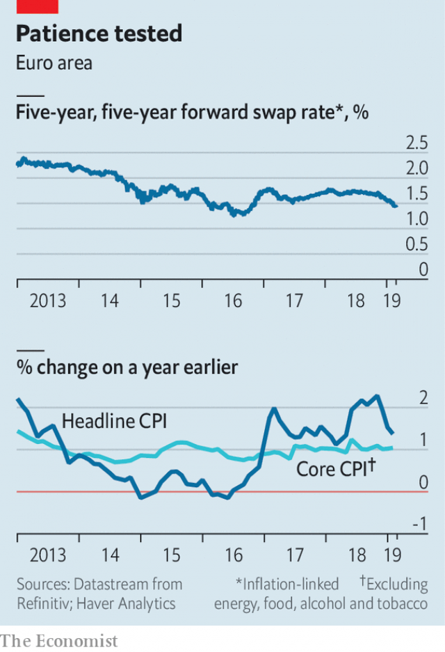

###### Virtue signalling

# Will a worsening outlook for inflation force the ECB to act? 

##### Some on its governing council may still prefer to wait and see 

 

> Feb 28th 2019 

PATIENCE, PERSISTENCE and prudence: the latest incarnation of the European Central Bank’s policy guidance appears to take a leaf out of early Christian writings on virtue. The central bank has counselled that, because it takes time for pricing pressures to recover from crisis years, it will keep interest rates unchanged at least through the summer of this year. 

Its waiting game, though, is being sorely tested. Underlying pricing pressures have been doggedly low for years. Now gloomy economic news risks further delaying their recovery. At its monetary-policy meeting on March 7th the bank will have to consider whether to ease policy. 

The headline inflation rate, which stood at 1.4% in January, has been buffeted around by movements in oil prices. But core inflation, which strips out volatile components such as food and energy prices, has proved difficult to budge. It has hovered around 1% since 2015. That is subdued compared with its average level in 2000-07, and far off the bank’s target of headline inflation below, but close to, 2%. 

The bank had hoped that above-trend economic growth would drive up wages and eventually force companies to put up their consumer prices. Indeed, economic growth was robust in 2017 and early 2018; annual wage growth had risen to 2.5% by the third quarter of 2018, a percentage point higher than rates in 2016. But price inflation has not yet followed—it is subdued even in labour-intensive service sectors such as recreation or restaurants. Perhaps, ECB officials might have thought, this was just a matter of time. 

Slowing growth, though, has dealt their hopes a blow. Italy fell into recession in the second half of 2018; Germany narrowly avoided that fate. Production disruptions in 2018 explain some of the downturn, but the moderation has continued into 2019. Further deterioration could slow price rises. Peter Vanden Houte of ING, a bank, points to research by ECB staff suggesting that companies are most emboldened to pass wage costs through to prices when demand is healthy and inflation high. Neither condition is now in place. 

Investors are also pessimistic about inflation. Market expectations of inflation in the medium term have fallen since late 2018. One measure favoured by central banks is the medium-term inflation-linked swap rate (see chart). That has fallen to 1.4%, well below levels reached in mid-2014, points out Andrew Benito of Goldman Sachs, a bank. Back then Mario Draghi, the head of the ECB, pointed to falls in the measure as a threat to price stability; a programme of asset purchases soon followed. 

 

The bank’s most likely tool this time would be a change to its forward guidance on interest-rate rises. It has committed to keeping interest rates unchanged at least through the summer of this year; it could push that date out further. Some economists think it might extend its targeted longer-term refinancing operations, which offer cheap loans to banks. Depending on its design, that would at least avert tighter funding conditions. Though the scheme is due to expire next year, its loans will stop counting towards regulatory liquidity measures this summer, forcing banks to refinance early. 

Action next week is not guaranteed. Some ECB officials have indicated that they want proof that the slowdown is persistent. The head of the Dutch central bank, Klaas Knot, for instance, has said that he wants to wait and see. But the cost of delaying easing rises as the outlook for inflation worsens, and inflation expectations threaten to linger below the target. Excessive patience might be harmful. 

-- 

 单词注释:

1.worsen['wә:sn]:vt. 使更坏, 使恶化 vi. 变得更坏, 恶化 

2.inflation[in'fleiʃәn]:n. 胀大, 夸张, 通货膨胀 [化] 充气吹胀; 膨胀 

3.ECB[]:[计] 事件控制块 

4.persistence[pә'sistәns]:n. 固执, 坚持不懈, 持续(性), 存留(状态) [电] 持久 

5.incarnation[.inkɑ:'neiʃәn]:n. 典型, 特殊阶段, 化身, 体现 

6.counsel['kaunsәl]:n. 商议, 忠告, 法律顾问 v. 商议, 劝告 

7.unchanged[.ʌn'tʃeindʒd]:a. 无变化的 [经] 持稳的 

8.sorely['sɒ:li]:adv. 疼痛地, 强烈地, 非常 

9.underlie[.ʌndә'lai]:vt. 位于...之下, 成为...的基础 

10.doggedly[]:adv. 顽强地；固执地 

11.volatile['vɒlәtail]:a. 挥发性的, 可变的, 不稳定的, 飞行的, 轻快的, 爆炸性的 n. 有翅动物, 挥发物 [计] 易失的 

12.budge[bʌdʒ]:vi. 微微移动 vt. 推动 n. 羔羊皮 

13.hover['hʌvә]:vi. 盘旋, 翱翔, 徘徊 vt. 孵 n. 翱翔 

14.subdue[sәb'dju:]:vt. 使服从, 压制, 减弱, 抑制, 克制 

15.robust[rәu'bʌst]:a. 健康的, 强健的, 要用力气的, 坚定的, 粗野的 [计] 健壮性 

16.sector['sektә]:n. 扇形, 部门, 部分, 函数尺, 象限仪, 段, 区段 vt. 把...分成扇形 [计] 扇面; 扇区; 段; 区段 

17.recession[ri'seʃәn]:n. 后退, 凹处, 衰退, 归还 [医] 退缩 

18.narrowly['nærәuli]:adv. 狭窄地, 严密地, 仔细地, 几乎不, 勉强地, 仅仅 

19.disruption[dis'rʌpʃәn]:n. 分裂, 崩溃, 瓦解 

20.downturn['dauntә:n]:n. (尤指经济方面的)衰退, 下降趋势 [电] 低迷时期 

21.moderation[.mɒdә'reiʃәn]:n. 缓和, 适度, 温和 [化] 慢化 

22.deterioration[di.tiәriә'reiʃәn]:n. 恶化, 衰退, 退化 [医] 变坏, 变质, 颓废, 衰退 

23.peter['pi:tә]:vi. 逐渐消失, 逐渐减少 

24.vanden[]:[网络] 梵登 

25.ing[]:abbr. 惯性导航与制导（Inertial Navigation and Guidance）；强中子发生器（Intense Neutron Generator） 

26.embolden[im'bәuldn]:vt. 使大胆, 使有胆量 

27.investor[in'vestә]:n. 投资者 [经] 投资者 

28.andrew['ændru:]:n. 安德鲁（男子名） 

29.Benito[bә'naitәu]:[航空](连续波)飞机导航装置 

30.goldman[]:n. 高曼（姓氏） 

31.Sachs[zaks]:n. 萨克斯（汽车零配件生产厂商） 

32.mario['mæriәj, 'mɑ:-]:n. 马里奥（男子名） 

33.Draghi[]:[网络] 行长德拉吉；总裁德拉吉；欧洲央行德拉吉 

34.asset['æset]:n. 资产, 有益的东西 

35.economist[i:'kɒnәmist]:n. 经济学者, 经济家 [经] 经济学家 

36.refinancing[rifi'nænsiŋ]:[经] 重新集资金 

37.avert[ә'vә:t]:vt. 转开, 避免, 防止 

38.expire[ik'spaiә]:vi. 期满, 呼气, 断气 vt. 呼出 

39.regulatory['regjulәtәri]:a. 受控制的, 统制的, 调整的 [经] 规则的 

40.liquidity[li'kwiditi]:n. 流动性, 流畅 [经] 流动性 

41.refinance[.ri:fai'næns]:vt. 再为...筹钱, 再供...资金 

42.slowdown['slәudaun]:n. 降低速度, 减速 

43.persistent[pә'sistәnt]:a. 固执的, 坚持的, 持续的, 作用持久的 [法] 坚持的, 固执的, 持续的 

44.Dutch[dʌtʃ]:n. 荷兰人, 荷兰语 a. 荷兰的 

45.klaas[]: [人名] 克拉斯 

46.linger['liŋgә]:vi. 逗留, 消磨, 徘徊 vt. 消磨 

