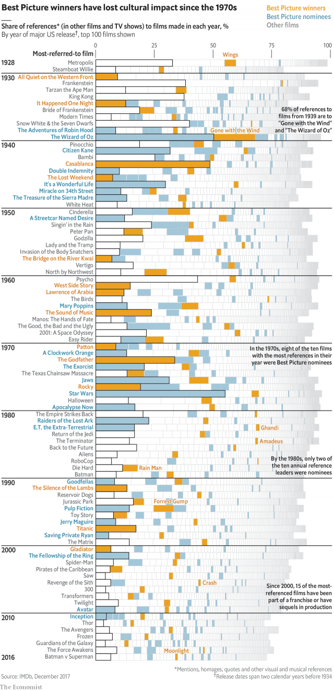

###### No longer a tastemaker

# The Oscars’ influence has waned 

##### Modern Best Picture winners receive fewer references in subsequent films than their predecessors did 

 

> Mar 2nd 2019 

“GREEN BOOK”? Critics sneered when Academy Award voters named this saccharine tale of a friendship between a black pianist and his white, tough-guy chauffeur the Best Picture of 2018. Yet rather than being a rare injustice, the award reinforced a trend. The top Oscar has increasingly gone to films that are soon forgotten. 

A film’s quality is in the eye of the beholder. Its influence, however, can be measured more objectively. IMDb, a crowd-sourced online database, contains a list of references to every film in subsequent films and TV shows. For example, “Casablanca” has over 1,600 references, including a discussion in “When Harry Met Sally” and a poster in “True Romance”. 

The data are spotty: films from the 1980s get four times as many references as those from the 1940s. However, the same bias presumably applies to all films made in a given year. So a rough proxy for a movie’s cultural influence is to count how many times it was referred to in subsequent years, and then compare its tally with those of all other films made in the same year. 

Decades ago, Best Picture nominees were regularly among the most influential films. Fully 68% of references to films made in 1939 are to “Gone with the Wind” (a winner) and “The Wizard of Oz” (nominated). A statistical model shows that in the 1950s, Best Picture winners had a 20% chance of being the most-referred-to film. 

That changed with the advent of “Star Wars”, summer blockbusters and sequels. Since the 1970s the films most referred to have been commercial flicks. Oscar voters usually spurn such movies; the ones they do like have become commercially less successful, and thus less culturally relevant. Best Picture winners today have just a 2% chance of leading the references table. By snubbing “Black Panther” (which already has 151 references) and the art film “Roma”, this year’s voters scoffed at both cultural influence and critical acclaim. 

-- 

 单词注释:

1.tastemaker['teist.meikә]:n. 时髦风尚的首创者, 开创时髦风尚的事物 

2.wane[wein]:n. 减少, 衰微, 败落, 亏缺, 月亏 vi. 变小, 亏缺, 衰落, 消逝, 退潮 

3.predecessor[.predi'sesә]:n. 前任, 先辈, 前身 [医] 初牙, 前辈, 祖先 

4.sneer[sniә]:n. 冷笑, 嘲笑 vi. 嘲笑, 冷笑 vt. 嘲笑着说, 嘲笑得使 

5.voter['vәutә]:n. 选民, 投票人 [法] 选民, 选举人, 投票人 

6.saccharine['sækәrain, -ri:n]:a. 糖的, 含糖的, 产糖的, 极甜的, 过甜的, 太甜的, 奉承的, 讨好的, 和颜悦色的 n. 糖精 

7.chauffeur['ʃәufә]:n. 司机 

8.injustice[in'dʒʌstis]:n. 不公平, 非正义的行为 [法] 不公正, 不公平, 权利侵害 

9.Oscar['ɔskә]:n. 奥斯卡金像奖, 钱, 现金 

10.beholder[bi'hәjldә(r)]:n. 观看者 

11.objectively[әb'dʒektivli,ɔb-]:adv. 客观地 

12.imdb[]:abbr. 网路电影资料库（Internet Movie Database） 

13.online[]:[计] 联机 

14.Casablanca[,kæsә'blæŋkә]:n. 卡萨布蓝卡 

15.harry['hæri]:vt. 掠夺, 使苦恼, 强使前行, 折磨, 骚扰 

16.sally['sæli]:n. 突击, 出击, 远足 vi. 突击, 出击, 出发 

17.romance[rәu'mæns]:n. 冒险故事, 浪漫史, 传奇文学 vi. 写传奇, 作空想, 虚构 

18.datum['deitәm]:n. 论据, 材料, 资料, 已知数 [医] 材料, 资料, 论据 

19.bias['baiәs]:n. 偏见, 斜纹 a. 偏斜的 adv. 偏斜 vt. 使有偏见 [计] 偏流; 偏压; 偏磁; 偏离 

20.proxy['prɒksi]:n. 代理, 代理人, 委托书 [经] 代理人, 代表权, 授权书 

21.cultural['kʌltʃәrәl]:a. 文化的, 教养的, 修养的 [医] 培养的 

22.tally['tæli]:n. 符木, 记账, 得分, 比分, 计数器, 标签, 符合, 对应物 vt. 记录, 点数, 计算, 加标签于, 使符合 vi. 记帐, 符合, 吻合, 记分 [计] 计数 

23.nominee[.nɒmi'ni:]:n. 被提名者, 被任命者 [经] 被指定人 

24.fully['fuli]:adv. 十分地, 完全地, 充分地 

25.wizard['wizәd]:n. 男巫, 术士, 奇才 a. 男巫的, 巫术的 [计] 向导 

26.oz[]:abbr. 盎司（ounce） 

27.nominate['nɒmineit]:vt. 提名, 任命, 命名 [法] 提名...为候选人, 指定, 推荐 

28.advent['ædvәnt]:n. 来到, 来临 

29.blockbuster['blɒkbʌstә]:n. 巨型炸弹 

30.sequel['si:kwәl]:n. 继续, 续集, 后果 [计] 结构的英语查询语言 

31.flick[flik]:n. 快速的轻打, 轻打声, 弹开 v. 轻弹, 轻轻拂去, 忽然摇动 

32.spurn[spә:n]:n. 踢开, 拒斥 vt. 踢开, 冷落, 践踏, 唾弃 vi. 藐视, 摒弃 

33.commercially[]:adv. 商业上；通商上 

34.les[lei]:abbr. 发射脱离系统（Launch Escape System） 

35.culturally[]:adv. 从文化角度, 文化意义上；在人文学方面 

36.snub[snʌb]:n. 冷落, 怠慢, 斥责, 制止 a. 制动用的, 短而扁的 vt. 冷落, 怠慢, 制止, 使...停住, 掐灭 

37.panther['pænθә]:n. 豹, 黑豹, 美洲豹 

38.roma['rɔmә. 'rәu-]:n. 罗马, 罗马帝国 

39.scoff[skɒf]:n. 嘲笑, 愚弄, 笑柄, 食品 v. 嘲笑, 嘲弄, 贪吃, 狼吞虎咽地吃 

40.acclaim[ә'kleim]:n. 喝彩, 欢呼, 赞同 v. 欢呼, 喝彩, 称赞 

