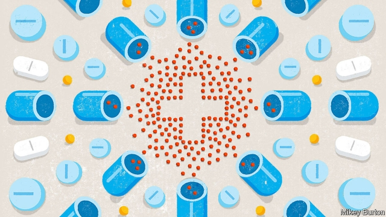
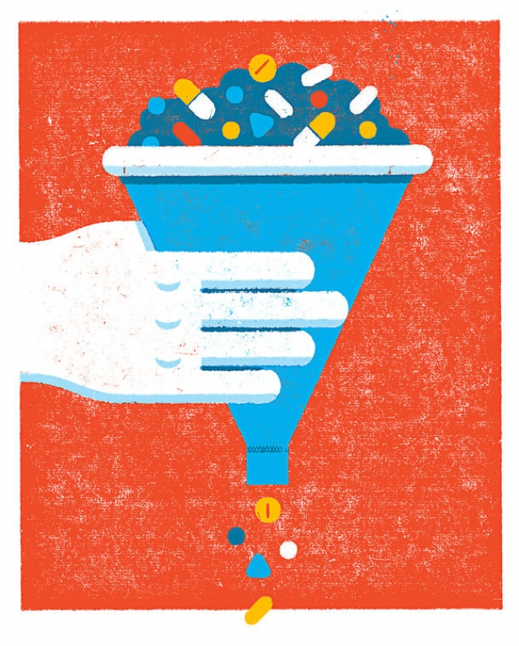

###### Cross purposes

# “Repurposing” off-patent drugs offers big hopes of new treatments 

##### But governments need to give companies incentives to invest in them 

 

> Feb 28th 2019 

TOWARDS THE end of 2014 a 66-year-old British man named Alistair had a seizure. A scan revealed shocking news. He had an inoperable brain tumour—a glioblastoma—that was likely to kill him in a few years. Soon afterwards, he read a newspaper article suggesting that a cocktail of cheap, everyday drugs, chosen for their anti-cancer effects, had helped a patient with the same disease. His doctors were unimpressed but said: “We can’t stop you.” 

Four years on Alistair is still taking this drug regimen alongside the “standard-of-care” treatment. The drug cocktail is prescribed by Care Oncology, a private clinic in London, which recommends a statin (a cholesterol-lowering drug), metformin (used to treat type-2 diabetes), doxycycline (an antibiotic) and mebendazole (an anti-worming agent). These may sound radical, but are actually safe, cheap, generic medicines with evidence of some anti-cancer effects. Nonetheless, their labels do not say they treat glioblastoma—nor any other cancer for that matter. 

This lack of clinical interest is not unusual. There is a huge untapped medicine chest of generic drugs with unexploited uses. Originally approved for one disease, these drugs went off-patent and now show promise in other diseases. Thalidomide, a morning-sickness drug forever linked with scandal and disaster, found new uses in leprosy and a blood cancer. An acne medicine is now part of an effective treatment for a form of leukaemia. Viagra, famously, came from failed work in angina. 

The scale of the opportunity for “drug repurposing” is vast. Bruce Bloom, boss of Cures Within Reach, an American repurposing charity, says 9,000 generic drugs have been approved. Pan Pantziarka, of the Anticancer Fund, another charity, says his group has found evidence in almost 260 non-cancer drugs of anti-cancer activity. Most have lost patent protection. The science that has piqued interest in these drugs comes from pre-clinical lab work in animals, case reports, small clinical trials and large-scale observational studies. 

Increasingly, large-scale screening studies are plucking options from oblivion. After screening thousands of approved drugs, the National Institutes of Health (NIH), an American research agency, identified 25 molecules that might fight drug-resistant bacteria, half of which are already approved drugs. The California Institute for Biomedical Research in San Diego has a library of 12,000 drug compounds it is testing against disease-causing pathogens. Two drugs are in trials as a result: an anti-rheumatic treatment called auranofin for tuberculosis; and clofazimine, a leprosy drug, to treat the parasite Cryptosporidium. 

Drugs like these—off-patent, cheap and already approved—are relatively quick to develop to treat new diseases. New molecular entities can cost hundreds of millions of dollars to test, and safety and toxicity problems mean that 45% of drugs fail clinical trials. Repurposed drugs, with well-established safety profiles, can save about five to seven years in development time. Approval rates are higher, and some think overall costs are 60% of those of new drugs. 

Interest in drug repurposing has been rising, particularly for medicines that could treat neglected diseases in poor countries, and rare diseases, cancer and mental health. A recent study inJAMA Psychiatry said that statins, metformin and blood-pressure drugs had potential for treating mental illnesses such as schizophrenia and bipolar disorder. Minocycline, an antibiotic, is already being tested as a treatment for autism. Ammar Al-Chalabi, a neurologist at Kings College, London, wants to repurpose Triumeq, an HIV drug, to fight motor neurone disease. 

There is a problem, however. Katherine Arline of Shepherd Therapeutics, a biotech firm that works in rare cancers, says that, because the costs are high and may not be recouped, firms have little incentive to run clinical trials on generic drugs. Once the costs of testing and registering have been paid, the lack of patent protection means that any firm can make the drug. Some describe generics as “financial orphans”. 

One approach is to change the generic drug to create something patentable. This is how the American drug firm, Johnson & Johnson (J&J), approached ketamine, an anaesthetic with a stack of evidence to support its use in treatment-resistant depression. J&J tweaked the molecule to create a variant that could also be inhaled. Reformulation is costly and risks reducing the efficacy of the drug. But J&J seems likely to receive approval from the Food and Drug Administration, the FDA. 

For years, like many off-label medicines, ketamine has been a valuable but hard-to-obtain therapy. This has driven the growth of ketamine clinics in America and Europe. In Britain Oxford Health, a unit within the National Health Service (NHS), will provide it. But the NHS as a whole does not cover it because it is not approved for this use, so patients must pay £795 ($1,058) for three infusions; J&J’s esketamine is likely to be far more costly. 

Several issues dog reusing generic medicines in new indications. Mr Bloom says that, in his experience, between one-third and a half of patients are loth to use drugs outside the current standard of care—even if they have a disease they know is going to kill them. And even if doctors might be willing in principle to prescribe an off-label drug, many feel unable to do so because of worries about their legal liability should something go wrong. Or there may be disputes over whether public health services or insurers will pay for drugs that have not been approved for that disease. 

Nonetheless, many non-profit groups see promise in supporting trials into drug repurposing. Epidemiological data can offer enticing leads. An insurance database in Taiwan shows a 76% reduction in the risk of tuberculosis among diabetic patients on metformin, and progressively larger protective effects with higher cumulative doses. However, Udai Banerji, a researcher at the Institute of Cancer Research in London, warns that randomised clinical trials are necessary to prove definitively the value of a drug to treat a new disease. 

Trials are costly, but the benefits can be huge. The Drugs for Neglected Diseases Initiative, a Swiss non-profit research group, supported R&D into fexinidazole, which was abandoned by a pharma firm at an early stage but was then found to show anti-parasitic qualities. This January, after years of work, it was approved for sleeping sickness in the Democratic Republic of Congo. It is the first oral medicine for the disease, and works for all stages of it. 

When it comes to cancer, some of the most promising generic pills are already well-known. Cancer Research UK, a charity, is testing aspirin to see if it can stop cancer recurring; metformin in a large prostate-cancer trial; and an anti-fungal medication to treat bowel cancer. The Anticancer Fund in Brussels has high hopes for propranolol in treating angiosarcoma—cancers of the inner lining of blood vessels—and for pancreatic cancer. Propranolol is a generic 1960s beta-blocker used for a wide range of ailments such as hypertension, anxiety and migraine. If approved for cancer, its price would be negligible compared with the tens of thousands of dollars a month normally charged for cancer medicines. Mr Banerji estimates that one cancer drug in five that goes off-patent is likely to have uses in treating other cancers. It is “almost free money”, he says. 

 

The Anticancer Fund believes that the path to wider uptake of repurposed drugs is through approval and relabelling by drug regulators for new treatments. Although difficult and expensive, Mr Pantziarka says it unleashes a cascade of important events. When a regulator licenses a drug, clinical guidelines are updated, drug formularies are changed, reimbursement should follow more smoothly and clinicians gain experience using it. In America Mr Bloom agrees that relabelling will encourage the usage of repurposed drugs. 

Money, though, is a crucial constraint. Even governments keen to pump cash into drug development prioritise drugs with patents. Mr Pantziarka says many official funding schemes, such as the EU’s Horizon 2020 programme, want projects that hold intellectual property. In America the National Centre for Advancing Translational Sciences will support research to help drug companies repurpose molecules for which they hold patents. 

Finance is not the only obstacle. Only the makers or original developers of a drug are permitted to adjust its label. Sanofi, based in Paris, was the firm that requested regulatory review of fexinidazole for sleeping sickness—although the R&D was a charitable effort. But drug firms are not obliged to support non-commercial efforts to repurpose drugs. And outside the industry it is hard to find the legal expertise to manage the necessary paperwork. 

Some of these concerns are under review by an expert group on repurposing within the European Commission. It is looking at how regulatory changes, as well as legal and financial support, could support repurposing by third parties such as charities and foundations. The Anticancer Fund wants the regulator to be able to evaluate evidence on drugs that has been submitted by third parties such as itself. 

As non-profits make headway in repurposing, corporate interest may be rising. Mr Bloom says that ten years ago not a single pharma company would have anything to do with his charity. Today he receives calls from at least two or three small- to mid-sized firms every month saying they are interested. In terms of achieving new treatment options, this is good news. But it will not bring cheaper medicines in areas traditionally neglected by the drug industry. Firms will focus on finding ways to patent the new uses—through reformulation or new combinations of substances—and charge high prices for the finished product. 

If governments want cheaper drugs, non-profits will need financial incentives and a helpful regulatory framework. Would-be repurposers have come up with some suggestions. They include making regulators give free advice and waive approval fees, and a public fund to support repurposing. Another idea is a “social-impact bond”—backed by private investors funding a range of drug trials for diseases that cost public-health services a lot of money to treat. When drugs are approved, investors are paid back by the public health service, which makes savings by using the newly approved generic drugs. 

The slow pace of change leaves patients like Alistair stranded. Care Oncology says it will publish results from its glioblastoma patients this spring. Though welcome, this will fall short of the gold-standard trial evidence needed to register a drug. The treatment will be left in limbo. And patients will be left to wonder why governments fail to see the purpose of repurposing drugs. 

-- 

 单词注释:

1.repurposing[rɪpɜ:'pəsɪŋ]:n. 再利用 v. 为…改变用途（repurpose的ing形式） 

2.incentive[in'sentiv]:n. 动机 a. 激励的 

3.Alistair[]:阿利斯泰尔 

4.seizure['si:ʒә]:n. 捕获, 夺取, 占领, 捕获物, 没收, 充公 [医] 发作; 癫痫发作 

5.inoperable[in'ɒpәrәbl]:a. 不能动手术的 [医] 不能手术的, 不宜手术的 

6.afterwards['ɑ:ftәwәdz]:adv. 然后, 后来 

7.cocktail['kɒkteil]:n. 鸡尾酒, 开味品 a. 鸡尾酒会的 

8.unimpressed['ʌnim'prest]:a. 无印记的, 没有印象的, 未受感动的 

9.regimen['redʒimen]:n. 养生法, 常规强化训练课, 体制, 情态 [医] 制度, 生活制度 

10.oncology[ɒŋ'kɒlәdʒi]:n. 肿瘤学 [医] 肿瘤学 

11.statin['stætɪn]:n. 斯达汀（药物名）; [医]抑制素[类名, 包括促生长素抑制素、促黑素抑制素、促乳素抑制素等] 

12.metformin[met'fɔ:min]:甲福明二甲双胍(抗糖尿病药、降血糖药) 

13.diabetes[daiә'bi:ti:z]:n. 糖尿病, 多尿症 [医] 糖尿病; 多尿症 

14.doxycycline[dɔksi'saiklin]:[化] 多西环素; 脱氧土霉素; 强力霉素 

15.antibiotic[.æntibai'ɒtik]:n. 抗生素 a. 抗生的 

16.mebendazole[mi'bendәzәul]:甲苯咪唑, 甲苯哒唑(抗蠕虫药, 驱肠虫药C6H5·CO·C7H4N2·NHCOOCH3) 

17.generic[dʒi'nerik]:a. 属类的, 一般的 [计] 一般的 

18.nonetheless[,nʌnðә'les]:conj. 然而, 尽管, 不过 adv. 不过, 仍然, 尽管如此, 然而 

19.clinical['klinikәl]:a. 临床的, 门诊部的 [医] 临床的, 临证的 

20.untap[]:abbr. United Nations Technical Assistance Programme 联合国技术援助计划 

21.unexploited[,ʌnik'splɔitid, -ek-]:a. 未被利用的,未经开发的 

22.originally[ә'ridʒәnli]:adv. 本来, 原来, 最初, 就起源而论, 独创地 

23.thalidomide[θә'lidәmaid]:n. 萨力多胺 [化] 沙利度胺; 酞胺哌啶酮; 酞谷酰亚胺 

24.leprosy['leprәsi]:n. 麻疯病, 腐败 [医] 麻风 

25.acne['ækni]:n. 痤疮, 粉刺 [医] 痤疮, 粉刺 

26.leukaemia[lu:'ki:miә]:n. 白血病 

27.viagra[]:n. [药]万艾可；伟哥（一种治疗阳痿的药, 壮阳药） 

28.famously['feimәsli]:adv. 极好地, 非常令人满意地 

29.angina[æn'dʒainә]:n. 咽痛, 绞痛 [医] 咽峡炎, 咽痛, 绞痛 

30.repurposing[rɪpɜ:'pəsɪŋ]:n. 再利用 v. 为…改变用途（repurpose的ing形式） 

31.Bruce[bru:s]:n. 布鲁斯 

32.anticancer['ænti'kænsә]:a. [医]抗癌的 

33.pique[pi:k]:n. 赌气, 愤怒, 不快, 凹凸织物 vt. 伤害...自尊心, 激怒, 刺激, 引起兴趣, 使兴奋 

34.observational[,ɔbzә'veiʃәnәl]:a. 观察的, 观测的 [计] 观察的 

35.oblivion[ә'bliviәn]:n. 遗忘, (头脑的)一片空白状, 湮没, 大赦, 赦免 [法] 忘却, 被忘却的事, 大赦 

36.nih[]:abbr. 国家卫生研究所（National Institutes of Health） 

37.California[.kæli'fɒ:njә]:n. 加利福尼亚 

38.biomedical[,baiәu'medikәl]:a. 生物医学 

39.san[sɑ:n]:abbr. 存储区域网（Storage Area Networking） 

40.diego[]:n. 迭戈（男子名） 

41.pathogen['pæθәdʒ(ә)n]:n. 病原体 [医] 病原体 

42.auranofin[]:[化] 金诺芬 

43.tuberculosis[tju,bә:kju'lәusis]:n. 肺结核 [医] 顿挫性结核 

44.clofazimine[]:[化] 氯法齐明 

45.parasite['pærәsait]:n. 寄生生物, 寄生虫, 食客 [医] 寄生物; 寄生胎 

46.cryptosporidium[]: 隐孢子虫（水中寄生虫, 可引致体内受感染） 

47.molecular[mә'lekjulә]:a. 分子的, 由分子组成的 [医] 分子的 

48.entity['entiti]:n. 实体, 实存物, 存在 [计] 实体 

49.toxicity[tɒk'sisiti]:n. 毒性 [医] 毒力, 毒性 

50.repurposed[]:[网络] 再利用材料 

51.profile['prәufail]:n. 侧面, 轮廓, 传略 vt. 描绘...轮廓, 写...的传略 [计] 提问档; 剖面图法; 剖面法 

52.psychiatry[sai'kaiәtri]:n. 精神病学, 精神病治疗 [医] 精神病学 

53.schizophrenia[.skizәu'fri:niә]:n. 精神分裂症 [医] 精神分裂症 

54.bipolar[bai'pәulә]:a. 有两极的, 双极的 [计] 双极性 

55.minocycline[,minәu'saikli:n]:二甲胺四环素 

56.autism['ɒ:tizm]:n. 孤独症 [医] 孤独癖, 自我中心主义 

57.ammar[]:n. (Ammar)人名；(法、葡、阿拉伯、英)阿马尔 

58.neurologist[nju'rɒlәdʒist]:n. 神经病学者, 神经科医师 [医] 神经病学家 

59.repurpose[ˌri:ˈpɜ:pəs]:vt. 赋予新的用途 

60.hiv[]:abbr. 艾滋病病毒（human immunodeficiency virus） 

61.neurone['njuәrɔn]:[医] 神经元; 轴索; 脑脊髓轴(罕用) 

62.katherine[]:n. 凯瑟琳（女子名） 

63.arline[]:n. (Arline)人名；(法)阿利纳 

64.therapeutics[.θerә'pju:tiks]:n. 治疗学 [医] 治疗学; 疗法, 治疗 

65.biotech['baɪəʊtek]:n. 生物技术 

66.recoup[ri'ku:p]:vt. 偿还, 赔偿, 补偿, 扣除 vi. 补偿损失 

67.patentable[]:a. 可给予专利权的, 可取得专利证的, 可给予专利证的, 可取得专利权的 [法] 可给予专利权的, 可以取得专利的 

68.johnson['dʒɔnsn]:n. 约翰逊（姓氏） 

69.ketamine['ketәmi:n]:[化] 氯胺酮 

70.anaesthetic[.ænis'θetik]:n. 麻醉剂, 麻药 a. 麻木的, 麻醉的 

71.tweak[twi:k]:n. 拧, 扭, 焦急 vt. 扭, 开足马力 

72.variant['vєәriәnt]:n. 变体, 异体 a. 不同的, 有差别的 [计] 变体型 

73.inhale[in'heil]:vt. 吸入 vi. 吸气 

74.reformulation[.ri:fɔ:mju'leiʃәn]:n. 再形成 

75.efficacy['efikәsi]:n. 功效, 效力 [医] 效能, 功效, 效验 

76.fda[]:abbr. （美）食品及药物管理局（Food and Drug Administration） 

77.therapy['θerәpi]:n. 治疗 [医] 疗法, 治疗 

78.Oxford['ɒksfәd]:n. 牛津, 牛津大学 

79.nh[]:abbr. 不吸湿的（nonhygroscopic）；全日空航空公司；美国地名, 新罕布什尔（New Hampshire） 

80.infusion[in'fju:ʒәn]:n. 注入, 泡制, 注入物 [化] 浸渍; 浸泡 

81.esketamine[]:[网络] 艾氯胺酮 

82.loth[lәuθ]:a. 不愿意的, 厌恶的 

83.liability[laiә'biliti]:n. 责任, 债务, 倾向 [经] 责任, 义务, 负债 

84.insurer[in'ʃuәrә]:n. 保险公司 [法] 保险人, 承保人, 保险公司 

85.epidemiological[]:a. 流行病学 

86.datum['deitәm]:n. 论据, 材料, 资料, 已知数 [医] 材料, 资料, 论据 

87.entice[in'tais]:vt. 诱骗, 引诱, 怂恿 

88.taiwan['tai'wɑ:n]:n. 台湾 

89.diabetic[daiә'betik]:a. 糖尿病的 n. 糖尿病患者 

90.progressively[]:adv. 进步, 先进, 向前进, 不断前进, 累进, 渐进, 逐渐, 渐次, 主张进步, 进行性 

91.cumulative['kju:mjulәtiv]:a. 累积的 [医] 蓄积的, 累积的 

92.udai[]:[网络] 乌德河；统一数据库访问接口 

93.banerji[]:[网络] 班纳基 

94.randomise['rændəmaiz]:vt. [主英国英语]＝randomize 

95.definitively[dɪ'fɪnətɪvlɪ]:adv. 决定性地, 最后地 

96.fexinidazole[]:[网络] 非昔硝唑 

97.pharma[]:n. 制药公司 

98.Congo['kɔŋ^әu]:n. 刚果, 刚果河, 工夫茶 [建] 刚果, 直接刚果红 

99.UK[ju: 'kei]:n. 联合王国 

100.aspirin['æspәrin]:n. 阿斯匹林 [化] 乙酰水杨酸; 阿司匹灵; 邻乙酸基苯甲酸 

101.recur[ri'kә:]:vi. 复发, 回到, 重现, 再来, 诉诸, 采用, 循环 

102.medication[.medi'keiʃәn]:n. 药物治疗, 药物处理, 医药 [医] 药疗法, 投药法 

103.bowel['bauәl]:n. 肠, 内脏, 内部 vt. 挖...的内脏 

104.Brussel[]:n. 布鲁塞尔（比利时首都） 

105.propranolol[prәj'prænәlɔl]:[化] 普萘洛尔; 萘心安; 心得安 

106.pancreatic[.pæŋkri'ætik]:a. 胰腺的 [医] 胰的 

107.propranolol[prәj'prænәlɔl]:[化] 普萘洛尔; 萘心安; 心得安 

108.ailment['eilmәnt]:n. 病痛, 疾病 [医] 疾病 

109.hypertension[.haipә'tenʃәn]:n. 高血压, 过度紧张 [医] 高血压, 血压过高, 张力过强, 压力过高 

110.migraine['mi:^rein, 'mai-]:n. 严重的周期性偏头痛 [医] 偏头痛 

111.negligible['neglidʒәbl]:a. 可以忽略的, 不足取的, 无用的 [医] 可不计的, 可忽视的 

112.tens[]:十位 

113.uptake['ʌpteik]:n. 举起, 拿起, 理解, 上风井, 摄入, 吸收 [化] 摄取 

114.repurposed[]:[网络] 再利用材料 

115.relabel[.ri:'leibәl]:vt. 重新贴标签于；重新用标签标明 

116.regulator['regjuleitә]:n. 调整者, 校准者, 校准器, 调整器, 标准钟 [化] 调节剂; 调节器 

117.unleash[.ʌn'li:ʃ]:vt. 解开...的皮带, 发出, 发动 

118.cascade[kæ'skeid]:n. 小瀑布, 瀑布状物 vi. 成瀑布落下 [计] 层叠, 级联 

119.guideline['gaidlain]:n. 指导路线, 方针, 指标 [经] 指导路线, 方针, 准则 

120.update[ʌp'deit]:vt. 更新, 使现代化 n. 更新 [计] 更新 

121.formulary['fɒ:mjulәri]:n. 公式集, 处方集, 套话 a. 规定的, 公式的, 药方的 

122.reimbursement[.ri:im'bә:smәnt]:n. 付还, 退还 [经] 偿付, 赔还 

123.clinician[kli'niʃәn]:[医] 临床医师, 临证医师 

124.constraint[kәn'streint]:n. 强制, 约束 [计] 约束 

125.prioritise[praɪ'ɒrəˌtaɪz]:vt. 给予…优先权; 按优先顺序处理; 出轻重缓急 vi. 把事情按优先顺序排好（等于prioritize） 

126.translational[]:[机] 平移的 

127.maker['meikә]:n. 制造者, 上帝 [经] 制造者, 出票人 

128.developer[di'velәpә]:n. 开发者 [计] 显影器 

129.sanofi[]:[网络] 赛诺菲；赛诺菲集团；法国赛诺菲 

130.regulatory['regjulәtәri]:a. 受控制的, 统制的, 调整的 [经] 规则的 

131.charitable['tʃæritәbl]:a. 大慈大悲的, 宽厚的, 慈善的 [法] 慈善的, 慷慨的, 宽恕的 

132.expertise[.ekspә:'ti:z]:n. 专家意见, 专门技术 [法] 专门知识, 专家意见 

133.headway['hedwei]:n. 前进, 航行速度, 进展 [经] 进尺, 钻井 

134.corporate['kɒ:pәrit]:a. 社团的, 合伙的, 公司的 [经] 团体的, 法人的, 社团的 

135.traditionally[]:adv. 传统上；传说上；习惯上 

136.reformulation[.ri:fɔ:mju'leiʃәn]:n. 再形成 

137.waive[weiv]:vt. 不坚持要求, 放弃, 推迟考虑, 丢弃 [经] 放弃权利, 免除, 弃权人 

138.investor[in'vestә]:n. 投资者 [经] 投资者 

139.strand[strænd]:n. (绳索的)股, 绳, 串, 海滨, 河岸 vi. 搁浅 vt. 使搁浅, 使落后, 使陷于困境, 弄断, 搓 

140.glioblastoma[]:[医] 成胶质细胞瘤, 恶性胶质瘤 

141.limbo['limbәu]:n. 地狱边缘, 监狱, 忘却 [法] 监狱, 拘禁, 忘却 

