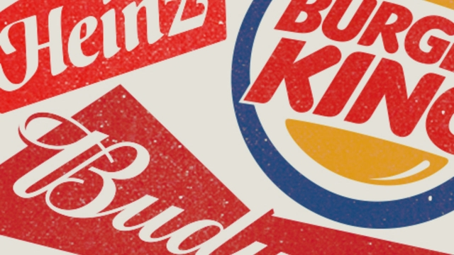

###### Trouble at 3G Capital

# 3G Capital discovers the limits of cost-cutting and debt 

##### The owner of Kraft Heinz is grappling with several problems 

 

> Mar 2nd 2019 

NOT MANY consumers have heard of 3G Capital, an investment fund, but it controls some of the planet’s best-known brands, including Heinz, Budweiser and Burger King. In the business world 3G has become widely admired for buying venerable firms and using debt and surgical cost-cuts to boost their financial returns. But after Kraft Heinz, a 3G firm, revealed a $12.6bn quarterly loss on February 21st what appeared to be a successful strategy suddenly looks like a fiasco. 

The implications reach beyond Kraft Heinz. In total, 3G-run firms owe at least $150bn (3G’s founders hold direct stakes in some firms while others are held by 3G’s investment funds; for simplicity, it makes sense to lump them together and call them 3G). Notable investors have got not just egg, but ketchup, on their faces—Warren Buffett’s investment firm, Berkshire Hathaway, lost $2.7bn on its Kraft Heinz shares in 2018. There is a queasy sense that 3G’s approach of dealmaking, squeezing costs and heavy debts, can be found at an alarming number of other firms. 

Leveraged takeovers are nothing new. In the 1980s raiders such as James Goldsmith terrorised boardrooms while private-equity tycoons launched buy-outs, most famously of RJR Nabisco in 1988. With its roots in Brazil, 3G has brought twists of its own to such barbarism. One is the scale of its dealmaking. It is history’s second-most acquisitive firm, after Blackstone, with $480bn of takeover bids, including the purchases of Anheuser Busch and SAB Miller. Another is its distinct style of buying popular brands with oligopolistic market shares. It believes that competition in such industries is muted and that consumers will reliably drink beer and eat beans for ever: Bud was, after all, founded in 1876 and Heinz in 1869. And since 3G is confident that sales will remain steady, it then loads firms with debt and cuts costs using zero-based budgeting, a technique that requires managers to justify every dollar of spending from scratch each year and reinvest only some of the savings in the best brands. 

It sounds plausible and it worked for a time—indeed the restaurant division is still performing reasonably. But recently problems have emerged elsewhere. Consumers are getting more fickle and are switching to independent beer brands and healthier food (see article). Competitors have raised their game; supermarkets are promoting cheaper white-label brands while e-commerce has given a leg up to insurgent brands. And capital markets have adapted. Investors have urged other firms to copy 3G’s cost-cutting tactics, even as takeover targets have got pricier because investors expect 3G to pay top dollar for them. 

Signs of trouble emerged in October, when AB InBev, 3G’s beer arm, cut its dividend. Although it is still growing overall, in North America its volumes and profits shrank in 2018. Meanwhile, Kraft Heinz’s recent woes have led it to cut its dividend and warn that profits in 2019 would fall. Alarmingly, this doesn’t seem a mere blip: it wrote down $15bn of acquisition costs. For good measure it also said that regulators are investigating its accounting. Neither AB InBev nor Kraft Heinz is likely to go bust, but in the long run they might end up being broken up yet again. 

Cost-cutting is essential in mature industries. The process of reallocating labour and capital away from declining products and towards new ones, as well as to new firms, is what boosts productivity. Nonetheless, managers have to get the mix right between slashing expenses and investing for growth, while maintaining an appropriate level of debt. Kraft Heinz has failed on both counts. It now forecasts that gross operating profit in 2019 will be slightly lower than in 2014, before the two firms merged, while its balance-sheet is creaking. 

Far from being an exception, Kraft Heinz is a super-sized version of the strategy of much of corporate America over the past decade. Although sales have been sluggish, 66% of firms in the S&P 500 index have raised their margins and 68% have raised their leverage since 2008. A mania for deals in mature industries, premised on debt and austerity, is in full swing. AT&T has bought Time Warner, Disney is buying Fox and Bristol-Myers Squibb, Celgene. These three deals alone involve over $110bn of extra net debt and envision a $6bn cut in total annual costs. 

Perhaps the good times will roll on. But there have already been two big blow-ups of acquisitive, indebted firms: Valeant, a drugmaker, in 2015-16; and, in 2017-18, General Electric, which has just sold its biopharma arm in order to cut its borrowings. There have been lucky escapes, too. In 2017 Kraft Heinz and 3G tried to buy Unilever for cash and stock for about $140bn. It was only thanks to a determined fight by Unilever’s managers, not its shareholders, that Kraft Heinz withdrew. 

Any time a firm has a string of successes, boards and investors tend to drink the Kool-Aid (another Kraft Heinz brand). In fact their unsentimental collective task is to enforce discipline and to block bids by over-extended firms. Since the end of 2016 the value of 3G’s portfolio has dropped by about a third, lagging far behind both the S&P 500 and food and beverage firms. Shares of Kraft Heinz have underperformed Unilever by an incredible 84 percentage points since the failed takeover bid. That’s enough to make you choke on your beer and burger. 

-- 

 单词注释:

1.kraft[krɑ:ft]:n. 牛皮纸 

2.heinz[]:n. 海因茨（姓氏）；亨氏食品公司（世界著名的食品供应商, 主要产品包括调味品和餐食两大类） 

3.grapple[græpl]:v. 抓住, 掌握 n. 抓住, 系紧, 掌握, 与...扭打 

4.Budweiser[]:n. 百威啤酒 

5.burger['bә:ɡә]:n. 汉堡包（等于hamburger） 

6.venerable['venәrәbl]:a. 庄严的, 值得尊敬的 

7.surgical['sә:dʒikl]:a. 外科的, 外科医生的, 手术上的 n. 外科病例, 外科病房, 外科手术 

8.fiasco[fi'æskәu]:n. 惨败, 大失败 

9.founder['faundә]:n. 创立者, 建立者 vt. 使沉没, 使摔倒, 弄跛, 浸水, 破坏 vi. 沉没, 摔到, 变跛, 倒塌, 失败 

10.notable['nәutәbl]:n. 著名人士, 值得注意之事物 a. 值得注意的, 显著的 

11.investor[in'vestә]:n. 投资者 [经] 投资者 

12.ketchup['ketʃәp]:n. 蕃茄酱 

13.Berkshire['bә:kʃә]:n. 巴克夏猪 

14.Hathaway[]:n. 哈撒韦（衬衫品牌）；海瑟薇（人名） 

15.queasy['kwi:zi]:a. 呕吐的, 使人呕吐的 [经] 不稳定的 

16.dealmaking[]:[网络] 交易；交易促成；交易撮合 

17.takeover[]:n. 接管, 接收 [经] 接收 

18.raider['reidә]:n. 奇袭者, 侵入者 [法] 袭击者, 侵入者, 劫掠商船的武装快船 

19.jame[]: 灰岩井 

20.goldsmith['gәuldsmiθ]:n. 金匠 

21.terrorise['terәraiz]:vt. 使恐怖, 恐吓, 威胁, 胁迫 vi. 引起恐怖, 实行恐怖统治 

22.boardroom['bɒ:drum]:n. 会议室, 证券交换场所 

23.tycoon[tai'ku:n]:n. 企业界大亨, 将军 [经] 企业界巨头, 企业家 

24.famously['feimәsli]:adv. 极好地, 非常令人满意地 

25.rjr[]:abbr. Radio Jamaica Ltd. 牙买加广播公司; RJ Reynolds RJ 雷诺兹 

26.Nabisco[]:n. 纳贝斯克 

27.Brazil[brә'zil]:n. 巴西 

28.barbarism['bɑ:bәrizәm]:n. 野蛮, 未开化 

29.acquisitive[ә'kwizitiv]:a. 渴望获得的, 贪婪的 [法] 取得的, 获得的, 贪得无厌的 

30.Blackstone[]:n. 百仕通集团（即黑石集团, 全球最大私募基金公司）；布莱克斯通（英国前文化部长）；黑石镇（美国马萨诸塞州的一个镇） 

31.anheuser[]:n. (Anheuser)人名；(德)安霍伊泽 

32.Busch[buəʃ]:n. 布施（姓氏） 

33.sab[]:abbr. Sabbath 安息日; sabbatical 安息日的; soprano, alto, baritone 女高音; special assessment bond 特别评估债券 

34.miller['milә]:n. 厂主, 蛾 [机] 铣床 

35.oligopolistic[]:a. 由少数把持的; 寡占的; 由少数垄断的 

36.reliably[ri'laiәbli]:adv. 可靠地, 可信赖地 

37.budgeting[]:[计] 预定, 预算 [经] 预算编制 

38.reinv[]:[网络] 开发投资；房地产开发投资 

39.plausible['plɒ:zibl]:a. 貌似真实的, 貌似合理的, 说得煞有其事的 [法] 花言巧语的, 似乎有理的 

40.reasonably['ri:znәbli]:adv. 适度地, 相当地 

41.fickle['fikl]:a. 变幻无常的, 浮燥的, 薄情的 

42.insurgent[in'sә:dʒәnt]:a. 谋叛的, 起义的, 澎湃的 n. 起义者, 叛乱者 

43.tactic['tæktik]:n. 一项战术, 一条策略 a. 战术的, 顺序的, 排列的 

44.pricy['praisi]:a. 昂贵的, 价格高的 

45.ab[æb]:prep. 从, 自 [计] 地址总线 

46.inbev[]:[网络] 英博；英博啤酒集团；英博集团 

47.dividend['dividend]:n. 被除数, 股利 [计] 被除数 

48.woe[wәu]:n. 悲哀, 悲痛, 苦痛 

49.alarmingly[ ə'lɑːmɪŋli]:adv. 让人担忧地 

50.regulator['regjuleitә]:n. 调整者, 校准者, 校准器, 调整器, 标准钟 [化] 调节剂; 调节器 

51.bust[bʌst]:n. 半身像, 胸部, 失败, 殴打 vt. 使爆裂, 使破产 vi. 爆裂, 破产 [计] 操作错 

52.reallocate[ri:'ælәkeit]:[经] 重新分派 

53.productivity[.prәudʌk'tiviti]:n. 生产力 [经] 生产率, 生产能力 

54.nonetheless[,nʌnðә'les]:conj. 然而, 尽管, 不过 adv. 不过, 仍然, 尽管如此, 然而 

55.slash[slæʃ]:v. 猛砍, 乱砍 n. 猛砍, 乱砍, 删减 [计] 斜线 

56.merge[mә:dʒ]:vt. 使合并, 使消失, 吞没 vi. 合并, 渐渐消失 [计] 合并 

57.creak[kri:k]:n. 辗轧声, 嘎吱嘎吱声 vi. 作辗轧声, 发出辗轧声 

58.corporate['kɒ:pәrit]:a. 社团的, 合伙的, 公司的 [经] 团体的, 法人的, 社团的 

59.sluggish['slʌgiʃ]:a. 偷懒的, 懒惰的, 迟钝的 [经] 萧条的, 呆滞的 

60.mania['meiniә]:n. 狂躁, 热衷, 狂热 [医] 躁狂, 狂 

61.premise['premis]:n. 前提, 房屋连地基, 上述各项 vt. 预先提出, 引出, 作为...的前提 vi. 作出前提 

62.austerity[ɒ'sterәti]:n. 朴素, 苦行, 严格, 严峻 

63.warner['wɔ:nә]:n. 警告者, 告诫者, 预告者 [化] 报警器 

64.Disney['dizni]:n. 迪斯尼 

65.squibb[]: [人名] [英格兰人姓氏] 斯奎布可能是绰号，爱嘲讽的人，来源于早期现代英语，含义是“讽刺诗文”(lampoon) 

66.celgene[]:[网络] 塞尔基因；赛尔基因；新基 

67.envision[in'viʒәn]:vt. 想象, 预想 

68.indebted[in'detid]:a. 负债的, 受惠的 [法] 负债的, 法律上有义务偿还的 

69.Valeant[]:[网络] 出价高过加拿大威朗；美商威朗；威朗药厂 

70.drugmaker['drʌ^,meikә(r)]:制药者 

71.biopharma[]:[网络] 生物制药；生物制药分析；睾酮素 

72.borrowing['bɔrәuiŋ]:[经] 借款, 贷款 

73.Unilever[]:n. 联合利华（财富500强公司之一, 总部位于荷兰和英国, 主要经营食品和洗涤用品） 

74.shareholder['ʃєә.hәuldә]:n. 股东 [法] 股东, 股票持有人 

75.unsentimental[ˌʌnˌsentɪˈmentl]:a. 不动感情的 

76.portfolio[pɒ:t'fәuliәu]:n. 皮包, 公文包, 部长职务, 有价证券财产目录, 艺术代表作选辑 [法] 公文包, 文件夹, 阁员职务 

77.beverage['bevәridʒ]:n. 饮料 [化] 饮料(如牛奶、茶、咖啡、啤酒等) 

78.underperform[,ʌndәpә'fɔ:m]:vi.表现不佳,工作不如预期(或同行) vt.(股票等)运作差于(一般市场价格) 

79.incredible[in'kredәbl]:a. 难以置信的 

80.burger['bә:ɡә]:n. 汉堡包（等于hamburger） 

