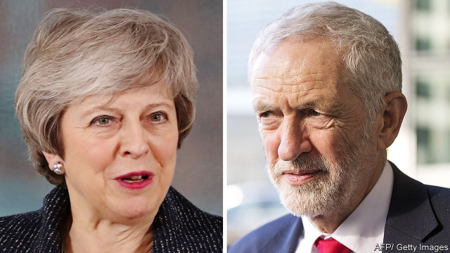

###### More haste, less speed

# Britain and the EU must extend Article 50 

##### And not just until June, unless they want to end up in the same situation three months from now 

 

> Feb 28th 2019 

UNDER ENOUGH heat, atoms start to fly apart. Such is the state of Britain’s political parties as Brexit day approaches. Theresa May, the Conservative prime minister, has long insisted that Britain will leave the European Union on March 29th, deal or no deal. This week she conceded that Parliament would be allowed to request more time after all. Meanwhile Jeremy Corbyn, who has been resisting calls from Labour members to back a second referendum, said it was now the party’s policy to support one. 

The about-turns show the extent to which both leaders have lost control of their own Brexit policies, and their parties (see article). Their change of direction is welcome. Labour’s reluctant backing of a second vote has many strings attached, but Mr Corbyn has at last conceded the principle that the public should have the right to approve or reject any deal. And Mrs May’s volte face makes it highly unlikely that Britain will crash out of the EU without a deal in a month’s time. 

Yet no one should get too excited. This week’s developments do not get rid of the cliff edge towards which Britain is heading—they only push it back, and not very far. Mrs May said that the Article 50 talks could be extended only to the end of June at the latest. That would buy just another three months. The prime minister seems determined to persist with her tactic of pretending to renegotiate her deal with the EU, running down the clock in the hope that MPs will feel forced to approve the deal as time runs out and the cliff edge draws nearer. 

This strategy has a poor record. Mrs May originally planned to present her deal to MPs in December, but pulled it when it became clear they would reject it. In January, when time was already tight, they defeated it by a record margin of 230 votes. The deal was supposed to return to the Commons this week for another attempt but the prime minister backed down again, fearing a second rout. She now says MPs will get to vote on her deal by March 12th, just 17 days before exit day. They may yet cave in; some hardline Brexiteers are already hinting that they might rather leave on time with Mrs May’s deal than delay Britain’s departure, at the risk of ending up with another referendum. But other MPs, far from feeling more cowed as Brexit day looms, seem to be growing in rebellious confidence. The prime minister has kicked the can down the road so many times. How many believe her when she now says that the end of June will be the final deadline? As Mrs May’s strategy remains unchanged even as her credibility collapses further, the risk is that Britain’s poisonous Brexit impasse simply continues for another three months. 

That is why the EU should try to push Britain towards delaying Brexit for longer, perhaps until the end of the year. An extension is useful only if Britain uses it to build a Brexit strategy that can command the support of a stable majority of MPs and the public. And that is more likely the more time it has. Holding yet another election might be another way to break the deadlock in Parliament (though polls suggest it might just prolong it). This newspaper has argued that a referendum on Mrs May’s negotiated deal would be a better way to achieve such agreement. Either of these radical courses would take longer than three months to succeed. 

A long extension would carry risks. Some Tories are itching to topple Mrs May; if they did, her replacement might turn out to be even harder to deal with. And if Britain remained in the EU beyond the end of June then it might be legally obliged to take part in this spring’s European Parliament elections, which it is not currently scheduled to do. Yet even as legalistic an institution as the EU ought to be able to find a way around snags such as this, if the prize is a better Brexit outcome for all parties. 

When, as seems likely, Mrs May asks for more time two weeks from now, the EU should press her to accept a long extension. And Mrs May should welcome its offer. 

-- 

 单词注释:

1.les[lei]:abbr. 发射脱离系统（Launch Escape System） 

2.EU[]:[化] 富集铀; 浓缩铀 [医] 铕(63号元素) 

3.Brexit[]:[网络] 英国退出欧盟 

4.theresa[ti'ri:zә]:n. 特丽萨（女子名） 

5.concede[kәn'si:d]:vt. 承认, 退让 vi. 让步 

6.jeremy['dʒerimi]:n. 杰里米（男子名） 

7.Corbyn[]:科尔宾（人名） 

8.referendum[.refә'rendәm]:n. （就重大政治或社会问题进行的）全民公决，全民投票 

9.Mr['mistә(r)]:先生 [计] 存储器回收程序, 多重请求 

10.volte[vɔlt, vәjlt, vɔ:lt]:n. 回, 次 

11.tactic['tæktik]:n. 一项战术, 一条策略 a. 战术的, 顺序的, 排列的 

12.renegotiate[.ri:ni'gәuʃieit]:vt. 重新谈判 

13.MP[]:国会议员, 下院议员 [计] 宏处理程序, 维护程序, 线性规划, 微程序, 多处理器 

14.originally[ә'ridʒәnli]:adv. 本来, 原来, 最初, 就起源而论, 独创地 

15.rout[raut]:n. 溃败, 大败, 乌合之众, 盛大晚会 vt. 使溃败, 使败逃, 打垮, 用鼻拱, 挖起, 搜, 唤起 vi. 用鼻拱地, 搜 

16.hardline[]:n. 强硬路线 [电] 硬线 

17.Brexiteers[]:支持英国退欧的人（Brexiteer的复数） 

18.loom[lu:m]:n. 织布机, 若隐若现的景象 vi. 朦胧地出现, 隐约可见, 可怕地出现 

19.rebellious[ri'beljәs]:a. 造反的, 反抗的 [法] 造反的, 反抗的, 反判的 

20.unchanged[.ʌn'tʃeindʒd]:a. 无变化的 [经] 持稳的 

21.credibility[.kredi'biliti]:n. 可信用, 确实性, 可靠 [法] 证据能力, 可信程度, 确实性 

22.impasse['impɑ:s]:n. 难局, 僵局, 死路, 死胡同 

23.deadlock['dedlɒk]:n. 僵局, 停顿 v. (使)停顿, (使)相持不下 [计] 死锁 

24.prolong[prәu'lɒŋ]:vt. 延长, 拖延, 拖长 [化] 冷凝管 

25.Tory['tɒ:ri]:n. 托利党党员, 保守党员, 亲英分子 a. 保守分子的 

26.itch[itʃ]:n. 痒, 渴望, 疥疮 vi. 发痒, 渴望 

27.topple['tɒpl]:vt. 推翻, 颠覆 vi. 倒塌, 摇摇欲坠 

28.replacement[ri'pleismәnt]:n. 归还, 更换, 代替者 [医] 复位, 置换 

29.legally['li:gәli]:adv. 法律上, 合法地 [法] 法律上, 合法地, 法定地 

30.currently['kʌrәntli]:adv. 现在, 当前, 一般, 普通 [计] 当前 

31.legalistic[.li:gә'listik]:a. 尊重法律的 

32.snag[snæg]:n. (尖利的)突出物, (衣服等的)戳破处, 断牙, 意外障碍 vt. 造成阻碍, 抓住机会, 抢到, 清除障碍物 

