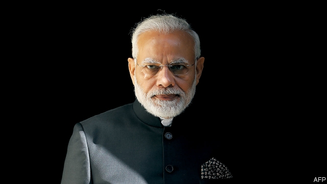

###### Modi’s dangerous moment

# India and Pakistan should stop playing with fire 

##### With an election looming, Narendra Modi is under pressure to act tough 

 

> Feb 28th 2019 

THE ARMIES of India and Pakistan often exchange fire across the front line in the disputed state of Kashmir. When tensions rise, one side will subject the other to a blistering artillery barrage. On occasion, the two have sent soldiers on forays into one another’s territory. But since the feuding neighbours tested nuclear weapons in the late 1990s, neither had dared send fighter jets across the frontier—until this week. After a terrorist group based in Pakistan launched an attack in the Indian-controlled part of Kashmir that killed 40 soldiers, India responded by bombing what it said was a terrorist training camp in the Pakistani state of Khyber Pakhtunkhwa. Pakistan retaliated by sending jets of its own to bomb Indian targets. In the ensuing air battle, both sides claim to have shot down the other’s aircraft, and Pakistan captured an Indian pilot. 

A miscalculation now could spell calamity. The fighting is already the fiercest between the two countries since India battled to expel Pakistani intruders from high in the Himalayas in 1999. The initial Indian air raid struck not Pakistan’s bit of Kashmir, but well within Pakistan proper and just 100km from the capital, Islamabad. That, in effect, constituted a change in the rules of engagement between the two (see article). India and Pakistan are so often at odds that there is a tendency to shrug off their spats, but not since their most recent, full-blown war in 1971 has the risk of escalation been so high. 

The intention of Narendra Modi, India’s prime minister, in ordering the original air strike was simple. Pakistan has long backed terrorists who mount grisly attacks in India, most notably in Mumbai in 2008, when jihadists who arrived by boat from Pakistan killed some 165 people. Although Pakistan’s army promised then to shut down such extremist groups, it has not. By responding more forcefully than usual to the latest outrage, Mr Modi understandably wanted to signal that he was not willing to allow Pakistan to keep sponsoring terrorism. 

In the long run, stability depends on Pakistan ending its indefensible support for terrorism. Its prime minister, Imran Khan, is urging dialogue and, in a promising gesture, was due to release India’s pilot—presumably with the approval of the army chief, who calls the shots on matters of security. 

But in the short run Mr Modi shares the responsibility to stop a disastrous escalation. Because he faces an election in April, he faces the hardest and most consequential calculations. They could come to define his premiership. 

Mr Modi has always presented himself as a bold and resolute military leader, who does not shrink from confronting Pakistan’s provocations. He has taken to repeating a catchphrase from the film “Uri”, which portrays a commando raid he ordered against Pakistan in 2016 in response to a previous terrorist attack as a moment of chin-jutting grit. The all-too-plausible fear is that his own tendency to swagger, along with domestic political pressures, will spur him further down the spiral towards war. 

The ambiguity of Mr Modi’s beliefs only deepens the danger. He campaigned at the election in 2014 as a moderniser, who would bring jobs and prosperity to India. But, his critics charge, all his talk of development and reform is simply the figleaf for a lifelong commitment to a divisive Hindu-nationalist agenda. 

Over the past five years Mr Modi has lived up neither to the hype nor to the dire warnings. The economy has grown strongly under his leadership, by around 7% a year. He has brought about reforms his predecessors had promised but never delivered, such as a nationwide goods-and-services tax (GST). 

But unemployment has actually risen during Mr Modi’s tenure, according to leaked data that his government has been accused of trying to suppress (see article). The GST was needlessly complex and costly to administer. Other pressing reforms have fallen by the wayside. India’s banks are still largely in state hands, still prone to lend to the well-connected. And as the election has drawn closer, Mr Modi has resorted to politically expedient policies that are likely to harm the economy. His government hounded the boss of the central bank out of office for keeping interest rates high, appointing a replacement who promptly cut them. And it has unveiled draft rules that would protect domestic e-commerce firms from competition from retailers such as Amazon. 

By the same token, Mr Modi has not sparked the outright communal conflagration his critics, The Economist included, fretted about before he became prime minister. But his government has often displayed hostility to India’s Muslim minority and sympathy for those who see Hinduism—the religion of 80% of Indians—as under threat from internal and external foes. He has appointed a bigoted Hindu prelate, Yogi Adityanath, as chief minister of India’s most populous state, Uttar Pradesh. A member of his cabinet presented garlands of flowers to a group of Hindu men who had been convicted of lynching a Muslim for selling beef (cows are sacred to Hindus). And Mr Modi himself has suspended the elected government of Jammu & Kashmir, India’s only Muslim-majority state, and used force to suppress protests there against the central government, leading to horrific civilian casualties. 

As reprehensible as all this is, the Hindu zealots who staff Mr Modi’s electoral machine complain that he has not done enough to advance the Hindu cause (see article). And public dissatisfaction with his economic reforms has helped boost Congress, the main opposition party, making the election more competitive than had been expected. The temptation to fire up voters using heated brinkmanship with Pakistan will be huge. 

Mr Modi has made a career of playing with fire. He first rose to prominence as chief minister of Gujarat when the state was racked by anti-Muslim pogroms in 2002. Although there is no evidence he orchestrated the violence, he has shown no compunction about capitalising on the popularity it won him in Hindu-nationalist circles. With a difficult election ahead, he may think he can pull off the same trick again by playing the tough guy with Pakistan, but without actually getting into a fight. However, the price of miscalculation does not bear thinking about. Western governments are pushing for a diplomatic settlement at the UN. If Mr Modi really is a patriot, he will now step back. 

-- 

 单词注释:

1.Pakistan[.pɑ:ki'stɑ:n]:n. 巴基斯坦 

2.loom[lu:m]:n. 织布机, 若隐若现的景象 vi. 朦胧地出现, 隐约可见, 可怕地出现 

3.narendra[]:[网络] 纳伦德拉；纳兰德；纳然陀 

4.MODI['mәudai]:[计] 模块化光学数字接口 

5.Kashmir['kæʃmiә]:n. 克什米尔 

6.blister['blistә]:n. 水疱 [化] 砂眼 

7.artillery[ɑ:'tilәri]:n. 火炮, 炮兵, 炮术 [机] 火炮, 炮兵 

8.barrage['bærɑ:dʒ]:n. 弹幕, 掩护炮火 vt. 以密集炮火进攻 

9.foray['fɒrei]:vi. 侵略, 劫掠, 袭击 n. 侵掠, 侵略, 攻击 

10.feud[fju:d]:n. 不和, 封地, 争执 vi. 长期不和, 擦亮 

11.terrorist['terәrist]:n. 恐怖分子 [法] 恐怖份子, 恐怖主义 

12.Pakistani[.pɑ:ki'stɑ:ni]:a. 巴基斯坦的 n. 巴基斯坦人 

13.Khyber[]:n. (Khyber)人名；(阿富)希贝尔 

14.Pakhtunkhwa[]:[网络] 伯尔省帕科屯瓦；普赫图赫瓦 

15.retaliate[ri'tælieit]:vt. 报复, 回敬 vi. 报复, 以牙还牙 

16.ensuing[]:a. 接著发生的 

17.miscalculation[]:n. 算错, 失算, 估计错误 [计] 计算错误, 算错 

18.calamity[kә'læmiti]:n. 灾难, 不幸事件 

19.intruder[in'tru:dә]:n. 侵入者, 干扰者, 妨碍者 [计] 入侵者 

20.Himalaya[,himə'leiə]:n. 喜马拉雅山脉 

21.ISLAMABAD[is'lɑ:mәbɑ:d]:伊斯兰堡(巴基斯坦首都) 

22.constitute[kәn'stitjut]:vt. 构成, 组成, 任命 [建] 构造, 组成 

23.engagement[in'geidʒdmәnt]:n. 诺言, 约会, 婚约, 交战 [医] 衔接 

24.odds[ɒdz]:n. 可能性, 几率, 机会, 胜算, 不平等 

25.spat[spæt]:n. 蚝卵, 口角, 拍打 vi. 拍打, 争吵 spit的过去式和过去分词 

26.escalation[.eskә'leiʃәn]:n. 扩大, 增加 [经] 调查, 价格调整 

27.grisly['grizli]:a. 可怕的, 厉害的, 令人畏惧的 

28.notably['nәjtbәli]:adv. 显著地, 著名地, 尤其, 特别 

29.mumbai[]:n. 孟买（印度城市） 

30.jihadist[]:n. 伊斯兰圣战士 

31.extremist[iks'tri:mist]:[经] 偏激份子 

32.forcefully[]:adv. 激烈地；强有力地；有说服力地 

33.outrage['autreidʒ]:n. 暴行, 侮辱, 愤怒 vt. 凌辱, 虐待, 触犯 

34.understandably[]:adv. 可懂, 可了解, 可理解 

35.terrorism['terәrizm]:n. 恐怖主义, 恐怖统治, 恐怖状态 [法] 胁迫, 暴政, 恐怖政治 

36.indefensible[.indi'fensәbl]:a. 不能防卫的, 无辩护余地的 

37.IMRAN[]:n. 伊姆兰（男子名） 

38.khan[kɑ:n]:n. 可汗, 商队宿店 

39.disastrous[di'zɑ:strәs]:a. 损失惨重的, 悲伤的 

40.consequential[,kɔnsi'kwenʃәl]:a. 作为结果的, 随之发生的, 推论的, 间接的, 重大的, 自大的, 傲慢的, 自傲的 [法] 结果的, 相应而生的, 接着发生的 

41.premiership['premjәʃip;pri'miә-,'pri:m-]:n. 总理职位, 首相职权, 首相职位, 总理职权 [法] 总理职位 

42.alway['ɔ:lwei]:adv. 永远；总是（等于always） 

43.resolute['rezәlu:t]:n. 果断的人 a. 坚决的, 刚毅的, 毅然的 

44.confront[kәn'frʌnt]:vt. 使面对, 对抗, 遭遇, 使对质, 比较 [法] 对证, 使对质, 比较 

45.provocation[.prɒvә'keiʃәn]:n. 激怒, 刺激, 挑拨 [医] 激发[作用] 

46.catchphrase['kætʃfreiz]:n. 吸引人们注意的话/字句 

47.uri[]:abbr. 上呼吸道感染（Upper Respiratory Infection）；统一资源标识符（Uniform Resource Identifier） 

48.portray[pɒ:'trei]:vt. 描绘, 描写, 描绘...的肖像 

49.commando[kә'mɑ:ndәu]:n. 突击队, 突击队员, (南非)布尔人部队 

50.grit[grit]:n. 砂砾, 粗砂石 vt. 覆以砂砾, 咬牙切齿地说 vi. 摩擦作声 

51.swagger['swægә]:n. 大摇大摆, 吹牛, 妄自尊大, 威吓 vi. 虚张声势吓人, 大摇大摆, 吹牛 vt. 吓唬, 恫吓 a. 漂亮的, 时髦的 

52.spiral['spairәl]:n. 螺旋形之物, 螺线 a. 螺旋形的, 盘旋的 vi. 螺旋形下降, 螺旋形上升, 螺旋形行进 vt. 使螺旋形行进 

53.ambiguity[.æmbi'gju:iti]:n. 不明确, 含糊 [计] 二义性; 多义性 

54.moderniser[]:n. 现代主义者, 现代化者 

55.figleaf[]:na. (雕塑)裸体像的遮羞叶；无花果叶 [网络] 狼战士；无花果树叶 

56.lifelong['laiflɒŋ]:a. 终身的, 毕生的 

57.divisive[di'vaisiv]:a. 区分的, 制造分裂的, 造成不和的 

58.hype[haip]:n. 大肆宣传；皮下注射 

59.dire[daiә]:a. 可怕的, 悲惨的, 阴沉的, 极端的 

60.predecessor[.predi'sesә]:n. 前任, 先辈, 前身 [医] 初牙, 前辈, 祖先 

61.gst[]:abbr. 格林威治恒星时（Greenwich Sideral Time） 

62.tenure['tenjuә]:n. 享有, 保有期 [经] (财产,职位等的)占有, 占有权 

63.datum['deitәm]:n. 论据, 材料, 资料, 已知数 [医] 材料, 资料, 论据 

64.suppress[sә'pres]:vt. 镇压, 使止住, 禁止, 抑制, 查禁 [法] 镇压, 平定, 禁止出版 

65.needlessly[]:adv. 不必要地；无用地 

66.administer[әd'ministә]:vt. 管理, 料理, 执行 vi. 执行遗产管理人的职责, 给予帮助 

67.prone[prәun]:a. 俯伏的, 面向下的, 有...倾向的 [医] 旋前的, 伏的, 俯的 

68.politically[]:adv. 政治上 

69.expedient[ik'spi:diәnt]:n. 权宜之计 a. 权宜的, 方便的, 有用的 

70.hound[haund]:n. 猎犬 vt. 带猎犬狩猎, 追捕, 激励, 使追逐 

71.replacement[ri'pleismәnt]:n. 归还, 更换, 代替者 [医] 复位, 置换 

72.promptly['prɒmptli]:adv. 敏捷地, 迅速地 

73.unveil[.ʌn'veil]:vt. 揭开, 揭幕, 除去...的面纱 vi. 显露, 除去面纱 

74.retailer['ri:teilә]:n. 零售商人, 传播的人 [经] 零售商 

75.amazon['æmәzɒn]:n. 亚马孙河 [医] 无乳腺者 

76.token['tәukәn]:n. 表征, 记号, 代币 a. 象征的, 表意的 [计] 记号 

77.outright['autrait]:a. 率直的, 完全的, 总共的, 直率的 adv. 完全地, 率直地, 立刻地, 一直向前 

78.communal['kɒmjunәl]:a. 公有的, 公社的 [法] 公共的, 自治体的, 巴黎公社的 

79.conflagration[.kɒnflә'greiʃәn]:n. 大火灾, 大火, 冲突 [化] 暴燃; 快速燃烧 

80.economist[i:'kɒnәmist]:n. 经济学者, 经济家 [经] 经济学家 

81.fret[fret]:n. 烦躁, 磨损, 焦急, 网状饰物 vi. 烦恼, 不满, 磨损 vt. 使烦恼, 腐蚀, 使磨损, 使起波纹 

82.hostility[hɒs'tiliti]:n. 敌意, 敌对, 反对 

83.Muslim['mjzlim; (?@) 'mʌzlem]:n. 伊斯兰教, 伊斯兰教教徒 

84.foe[fou]:n. 仇敌, 反对者, 敌人, 对手 

85.bigoted['bigәtid]:a. 盲从的, 固执己见的, 执迷的, 顽固的 

86.Hindu['hindu:]:a. 印度教教徒的 n. 印度教教徒 

87.prelate['prelit]:n. 高级教士 

88.yogi['jәu^i]:n. 瑜伽派教师, 教瑜伽功者 

89.populous['pɒpjulәs]:a. 人口多的, 人口稠密的 

90.uttar[]:[网络] 北方；乌塔茹阿；太邦 

91.Pradesh[]:邦 

92.garland['gɑ:lәnd]:n. 花环, 荣誉 vt. 戴花环 

93.convict[kәn'vikt]:n. 囚犯, 罪犯 vt. 宣告有罪, 使知罪 

94.lynch[lintʃ]:n. 私刑, 私罚 vt. 处以私刑处死, 加私刑 

95.Hindu['hindu:]:a. 印度教教徒的 n. 印度教教徒 

96.Jammu['dʒʌmu:]:查谟(城市, 位于亚洲查谟和克什米尔的西南) 

97.horrific[hɒ'rifik]:a. 令人毛骨悚然的, 感到恐惧的 

98.casualty['kæʒjuәlti]:n. 意外事故, 伤亡, 受害者 [化] 事故 

99.reprehensible[.repri'hensәbl]:a. 应斥责的, 应该谴责的 [法] 应受严责的, 应受指责的, 应受申斥的 

100.zealot['zelәt]:n. 热心者, 狂热者, 犹太教狂热信徒 [法] 狂热分子, 激烈分子 

101.electoral[i'lektәrәl]:a. 选举人的, 选举的, (有关)选举的 [法] 选举的, 选举人的, 由选举人组成的 

102.dissatisfaction['dis.sætis'fækʃәn]:n. 不满, 不平 

103.opposition[.ɒpә'ziʃәn]:n. 反对, 敌对, 相反, 在野党 [医] 对生, 对向, 反抗, 反对症 

104.voter['vәutә]:n. 选民, 投票人 [法] 选民, 选举人, 投票人 

105.brinkmanship['briŋkmәnʃip]:n. 边缘政策 [法] 外交冒险政策, 紧急政策 

106.prominence['prɒminәns]:n. 突起, 突出, 显著, 突出物, 凸出 [医] 隆凸, 凸 

107.Gujarat[,ɡu:dʒe'rɑ:t]:n. 古吉拉特邦（印度西部的邦） 

108.pogrom['pɒgrәm]:n. 集体迫害, 大屠杀 vt. 集体迫害, 大屠杀 

109.orchestrate['ɒ:kistreit]:v. 编管弦乐曲 

110.compunction[kәm'pʌŋkʃәn]:n. 良心的责备, 后悔, 悔恨 

111.capitalise['kæpitәlaiz]:vt. 用大写字母写, 用大写字母印, 投资于, 使变为资本, 提供资本给 vi. 利用 

112.popularity[.pɒpju'læriti]:n. 名声, 受大众欢迎, 流行 

113.diplomatic[.diplә'mætik]:a. 外交的, 老练的 [法] 外交的, 外交上的, 文献上的 

114.UN[ʌn]:pron. 家伙, 东西 [经] 联合国 

115.patriot['peitriәt]:n. 爱国者, 爱国主义者 

