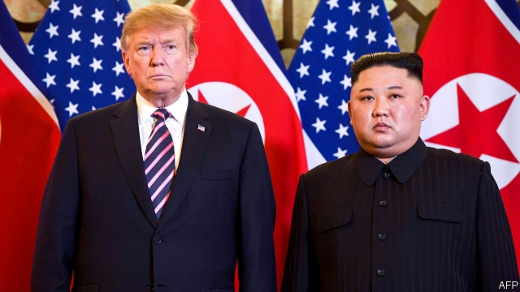

###### The Hanoi summit

# Trump and Kim walk away 

##### Talks break down without a deal. It could be a lot worse 

 

> Feb 28th 2019 

OH, THAT DIFFICULT second date. When President Donald Trump first met Kim Jong Un in Singapore in June last year, their talks achieved very little except a change of mood. But it was enough for Mr Trump to claim that he had prevented war in Asia and that North Korea was “no longer a nuclear threat”. 

On February 27th and 28th the two men met again, in Hanoi in Vietnam. This time Mr Trump was under pressure to win concrete concessions from Mr Kim, but he ended up walking away with nothing, saying that he would “rather do it right than do it fast.” If you believed Mr Trump’s hyperbole after Singapore, that will come as a bitter disappointment. But if the aim is to simply make the world a little bit safer, Mr Trump’s unorthodox, sweeping approach to the nitty-gritty business of arms-control is not exactly a failure either. 

Walking away was at least better than giving way. Details of the summit were still emerging as we went to press, but in the press conference that followed the talks, Mr Trump said that Mr Kim had demanded the lifting of sanctions in exchange for decommissioning the nuclear facility at Yongbyon. That would have been a terrible deal. The North has other facilities which produce weapons-grade uranium, not to mention a stock of warheads and missiles. 

Mr Trump also made clear that the disagreement was amicable. He expects more talks and more progress. He went out of his way to praise Mr Kim and to underline the economic potential of North Korea, if only it was prepared to surrender its arsenal and rejoin the world. It would be very Trumpian for the next overture to the North to come soon after this latest rebuff. 

Most important, the Hanoi summit retains the gains from Singapore. In the lead up to that first summit the North was testing ballistic missiles capable of hitting most of America. Those tests have stopped, as have its tests of the warheads themselves, lowering tension and the risk of inadvertent escalation. Mr Kim gave his word that this will not change. 

And yet, if denuclearisation really is the aim, the gulf looks unbridgeable. In Singapore, when the two sides agreed to a nuclear-free Korean peninsula, they meant different things. America expects the North to abandon its nuclear weapons in their entirety; the North insists that America withdraw the nuclear umbrella that protects South Korea as well as pull out its troops from the peninsula. 

Far from disarming, North Korea continues to build up its arsenal. Much to the irritation of Mr Trump, America’s intelligence agencies, backed by his military commander in Asia, have concluded that Mr Kim and his senior aides “ultimately view nuclear weapons as critical to regime survival.” As if to rub that in, a recent assessment from Stanford University reckoned that in the past year Mr Kim may have produced enough weapons-grade material for five to seven new bombs, taking his arsenal to 37. 

Meanwhile, Mr Kim has failed to take even rudimentary steps towards setting up a negotiating process that might eventually lead to large-scale disarmament. In the lead up to the Hanoi summit, he snubbed Mike Pompeo, the Secretary of State, and sulked about America’s offers. The North has refused to produce an inventory of its nuclear weapons, laboratories, test-sites and other facilities. Until it does, denuclearisation cannot get under way in earnest. Without a process to give the talks a momentum of their own, the entire enterprise depends on the whim of two highly unpredictable men. 

Obduracy built on a misunderstanding is hardly a promising foundation for lasting and large-scale disarmament. But it has at least resulted in a form of containment. For the time being, North Korea is living under a de facto test ban. That stops it from perfecting its weapons, or from using them to intimidate its neighbours. If you compare that with the achievements of Mr Trump’s predecessors, it is not too bad. 

-- 

 单词注释:

1.hanoi[hæ'nɔi]:n. 河内（越南首都） 

2.trump[trʌmp]:n. 王牌, 法宝, 喇叭 vt. 打出王牌赢, 胜过 vi. 出王牌, 吹喇叭 

3.kim[]:n. 金姆（人名） 

4.donald['dɔnәld]:n. 唐纳德（男子名） 

5.jong[jɔŋ]:n. 小伙子；（旧时的）青年男奴 

6.UN[ʌn]:pron. 家伙, 东西 [经] 联合国 

7.Singapore[.siŋgә'pɒ:]:n. 新加坡 

8.Korea[kә'riә]:n. 朝鲜, 韩国 

9.Vietnam[.vjet'næm]:n. 越南 

10.concession[kәn'seʃәn]:n. 特许, 让步, 认可 [经] 核准, 许可, 特殊(权) 

11.hyperbole[hai'pә:bәli]:n. 夸张法 

12.unorthodox[.ʌn'ɒ:θәdɒks]:a. 非正统的, 异教的 

13.sanction['sæŋkʃәn]:n. 核准, 制裁, 处罚, 约束力 vt. 制定制裁规则, 认可, 核准, 同意 

14.decommissioning[]:[化] 退役; 设施退役; 停运 

15.yongbyon[]:[网络] 宁边；宁边核设施 

16.uranium[ju'reiniәm]:n. 铀 [化] 铀U 

17.warhead['wɒ:hed]:n. 弹头 

18.amicable['æmikәbl]:a. 友善的, 友好的 [法] 友好的, 和睦的, 温和的 

19.arsenal['ɑ:snәl]:n. 兵工厂, 军械库 [机] 兵工厂 

20.rejoin[ri'dʒɒin]:vt. 使再结合, 再加入, 回答 vi. 重新聚合, 回答, 第二次答辩 

21.Trumpian[]:特朗普的 

22.overture['әuvә.tʃuә]:n. 主动表示, 事件的开端, 序言, 提议, 提案, 初步交涉 vt. 提议, 为...奏前奏曲 

23.rebuff[ri'bʌf]:n. 断然拒绝, 严厉拒绝, 漠不关心 vt. 严厉拒绝 

24.ballistic[bә'listik]:a. 弹道的 [医] 射击的, 冲击的 

25.inadvertent[.inәd'vә:tәnt]:a. 漫不经心的, 非故意的 

26.escalation[.eskә'leiʃәn]:n. 扩大, 增加 [经] 调查, 价格调整 

27.denuclearisation[di:-,nju:kliərai'zeiʃən; -ri'z-]:n. denuclearise的变形 

28.unbridgeable[.ʌn'bridʒәbl]:a. 不能架桥的, 不能逾越的 

29.Korean[kә'riәn]:n. 朝鲜人, 朝鲜语 a. 朝鲜人的, 朝鲜语的 

30.entirety[in'taiәti]:n. 全部, 整体 [法] 共有制, 整体, 全部 

31.disarm[dis'ɑ:m]:vt. 解除武装, 裁军, 缓和 vi. 放下武器 

32.irritation[.iri'teiʃәn]:n. 刺激, 烦恼, 刺激物 [医] 刺激[作用], 兴奋 

33.aide[eid]:n. 助手, 副官 [计] 数据输入的可说明性 

34.regime[rei'ʒi:m]:n. 政权, 当权期间, 政体, 社会制度, 体制, 情态 [医] 制度, 生活制度 

35.stanford['stænfәd]:n. 斯坦福（姓氏, 男子名）；斯坦福大学（美国一所大学） 

36.reckon['rekәn]:vt. 计算, 总计, 估计, 认为, 猜想 vi. 数, 计算, 估计, 依赖, 料想 

37.rudimentary[ru:di'mentәri]:a. 基本的, 起码的, 初步的, 发展不完全的, 残留的, 退化的 [医] 原基的, 未成熟的; 残遗的, 已退化的 

38.disarmament[dis'ɑ:mәmәnt]:n. 裁军 [法] 裁军, 解除军备 

39.snub[snʌb]:n. 冷落, 怠慢, 斥责, 制止 a. 制动用的, 短而扁的 vt. 冷落, 怠慢, 制止, 使...停住, 掐灭 

40.mike[maik]:vi. 偷懒, 游手好闲 n. 休息, 游手好闲, 扩音器, 话筒 

41.pompeo[]:n. (Pompeo)人名；(意)蓬佩奥 

42.sulk[sʌlk]:n. 闹情绪, 闷闷不乐 vi. 不高兴, 闷闷不乐, 不悦, 生气, 愠怒 

43.inventory['invәntәri]:n. 详细目录, 存货清单 vt. 列入详细目录, 清点存货 [计] 存货清单 

44.cannot['kænɒt]:aux. 无法, 不能 

45.momentum[mәu'mentәm]:n. 动力, 动量 [化] 动量 

46.whim[hwim]:n. 一时的兴致, 冲动, 怪念头, 绞盘 

47.unpredictable[.ʌnpri'diktәbl]:a. 不可预知的 

48.obduracy['ɒbdjurәsi]:n. 顽固, 执拗, 冷酷 

49.misunderstanding[.misʌndә'stændiŋ]:n. 误会, 误解 [法] 误解, 误会, 不和 

50.containment[kәn'teinmәnt]:n. 抑制, 牵制, 遏制 [法] 抑制, 牵制, 遏制 

51.de[di:]:[化] 非对映体过量 [医] 铥(69号元素铥的别名,1916年Eder离得的假想元素) 

52.facto[]:[法] 实际上, 事实上 

53.predecessor[.predi'sesә]:n. 前任, 先辈, 前身 [医] 初牙, 前辈, 祖先 

