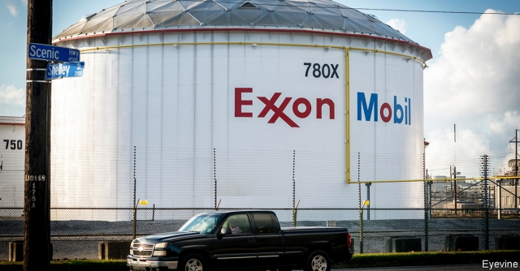

###### Letters to the editor

# On oil companies, Shropshire, Marcel Proust, Brexit 

##### A selection of correspondence 

> Mar 2nd 2019 

Climate change is far too complex to lend itself to an easy solution. Your case study of Exxon Mobil does indeed show that “the market cannot solve climate change by itself” and “muscular government action is needed” (“Crude awakening”, February 9th). But the hard fact is that both markets and governments fail to reflect climate-change risks, which explain the failure in slowing global warming. Without a global agreement for an effective, market-based framework for the taxing of carbon at an appropriately high level, no serious and sustainable dent can be made in greenhouse-gas emissions. This alone has doomed the Paris agreement to be a toothless deal. No wonder that coal’s share in the global energy mix keeps growing. 

Only forceful policies can alter the behaviour of the energy markets, which do not reflect that fossil-fuel firms are overvalued and may become stranded assets. These firms do not even sense the long-term risk of sitting on vast volumes of unburnable carbon reserves, which is a carbon bubble. These companies continue to develop reserves that would never be used with effective climate policies in place. They are rewarded by the markets for finding and developing new reserves. There is no noticeable exit from heavy emission-producing activities in anticipation of the possible introduction of a biting carbon tax. Unless this energy-market behaviour is dealt with, the vision of a carbon-free future will remain just that, a vision. 

ISTVAN DOBOZIFormer lead energy economist at the World BankGaithersburg, Maryland 

Shale (or fracking) explains much of the boom in the oil market, as well as the volatile market performance of energy companies. Production increases are occurring at the same time that profitability is declining. In 1980, 29% of the Standard & Poor’s 500 index was occupied by oil and gas; today it is 5%. Fracking has flooded the market with cheap gas, pushing prices down further. Investors seduced by the promise of increased profits are being left at the altar of derivatives standing in for real economic growth. 

You claim that energy companies that rely on fossil fuels are merely “responding to incentives set by society”. But oil and gas companies with their deep pockets continue to enjoy the privileges of a bygone era with the false promises of jobs and business expansion that have yet to materialise. 

The fact is that last year, oil and gas stocks placed last on the S&P 500. Money managers who continue to invest looking nostalgically backwards ignore this at their own (and their beneficiaries’) peril. 

TOM SANZILLODirector of financeInstitute for Energy Economics and Financial AnalysisCleveland 

I take exception to the suggestion that oil companies are merely responding to incentives and are thus not “evil”. When you know how serious the consequences are; when you knew decades ago of the severity of climate change and covered it up; when, knowing all that, you just follow “incentives”—that’s pretty evil. And when you maintain a political propaganda operation to lie about the problem and protect those incentives, that’s pretty evil, too. 

SHELDON WHITEHOUSESenator for Rhode IslandNewport, Rhode Island 

 

There are a few things you left out of your article on Exxon Mobil. First, it produces about only 3% of the world’s oil. If you want to target a much greater contributor to climate change, go after OPEC and Russia, which together account for more than half the world’s output. You also left out China, which alone is responsible for nearly half the rise of the world’s carbon emissions. Last, you mentioned that Exxon Mobil was against the Kyoto protocol, without pointing out that nearly all the countries that signed it failed miserably to keep to its provisions. 

STEPHEN MILLERSan Francisco 

Unfortunately, a tax on carbon is regressive given that poorer families pay a higher proportion of their income on energy, especially those in rural areas who must drive long distances. The remedy you propose, to offset carbon revenues with tax cuts, is also regressive. It will reward those with high incomes who pay higher taxes. A simpler approach is to rebate all revenues as a carbon dividend with the same amount to every person. That should appeal to France’s gilets jaunes and similar protest groups in other countries whose support is needed if we are to adopt a saner climate-change policy. 

MAX HENRIONLos Gatos, California 

Regarding Bagehot’s hymn to Shropshire and the damage that a no-deal Brexit would do to the county’s sheep industry (February 16th), did he visit Britpart, a fast-growing parts specialist for Land Rover that employs over 300 people at its Craven Arms site? There are always sales support and warehouse jobs available there and the firm exports all over the world. Just down the road is the headquarters of igloovision.com, a virtual-reality firm established in 2007. It now has offices in London, New Jersey and Toronto. 

Both of these firms offer better pay and employment conditions than Shropshire’s lamb abattoirs. These abattoirs are indirect beneficiaries of subsidies paid to Shropshire hill farmers, currently by the EU, but no doubt soon to be paid by British taxpayers if the guarantees offered by the government are to be believed. Moreover, in the Craven Arms area farmers are already diversifying rapidly into chickens, tourism and equine activities. 

I have lived for 20 years at the base of one of those famous blue hills in Shropshire. The forested areas are largely owned by the Forestry Commission with an increasing concern for diversity and wildlife. It is a significant part of the economy. The idea that landowners and farmers will let the land “degenerate into scrubland” is fanciful when land prices have skyrocketed. 

CHRISTINE PENDLETONCraven Arms, Shropshire 

Shropshire’s hills would not degenerate into scrubland without their “woolly lawnmowers”. Instead, they could once again support the varied ecosystems that flourished before the arrival of intensive ovine monoculture. A.E. Housman’s blessing is a mixed one. He has given Shropshire a rich poetic heritage, but he also helped fix our folk aesthetic on unnaturally bare hillsides. 

EDWARD GENOCHIOBirmingham 

I was delighted by your Proustian punning in “Remembrance of posts past” and “In search of lost time (and money)” (February 2nd). Both were takes on the alternative English-language translations of Marcel Proust’s seven-volume novel, “À la Recherche du Temps Perdu”. But given Robert Swan’s appointment as Intel’s new chief executive (“Swanning in”, February 9th), surely you missed a once-in-a-lifetime opportunity for another Proust pun with “Swan’s way”? 

WILLIAM TARVAINENLondon 

Surely we should be asking for an extension to Article 50 until the end of May (“Crisis deferred, again”, February 16th)? 

ALAN MALCOLMLondon 

-- 

 单词注释:

1.Shropshire['ʃrɔpʃiә]:(黑头黑脚白毛无角)肉用羊, 萨罗普羊 

2.marcel[mɑ:'sel]:n. 波浪形鬈发 vt. 把...烫成波浪形 vi. 烫发 

3.Proust[pru:st]:普鲁斯特(姓氏) 

4.Brexit[]:[网络] 英国退出欧盟 

5.correspondence[.kɒri'spɒndәns]:n. 相符, 通信, 信件 [医] 对应, 相对 

6.Exxon['ɛksan]:n. 艾克森石油公司 

7.mobil[]:n. 美孚石油公司（世界上最著名的石油公司之一） 

8.cannot['kænɒt]:aux. 无法, 不能 

9.muscular['mʌskjulә]:a. 强壮的, 肌肉发达的, 有力的 [医] 肌的; 肌肉发达的 

10.awaken[ә'weikәn]:vt. 唤醒, 唤起, 使意识到 vi. 觉醒, 意识到 

11.appropriately[]:adv. 适当的, 恰如其分的, 恰当的, 合适的 

12.sustainable[sә'steinәbl]:a. 足可支撑的, 养得起的, 可以忍受的 

13.dent[dent]:n. 凹痕 vt. 使凹下, 削弱 vi. 塌陷 

14.emission[i'miʃәn]:n. 发射, 射出, 发行 [医] 发射, 遗精 

15.doom[du:m]:n. 厄运, 不幸, 法律, 宣告, 判决, 死亡 vt. 命中注定, 判决 

16.toothless['tu:θlis]:a. 无齿的 [医] 无牙的 

17.forceful['fɒ:sful]:a. 有力的, 强烈的, 有说服力的 

18.overvalue[.әuvә'vælju:]:vt. 估价过高, 过分尊重, 估计过高 

19.strand[strænd]:n. (绳索的)股, 绳, 串, 海滨, 河岸 vi. 搁浅 vt. 使搁浅, 使落后, 使陷于困境, 弄断, 搓 

20.asset['æset]:n. 资产, 有益的东西 

21.unburnable[]:[网络] 不可燃 

22.anticipation[æn.tisi'peiʃәn]:n. 预期, 预料 [医] 提前出现(如遗传病) 

23.Istvan[]:n. (Istvan)人名；(罗)伊斯特万 

24.economist[i:'kɒnәmist]:n. 经济学者, 经济家 [经] 经济学家 

25.Maryland['merilәnd]:n. 马里兰州 

26.shale[ʃeil]:n. 页岩 

27.fracking[]:n. 水力压裂 

28.volatile['vɒlәtail]:a. 挥发性的, 可变的, 不稳定的, 飞行的, 轻快的, 爆炸性的 n. 有翅动物, 挥发物 [计] 易失的 

29.profitability[.prɒfitә'biliti]:n. 收益性, 利益率 [经] 可获利润率 

30.fracking[]:n. 水力压裂 

31.investor[in'vestә]:n. 投资者 [经] 投资者 

32.seduce[si'dju:s]:vt. 唆使, 怂恿, 引诱, 诱奸 [法] 勾引, 诱惑, 诱奸 

33.altar['ɒ:ltә]:n. 圣坛, 祭坛 

34.derivative[di'rivәtiv]:a. 引出的, 派生的 n. 引出之物, 派生物, 衍生字 

35.fossil['fɒsәl]:n. 化石, 古物 a. 化石的, 陈腐的, 守旧的 

36.incentive[in'sentiv]:n. 动机 a. 激励的 

37.bygone['baigɒn]:n. 过去的事, 往事 a. 过去的 

38.materialise[mә'tiәriәlaiz]:vi.vt. (使)物质化, (使)具体化, (使)追求物质利益, (使)显形, 成为事实, 实现 vi. 突然出现 

39.nostalgically[nɔˈstældʒɪkəlɪ]:adv. 怀乡地, 怀旧地, 恋旧地 

40.backwards['bækwәdz]:adv. 向后 

41.peril['peril]:n. 危险, 冒...之险, 险境, 险因 vt. 置...于险境, 冒险, 危及 

42.tom[tɒm]:n. 雄性动物, 雄猫 

43.severity[si'veriti]:n. 严格, 朴素, 激烈 

44.propaganda[.prɒpә'gændә]:n. 宣传, 宣传活动 [医] 宣传 

45.sheldon['ʃeldәn]:n. 谢尔登（男子名） 

46.rhode[]:n. 罗德岛 

47.contributor[kәn'tribjutә]:n. 贡献者, 捐助者, 赠送者, 投稿者 [法] 捐助人, 捐赠人, 投搞人 

48.OPEC['әjpek]:欧佩克(石油输出国家组织) 

49.Kyoto[ki'әutәu]:n. 京都 

50.protocol['prәutәkɒl]:n. 草案, 礼仪, 协议 v. 拟定 [计] 协议, 协议列表实用程序 

51.miserably['mizәrәbli]:adv. 非常不幸地, 可悲地, 贫困地 

52.stephen['sti:vn]:n. 斯蒂芬（男子名） 

53.francisco[fræn'siskәu]:n. 弗朗西斯科（男子名, 等于Francis） 

54.regressive[ri'gresiv]:a. 后退的, 退化的, 回归的 [医] 退化的, 退行的, 消退的, 回归的 

55.offset['ɒ:fset]:n. 抵消, 把...并列, 旁系, 支管, 用胶印法印 vt. 弥补, 抵消, 胶印 vi. 装支管 n. 偏移量 [计] 偏移量 

56.rebate[ri'beit]:n. 部分退款, 折扣 vt. 退还, 打折扣 vi. 退还部分付款 

57.dividend['dividend]:n. 被除数, 股利 [计] 被除数 

58.gilet[dʒi'lei]:n. 背心, 马甲 

59.jaune[]:[网络] 汝拉 

60.sane[sein]:a. 神智健全的, 稳健的, 没病的, 合理的 [医] 精神健全的 

61.MAX[mæks]:[计] 最大 

62.gatos[]: [人名] 加托斯 

63.California[.kæli'fɒ:njә]:n. 加利福尼亚 

64.hymn[him]:n. 赞美诗, 圣歌 v. 唱赞美歌 

65.rover['rәuvә]:n. 漂泊者, 流浪者, 海盗 [法] 流浪者, 海盗, 海盗船 

66.craven['kreivәn]:n. 懦夫, 怯懦者, 胆小鬼 a. 怯懦的, 畏缩的, 胆小的 

67.alway['ɔ:lwei]:adv. 永远；总是（等于always） 

68.headquarter[,hed'kwɔ:tә]:vt. 将...的总部设在 

69.jersey['dʒә:zi]:n. 运动衫 

70.toronto[tә'rɔntәu]:n. 多伦多（加拿大城市） 

71.abattoir['æbәtwɑ:]:n. 屠场, 角斗场 [医] 屠宰场 

72.beneficiary[.beni'fiʃәri]:n. 受惠者, 受益人 a. 受封的 

73.currently['kʌrәntli]:adv. 现在, 当前, 一般, 普通 [计] 当前 

74.EU[]:[化] 富集铀; 浓缩铀 [医] 铕(63号元素) 

75.taxpayer['tækspeiә]:n. 纳税人 [法] 纳税人, 纳税义务人 

76.diversify[dai'vә:sifai]:vt. 使多样化, 使变化 

77.equine['i:kwain]:n. 马 a. 马的, 象马的 

78.forestry['fɒristri]:n. 林学, 森林地 [法] 林地, 林学, 林业 

79.diversity[dai'vә:siti]:n. 差异, 多样性 [化] 多样性 

80.landowner['lændәunә]:n. 地主 [法] 土地所有人, 地主 

81.degenerate[di'dʒenәreit]:a. 堕落的 vi. 退化, 堕落 vt. 使变质, 使退化 

82.scrubland['skrʌblænd]:n. 灌木丛林地 

83.fanciful['fænsiful]:a. 奇怪的, 稀奇的, 想像的 

84.christine['kristi:n]:n. 克莉丝汀（女子名） 

85.woolly['wuli]:a. 羊毛制的, 模糊的, 似羊毛的, 蓬乱的 

86.lawnmower[]:n. 刈割者, 草坪割草机, 割草机 [电] 剪草机型放大器 

87.ecosystem['i:kәu.sistәm]:n. 生态系统 [医] 生态系 

88.ovine['әuvain]:a. 绵羊的 [医] 羊的 

89.monoculture['mɒnәkʌltʃә]:n. 单一栽培, 单作 [经] 单一农作物 

90.AE[]:[计] 绝对误差, 运算器 

91.poetic[pәu'etik]:a. 诗的, 诗意的, 诗人的 

92.heritage['heritidʒ]:n. 遗产, 祖先遗留物, 继承物 [医] 遗传性 

93.aesthetic[i:s'θetik]:a. 美学的, 审美的, 有美感的 

94.unnaturally[ʌn'nætʃrəlɪ]:adv. 违反习俗地; 不自然地; 勉强地; 不近人情地 

95.edward['edwәd]:n. 爱德华（男子名） 

96.Proustian[]:普鲁士的, 普鲁斯特的（proust的形容词形式） 

97.pun[pʌn]:n. 双关语, 俏皮话 vi. 说双关语, 说俏皮话 vt. 用双关语说服, 捣实 

98.remembrance[ri'membrәns]:n. 回想, 记忆, 纪念品, 记忆力, 问候, 致意 

99.La[lɔ:, lɑ:]:[医] 镧(57号元素) 

100.recherche[]:a. 精选的, 罕见的, 珍奇的 

101.temp[temp]:n. [口]临时雇员 

102.perdu[pә:'dju:]:a. 隐藏的, 潜伏的, 看不见的 n. 敢死队员, 很难成功的事, 几乎没有成功希望的举动 

103.Robert['rɔbәt]:[法] 警察 

104.william['wiljәm]:n. 威廉（男子名）；[常作W-][美俚]钞票, 纸币 

105.defer[di'fә:]:vi. 推迟, 延期, 听从 vt. 使推迟, 使延期 

106.alan['ælәn]:n. 艾伦（男子名） 

