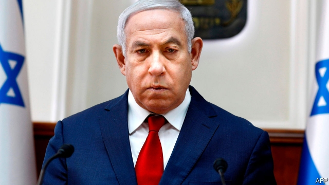

###### A blow to Bibi

# Accused of corruption, Binyamin Netanyahu vows to fight on 

##### Voters will soon decide whether the embattled prime minister deserves re-election 

 

> Feb 28th 2019 

BINYAMIN NETANYAHU has long hoped to make history this year. On April 9th, when Israel holds a general election, he aims to equal the record of the country’s founding prime minister, David Ben-Gurion, by racking up a fifth election victory. Following that, in July, he envisions becoming Israel’s longest-serving leader. He may yet achieve those milestones, but on February 28th he made history of a different sort, becoming Israel’s first sitting prime minister to be indicted, pending a hearing. 

Bribery, fraud and breach of trust are Mr Netanyahu’s alleged crimes. “You have hurt the image of public service and public faith in it,” Avichai Mandelblit, the attorney-general, wrote in his decision. “You acted in a conflict of interests, you abused your authority while taking into account other considerations that relate to your personal interests and the interests of your family. You corrupted public servants working under you.” 

Mr Netanyahu’s lawyers will have an opportunity to dispute the accusations in a pre-trial hearing before formal charges are filed. He himself is already on the attack, saying: “This house of cards will collapse soon.” But his oft-made claim about the investigation, that “there will be nothing, because there is nothing”, is starting to sound less convincing. 

The accusations stem from three cases. In the first, known as Case 1000, the police allege he accepted gifts of jewellery, champagne and Cuban cigars, worth more than $200,000, from rich patrons in return for political favours. He faces charges of fraud and breach of trust in that case. In the second, Case 2000, he is said to have discussed colluding with a newspaper publisher to curb the distribution of a competitor in exchange for favourable coverage. No deal was agreed on, but he still faces a charge of breach of trust. 

The third case, known as Case 4000, carries the greatest risk for Mr Netanyahu. In that one he is alleged to have intervened in regulatory decisions on behalf of Bezeq, a telecommunications giant, in return for gauzy coverage on Walla!, one of Israel’s most popular websites, which is owned by the company. The potential charges are fraud, breach of trust and bribery. Convictions could result in jail time. 

Police have recommended indicting Mr Netanyahu before, in unrelated cases, only for previous attorneys-general to let him off with a public reprimand. But it is difficult to see how the most recent cases do not go to trial. Police investigators and state attorneys took more than three years to assemble them. Among the dozens of witnesses for the prosecution will be three former close aides to the prime minister. Mr Mandelblit, who will have the final say, served as Mr Netanyahu’s cabinet secretary before the prime minister appointed him to his current job. He has deliberated long and hard over the decision. 

Israel’s legal system has already proved that no one is above the law. A past prime minister, Ehud Olmert, has served jail time for bribery; a former president, Moshe Katzav, was convicted of rape. Still, Mr Netanyahu insists that the accusations against him are much ado about nothing. He does not deny accepting gifts from friends and trying to influence the media. But he claims never to have traded favours. Mr Netanyahu says he is the victim of a conspiracy by leftists who are trying to use the legal system to bring him down, since they cannot defeat him at the ballot box. 

The law does not require an indicted prime minister to step down. Mr Olmert resigned in advance of being indicted; Yitzhak Rabin, another former prime minister, avoided charges over an illegal bank account by stepping down. There is a slim chance that Mr Netanyahu would resign as part of a plea deal, saving himself from an enormous legal bill, but for now he appears intent on fighting the charges and, if he wins in April, even standing trial while serving as prime minister—though that would almost certainly be the subject of a legal challenge. 

It may not get to that point. Mr Netanyahu’s top two opponents in the election—Benny Gantz, a former army chief of staff, and Yair Lapid, a former television personality—joined forces on February 21st. Their new centrist party, called Blue and White, after the colours of Israel’s flag, has begun attracting right-wing voters no longer enamoured with the prime minister. It is polling higher than his Likud party. 

Much can change before election day. Most polls still give Mr Netanyahu’s coalition of nationalist and religious parties a small majority in the next Knesset. The investigations are a “witch-hunt”, he says, the reports of corruption are “fake news”; Israelis should vote for him and stick it to the liberal elite. 

His political allies believe many will, so they have not yet abandoned him. But he is beginning to look desperate. He recently brokered an electoral pact between Jewish Home, a religious party in his coalition, and Jewish Power, a racist party that encourages the emigration of all Arabs. Until recently, even Likud considered Jewish Power beyond the pale. The union, though, helps to ensure that the two parties will reach the minimum threshold of 3.25% of the vote required to take seats in the Knesset, maximising right-wing votes. 

Critics of Mr Netanyahu say that he is harming Israeli democracy—and fear that he will do more damage if he is re-elected. He has turned his supporters against once-respected state bodies, such as the judiciary. There are rumours that, if he wins, he will try to pass a law that grants prime ministers immunity from prosecution while in office. In the meantime, he will try to turn the election into a referendum, in which voters are to choose between the prime minister and his prosecutors. Increasingly, Mr Netanyahu is ready to weaken Israel’s institutions in an attempt to ensure his political survival. 

More:  Why Binyamin Netanyahu should step down 

Editor’s note (February 28th 2019): Soon after The Economist went to press, the attorney-general of Israel indicted the prime minister, pending a hearing. This piece has been substantially updated, and differs from the version in print, which was published before the attorney-general’s announcement.  

-- 

 单词注释:

1.bibi[]:n. 周笔畅 

2.corruption[kә'rʌpʃәn]:n. 腐败, 堕落, 贪污 [计] 论误 

3.binyamin[]:本雅明 

4.Netanyahu[]:n. 内塔尼亚胡（人名） 

5.vow[vau]:n. 誓约, 誓言, 许愿 vi. 起誓, 发誓, 郑重宣言 vt. 立誓, 起誓要, 郑重地宣布 

6.voter['vәutә]:n. 选民, 投票人 [法] 选民, 选举人, 投票人 

7.embattle[im'bætl]:vt. 列阵, 布阵, 整军备战, 严阵以待 

8.binyamin[]:本雅明 

9.Israel['izreil]:n. 以色列, 以色列后裔, 犹太人 

10.david['deivid]:n. 大卫；戴维（男子名） 

11.envision[in'viʒәn]:vt. 想象, 预想 

12.milestone['mailstәun]:n. 里程碑, 里程石, 里程标 

13.indict[in'dait]:vt. 起诉, 控告, 指控 [法] 控告, 揭发, 对...起诉 

14.pending['pendiŋ]:a. 未决定的, 待决的, 行将发生的, 向外伸出的 prep. 在等待...之际, 直到...时为止, 在...期间, 在...过程中 

15.bribery['braibәri]:n. 贿赂行为, 行贿, 受贿 [经] 行贿, 受贿 

16.fraud[frɒ:d]:n. 欺骗, 欺诈, 诡计, 骗子 [经] 欺诈, 舞弊, 骗子 

17.breach[bri:tʃ]:n. 裂口, 违背, 破坏, 违反, 突破, 破裂 vt. 攻破, 突破 vi. 跳出水面 

18.allege[ә'ledʒ]:vt. 宣称, 主张, 提出, 断言 [法] 断言, 指称, 指证 

19.accusation[ækju:'zeiʃәn]:n. 控告, 指控, 指责 [法] 控告, 起诉, 告发 

20.les[lei]:abbr. 发射脱离系统（Launch Escape System） 

21.jewellery['dʒu:әlri]:n. 宝石, 贵重饰物, 珠宝, 宝石饰物, 受珍视的人/物, 宝贝, 有价值的人/物 

22.champagne[ʃæm'pein]:n. 香槟酒, 香槟酒色 [化] 香槟酒 

23.Cuban['kju:bәn]:a. 古巴的, 古巴人的 n. 古巴人 

24.patron['peitrәn]:n. 赞助人, 顾客, 保护人 [法] 保护人, 庇护人, 赞助人 

25.collude[kә'lu:d]:vi. 共谋, 串通, 勾结 

26.publisher['pʌbliʃә]:n. 出版者, 发行人 [法] 发行人, 出版者, 报刊发行者 

27.curb[kә:b]:n. 抑制, 勒马绳, 边石 vt. 抑制, 束缚, 勒住 

28.coverage['kʌvәridʒ]:n. 覆盖的范围, 保险总额, 新闻报导 [化] 可达范围; 覆盖度 

29.intervene[.intә'vi:n]:vi. 插入, 调停, 干涉 [经] 进场干预 

30.regulatory['regjulәtәri]:a. 受控制的, 统制的, 调整的 [经] 规则的 

31.telecommunication['telikәmju:ni'keiʃәn]:n. 电讯, 远距离通讯, 无线电通讯 [计] 远程通信, 电信 

32.gauzy['gɒ:zi]:a. 纱似的, 薄的 

33.bribery['braibәri]:n. 贿赂行为, 行贿, 受贿 [经] 行贿, 受贿 

34.conviction[kәn'vikʃәn]:n. 定罪, 信服, 坚信 [法] 定罪, 证明有罪, 判罪 

35.unrelated[]:[法] 无关的 

36.reprimand['reprimɑ:nd]:n. 谴责, 惩戒, 非难 vt. 谴责, 惩戒, 严责 

37.investigator[in'vestigeitә]:n. 调查者, 审查者 [法] 审查员, 侦查员, 调查员 

38.attorney[ә'tә:ni]:n. 代理人, 律师 [经] 律师, 代理人 

39.prosecution[.prɒsi'kju:ʃәn]:n. 执行, 经营, 起诉 

40.aide[eid]:n. 助手, 副官 [计] 数据输入的可说明性 

41.ehud[]:[网络] 以笏；以色列；艾胡得 

42.olmert[]:n. [姓氏]奥尔默特 

43.Moshe[]:n. (Moshe)人名；(以)摩西 

44.katzav[]:[网络] 卡塔夫 

45.convict[kәn'vikt]:n. 囚犯, 罪犯 vt. 宣告有罪, 使知罪 

46.rape[reip]:n. 抢夺, 掠夺, 强奸, 葡萄渣, 芸苔 vt. 掠夺, 抢夺, 强奸 

47.ado[ә'du:]:n. 纷扰, 忙乱, 麻烦 

48.conspiracy[kәn'spirәsi]:n. 同谋, 阴谋, 阴谋集团 [法] 阴谋, 通谋, 共谋 

49.leftist['leftist]:n. 左翼的人, 左派 a. 左派的 

50.cannot['kænɒt]:aux. 无法, 不能 

51.ballot['bælәt]:n. 投票, 投票用纸, 抽签 vi. 投票, 抽签 vt. 投票选出, 拉选票 

52.Yitzhak[]:n. (Yitzhak)人名；(以)伊扎克 

53.Rabin[]:n. 拉宾（希伯来姓氏） 

54.plea[pli:]:n. 恳求, 辩解, 抗辩, 诉讼, 请愿, 托词 [法] 抗辩, 申诉案件, 答辩 

55.intent[in'tent]:n. 意图, 含义, 故意 a. 专心的, 决心的, 热心的 

56.gantz[]: [人名] 甘茨; [电影]杀戮都市/杀戮都市 

57.yair[jeә(r)]:adv. <澳>=yeah 

58.lapid[]:abbr. lapidary 宝石商; lapideum (Latin=stony) （拉丁语）石样的; 硬的; 无情的 

59.centrist['sentrist]:n. 中间党派的成员, 温和主义者 [法] 中间派议员, 中立派议员 

60.enamour[i'næmә]:vt. 迷住, 使迷恋 

61.Likud[li:'ku:d]:n. 利库德集团(以色列右翼党派的政治联盟,长期为以色列执政党) 

62.coalition[.kәuә'liʃәn]:n. 结合体, 结合, 联合 [经] 联合, 联盟 

63.nationalist['næʃәnәlist]:n. 国家主义者, 民族主义者 

64.Knesset['kneset]:n. (以色列)议会 

65.fake[feik]:n. 假货, 欺骗, 诡计 a. 假的 vt. 假造, 仿造 vi. 伪装 

66.Israeli[iz'reili]:a. 以色列的, 以色列人(语)的 n. 以色列人 

67.elite[ei'li:t]:n. 精华, 精锐, 中坚分子 

68.ally['ælai. ә'lai]:n. 同盟者, 同盟国, 助手 vt. 使联盟, 使联合, 使有关系 vi. 结盟 

69.broker['brәukә]:n. 掮客, 经纪人 [经] 经纪人, 掮客 

70.electoral[i'lektәrәl]:a. 选举人的, 选举的, (有关)选举的 [法] 选举的, 选举人的, 由选举人组成的 

71.pact[pækt]:n. 契约, 协定, 条约 [化] 合同 

72.racist['reisist]:n. 种族主义者 [法] 种族主义的, 种族歧视 

73.emigration[.emi'greiʃәn]:n. 移民, 移居外国(或外地) [医] 血细胞渗出 

74.threshold['θreʃәuld]:n. 门槛, 入口, 开端, 阈 [计] 阈; 阈值 

75.maximise['mæksimaiz]:vt. 把...增加到最大限度, 把...扩大到最大限度, 充分重视, 找出...的最高值 

76.Israeli[iz'reili]:a. 以色列的, 以色列人(语)的 n. 以色列人 

77.supporter[sә'pɒ:tә]:n. 支持者, 后盾, 迫随者, 护身织物 [法] 支持者, 赡养者, 抚养者 

78.judiciary[dʒu:'diʃiәri]:a. 司法的, 法院的, 法官的 n. 司法部, 司法系统, 法官 

79.immunity[i'mju:niti]:n. 免疫, 免疫性, 免除 [化] 免疫性 

80.referendum[.refә'rendәm]:n. （就重大政治或社会问题进行的）全民公决，全民投票 

81.prosecutor['prɒsikju:tә]:n. 实行者, 告发者, 公诉人 [法] 原告, 起诉人, 检举人 

82.economist[i:'kɒnәmist]:n. 经济学者, 经济家 [经] 经济学家 

83.substantially[sәb'stænʃәli]:adv. 实质上, 本质上, 大体上 

84.update[ʌp'deit]:vt. 更新, 使现代化 n. 更新 [计] 更新 

