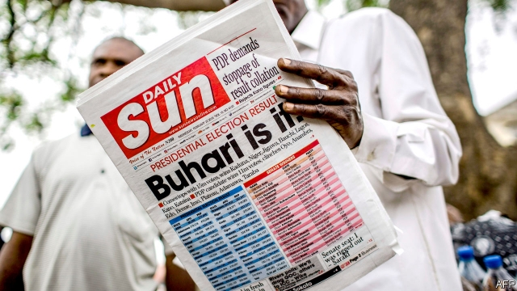
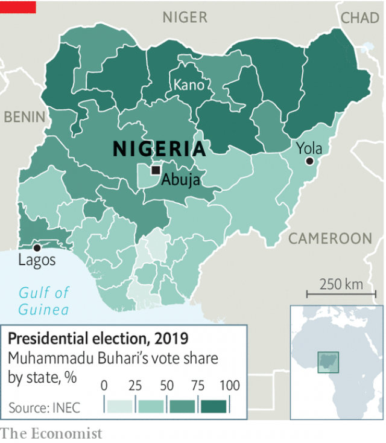

###### Time to keep those promises

# Nigeria’s President Muhammadu Buhari wins a second term 

##### The opposition is challenging the result, but seems unlikely to succeed 

 

> Feb 28th 2019 

A  SMALL CROWD gathered around a plastic table by a dusty roadside in the eastern Nigerian town of Yola on February 23rd. When an electoral officer announced that Muhammadu Buhari, the incumbent president, won the most votes there his supporters in the crowd erupted, cheering and dancing. Fans of his main challenger, Atiku Abubakar, who cast his ballot at this polling station earlier in the morning, slunk away, dejected. “It feels very painful,” said Muhammad Sanusi, one such supporter. 

That pain has only increased. On February 27th Nigeria’s Independent National Electoral Commission (INEC) announced that Mr Buhari had won a second term, with 56% of the vote. His victory this time will not generate the same euphoria it did in 2015. The former general, who ruled briefly as the country’s military dictator after a coup in the 1980s, has struggled to fulfil many of the campaign promises he made four years ago. Mr Abubakar’s People’s Democratic Party (PDP) claims the results were rigged. In a sign of growing voter apathy, turnout, which languished at 44% in 2015, fell to 36% this time. 

For many Nigerians, the election has been tarnished by the sloppiness with which it was run. The vote was originally scheduled for February 16th, but INEC postponed it just hours before it was meant to begin because it had been unable to get materials, such as ballot papers, to polling stations on time. When the vote was held at last on February 23rd, observers say most polling stations opened hours late for the same reason, and many election officials were unprepared. The European Union’s observer mission cited “serious operational shortcomings”. 

Voting proceeded peacefully in most parts of the country, but violence broke out in some states. The Nigeria Civil Society Situation Room, a group of NGOs monitoring the vote, reckons at least 39 people were killed over the weekend, most by thugs who attacked polling stations. It is not clear on which party’s behalf they were acting. Some fear clashes after the poll, a staple of previous Nigerian elections. About 800 people were killed in 2011. This time, to deter such violence, radio stations in Yola played only songs promoting peace on voting day. “No need to fight-o,” one number urged. “Things gotta change by determination; this election no intimidation.” 

Vote-buying was more widespread. Mr Buhari’s All Progressives’ Congress (APC) and the PDP were probably both culpable. In a posh neighbourhood of Lagos, Nigeria’s economic capital, one resident says he saw a man handing out cash on voting day. On the eve of the vote, a journalist in Yola said a politician gave his wife sachets of spices to give to voters in her village. 

 

Such problems have also plagued past elections, and observers say this vote was not necessarily worse run. YIAGA Africa, an NGO, carried out a parallel vote tabulation (PVT), a technique for projecting results based on a sample of polling stations in each state. It says the PVT’s estimates “are consistent with the official results announced by INEC”. 

The PDP, though, says the APC plotted to rig the vote with help from the army and INEC. “I hereby reject the result,” Mr Abubakar declared shortly after his defeat was announced. His party alleges that Mr Buhari’s replacement of the Supreme Court’s chief justice in January, ostensibly for corruption, was in fact aimed at thwarting a legal challenge to the results. Mr Abubakar has said the PDP will mount one. The court-appointed election tribunal could take months to issue a verdict. That said, the courts have never overturned a presidential election in Nigeria. 

Many Nigerians will be disappointed to see Mr Buhari remain in power. Broadly, his campaign this time focused on the same three areas as it did in 2015: corruption, the economy and security. Progress on all three has been limited on his watch. 

“I was very disappointed with Buhari’s first term,” says Umar, a civil servant in Abuja, the capital. But he says he “had to vote for him in the end” because he believed Mr Abubakar was corrupt. Graft remains ever-present in the lives of most Nigerians, and opponents accuse Mr Buhari of fighting it selectively. His own party has welcomed light-fingered defectors from the PDP into its ranks. The APC governor of Kano state, in northern Nigeria, was filmed last year receiving thick stacks of dollars. (He denies receiving the money.) 

Ordinary Nigerians struggle to make ends meet. The economy is still only slowly recovering from a recession in 2016. Some saw it as a chance to diversify, but oil still accounts for over two-thirds of government revenue. Manufacturing is crippled by power shortages. One factory boss in Kano, once an industrial hub, says manufacturers there are producing at around 10% of capacity. Mr Buhari’s supporters say that, given more time, he can do better. 

Security was one area where Mr Buhari appeared to be making progress. The army has pushed the jihadists of Boko Haram out of major towns in the north-east. But they have not been defeated and, in recent months, have looked resurgent. Even more deadly are clashes between farmers and herders in the country’s “middle belt”. Many in the predominantly Christian south accuse Mr Buhari of favouritism towards the country’s largely Muslim northern half. (Mr Buhari is a northern Muslim.) Dire Atako, a Christian timber trader living outside Yola, voted for Mr Abubakar (also a northern Muslim) because he wanted change after his village had been attacked by herders. “The present government assured us of security, but I have seen houses here burned down,” he says. 

At Mr Abubakar’s polling station in Yola, Abdul Mutallib, another of his followers, looked on as APC supporters gloated. “If our candidate loses, we’ll accept it,” he said. “Life goes on.” If the rest of the country’s political class shows the same restraint, then Nigeria’s flawed democracy will have made some progress. 

-- 

 单词注释:

1.buhari[]:[网络] 布哈里 

2.opposition[.ɒpә'ziʃәn]:n. 反对, 敌对, 相反, 在野党 [医] 对生, 对向, 反抗, 反对症 

3.roadside['rәudsaid]:n. 路旁, 路边 a. 路边的 

4.Nigerian[nai'dʒiriәn]:n. 尼日利亚人 

5.yola[]:n. 约拉（尼日利亚东部城市） 

6.electoral[i'lektәrәl]:a. 选举人的, 选举的, (有关)选举的 [法] 选举的, 选举人的, 由选举人组成的 

7.incumbent[in'kʌmbәnt]:a. 现任的, 依靠的, 负有义务的 n. 领圣俸者, 在职者 

8.supporter[sә'pɒ:tә]:n. 支持者, 后盾, 迫随者, 护身织物 [法] 支持者, 赡养者, 抚养者 

9.challenger['tʃælindʒә]:n. 挑战者 [经] 申请回避的人 

10.atiku[]:[网络] 阿蒂库 

11.abubakar[]:n. (Abubakar)人名；(尼日利、坦桑)阿布巴卡尔 

12.ballot['bælәt]:n. 投票, 投票用纸, 抽签 vi. 投票, 抽签 vt. 投票选出, 拉选票 

13.slink[sliŋk]:vi. 鬼鬼祟祟地走, (动物)早产 vt. 早产 n. 鬼鬼祟祟的人, 早产的动物 a. 早产的 

14.deject[di'dʒekt]:vt. 使沮丧, 使灰心 

15.muhammad[]:n. 穆罕默德 

16.Sanusi[]:[网络] 努西；行长萨努西；赛努西 

17.electoral[i'lektәrәl]:a. 选举人的, 选举的, (有关)选举的 [法] 选举的, 选举人的, 由选举人组成的 

18.inec[ɪ'nek]:abbr. inverted emulsifiable concentrate 反向乳化浓缩 

19.euphoria[ju:'fɒ:riә]:n. 兴奋, 陶醉, 陶醉感 [医] 精神愉快, 欣快 

20.briefly['brifli]:adv. 简短地, 扼要地, 简明地, 简单地 

21.dictator['dikteitә]:n. 命令者, 独裁者 

22.coup['ku:]:n. 砰然的一击, 妙计, 出乎意料的行动, 政变 [医] 发作, 中, 击 

23.PDP[]:[计] 过程定义处理程序, 程序控制数据处理器 

24.rig[rig]:n. 装备, 帆装 vt. 装配, 装扮, 给船装帆, 垄断, 操纵 

25.voter['vәutә]:n. 选民, 投票人 [法] 选民, 选举人, 投票人 

26.apathy['æpәθi]:n. 无感情, 无兴趣, 冷漠 [医] 无情[感], 淡漠 

27.turnout['tә:naut]:n. 聚集的人群, 出席者, 产量 [化] 输出; 产额 

28.languish['læŋgwiʃ]:vi. 憔悴, 凋萎, 苦思 

29.Nigerian[nai'dʒiriәn]:n. 尼日利亚人 

30.tarnish['tɑ:niʃ]:n. 失泽, 失泽膜, 污点 vt. 使失去光泽, 玷污 vi. 失去光泽, 被玷污 

31.sloppiness[]:n. 凌乱；马虎 

32.originally[ә'ridʒәnli]:adv. 本来, 原来, 最初, 就起源而论, 独创地 

33.unprepared[.ʌnpri'pєәd]:a. 无准备的, 即席的, 不期而遇的 

34.cite[sait]:vt. 引用, 引证, 表彰 [建] 引证, 指引 

35.peacefully[]:adv. 平静地 

36.Nigeria[nai'dʒiriә]:n. 尼日利亚 

37.ngos[]:abbr. non-government organization 非政府组织，非政府机构 

38.reckon['rekәn]:vt. 计算, 总计, 估计, 认为, 猜想 vi. 数, 计算, 估计, 依赖, 料想 

39.thug[θʌg]:n. 恶棍, 刺客, 凶手 [法] 凶手, 刺客, 暴徒 

40.clash[klæʃ]:n. 冲突, 撞击声, 抵触 vi. 冲突, 抵触 vt. 使发出撞击声 [计] 对撞 

41.staple['steipl]:n. 主要产物, 常用品, 主要要素, 原料, 订书钉, 钩环 a. 主要的, 重要的 vt. 分级, 钉住 

42.deter[di'tә:]:vt. 制止, 吓住, 威慑 

43.gotta['^ɔtә]:必须, 有, 拥有 

44.intimidation[in,timi'deiʃәn]:n. 恐吓, 威胁 [法] 恐吓, 威胁 

45.APC[]:复方阿司匹林 [计] 自动程序控制 

46.culpable['kʌlpәbl]:a. 该责备的, 有罪的 [法] 应受处罚, 有罪 

47.posh[pɒʃ]:a. 豪华的, 漂亮的, 优雅的, 极好的 interj. 呸 

48.Lagos['lɑ:gәs]:n. 拉各斯(尼日利亚的首都) 

49.sachet[sæ'ʃei]:n. 小袋, 香料袋 [医] 香囊, 小药囊 

50.spice[spais]:n. 香料, 药料, 香气, 调味品, 情趣, 少许 vt. 加香料, 使添趣味 

51.plague[pleig]:n. 瘟疫, 天罚, 麻烦, 灾祸 vt. 折磨, 使苦恼, 使得灾祸 

52.ngo[]:abbr. 民间组织；非政府组织（Non-Governmental Organization） 

53.tabulation[.tæbju'leiʃәn]:n. 作表, 表格 [经] 制表, 列表 

54.pvt[]:abbr. 私有的（private）；压力、体积、温度（Pressure-Volume-Temperature） 

55.hereby[hiә'bai]:adv. 因此, 据此 

56.allege[ә'ledʒ]:vt. 宣称, 主张, 提出, 断言 [法] 断言, 指称, 指证 

57.replacement[ri'pleismәnt]:n. 归还, 更换, 代替者 [医] 复位, 置换 

58.ostensibly[]:adv. 可公开, 显然, 表面, 外表, 诡称, 假装 

59.corruption[kә'rʌpʃәn]:n. 腐败, 堕落, 贪污 [计] 论误 

60.thwart[θwɒ:t]:a. 横放的 vt. 反对, 阻挠, 横过 prep. 横过 adv. 横过 

61.tribunal[trai'bju:nl]:n. 法庭, 法官席, 裁决 [法] 法庭, 裁判所, 裁判 

62.verdict['vә:dikt]:n. 裁决, 判决, 判断性意见, 定论, 结论 [法] 定论, 判断, 意见 

63.overturn[.әuvә'tә:n]:n. 倾覆, 破灭, 革命 vt. 推翻, 颠倒 vi. 翻倒 

64.presidential[.prezi'denʃәl]:a. 总统制的, 总统的, 首长的, 统辖的 [法] 总统的, 议长的, 总经理的 

65.broadly['brɒ:dli]:adv. 宽广地, 明白地, 无礼貌地 

66.umar[]:[网络] 上流式多级厌氧反应器；欧麦尔；奥马尔 

67.Abuja[a:'bu:dʒa:]:n. 阿布贾（尼日利亚现在的首都） 

68.graft[grɑ:ft]:n. 嫁接, 贪污 v. 嫁接, 移植, 贪污 

69.selectively[]:adv. 有选择地 

70.defector[di'fektә]:n. 背叛者, 叛离者 [法] 变节分子, 背叛者, 开小差者 

71.Kano['kɑ:nәu]:卡诺[尼日利亚北部城市] 

72.recession[ri'seʃәn]:n. 后退, 凹处, 衰退, 归还 [医] 退缩 

73.diversify[dai'vә:sifai]:vt. 使多样化, 使变化 

74.manufacturing[.mænju'fæktʃәriŋ]:n. 制造业 a. 制造业的 

75.hub[hʌb]:n. 毂, 木片, 中心 [计] 插座; 插孔; 集线器, 集中器, 连接器, 中继站 

76.jihadist[]:n. 伊斯兰圣战士 

77.boko['bәukәu]:n. <英俚>鼻子 

78.haram['heәrәm]:n. (=harem)(伊斯兰教徒)女眷居住的内室,闺房, (伊斯兰教徒的)女眷,共配一雄的一群雌性动物 

79.resurgent[ri'sә:dʒәnt]:a. 复生的, 复活的 n. 复活者 

80.herder['h\\:dә(r)]:n. 牧人, (美)(非正式)监狱看守 [计] 首部, 首标, 标题, 头标, 报头, 管座, 端板 

81.predominantly[]:adv. 主要地, 显著地, 大多数地, 突出地 

82.favouritism[]:n. 偏爱, 徇私, 宠信, 得宠, 偏袒 

83.Muslim['mjzlim; (?@) 'mʌzlem]:n. 伊斯兰教, 伊斯兰教教徒 

84.dire[daiә]:a. 可怕的, 悲惨的, 阴沉的, 极端的 

85.trader['treidә]:n. 商人, 商船 [经] 交易者, 商船 

86.abdul[]:n. 阿卜杜勒（人名） 

87.follower['fɒlәuә]:n. 从者, 属下, 追补者 [电] 随动机 

88.gloat[glәut]:vi. 满足地看, 幸灾乐祸, 贪婪地盯视 n. 贪婪的盯视, 满足的注视, 幸灾乐祸 

89.flaw[flɒ:]:n. 缺点, 裂纹, 瑕疵, 一阵狂风 [化] 划痕; 裂缝; 裂纹 

