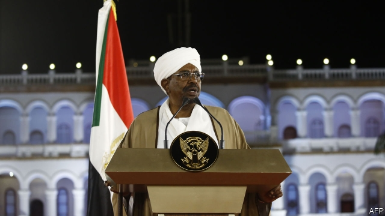

###### A last roll of the dice?

# Omar al-Bashir declares a state of emergency in Sudan 

##### An embattled president woos generals at the expense of Islamists 

 

> Feb 28th 2019 

ON FEBRUARY 22ND millions of Sudanese gathered with bated breath in front of their television screens. It had been two months since tens of thousands of protesters, angry at rising food prices, began demanding an end to the 30-year rule of President Omar al-Bashir. Earlier in the day Sudan’s security chief had briefed journalists that Mr Bashir would step down as head of the ruling party. Amid mounting excitement, rumours swept the country that he would announce his intention to resign as president next year rather than stand for another five-year term. Would he bow out even sooner? 

No such luck. Mr Bashir began by sounding conciliatory. “The demands of our people for better living conditions are lawful,” he said, calling for a national dialogue. He told parliament to postpone the constitutional amendments that would have let him seek another term. But then, suddenly, his tone changed sharply as he declared a one-year state of emergency. His government, he said, had been dissolved. There was no sign that he would step down. 

This allows Mr Bashir to suspend the constitution. Security forces may raid premises without warrants and seize property. Decrees issued three days later ban unlicensed gatherings and protests, as well as the trading or hoarding of fuel and other subsidised goods. So in practice little has changed, since several of Sudan’s 18 states were already under emergency law and the security forces have long enjoyed immunity from prosecution. They have killed at least 50 people since the start of the crisis. 

Mr Bashir is still far from secure. Diplomats and politicians in Khartoum, the capital, think he may yet be ousted. His latest move may have been prompted more by discord in ruling circles than by protests on the streets. 

But the balance of power may have altered. Since grabbing the reins in a coup in 1989 he has governed in alliance with Islamists, many of whom now reject him. By dissolving the government he has boosted the army, perhaps pre-empting a military attempt to overthrow him. His new cabinet is dominated by technocrats and generals. All 18 state governors have been replaced by military or security men. “He’s sending a message to the Islamists that he is no longer their champion,” says Ahmed Soliman of Chatham House, a think-tank in London. 

He may, as a result, be edging away from the Islamists of Qatar and Turkey, with their ties to the Muslim Brotherhood, and instead be leaning back towards the rival regional club led by Egypt, Saudi Arabia and the United Arab Emirates, which all loathe the Brothers. To appeal to young Sudanese, especially women, Mr Bashir has offered to review draconian laws prohibiting “immoral” clothing, among other sins. By sidelining the Islamists Mr Bashir may hope to be rewarded with cash to ease Sudan’s economic crisis. 

But violence may well increase. The opposition has furiously rejected the president’s call for dialogue. Demonstrations following the declaration of emergency were the angriest in weeks. On February 24th a medical school in Khartoum was ransacked by security forces. Female students were reportedly whipped. 

-- 

 单词注释:

1.omar['әjmɑ:(r)]:n. 奥马尔（男子名） 

2.Sudan[su:'dæn]:n. 苏丹 [化] 苯偶氮间苯二酚; 苏丹 

3.embattle[im'bætl]:vt. 列阵, 布阵, 整军备战, 严阵以待 

4.Islamist[iz'lɑ:mist]:n. 伊斯兰教主义者；回教教徒 

5.Sudanese[su:dә'ni:z]:a. 苏丹的, 苏丹人的 n. 苏丹人 

6.bate[beit]:vt. 减弱, 减少, 降低, 缓和 n. 鹰的躁动, 大怒 

7.tens[]:十位 

8.protester[]:n. 抗议者, 持异议者, 拒付者 [经] 反对者 

9.Bashir[]:n. (Bashir)人名；(英、俄、阿富、巴基)巴希尔；(阿拉伯)贝希尔 

10.amid[ә'mid]:prep. 在其间, 在其中 [经] 在...中 

11.conciliatory[kәn'siliәtәri]:a. 安抚的, 和好的, 调和的 

12.lawful['lɒ:ful]:a. 法律许可的, 守法的, 合法的 [经] 合法的, 法定的 

13.constitutional[.kɒnsti'tju:ʃәnl]:a. 宪法的, 立宪的, 体质的 [医] 全身的; 体质的 

14.amendment[ә'mendmәnt]:n. 修订, 改善, 改良, 改正 [化] 调理剂; 修正 

15.premise['premis]:n. 前提, 房屋连地基, 上述各项 vt. 预先提出, 引出, 作为...的前提 vi. 作出前提 

16.warrant['wɒ:rәnt]:n. 授权, 正当理由, 根据, 证明, 批准, 凭证, 令状, 委任状 vt. 授权给, 保证, 担保, 批准, 使有正当理由 

17.decree[di'kri:]:n. 法令, 判决, 天意 vt. 颁布, 判决 vi. 发布命令 

18.unlicensed[.ʌn'laisnst]:a. 没有执照的, 未经当局许可的 [法] 未经当局许可的, 无执照的, 无节制的 

19.gathering['gæðәriŋ]:n. 聚集, 集中, 采集 [化] 富集 

20.hoard[hɒ:d]:n. 贮藏物, 密藏的金钱 v. 囤积, 贮藏 

21.subsidise[]:vt. 给...补助金, 津贴, 资助 

22.immunity[i'mju:niti]:n. 免疫, 免疫性, 免除 [化] 免疫性 

23.prosecution[.prɒsi'kju:ʃәn]:n. 执行, 经营, 起诉 

24.diplomat['diplәmæt]:n. 外交官, 有外交手腕的人 [法] 外交家, 外交官, 有权谋的人 

25.Khartoum[ka:'tu:m]:n. 喀土穆（苏丹首府） 

26.oust[aust]:vt. 逐出, 罢黜, 剥夺, 驱逐 [法] 驱逐, 剥夺, 免职 

27.discord['diskɒ:d]:n. 不调和, 不和 vi. 不一致, (声音)刺耳 

28.grab[græb]:n. 抓握, 掠夺, 强占, 东方沿岸帆船 vi. 抓取, 抢去 vt. 攫取, 捕获, 霸占 

29.coup['ku:]:n. 砰然的一击, 妙计, 出乎意料的行动, 政变 [医] 发作, 中, 击 

30.alliance[ә'laiәns]:n. 联盟, 联合 [法] 同盟, 联盟, 联姻 

31.overthrow[.әuvә'θrәu]:n. 推翻, 瓦解, 倾覆 vt. 打倒, 推翻, 倾覆 

32.technocrat['teknәukræt]:n. 技术专家治国论者, 技术专家统治论者 

33.ahmed[]:n. 艾哈迈德（男子名） 

34.Soliman[]:n. (Soliman)人名；(意)索利曼；(阿拉伯)苏莱曼 

35.chatham['tʃætәm]:n. 查塔姆（姓氏） 

36.Qatar['kɑ:tәr]:n. 卡塔尔 

37.Muslim['mjzlim; (?@) 'mʌzlem]:n. 伊斯兰教, 伊斯兰教教徒 

38.regional['ri:dʒәnәl]:a. 地方的, 地域性的 [医] 区的, 部位的 

39.Egypt['i:dʒipt]:n. 埃及 

40.saudi['sajdi]:a. 沙乌地阿拉伯（人或语）的 

41.Arabia[ә'reibiә]:n. 阿拉伯半岛 

42.emirate[e'miәrit]:n. 埃米尔的地位, 酋长国 

43.loathe[lәuð]:vt. 厌恶, 憎恶 

44.draconian[drә'kәjniәn]:a. 严厉的, 残酷的 

45.immoral[i'mɒrәl]:a. 不道德的, 邪恶的, 放荡的 [法] 不道德的, 道德败坏的, 邪恶的 

46.sideline['saidlain]:n. 副业, 旁线, 界线, 兼职, 旁观者看法 vt. 使退出比赛场地 

47.opposition[.ɒpә'ziʃәn]:n. 反对, 敌对, 相反, 在野党 [医] 对生, 对向, 反抗, 反对症 

48.furiously[]:adv. 狂暴地；猛烈地 

49.demonstration[.demәn'streiʃәn]:n. 示范, 实证 [医] 示教, 实物教授 

50.declaration[.deklә'reiʃәn]:n. 宣告, 说明, 宣布 [计] 说明 

51.ransack['rænsæk]:vt. 到处搜索, 遍寻, 掠夺, 洗劫 [法] 洗劫, 抢劫, 掠夺 

52.reportedly[ri'pɒ:tidli]:adv. 根据传说, 根据传闻, 据报道 

