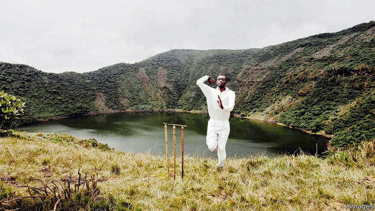

###### Willow in the hills

# The fastest-growing sport in Rwanda is cricket 

##### Fans even say it promotes reconciliation 

 

> Feb 28th 2019 

THE BIKE riders competing in the Tour du Rwanda, billed as “Africa’s biggest cycling race”, hurtled off on February 24th across mountains famous for gorillas, with the eighth and final lung-bursting stage ending in Kigali, the capital, a week later. President Paul Kagame, meanwhile, tweets his loyalty to Arsenal Football Club. His cash-strapped government is paying the club $39m over three years for the words “Visit Rwanda” to appear on the sleeves of the players’ shirts. Rwandan aficionados of cricket, however, say it is their own hallowed game that is growing fastest. 

According to Cricket Builds Hope, a British charity backed by David Cameron when he was prime minister, Rwanda now has 24 cricket clubs, 98 schools that play the game and 15,000 regular players, 40% of them female. 

A largely Francophone country until Mr Kagame made English compulsory in schools a decade ago, Rwanda is an unlikely hotspot for cricket. Most locals had barely heard of the sport until this century, when a handful of Rwandans of Indian descent and a clutch of returnees brought up in English-speaking Uganda and Kenya decided to give the game a go. A friend of Mr Cameron, the late Christopher Shale, who happened to chair his local Conservative Party branch, then raised a chunk of money to bring in the bulldozers to build one of the most beautiful cricket grounds anywhere in the world at Gahanga, a village half an hour south of Kigali. The oval outfield is sown with Bermuda grass and the practice pitch is made of astroturf, both imported from South Africa. 

Most other Rwandan pitches are a lot rougher. The country’s hilly topography is not ideally suited to the game. The first national pitch was made of frayed mats laid over bumpy concrete, sometimes eroded by termites, which made for some wicked bouncers. “People have lost their teeth,” says Eric Dusingizimana, an engineer who captained Rwanda and entered the “Guinness Book of Records” for enduring the longest unbroken stint of batting practice (51 hours). 

The wounds of the genocide of 1994, when perhaps 500,000 people, mainly ethnic Tutsis, were murdered by the previous, Hutu-dominated regime, have yet to heal. Those ethnic labels are unmentionable today. “The cricket club is a surrogate family for people who’ve lost loved ones,” says Mr Dusingizimana. “Cricket is more than just a game, it has united us.” Cricket Builds Hope also provides leadership workshops for poor women, teaching self-awareness, public speaking and advocacy. “It’s played a big role in post-genocide reconciliation,” says Mary Maina, a former captain of the women’s national team, perhaps exaggerating a little. 

-- 

 单词注释:

1.willow['wilәu]:n. 柳树, 柳木制品 a. 柳树的, 柳木制的 

2.rwanda[rj'ændә]:n. 卢旺达（东非国家）；卢旺达语 

3.reconciliation[,rekәnsili'eiʃәn]:n. 和解, 和好, 复交, 调解, 调停, 和谐, 一致, 甘愿, 顺从 [经] (银行往来)调节, 调和, 一致 

4.hurtle['hә:tl]:vi. 猛冲, 碰撞, 突进 vt. 猛撞, 猛投 n. 投掷, 碰撞, 碰撞声 

5.gorilla[gә'rilә]:n. 大猩猩, 残暴的男人, 歹徒 

6.kigali[ki'ɡɑ:li]:n. 基加利（卢旺达的首都） 

7.paul[pɔ:l]:n. 保罗（男子名） 

8.kagame[]:[网络] 卡加梅；卡加梅总统；卡根 

9.tweet[twi:t]:vi. 啁啾 n. 小鸟叫声 

10.arsenal['ɑ:snәl]:n. 兵工厂, 军械库 [机] 兵工厂 

11.Rwandan[rj'ɑ:ndәn, -'æn-]:a. 卢旺达的 

12.aficionado[ә.fisjә'nɑ:dәu]:n. 狂热爱好者, 迷 

13.hallow['hælәu]:vt. 使...神圣, 视为神圣 n. 圣徒 

14.david['deivid]:n. 大卫；戴维（男子名） 

15.cameron['kæmәrәn]:n. 卡梅伦/隆（男子名） 

16.francophone['fræŋkәufәun]:n. (尤指在使用两种或多种语言国度里的)操法语者,讲法语的(当地)人 

17.hotspot[]:n. 热区；热点 

18.Rwandan[rj'ɑ:ndәn, -'æn-]:a. 卢旺达的 

19.descent[di'sent]:n. 降落, 家系, 侵袭, 血统 [医] 下降, 世代, 血统 

20.clutch[klʌtʃ]:n. 抓紧, 掌握, 离合器, 一窝小鸡 vt. 抓住, 踩汽车离合器踏板 vi. 抓 [计] 联轴器; 离合器 

21.returnee[ri.tә:'ni:]:n. 回国人员, 返回者 

22.Uganda[ju(:)'^ændә, u:'^ændә]:n. 乌干达 

23.Kenya['kenjә]:n. 肯尼亚 

24.christopher['kristәfә]:n. 克里斯多夫（男子名） 

25.shale[ʃeil]:n. 页岩 

26.chunk[tʃʌŋk]:n. 大块, 矮胖的人(或物) [经] 定样 

27.bulldozer['buldәuzә]:n. 推土机 [化] 推土机 

28.outfield['autfi:ld]:n. 外场, (思想中的)未知世界, 边境 

29.Bermuda[bә'mju:dә]:n. 百慕大岛 

30.AstroTurf['æstrәjt\\:f]:n. 阿斯特罗草皮( 指用绿色尼龙等材料制成用来铺设运动场等的人造草皮)[源自商标名] 

31.topography[tә'pɒgrәfi]:n. 地志, 地形学, 地势, 局部解剖学 [医] 局部解剖, 局部记载 

32.ideally[ai'diәli]:adv. 完美地, 理想地 

33.fray[frei]:n. 磨损, 打架, 争论 vt. 使磨损 vi. 被磨损 

34.bumpy['bʌmpi]:a. 颠簸的, 崎岖不平的 

35.erode[i'rәud]:vt. 腐蚀, 侵蚀 vi. 受腐蚀 

36.termite['tә:mait]:n. 白蚁 

37.bouncer['baunsә]:n. 巨大的东西, 巨人, 跳跃的人, 同类中最大者 

38.eric['erik]:abbr. 科教资源信息中心（Educational Resources Information Center）；电子遥控与独立控制（Electronic Remote and Independent Control） 

39.Guinness['ginis]:n. 吉尼斯黑啤酒 

40.unbroken['ʌn'brәukәn]:a. 未破损的, 未被征服的, 未打垮的, 不屈服的, 不涣散的, 整齐的, 未中断的 [法] 未被阻断的, 未破损的, 完好的 

41.stint[stint]:vt. 节省, 限制, 停止 vi. 节约 n. 吝惜, 节约, 限额 

42.genocide['dʒenәu,said]:n. 种族灭绝, 灭绝整个种族的大屠杀 [医] 种族灭绝(侵略军队加害居民的罪行) 

43.ethnic['eθnik]:a. 人种的, 种族的 [医] 人种的 

44.Tutsi['tjtsi]:n. 图西人(卢旺达与布隆迪境内的少数民族人) 

45.regime[rei'ʒi:m]:n. 政权, 当权期间, 政体, 社会制度, 体制, 情态 [医] 制度, 生活制度 

46.unmentionable[.ʌn'menʃәnәbl]:a. 不宜提及的, 说不出口的 n. 不宜说出口之事物, 内衣, 裤子 

47.surrogate['sʌrәgit]:n. 替代者, 代用品 vt. 代理, 替代 

48.advocacy['ædvәkәsi]:n. 拥护, 支持, 鼓吹, 辩护, 辩护术 [法] 辩护, 拥护, 提倡 

49.mary['meәri]:n. 玛丽（女子名） 

50.maina[]:[网络] 马伊纳；联轴器；新年快乐 

